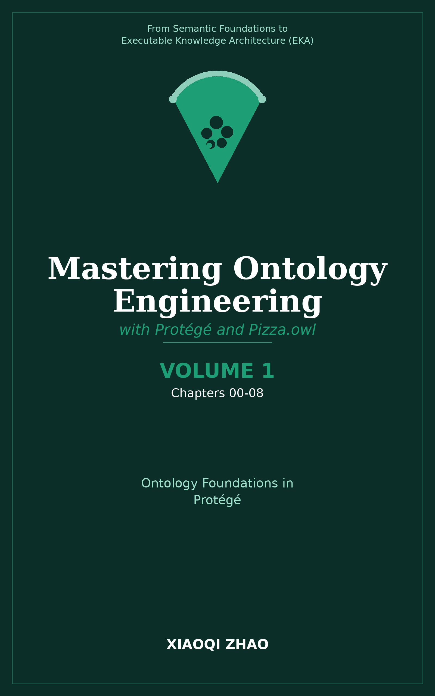

# Volume 1: Ontology Foundation in Protégé

**Introduction and Core Ontology Building Blocks**

</img>

| Chapter | Core Content | Key OWL/Technical Concepts |
| --- | --- | --- |
| 00 | Executive Introduction & EKA Framework | Executable Knowledge Architecture (EKA), Semantic Knowledge Development Lifecycle (SKDL), vision of executable semantic systems |
| 01 | Introduction to Protégé & Environment Setup | Protégé installation, interface overview, reasoner configuration, opening the Pizza ontology tutorial |
| 02 | Classes, Taxonomies, and Subclass Hierarchies | Class hierarchies, `owl:Thing`, root classes, creating subclasses, taxonomic design principles |
| 03 | Object Properties and Basic Relations | Object properties, domain and range definitions, `rdfs:domain`, `rdfs:subPropertyOf` |
| 04 | Property Characteristics (Functional & Inverse) | Functional properties, inverse properties, symmetric and transitive characteristics, property assertions |
| 05 | Existential Restrictions (`someValuesFrom`) | Existential restrictions, necessary conditions, defining complex classes using `some` |
| 06 | Universal Restrictions (`allValuesFrom`) | Universal restrictions, value constraints, handling open vs. closed boundaries |
| 07 | Disjoint Classes and Covering Axioms | Disjointness, covering axioms, logical partitions, enforcing mutual exclusivity in taxonomies |
| 08 | Introduction to Pellet and HermiT Reasoners | Automated reasoning, consistency checking, classification, viewing inferred hierarchies |

**Volume 1 Focus:**

- Establishing the foundational syntax and mental model of OWL
- Setting up the Protégé environment and navigating the Pizza tutorial workspace
- Mastering basic taxonomy construction and property characteristics
- Introducing existential and universal restrictions to define structured classes

---

Last updated at 2026-08-28