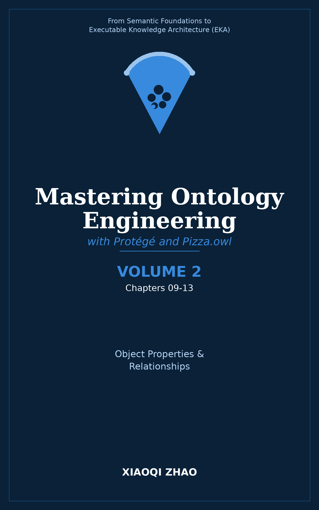

# Volume 2: Object Properties, Characteristics, Domain and Range

**Advanced Property Mechanics and Logical Rigor**

</img>

| Chapter | Core Content | Key OWL/Technical Concepts |
| --- | --- | --- |
| 09 | Advanced Object Property Characteristics | Reflexive, irreflexive, asymmetric properties; property chains; complex property axioms |
| 10 | Domain and Range Refinement Strategies | Global vs. local property restrictions, avoiding common domain/range traps, best practices for property scoping |
| 11 | Inverse Functional and Transitive Patterns | Tracking unique identities with inverse functional properties, hierarchical traversal with transitive properties |
| 12 | Complex Property Hierarchies | Organizing large property trees, subproperty relationships, property characteristics inheritance |
| 13 | Practical Property Modeling in Pizza.owl | Refining pizza toppings, bases, and ingredients using advanced property configurations and reasoning validation |

**Volume 2 Focus:**

- Deep-diving into advanced object property characteristics and relational mechanics
- Mastering local vs. global domain and range constraints
- Building robust property hierarchies to support complex domain relationships
- Validating property behavior through reasoner execution

---

Last updated at 2026-08-28