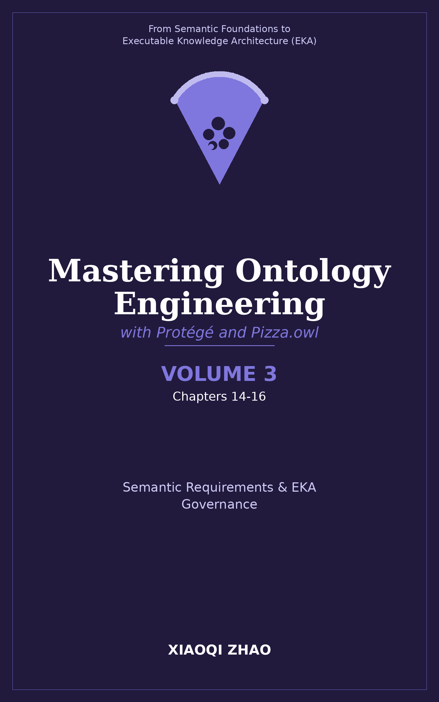

# Volume 3: Semantic Requirements and EKA Governance

**Establishing Governance and Defining Semantic Requirements**

</img>

| Chapter | Core Content | Key OWL/Technical Concepts |
| --- | --- | --- |
| 14 | Defining Semantic Requirements | Competency questions, translating business requirements into formal semantic queries and ontological scope |
| 15 | EKA Governance Foundation ($\Gamma$) | Introduction to semantic governance, naming conventions, modularization, version control, and team collaboration frameworks |
| 16 | Managing Ontology Lifecycle & Quality | Quality assurance, documentation standards, handling ontology drift, and maintaining semantic integrity at scale |

**Volume 3 Focus:**

- Translating real-world business requirements into precise competency questions and ontological boundaries
- Establishing governance frameworks ($\Gamma$) for team-based and enterprise ontology development
- Ensuring long-term semantic quality, maintainability, and documentation standards

---

Last updated at 2026-08-28