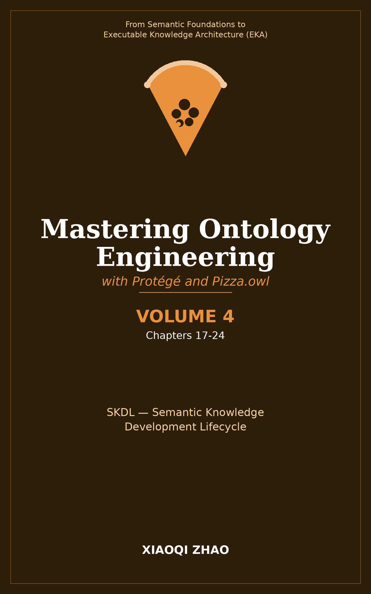

# Volume 4: Semantic Knowledge Development Lifecycle (SKDL)

**From Semantic Modeling to Executable Knowledge**

</img>

| Chapter | Tutorial Exercise | SKDL Stage | EKA Component & Core Focus |
| --- | --- | --- | --- |
| 17 | N/A | SKDL Introduction | The Semantic Knowledge Development Lifecycle, mapping SKDL to EKA components |
| 18 | Exercise 14 | Stage 1: Conceptual Modeling | Identifying domain concepts, structuring taxonomies, defining class hierarchies (`K`) |
| 19 | Exercise 15 | Stage 2: Semantic Description | Adding meaning through logical characteristics, object properties, existential/universal restrictions |
| 20 | Exercise 16, 17 | Stage 3: Knowledge Reuse | Reusing and refining ontology design patterns, modular ontologies, extending structures |
| 21 | Exercise 18 | Stage 4: Semantic Governance | Protecting semantic consistency, applying governance policies, naming standards, documentation |
| 22 | Exercise 19 | Stage 5: Semantic Validation | Detecting logical inconsistencies, running reasoners, identifying unsatisfiable classes (`owl:Nothing`) |
| 23 | Exercise 20, 21 | Stage 6: Semantic Reasoning | Enabling automatic semantic inference, automated classification, enriching the knowledge graph |
| 24 | N/A | Stage 7: Transition to Execution | Bridging SKDL output into EKA triggers and execution layers, preparing model for operational systems |

**Volume 4 Focus:**

- Introducing the 7-stage Semantic Knowledge Development Lifecycle (SKDL)
- Bridging classical knowledge representation theories with modern ontology engineering
- Connecting each lifecycle stage directly to the EKA architecture components ($K, R, \Theta, \Phi, \Gamma$)
- Providing a repeatable, rigorous engineering roadmap from concepts to executable systems

---

Last updated at 2026-08-28