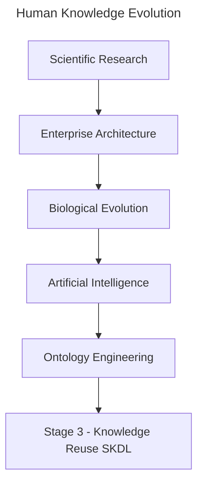
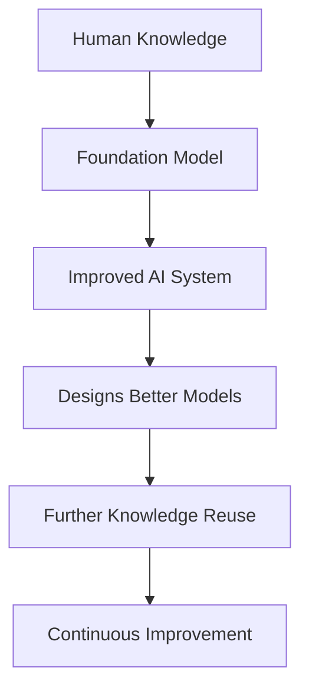

# Chapter 20 -- Knowledge Reuse: Stage 3 of the Semantic Knowledge Development Lifecycle

**Reusing Semantic Knowledge Through OWL Design Patterns**

> *"Knowledge becomes truly valuable not when it is created once, but when it can be reused many times.*

The first two stages of the **Semantic Knowledge Development Lifecycle (SKDL)** established the semantic foundations of ontology engineering.

During **Stage 1 -- Conceptual Modeling**, we identified the concepts that define a knowledge domain and organized them into a coherent semantic taxonomy.

During **Stage 2 -- Semantic Description**, we enriched those concepts with formal meaning using **Description Logic (DL)**, OWL restrictions, and class expressions

By the end of **Chapter (19)**, our ontology was no longer simply a collection of class names.

It had become a **formal semantic knowledge model** whose concepts possess machine-understandable meaning.

At this point, however, another important engineering question naturally arises:

> **Once semantic knowledge has been created, how should it be managed as the ontology continues to grow?**

Should every new concept independently redefine knowledge that already exists?

Should ontology engineers repeatedly recreate similar semantic descriptions?

Or should previously established semantic knowledge itself become a reusable engineering asset?

Professional ontology engineering adopts the **third approach**.

Rather than viewing semantic definitions as isolated pieces of modeling work, mature ontologies treat them as **reusable knowledge assets** that can be shared, extended, specialized, and maintained systematically across the entire knowledge base.

This philosophy introduces **Stage 3 -- Knowledge Reuse** of the Semantic Knowledge Development Lifecycle (SKDL).

The objective of this stage is not to create additional semantic knowledge simply for its own sake.

Instead, it is to organize semantic knowledge so that it can be **reused consistently**, reducing duplication while improving maintainability, scalability, and long-term semantic quality.

Within the **Executable Knowledge Architecture (EKA)**, this transition represents another important increase in engineering maturity.

Knowledge is no longer viewed merely as information stored within an ontology.

Instead, semantic knowledge begins evolving into a reusable engineering asset capable of supporting
- multiple concepts,
- multiple ontologies,
- multiple applications, and
- eventually multiple intelligent systems.

Beginning with **Exercise 16** from the *Protégé 5 New OWL Pizza Tutorial*, this chapter explores how OWL enables semantic reuse through inheritance, logical abstraction, reusable modeling patterns, and carefully designed class definitions.

Along the way, we will examine knowledge reuse from multiple complementary perspectives, including software engineering, Enterprise Architecture, scientific research, biological evolution, mathematical abstraction, and modern Artificial Intelligence.

By the end of this chapter, you will recognize that **knowledge reuse is far more than another OWL modeling technique**.

It represents one of the universal engineering principles through which human knowledge continuously grows, evolves, and accumulates over time.



Whether knowledge is transmitted through scientific publications, enterprise architecture repositories, biological genomes, AI foundation models, or semantic ontologies, the underlying principle remains the same:

> **Progress is achieved not by repeatedly creating knowledge, but by continuously reusing, refining, and extending the knowledge that already exists.**

---

Table of Contents

- [20.1 Introduction -- From Individual Knowledge to Reusable Knowledge](#201-introduction----from-individual-knowledge-to-reusable-knowledge)
- [20.2 Why Knowledge Reuse Is a Universal Engineering Principle](#202-why-knowledge-reuse-is-a-universal-engineering-principle)
  - [20.2.1 Reuse in Software Engineering](#2021-reuse-in-software-engineering)
  - [20.2.2 Reuse in Enterprise Architecture](#2022-reuse-in-enterprise-architecture)
  - [20.2.3 Reuse in Scientific Research](#2023-reuse-in-scientific-research)
  - [20.2.4 Reuse in Biological Evolution](#2024-reuse-in-biological-evolution)
  - [20.2.5 Reuse in Artificial Intelligence](#2025-reuse-in-artificial-intelligence)
    - [20.2.5.1 From Knowledge Reuse to Recursive Improvement](#20251-from-knowledge-reuse-to-recursive-improvement)
  - [20.2.6 From Universal Principle to Ontology Engineering](#2026-from-universal-principle-to-ontology-engineering)
- [20.3 Exercise 16 -- Reusing Semantic Knowledge in Practice](#203-exercise-16----reusing-semantic-knowledge-in-practice)
  - [20.3.1 Engineering Objective of Exercise 16](#2031-engineering-objective-of-exercise-16)
  - [20.3.2 From Copying Classes to Reusing Knowledge](#2032-from-copying-classes-to-reusing-knowledge)
  - [20.3.3 Reuse Before Redesign](#2033-reuse-before-redesign)
  - [20.3.4 Knowledge Reuse versus Knowledge Duplication](#2034-knowledge-reuse-versus-knowledge-duplication)
  - [20.3.5 Looking Beyond the User Interface](#2035-looking-beyond-the-user-interface)
- [20.4 Clone Before Create -- Reuse as an Engineering Pattern](#204-clone-before-create----reuse-as-an-engineering-pattern)
  - [20.4.1 The Pattern in Software Engineering](#2041-the-pattern-in-software-engineering)
  - [20.4.2 The Pattern in Enterprise Architecture](#2042-the-pattern-in-enterprise-architecture)
  - [20.4.3 The Pattern in Design and Manufacturing](#2043-the-pattern-in-design-and-manufacturing)
  - [20.4.4 From Copying to Knowledge Reuse](#2044-from-copying-to-knowledge-reuse)
  - [20.4.5 The Role of Variation in Knowledge Reuse](#2045-the-role-of-variation-in-knowledge-reuse)
  - [20.4.6 The Limits of Cloning](#2046-the-limits-of-cloning)
  - [20.4.7 The Engineering Attitude](#2047-the-engineering-attitude)
- [20.5 Reusable Semantic Patterns in OWL](#205-reusable-semantic-patterns-in-owl)
  - [20.5.1 Inheritance (`SubClassOf`)](#2051-inheritance-subclassof)
  - [20.5.2 Equivalent Class Definitions (`EquivalentTo`)](#2052-equivalent-class-definitions-equivalentto)
  - [20.5.3 Reusable Restriction Patterns](#2053-reusable-restriction-patterns)
  - [20.5.4 Ontology Imports (`owl:imports`)](#2054-ontology-imports-owlimports)
  - [20.5.5 Design Patterns](#2055-design-patterns)
  - [20.5.6 Semantic Alignment](#2056-semantic-alignment)
- [20.6 Reuse Across Disciplines - Mechanisms](#206-reuse-across-disciplines---mechanisms)
  - [20.6.1 Software Engineering -- Inheritance and Composition](#2061-software-engineering----inheritance-and-composition)
  - [20.6.2 Enterprise Architecture -- Capability Reuse and Reference Architecture](#2062-enterprise-architecture----capability-reuse-and-reference-architecture)
  - [20.6.3 Scientific Research -- Citation and Systematic Review](#2063-scientific-research----citation-and-systematic-review)
  - [20.6.4 Biology -- Gene Duplication and Regulatory Review](#2064-biology----gene-duplication-and-regulatory-review)
  - [20.6.5 Artificial Intelligence -- Transfer Learning and Model Adaptation](#2065-artificial-intelligence----transfer-learning-and-model-adaptation)
- [20.7 Mathematical Perspective -- Abstraction, Generalization and Reuse](#207-mathematical-perspective----abstraction-generalization-and-reuse)
  - [20.7.1 Generalization as Subset Inclusion](#2071-generalization-as-subset-inclusion)
  - [20.7.2 Abstraction and Dimension Reduction](#2072-abstraction-and-dimension-reduction)
  - [20.7.3 Posets and Lattices](#2073-posets-and-lattices)
  - [20.7.4 Reuse and Logical Consistency](#2074-reuse-and-logical-consistency)
- [20.9 Interesting Reading -- From Plato to Design Patterns](#209-interesting-reading----from-plato-to-design-patterns)
- [20.10 EKA Perspective -- Stage 3 Strengthens $K$ and Prepares $\\Gamma$](#2010-eka-perspective----stage-3-strengthens-k-and-prepares-gamma)
- [20.11 Engineering Guidelines for Knowledge Reuse](#2011-engineering-guidelines-for-knowledge-reuse)
- [20.12 Key Concepts](#2012-key-concepts)
- [20.13 Chapter Summary](#2013-chapter-summary)
- [20.14 Looking Ahead -- Knowledge Governance](#2014-looking-ahead----knowledge-governance)


## 20.1 Introduction -- From Individual Knowledge to Reusable Knowledge

One of the defining characteristics of human civilization is that **knowledge accumulates through reuse rather than continual reinvention**.

Very few ideas are created in complete isolation.

Instead, almost every advance builds upon knowledge that already exists.

Scientists extend previous discoveries through research and citation.

Engineers improve proven designs rather than redesigning every component from first principles.

Software developers reuse libraries, frameworks, and design patterns instead of repeatedly implementing identical functionality.

Enterprise architects organize reusable business capabilities, reference architectures, and architectural building blocks that can support numerous initiatives across an organization.

Even biological evolution follows the same principle.

Rather than redesigning living organisms from the beginning, evolution preserves successful genetic information across generations while gradually introducing variation through mutation and natural selection.

Modern Artificial Intelligence demonstrates a remarkably similar pattern.

Foundation models learn from enormous collections of accumulated human knowledge, while techniques such as **transfer learning, Retrieval-Augmented Generation (RAG)**, and **knowledge distillation** continually reuse previously acquired knowledge to solve new problems more effectively.

Although these disciplines appear unrelated, they all reflect the same underlying engineering principle:

> **Progress is achieved not by repeatedly creating knowledge, but by continuously reusing, refining, and extending existing knowledge.**

Ontology engineering is no exception.

After completing **Stage 2 -- Semantic Description**, the `Pizza` ontology now contains its first meaningful semantic definitions.

For example, `MargheritaPizza` is no longer merely a concept within a taxonomy.

It possesses formal semantic descriptions through restrictions such as:

```text
hasTopping some MozzarellaTopping
hasTopping some TomatoTopping
```

These restrictions successfully describe one particular pizza.

However, an important engineering challenge immediately appears.

As the ontology expands from a handful of concepts to hundreds -- or even millions -- of concepts, should ontology engineers repeatedly recreate similar semantic definitions?

Or should those semantic descriptions themselves become reusable knowledge assets?

This question motivates **Stage 3 -- Knowledge Reuse** of the Semantic Knowledge Development Lifecycle (SKDL).

**Knowledge reuse** extends the engineering principles established in the previous chapters.

- **Stage 1** introduced reusable conceptual abstractions through semantic taxonomies.
- **Stage 2** introduced reusable logical constructors through Description Logic (DL).
- Now **Stage 3** goes one step further by creating **semantic knowledge itself as reusable**.

Rather than viewing each class definition as an isolated modeling exercise, ontology engineers identify semantic patterns that can be shared consistently across many concepts.

As ontologies continue to grow, this shift becomes increasingly important.

Without systematic reuse, semantic models gradually accumulate duplicated restrictions, inconsistent definitions, unnecessary maintenance effort, and increasingly governance complexity.

Small educational ontologies may tolerate such duplication

Large enterprise knowledge graphs containing tens of thousands of concepts **CANNOT**.

Knowledge reuse therefore should not be viewed simply as a convenient modeling technique.

It represents a fundamental engineering discipline for controlling semantic complexity while enabling ontologies to evolve sustainably over long periods of time.

This engineering philosophy is familiar across many mature disciplines.

Enterprise Architecture promotes the principle of **Reuse before Buy before Build**, encouraging organizations to maximize the value of existing architectural assets before acquiring or constructing new solutions.

Scientific research measures impact not only by creating new knowledge, but also by how frequently that knowledge is reused and extended through subsequent publications.

Likewise, successful ontologies are characterized not by the number of concepts they contain, but by the extent to which their semantic knowledge can be reused consistently throughout the knowledge base.

**Exercise 16** introduces this principle through a seemingly simple modeling activity.

Rather than creating entirely new semantic definitions from scratch, we begin constructing new ontology concepts by reusing semantic structures that already exist.

Although the practical exercise requires only a small number of operations within Protégé, its engineering significance extends far beyond the user interface.

It introduces one of the defining characteristics of every mature engineering discipline:

> **Well-designed knowledge should be created once, reused many times, and refined only when necessary.**

Throughout this chapter, we will examine knowledge reuse from practical, engineering, mathematical, architectural, biological, and artificial intelligence perspectives.

By the end of the chapter, you will recognize that reusable semantic knowledge is more than a modeling convenience.

It is a **reusable knowledge asset** -- one that enables ontologies, enterprise architectures, scientific knowledge, AI systems, and even biological life to grow in complexity while remaining coherent, maintainable, and sustainable.

## 20.2 Why Knowledge Reuse Is a Universal Engineering Principle

One of the most remarkable characteristics shared by mature engineering disciplines is that:

> **progress depends far more on reuse than on continual reinvention**.

Although innovation often receives the greatest attention, sustained progress is rarely achieved by repeatedly creating everything from the beginning.

Instead, successful systems grow by preserving proven knowledge while extending it to address new challenges.

This principle appears so consistently across science and engineering that it can reasonably be regarded as a universal engineering law.

Ontology engineering is no exception.

Once semantic knowledge has been carefully **designed**, **validated**, and **understood**, it becomes an engineering asset that should be reused rather than recreated. **Exercise 16** introduces this principle within the `Pizza` ontology, but its significance extends far beyond OWL or Protégé. It reflects a pattern that underlies software engineering, enterprise architecture, scientific research, biology, mathematics, and modern artificial intelligence.

The remainder of this chapter explores these perspectives to demonstrate that **knowledge reuse is not merely an ontology technique -- it is a fundamental mechanism through which complex knowledge systems evolve.**

### 20.2.1 Reuse in Software Engineering

Software engineering has long recognized that **maintainability depends upon systematic reuse**.

Modern applications are rarely developed entirely from scratch.

Instead, developers build upon existing programming languages, operating systems, libraries, frameworks, APIs, design patterns, and open-source ecosystems.

When creating a new application, an experienced engineer does not begin by writing a new compiler, networking stack, or database engine. Instead, existing components are reused whenever they have already demonstrated correctness, reliability, and maintainability.

This philosophy is reflected in principle such as:
- Design Patterns
- Don't Repeat Yourself (DRY)
- Convention over Configuration
- Framework-based Development
- Package Management Ecosystems

**Knowledge reuse** therefore reduces both development effort and engineering risk.

Ontology engineering follows exactly the same philosophy.

Instead of repeatedly redefining identical semantic structures, reusable ontology patterns become the semantic equivalent of software libraries.

### 20.2.2 Reuse in Enterprise Architecture

Enterprise Architecture extends this philosophy from software components to organizational knowledge.

Rather than designing every capability independently, mature EA practices encourage organizations to reuse proven architectural assets whenever possible.

A widely recognized principle is:

> **Reuse before Buy before Build**

The sequence reflects increasing cost and decreasing reuse --

1. Reuse existing enterprise assets.
2. Purchase proven commercial capability (Commercial Off-The-Shelf, or COTS) when suitable assets are unavailable.
3. Build new solutions only when neither reuse nor acquisition satisfies the business need.

This principle minimizes duplication, reduces operational risk, improves governance, and accelerates delivery.

Semantic knowledge should be treated in exactly the same way.

Well-designed ontology modules, reusable class expressions, common vocabularies, and shared semantic patterns become enterprise assets that can be leveraged across projects rather than recreated independently.

Within the EKA framework, reusable semantic knowledge represents reusable organizational intelligence.

### 20.2.3 Reuse in Scientific Research

Scientific knowledge advances through cumulative refinement rather than isolated discovery.

Every research paper begins with a literature review because no scientific contribution exists in isolation.

Researchers study previous work, identify existing theories, reproduce experiments, extend established results, and contribute only the incremental knowledge that advances the field.

Consequently, one indicator of a publication's long-term impact is the number of times it is cited by subsequent research.

A highly cited paper demonstrates that its knowledge has been successfully reused by the scientific community.

Knowledge therefore achieves influence not simply by being published, but by becoming reusable.

Ontology engineering follows the same principle.

A reusable ontology contributes value far beyond its original project because its semantic structures can support future ontologies, knowledge graphs, and intelligent applications.

### 20.2.4 Reuse in Biological Evolution

Nature itself demonstrates perhaps the most successful example of knowledge reuse.

The genomes of modern organisms are not created independently for every generation.

Instead, genetic information is inherited, reused, recombined, and gradually refined through evolutionary processes.

Successful biological structures persist because they continue to prove useful under changing environmental conditions.

Evolution therefore preserves accumulated biological knowledge while permitting incremental adaptation.

Complex life emerges through billions of years of reuse rather than continual recreation.

Ontology evolution follows a remarkably similar pattern.

Successful semantic structures should likewise be inherited, extended, specialized, and adapted instead of repeatedly reconstructed.

### 20.2.5 Reuse in Artificial Intelligence

Recent advances in Artificial Intelligence further illustrate the importance of reusable knowledge.

Large Language Models are trained on vast collections of accumulated human knowledge rather than beginning with an empty understanding of the world.

Subsequent techniques continue this philosophy:

- Transfer Learning
- Fine-Tuning
- Retrieval-Augmented Generation (RAG)
- Knowledge Distillation
- Model Adaptation

Each technique seeks to reuse previously learned knowledge instead of rediscovering it independently.

Knowledge distillation provides an especially compelling example.

Rather than retraining a smaller model from the beginning, knowledge learned by a larger model is transferred into a more efficient representation.

The objective is not to recreate intelligence but to reuse it.

Ontology engineering pursues the same objective.

Semantic definitions, once established, should become reusable knowledge assets capable of supporting future applications.

#### 20.2.5.1 From Knowledge Reuse to Recursive Improvement

Recent discussions surrounding **Artificial General Intelligence (AGI)** have introduced another perspective on knowledge reuse.

One frequently discussed hypothesis proposes that once an AI system becomes capable of contributing to AI research itself, it may begin improving the very models from which it originated.

Conceptually, the process can be viewed as:



Whether recursive self-improvement eventually produces AGI or even Artificial Super-Intelligence (ASI) remains an open scientific question.

Researchers continue to debate both its feasibility and its expected timescale. Nevertheless, one engineering observation is already evident:

> **each new generation of AI systems is built primarily by reusing the accumulated knowledge, architectures, and capabilities of previous generations.**

Modern foundation models do not rediscover mathematics, language, software engineering, medicine, or ontology engineering independently.

They inherit enormous amounts of previously created human knowledge through trained corpora, reusable model architectures, transfer learning, fine-tuning, retrieval mechanisms, and knowledge distillation.

Even when new capabilities emerge, they typically represent **extensions of existing knowledge rather than complete reinvention**.

Consequently, **knowledge reuse** is becoming not merely an optimization technique, but one of the central mechanisms through which modern AI systems continue to evolve.

Ontology engineering follows the same engineering philosophy.

Every reusable ontology, semantic pattern, and knowledge graph contributes to a growing body of machine-interpretable knowledge that future intelligent systems may build upon rather than recreate.

From the perspective of the **Executable Knowledge Architecture (EKA)**, reusable ontologies can be viewed as persistent organizational knowledge assets. As AI systems increasingly consume structured knowledge rather than isolated documents, well-governed ontologies and knowledge graphs become reusable semantic foundations upon with future intelligent systems can continuously build.

In this sense, **Stage 3 -- Knowledge Reuse** is concerned not only with reducing modeling effort today, but also with enabling the accumulation of semantic intelligence for tomorrow.

From this perspective, knowledge reuse is not simply an optimization strategy for AI systems—it is arguably the mechanism through which cumulative machine intelligence becomes possible.

### 20.2.6 From Universal Principle to Ontology Engineering

Across all these disciplines, a common pattern emerges as below:

| Discipline | Reusable Asset |
| --- | --- |
| Software Engineering | Libraries, frameworks, APIs |
| Enterprise Architecture | Capability maps, reference architectures, reusable building blocks |
| Scientific Research | Publications, theories, experimental evidence |
| Biology | Genetic information |
| Artificial Intelligence | Learned representations, foundation models, distilled knowledge |
| Ontology Engineering | Ontologies, semantic patterns, reusable class expressions |

Although the artifacts differ, the engineering philosophy remains remarkably consistent.

> **Knowledge becomes increasingly valuable as its ability to be reused increases.**

**Exercise 16** now introduces this same principle within OWL ontology engineering.

The objective is no longer merely to define semantic knowledge correctly, but to organize that knowledge so it can be
- reused consistently,
- governed effectively, and
- extended systematically

throughout the remainder of the **Semantic Knowledge Development Lifecycle (SKDL)**.

However, reuse also introduces new responsibilities. Once semantic knowledge is shared across multiple concepts and applications, changes made to one reusable definition may affect many dependent models. Consequently, semantic reuse naturally raises questions of **ownership**, **versioning**, **validation**, and **governance**. These engineering concerns become the focus of the next stage of the SKDL as well.

Reuse does not merely preserve existing knowledge. It increases its value! Every successful reuse validates previous knowledge, extends its applicability, reduces future engineering, and creates a stronger foundation for subsequent innovation.

In this sense, the value of knowledge compounds through reuse in much the same way that financial capital compounds through investment.

Knowledge survives civilizations not because it is repeatedly rediscovered, but because it is successfully transmitted, reused, and refined across generations.

In short:

> **Human civilization advances because knowledge accumulates through systematic reuse.**
> **Ontology engineering simply makes this principle explicit and machine-interpretable.**

## 20.3 Exercise 16 -- Reusing Semantic Knowledge in Practice

In the previous section we examined why knowledge reuse represents one of the most fundamental engineering principles across science, software engineering, enterprise architecture, biology, and artificial intelligence.

**Exercise 16 -- Create `AmericanaPizza` by Cloning `MargheritaPizza` and Adding Additional Restrictions** now demonstrates how this principle is applied within an ontology.

At first glance, the exercise appears surprisingly simple.

Instead of creating a new pizza from scratch, we duplicate an existing class and introduce one additional semantic restriction.

Although this operation requires only a few clicks inside Protégé, it illustrates an engineering principle that scales to ontologies containing thousands -- or even millions -- of concepts.

The objective is not to copy information.

The objective is to **reuse validated semantic knowledge while introducing only the differences required by the new concept**.

This is precisely how mature knowledge systems evolve.

### 20.3.1 Engineering Objective of Exercise 16

**Exercise 16** asks us to create `AmericanaPizza` by duplicating `MargheritaPizza` and adding one additional topping restriction.

Conceptually the exercise can be summarized as:

```text
Existing Semantic Definition + Small Semantic Difference
= New Knowledge
```

Rather than redefining every characteristic, we preserve the semantic knowledge that has already been validated.

Only the distinguishing features is added.

This reflects one of the oldest engineering principles:

> **Never recreate what has already been proven correct**.

### 20.3.2 From Copying Classes to Reusing Knowledge

Protégé performs the operation using **Duplicate Selected Class**, either from Edit menu or simply right click on the class name:


In the "Duplicate Class" dialogue, change the name from `MargheritaPizza` to `AmericanaPizza`, leave all the other options as they are and select `OK`:

From:


to:


> Notice: when you change `Name`, the IRI identifier is also changed.

After clicking `OK`, new named pizza is added:


Switch to `Entities` tab, you may see this new named pizza `AmericanaPizza` inherits the same `SubClass Of` contents from `MargheritaPizza`:


Now add one more restriction to make `AmericanaPizza` distinguished from the copied one: `hasTopping some PepperoniTopping`, noted that if you see dotted red line under any concept, e.g. below `Pepperonitopping`, it means you haven't added that Topping in ontology, add that first then back to class expressions editor:


After `PepperoniTopping` is added, you should see below:


Also modifying comment annotation, then the end state of **Exercise 16** should be like below:


From a software perspective this appears to be cloning.

From an ontology perspective something more interesting is occuring.

We are not merely copying a class.

We are reusing:

- conceptual placement,
- inherited semantics,
- logical restrictions,
- annotations,
- documentation, and
- modeling decisions.

Every one fo these represents accumulated knowledge.

The duplicated class therefore becomes the starting point for further semantic specialization rather than an independent creation.

Knowledge evolves through **modification** rather than **repeated invention**.

### 20.3.3 Reuse Before Redesign

When `AmericanaPizza` is created, almost everything already exists:

```text
NamedPizza
hasTopping some MozzarellaTopping
hasTopping some TomatoTopping
```

Only one new semantic statement is introduced:

```text
hasTopping some PepperoniTopping
```

The resulting definition becomes:

```text
MargheritaPizza + PepperoniTopping
= AmericanaPizza
```

From an engineering perspective, approximately 90% of the semantic definition is reused.

Only the remaining ~10% represents genuinely new knowledge.

This ratio appears repeatedly throughout software engineering, enterprise architecture, and scientific modeling.

Innovation typically occurs by extending existing knowledge rather than replacing it.

### 20.3.4 Knowledge Reuse versus Knowledge Duplication

Although **Exercise 16** begins with duplication, duplication itself is not the engineering objective.

There is an important distinction.

| Duplication | Reuse |
| --- | --- |
| Copies information | Preserves validated knowledge |
| Produces independent artifacts | Maintains semantic lineage |
| Encourages divergence | Encourages consistency |
| Increases maintenance | Reduces maintenance effort |

The duplicate serves only as an intermediate step.

Its purposes is to accelerate semantic reuse while preserving correctness.

As the ontology matures, increasingly sophisticated reuse mechanisms -- such as reusable superclass patterns, equivalent class definitions, ontology imports, and modular ontologies -- will gradually replace simple cloning.

**Exercise 16** therefore introduces the simplest manifestation of a much broader engineering discipline.

### 20.3.5 Looking Beyond the User Interface

You may initially regard **Duplicate Selected Class** as merely a convenient Protégé feature.

It is considerably more important than that.

The command embodies a universal engineering philosophy.

Knowledge that has already been

- understood,
- validated,
- documented, and
- successfully applied

should become a **reusable asset** rather than disposable effort.

This principle explains:

- why software libraries exist,
- why enterprise architecture repositories exist,
- why scientific literature is cited,
- why biological evolution conserves successful genes, and
- why ontologies continue growing through semantic specialization instead of continual reinvention.

**Exercise 16**  therefore represents the first practical demonstration of **Stage 3 -- Knowledge Reuse** within the Semantic Knowledge Development Lifecycle (SKDL).

## 20.4 Clone Before Create -- Reuse as an Engineering Pattern

The simple act of duplicating `MargheritaPizza` to create `AmericanaPizza` in **Exercise 16** illustrates a much broader engineering principle that extends far beyond Protégé  or OWL. It is a concrete manifestation of a pattern that appears across virtually every mature engineering discipline:

> **clone before create** -- or more formally, **reuse before build**.

This pattern is not merely a productivity shortcut.

It embodies a fundamental insight about how complex systems are constructed and maintained over time.

Engineering disciplines that have successfully scaled to manage extraordinary complexity -- from software engineering to aerospace systems, from enterprise architecture to semiconductor design -- all rely on some form of this principle.

Rather than beginning each new design from a blank canvas, engineers identify existing solutions that closely approximate the desired outcome, duplicate them, and then introduce only the modifications necessary to address the new requirements.

This approach is not an admission of limited creativity. It is a recognition that the vast majority of engineering effort is spent not on novel invention, but on the **adaptation**, **extension**, and **combination** of proven solutions.

By beginning with an existing artifact, engineers inherit the accumulated knowledge, testing, validation, and documentation embedded within it. Every hour spent designing a new solution from scratch is an hour that could have been spent refining a proven solution to fit a new context -- or, even more productively, improving the shared foundation so that everyone benefits.

### 20.4.1 The Pattern in Software Engineering

In software engineering, the **clone before create** patter appears in numerous forms:

- **Class inheritance**: Subclasses extend the behavior of parent class, inheriting their methods and attributes while adding or overriding specific features. This is not duplication; it is specialization.
- **Copy-to-write**: Data structures are shared until modification is required, reducing memory consumption and improving performance.
- **Forking**: Open-source projects are forked to create new projects that share a common codebase but evolve independently.
- **Scaffolding**: Code generators produce initial versions of applications or components based on established templates, which are then customized.
- **Design Patters**: Reusable solutions to common problems, such as the Factory pattern or Observer pattern, are applied across projects without being re-implemented from scratch.

Each of these mechanisms shares a common logic:

> **start with a working solution, modify only what is necessary, and preserve what already works.**

This logic is not accidental. It emerges from the observation that most engineering problems are variations of problems that have already been solved. To solve a new problem by reinventing the whole wheel is to ignore the accumulated knowledge of the engineering community. To solve it by adapting an existing solution is to build upon that knowledge.

The principle of **Don't Repeat Yourself (DRY)** formalizes this idea:

> every piece of knowledge should have a single, unambiguous representation within a system.

When knowledge is duplicated, changes must be made in multiple places, increasing the risk of inconsistency and the cost of maintenance. DRY is not merely a coding guideline -- it is a reuse discipline.

Similarly, **Convention over Configuration** reduces the need for repetitive specification by establishing default behaviors that can be overridden only when necessary. This allows engineers to reuse established patterns without explicitly redefining them for each new context.

**Package management ecosystems** -- such a `npm`, `Maven`, `PyPI`, and others -- represent reuse at an industrial scale. Rather than implementing common functionality themselves, developers declare dependencies on existing libraries that have been tested, documented, and maintained by others. This dramatically reduces development effort while improving reliability.

Ontology engineering follows exactly the same philosophy. Instead of repeatedly redefining identical semantic structure, reusable ontology patterns become the semantic equivalent of software libraries. Our `Pizza` ontology itself can be viewed as a reusable module that could be imported into larger food ontologies, menu systems, or nutritional knowledge graphs.

### 20.4.2 The Pattern in Enterprise Architecture

Enterprise Architecture formalizes the same principle through the **Reuse before Buy before Build** framework.

This principle is not merely a suggestion; it is a governance rle that guides investment decisions across the enterprise.

| Decision | Implication |
| --- | --- |
| **Reuse** | Leverage existing capabilities, reducing cost and risk |
| **Buy** | Acquire proven commercial solutions when reuse is not feasible |
| **Build** | Construct solutions only when neither reuse nor buy suffices |

The discipline enforced by this framework ensures that enterprise assets are not continually recreated.

Instead, architectural building blocks -- capabilities, applications, data models, and reference architectures -- are designed explicitly for reuse.

When a new project begins, the first question is not "*What should be build?* but rather "*What can we reused?*"

This is not merely an economic optimization. It is a strategy for managing complexity. Every time an existing asset is reused, the organization avoids introducing new variability into its architecture. Consistency improves. Governance becomes simpler. Maintenance effort declines.

**Reference Architectures** provide a particularly clear example. Rather than designing a new solution architecture for every project, organizations develop reference architectures that embody proven patterns, standards, and best (good) practices. These reference architectures are then adapted -- not recreated -- for each specific context.

**Capability-based planning** extends this thinking to the business level. Business capabilities are defined once and then realized through multiple projects and initiatives. The capability itself becomes a reusable asset that provides a stable foundation for investments decisions, roadmap planning, and architectural governance.

In enterprise architecture, reuse is not merely a technical practice -- it is a strategic discipline that aligns technology investment with business value.

### 20.4.3 The Pattern in Design and Manufacturing

Beyond software and architecture, the **clone before create** pattern appears in physical engineering as well:

- **Product line engineering**: Automobile manufacturers produce multiple vehicle models from shared platforms. The underlying chassis, powertrain, and electrical architecture are reused across models; only exterior styling and interior features vary. Volkswagen's MQB platform (*Modularer QuerBaukasten*, https://en.wikipedia.org/wiki/Volkswagen_Group_MQB_platform), for example, underpins dozens of models across multiple brands, sharing approximately 60% of components.
- **Design reuse in aerospace**: Aircraft designers are refined over decades. The Boeing 737, first introduced in 1967, has been continuously extended and modified, but its fundamental architecture remains recognizable. The 737 MAX shares the same basic airframe design as earlier models, enabling airlines to reuse pilot training, maintenance procedures, and spare parts.
- **Semiconductor design**: Integrated circuits (IC) are built from reusable intellectual property (IP) blocks -- processors, memory controllers, interface modules -- that are combined and configured rather than designed from scratch. Modern system-on-chip (SoC) designs typically integrated dozens of pre-verified IP blocks, dramatically reducing design time and risk.
- **Mechanical engineering**: Standardized fasteners, bearing, motors, and other components are also reused across products. Engineers do not design a new screw for every application; instead, they select from standard catalogs.

In each case, the pattern is identical:

> **establish a proven base, maximize the reuse of the elements in this base, extend it incrementally, and minimize the introduction of unproven elements.**

The alternative -- designing every system from the ground up -- is economically infeasible at scale.

Crucially, these physical engineering disciplines also demonstrate the limits of reuse. Components that are too tightly coupled to their original context cannot be reused without significant modification. Successful reuse requires thoughtful design for adaptability -- a theme we will return to in [**Section 20.4.6**](#2046-the-limits-of-cloning).

### 20.4.4 From Copying to Knowledge Reuse

The software and design examples above share one subtle but important characteristic:

> reuse in these disciplines is not merely about **copying**.

It is about:

> **preserving the knowledge embedded in the original artifact**.

When a software engineer extends a class, they inherit not only *the code* but also **the design decisions, testing, and documentation** that accompanied the original implementation.

When an automobile manufacturer reuses a platform, they inherit **crash-test results, manufacturing processes, and supply-chain relationships**.

When an ontology engineer duplicates a class, they inherit **the semantic decisions, logical restrictions, and validation history** attached to the original concept.

This is the key insight that distinguishes **reuse** from mere **copying**:

| | Copying | Knowledge Reuse |
| --- | --- | --- |
| **Preserves** | Text, Code, or Structure | Validated Knowledge, Design Rationale, and Engineering Decisions |
| **Reduces** | Typing Effort | Error Risk and Design Uncertainty |
| **Requires** | No Understanding | Understanding of What is being Reused |
| **Supports** | Independent Evolution | Consistent Evolution across Dependent Artifacts |
| **Outcome** | Redundant Artifacts | Coherent, Maintainable Knowledge Base |

The duplicate operation in **Exercise 16** is therefore not a mechanical copy operation. It is a deliberate act of knowledge transmission.

By duplicating `MargheritaPizza`, the ontology engineer inherits:

- **Conceptual Placement** -- the class's position within the `NamedPizza` hierarchy
- **Inherited Semantics** -- all restrictions inherited from `NamedPizza` and `Pizza`
- **Logical Restrictions** -- the existential restrictions on `MozzarellaTopping` and `TomatoTopping`
- **Annotation** -- labels, comments, and documentation
- **Modeling decisions** -- the choice of toppings and the semantic structure

The new class does not start from scratch; it starts from a position of validated knowledge --

> The ontology engineer's task is no longer to **recreate** but to **extend**.

This distinction becomes particularly important when considering large ontologies. In a knowledge base containing thousands of concepts, the difference between "copying and pasting" and "reusing validated knowledge" is not merely semantic -- it is the difference between a **maintainable ontology** and an **unmaintainable one**.

### 20.4.5 The Role of Variation in Knowledge Reuse

Critically, knowledge reuse does not imply **stagnation**.

Every reuse introduces variation. The new class is modified to accommodate new requirements.

In **Exercise 16**, `AmericanaPizza` receives an additional topping restriction that distinguishes it from `MargheritaPizza`.

This variation is not a defect; it is the mechanism through which knowledge evolves.

Biological evolution provides a useful analogy. Genetic information is inherited from parent to offspring, but mutations introduce variation. Most mutations are neutral or harmful; occasionally, one proves beneficial and is preserved. Over time, the population evolves -- not by reinventing the genome, but by accumulating beneficial variations on a shared genetic foundation.

Ontology engineering follows a similar pattern. Semantic knowledge is inherited, but variations are introduced to address new requirements. Most variations are minor and have limited impact; occasionally, one proves valuable and becomes part of the reusable foundation for future concepts. The ontology evolves -- not by reinventing its concepts, but by accumulating useful semantic variations.

In this sense, **Section 20.3.3**

### 20.4.6 The Limits of Cloning

### 20.4.7 The Engineering Attitude

## 20.5 Reusable Semantic Patterns in OWL

### 20.5.1 Inheritance (`SubClassOf`)

### 20.5.2 Equivalent Class Definitions (`EquivalentTo`)

### 20.5.3 Reusable Restriction Patterns

### 20.5.4 Ontology Imports (`owl:imports`)

### 20.5.5 Design Patterns

### 20.5.6 Semantic Alignment

## 20.6 Reuse Across Disciplines - Mechanisms

### 20.6.1 Software Engineering -- Inheritance and Composition

### 20.6.2 Enterprise Architecture -- Capability Reuse and Reference Architecture

### 20.6.3 Scientific Research -- Citation and Systematic Review

### 20.6.4 Biology -- Gene Duplication and Regulatory Review

### 20.6.5 Artificial Intelligence -- Transfer Learning and Model Adaptation

## 20.7 Mathematical Perspective -- Abstraction, Generalization and Reuse

### 20.7.1 Generalization as Subset Inclusion

### 20.7.2 Abstraction and Dimension Reduction

### 20.7.3 Posets and Lattices

### 20.7.4 Reuse and Logical Consistency

## 20.9 Interesting Reading -- From Plato to Design Patterns

## 20.10 EKA Perspective -- Stage 3 Strengthens $K$ and Prepares $\Gamma$

## 20.11 Engineering Guidelines for Knowledge Reuse

## 20.12 Key Concepts

## 20.13 Chapter Summary

## 20.14 Looking Ahead -- Knowledge Governance

---

Last updated at: 2026-08-09