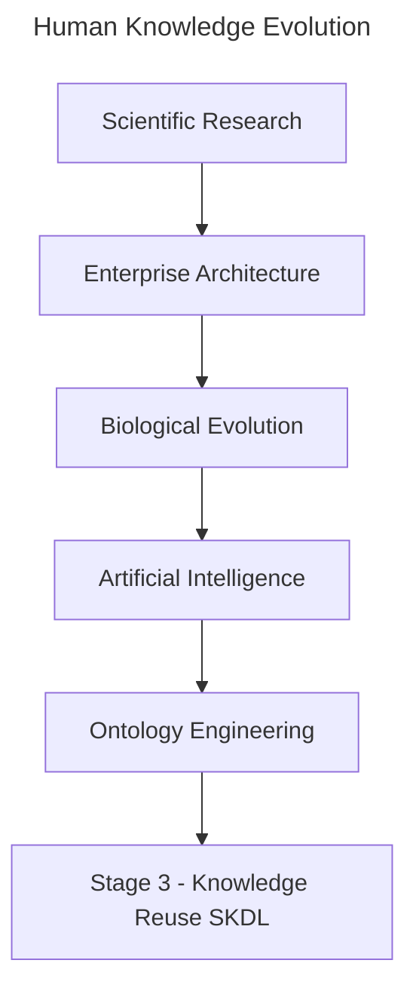
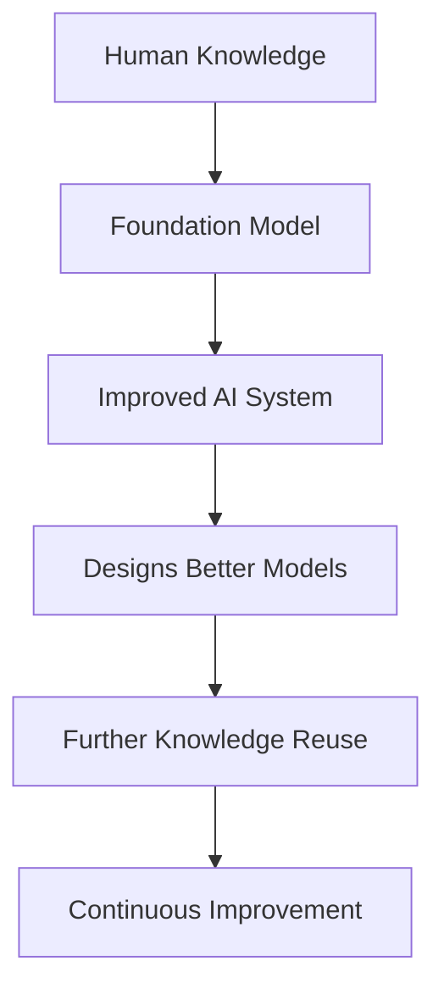
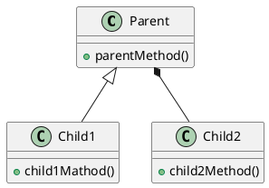
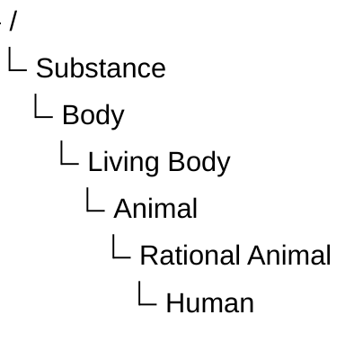

# Chapter 20 -- Knowledge Reuse: Stage 3 of the Semantic Knowledge Development Lifecycle

**Reusing Semantic Knowledge Through OWL Design Patterns**

> *"Knowledge becomes truly valuable not when it is created once, but when it can be reused many times.*

The first two stages of the **Semantic Knowledge Development Lifecycle (SKDL)** established the semantic foundations of ontology engineering.

During **Stage 1 -- Conceptual Modeling**, we identified the concepts that define a knowledge domain and organized them into a coherent semantic taxonomy.

During **Stage 2 -- Semantic Description**, we enriched those concepts with formal meaning using **Description Logic (DL)**, OWL restrictions, and class expressions

Chapter 18 established the conceptual vocabulary. Chapter 19 gave that vocabulary formal semantic meaning. By the end of **Chapter (19)**, our ontology was no longer simply a collection of class names.

It had become a **formal semantic knowledge model** whose concepts possess machine-understandable meaning.

At this point, however, another important engineering question naturally arises:

> **Once semantic knowledge has been created, how should it be managed as the ontology continues to grow?**

Should every new concept independently redefine knowledge that already exists?

Should ontology engineers repeatedly recreate similar semantic descriptions?

Or should previously established semantic knowledge itself become a reusable engineering asset?

Professional ontology engineering adopts the **third approach**.

Rather than viewing semantic definitions as isolated pieces of modeling work, mature ontologies treat them as **reusable knowledge assets** that can be shared, extended, specialized, and maintained systematically across the entire knowledge base.

This philosophy introduces **Stage 3 -- Knowledge Reuse** of the Semantic Knowledge Development Lifecycle (SKDL).

The objective of this stage is not to create additional semantic knowledge simply for its own sake.

Instead, it is to organize semantic knowledge so that it can be **reused consistently**, reducing duplication while improving maintainability, scalability, and long-term semantic quality.

Within the **Executable Knowledge Architecture (EKA)**, this transition represents another important increase in engineering maturity.

Knowledge is no longer viewed merely as information stored within an ontology.

Instead, semantic knowledge begins evolving into a reusable engineering asset capable of supporting
- multiple concepts,
- multiple ontologies,
- multiple applications, and
- eventually multiple intelligent systems.

Beginning with **Exercise 16** from the *Protégé 5 New OWL Pizza Tutorial*, this chapter explores how OWL enables semantic reuse through inheritance, logical abstraction, reusable modeling patterns, and carefully designed class definitions.

Along the way, we will examine knowledge reuse from multiple complementary perspectives, including software engineering, Enterprise Architecture, scientific research, biological evolution, mathematical abstraction, and modern Artificial Intelligence.

By the end of this chapter, you will recognize that **knowledge reuse is far more than another OWL modeling technique**.

It represents one of the universal engineering principles through which human knowledge continuously grows, evolves, and accumulates over time.



Whether knowledge is transmitted through scientific publications, enterprise architecture repositories, biological genomes, AI foundation models, or semantic ontologies, the underlying principle remains the same:

> **Progress is achieved not by repeatedly creating knowledge, but by continuously reusing, refining, and extending the knowledge that already exists.**

---

Table of Contents

- [Chapter 20 -- Knowledge Reuse: Stage 3 of the Semantic Knowledge Development Lifecycle](#chapter-20----knowledge-reuse-stage-3-of-the-semantic-knowledge-development-lifecycle)
  - [20.1 Introduction -- From Individual Knowledge to Reusable Knowledge](#201-introduction----from-individual-knowledge-to-reusable-knowledge)
  - [20.2 Why Knowledge Reuse Is a Universal Engineering Principle](#202-why-knowledge-reuse-is-a-universal-engineering-principle)
    - [20.2.1 Reuse in Software Engineering](#2021-reuse-in-software-engineering)
    - [20.2.2 Reuse in Enterprise Architecture](#2022-reuse-in-enterprise-architecture)
    - [20.2.3 Reuse in Scientific Research](#2023-reuse-in-scientific-research)
    - [20.2.4 Reuse in Biological Evolution](#2024-reuse-in-biological-evolution)
    - [20.2.5 Reuse in Artificial Intelligence](#2025-reuse-in-artificial-intelligence)
      - [20.2.5.1 From Knowledge Reuse to Recursive Improvement](#20251-from-knowledge-reuse-to-recursive-improvement)
    - [20.2.6 From Universal Principle to Ontology Engineering](#2026-from-universal-principle-to-ontology-engineering)
  - [20.3 Exercise 16 -- Reusing Semantic Knowledge in Practice](#203-exercise-16----reusing-semantic-knowledge-in-practice)
    - [20.3.1 Engineering Objective of Exercise 16](#2031-engineering-objective-of-exercise-16)
    - [20.3.2 From Copying Classes to Reusing Knowledge](#2032-from-copying-classes-to-reusing-knowledge)
    - [20.3.3 Reuse Before Redesign](#2033-reuse-before-redesign)
    - [20.3.4 Knowledge Reuse versus Knowledge Duplication](#2034-knowledge-reuse-versus-knowledge-duplication)
    - [20.3.5 Looking Beyond the User Interface](#2035-looking-beyond-the-user-interface)
  - [20.4 Reuse Before Rebuild -- An Engineering Pattern](#204-reuse-before-rebuild----an-engineering-pattern)
    - [20.4.1 The Pattern in Software Engineering](#2041-the-pattern-in-software-engineering)
    - [20.4.2 The Pattern in Enterprise Architecture](#2042-the-pattern-in-enterprise-architecture)
    - [20.4.3 The Pattern in Design and Manufacturing](#2043-the-pattern-in-design-and-manufacturing)
    - [20.4.4 From Copying to Knowledge Reuse](#2044-from-copying-to-knowledge-reuse)
    - [20.4.5 The Role of Variation in Knowledge Reuse](#2045-the-role-of-variation-in-knowledge-reuse)
    - [20.4.6 The Limits of Cloning](#2046-the-limits-of-cloning)
    - [20.4.7 The Engineering Attitude](#2047-the-engineering-attitude)
  - [20.5 Reusable Semantic Patterns in OWL](#205-reusable-semantic-patterns-in-owl)
    - [20.5.1 Inheritance (`SubClassOf`)](#2051-inheritance-subclassof)
    - [20.5.2 Equivalent Class Definitions (`EquivalentTo`)](#2052-equivalent-class-definitions-equivalentto)
    - [20.5.3 Reusable Restriction Patterns](#2053-reusable-restriction-patterns)
    - [20.5.4 Ontology Imports (`owl:imports`)](#2054-ontology-imports-owlimports)
    - [20.5.5 Design Patterns](#2055-design-patterns)
    - [20.5.6 Semantic Alignment](#2056-semantic-alignment)
  - [20.6 Reuse Across Disciplines - Mechanisms](#206-reuse-across-disciplines---mechanisms)
    - [20.6.1 Software Engineering -- Inheritance and Composition](#2061-software-engineering----inheritance-and-composition)
    - [20.6.2 Enterprise Architecture -- Capability Reuse and Reference Architecture](#2062-enterprise-architecture----capability-reuse-and-reference-architecture)
    - [20.6.3 Scientific Research -- Citation and Systematic Review](#2063-scientific-research----citation-and-systematic-review)
    - [20.6.4 Biology -- Gene Duplication and Regulatory Review](#2064-biology----gene-duplication-and-regulatory-review)
    - [20.6.5 Artificial Intelligence -- Transfer Learning and Model Adaptation](#2065-artificial-intelligence----transfer-learning-and-model-adaptation)
  - [20.7 Mathematical Perspective -- Abstraction, Generalization and Reuse](#207-mathematical-perspective----abstraction-generalization-and-reuse)
    - [20.7.1 Generalization as Subset Inclusion](#2071-generalization-as-subset-inclusion)
    - [20.7.2 Abstraction and Dimension Reduction](#2072-abstraction-and-dimension-reduction)
    - [20.7.3 Posets and Lattices](#2073-posets-and-lattices)
    - [20.7.4 Reuse and Logical Consistency](#2074-reuse-and-logical-consistency)
  - [20.8 Interesting Reading -- From Plato to Design Patterns](#208-interesting-reading----from-plato-to-design-patterns)
    - [20.8.1 Plato's Forms: The First Reusable Knowledge Assets](#2081-platos-forms-the-first-reusable-knowledge-assets)
    - [20.8.2 Aristotle's Genus and Differentia: The First Reuse Pattern](#2082-aristotles-genus-and-differentia-the-first-reuse-pattern)
    - [20.8.3 Porphyry's Tree: The First Reusable Taxonomy](#2083-porphyrys-tree-the-first-reusable-taxonomy)
    - [20.8.4 Kant and the Conceptual Schema: Reusable Categories as Preconditions of Knowledge](#2084-kant-and-the-conceptual-schema-reusable-categories-as-preconditions-of-knowledge)
    - [20.8.5 Christopher Alexander and the Language of Patterns](#2085-christopher-alexander-and-the-language-of-patterns)
    - [20.8.6 From Software Patterns to Ontology Design Patterns](#2086-from-software-patterns-to-ontology-design-patterns)
  - [20.9 EKA Perspective -- Stage 3 Strengthens $K$ and Prepares $\\Gamma$](#209-eka-perspective----stage-3-strengthens-k-and-prepares-gamma)
    - [20.9.1 Reuse and the EKA Tuple](#2091-reuse-and-the-eka-tuple)
    - [20.9.2 Strengthening $K$ -- The Knowledge Graph Layer](#2092-strengthening-k----the-knowledge-graph-layer)
    - [20.9.3 Preparing $\\Gamma$ -- The Governance Layer](#2093-preparing-gamma----the-governance-layer)
      - [**The SDC Model: Governance as Data Physics**](#the-sdc-model-governance-as-data-physics)
    - [20.9.4 From Kant to EKA: The Architectural Meaning of Reusable Categories](#2094-from-kant-to-eka-the-architectural-meaning-of-reusable-categories)
    - [20.9.5 The Maturity Arc: From $K$ to $\\Gamma$](#2095-the-maturity-arc-from-k-to-gamma)
    - [20.9.6 Engineering Takeaway](#2096-engineering-takeaway)
  - [20.10 Engineering Guidelines for Knowledge Reuse](#2010-engineering-guidelines-for-knowledge-reuse)
    - [20.10.1 Design for Reuse from the Start](#20101-design-for-reuse-from-the-start)
    - [20.10.2 Reuse Before Create](#20102-reuse-before-create)
    - [20.10.3 Clone Deliberately, Then Specialize](#20103-clone-deliberately-then-specialize)
    - [20.10.4 Abstract Common Patterns](#20104-abstract-common-patterns)
    - [20.10.5 Govern What You Reuse](#20105-govern-what-you-reuse)
    - [20.10.6 Validate After Every Reuse](#20106-validate-after-every-reuse)
    - [20.10.7 Think in Patterns, Note Instances](#20107-think-in-patterns-note-instances)
    - [20.10.8 Document the Semantic Lineage](#20108-document-the-semantic-lineage)
    - [20.10.9 Engineering Takeaway](#20109-engineering-takeaway)
  - [20.11 Key Concepts](#2011-key-concepts)
  - [20.12 Chapter Summary](#2012-chapter-summary)
  - [20.13 Looking Ahead -- Knowledge Governance](#2013-looking-ahead----knowledge-governance)
    - [20.13.1 From Reuse to Governance](#20131-from-reuse-to-governance)
    - [20.13.2 What Semantic Governance Entails](#20132-what-semantic-governance-entails)
    - [20.13.3 The SDC Model as Governance Infrastructure](#20133-the-sdc-model-as-governance-infrastructure)
    - [20.13.4 The Path Forward](#20134-the-path-forward)
    - [20.13.5 The Arc of the Lifecycle](#20135-the-arc-of-the-lifecycle)


## 20.1 Introduction -- From Individual Knowledge to Reusable Knowledge

One of the defining characteristics of human civilization is that **knowledge accumulates through reuse rather than continual reinvention**.

Very few ideas are created in complete isolation.

Instead, almost every advance builds upon knowledge that already exists.

Scientists extend previous discoveries through research and citation.

Engineers improve proven designs rather than redesigning every component from first principles.

Software developers reuse libraries, frameworks, and design patterns instead of repeatedly implementing identical functionality.

Enterprise architects organize reusable business capabilities, reference architectures, and architectural building blocks that can support numerous initiatives across an organization.

Even biological evolution follows the same principle.

Rather than redesigning living organisms from the beginning, evolution preserves successful genetic information across generations while gradually introducing variation through mutation and natural selection.

Modern Artificial Intelligence demonstrates a remarkably similar pattern.

Foundation models learn from enormous collections of accumulated human knowledge, while techniques such as **transfer learning, Retrieval-Augmented Generation (RAG)**, and **knowledge distillation** continually reuse previously acquired knowledge to solve new problems more effectively.

Although these disciplines appear unrelated, they all reflect the same underlying engineering principle:

> **Progress is achieved not by repeatedly creating knowledge, but by continuously reusing, refining, and extending existing knowledge.**

Ontology engineering is no exception.

After completing **Stage 2 -- Semantic Description**, the `Pizza` ontology now contains its first meaningful semantic definitions.

For example, `MargheritaPizza` is no longer merely a concept within a taxonomy.

It possesses formal semantic descriptions through restrictions such as:

```text
hasTopping some MozzarellaTopping
hasTopping some TomatoTopping
```

These restrictions successfully describe one particular pizza.

However, an important engineering challenge immediately appears.

As the ontology expands from a handful of concepts to hundreds -- or even millions -- of concepts, should ontology engineers repeatedly recreate similar semantic definitions?

Or should those semantic descriptions themselves become reusable knowledge assets?

This question motivates **Stage 3 -- Knowledge Reuse** of the Semantic Knowledge Development Lifecycle (SKDL).

**Knowledge reuse** extends the engineering principles established in the previous chapters.

- **Stage 1** introduced reusable conceptual abstractions through semantic taxonomies.
- **Stage 2** introduced reusable logical constructors through Description Logic (DL).
- Now **Stage 3** goes one step further by creating **semantic knowledge itself as reusable**.

Rather than viewing each class definition as an isolated modeling exercise, ontology engineers identify semantic patterns that can be shared consistently across many concepts.

As ontologies continue to grow, this shift becomes increasingly important.

Without systematic reuse, semantic models gradually accumulate duplicated restrictions, inconsistent definitions, unnecessary maintenance effort, and increasingly governance complexity.

Small educational ontologies may tolerate such duplication

Large enterprise knowledge graphs containing tens of thousands of concepts **CANNOT**.

Knowledge reuse therefore should not be viewed simply as a convenient modeling technique.

It represents a fundamental engineering discipline for controlling semantic complexity while enabling ontologies to evolve sustainably over long periods of time.

This engineering philosophy is familiar across many mature disciplines.

Enterprise Architecture promotes the principle of **Reuse before Buy or Build** -- that is, before acquiring new capabilities through purchasing or construction, first evaluate what already exists and can be reused. This principle encourages organizations to maximize the value of existing architectural assets before committing to new solutions.

Scientific research measures impact not only by creating new knowledge, but also by how frequently that knowledge is reused and extended through subsequent publications.

Likewise, successful ontologies are characterized not by the number of concepts they contain, but by the extent to which their semantic knowledge can be reused consistently throughout the knowledge base.

**Exercise 16** introduces this principle through a seemingly simple modeling activity.

Rather than creating entirely new semantic definitions from scratch, we begin constructing new ontology concepts by reusing semantic structures that already exist.

Although the practical exercise requires only a small number of operations within Protégé, its engineering significance extends far beyond the user interface.

It introduces one of the defining characteristics of every mature engineering discipline:

> **Well-designed knowledge should be created once, reused many times, and refined only when necessary.**

Throughout this chapter, we will examine knowledge reuse from practical, engineering, mathematical, architectural, biological, and artificial intelligence perspectives.

By the end of the chapter, you will recognize that reusable semantic knowledge is more than a modeling convenience.

It is a **reusable knowledge asset** -- one that enables ontologies, enterprise architectures, scientific knowledge, AI systems, and even biological life to grow in complexity while remaining coherent, maintainable, and sustainable.

## 20.2 Why Knowledge Reuse Is a Universal Engineering Principle

One of the most remarkable characteristics shared by mature engineering disciplines is that:

> **progress depends far more on reuse than on continual reinvention**.

Although innovation often receives the greatest attention, sustained progress is rarely achieved by repeatedly creating everything from the beginning.

Instead, successful systems grow by preserving proven knowledge while extending it to address new challenges.

This principle appears so consistently across science and engineering that it can reasonably be regarded as a universal engineering law.

Ontology engineering is no exception.

Once semantic knowledge has been carefully **designed**, **validated**, and **understood**, it becomes an engineering asset that should be reused rather than recreated. **Exercise 16** introduces this principle within the `Pizza` ontology, but its significance extends far beyond OWL or Protégé. It reflects a pattern that underlies software engineering, enterprise architecture, scientific research, biology, mathematics, and modern artificial intelligence.

The remainder of this chapter explores these perspectives to demonstrate that **knowledge reuse is not merely an ontology technique -- it is a fundamental mechanism through which complex knowledge systems evolve.**

### 20.2.1 Reuse in Software Engineering

Software engineering has long recognized that **maintainability depends upon systematic reuse**.

Modern applications are rarely developed entirely from scratch.

Instead, developers build upon existing programming languages, operating systems, libraries, frameworks, APIs, design patterns, and open-source ecosystems.

When creating a new application, an experienced engineer does not begin by writing a new compiler, networking stack, or database engine. Instead, existing components are reused whenever they have already demonstrated correctness, reliability, and maintainability.

This philosophy is reflected in principle such as:
- Design Patterns
- Don't Repeat Yourself (DRY)
- Convention over Configuration
- Framework-based Development
- Package Management Ecosystems

**Knowledge reuse** therefore reduces both development effort and engineering risk.

Ontology engineering follows exactly the same philosophy.

Instead of repeatedly redefining identical semantic structures, reusable ontology patterns become the semantic equivalent of software libraries.

### 20.2.2 Reuse in Enterprise Architecture

Enterprise Architecture extends this philosophy from software components to organizational knowledge.

Rather than designing every capability independently, mature EA practices encourage organizations to reuse proven architectural assets whenever possible.

A widely recognized principle is:

> **Reuse before Buy or Build**.

The principle reflects a clear decision hierarchy: reuse is always the first option. Only when reuse is not feasible should organizations consider acquisition (buy) or construction (build). The choice between buy and build depends on business context -- cost, timeline, strategic alignment -- not a fixed sequential order.

1. **Reuse** existing enterprise assets whenever feasible.
2. **Buy** proven commercial capability (Commercial Off-The-Shelf, or COTS) when suitable assets are unavailable and acquisition aligns with business needs.
3. **Build** new solutions only when neither reuse nor acquisition satisfies the business requirements.

This principle minimizes duplication, reduces operational risk, improves governance, and accelerates delivery.

Semantic knowledge should be treated in exactly the same way.

Well-designed ontology modules, reusable class expressions, common vocabularies, and shared semantic patterns become enterprise assets that can be leveraged across projects rather than recreated independently.

Within the EKA framework, reusable semantic knowledge represents reusable organizational intelligence.

### 20.2.3 Reuse in Scientific Research

Scientific knowledge advances through cumulative refinement rather than isolated discovery.

Every research paper begins with a literature review because no scientific contribution exists in isolation.

Researchers study previous work, identify existing theories, reproduce experiments, extend established results, and contribute only the incremental knowledge that advances the field.

Consequently, one indicator of a publication's long-term impact is the number of times it is cited by subsequent research.

A highly cited paper demonstrates that its knowledge has been successfully reused by the scientific community.

Knowledge therefore achieves influence not simply by being published, but by becoming reusable.

Ontology engineering follows the same principle.

A reusable ontology contributes value far beyond its original project because its semantic structures can support future ontologies, knowledge graphs, and intelligent applications.

### 20.2.4 Reuse in Biological Evolution

Biological inheritance provides a useful analogy for cumulative information preservation and variation.

The genomes of modern organisms are not created independently for every generation.

Instead, genetic information is inherited, reused, recombined, and gradually refined through evolutionary processes.

Successful biological structures persist because they continue to prove useful under changing environmental conditions.

Evolution therefore preserves accumulated biological knowledge while permitting incremental adaptation.

Complex life emerges through billions of years of reuse rather than continual recreation.

Ontology evolution follows a remarkably similar pattern.

Successful semantic structures should likewise be inherited, extended, specialized, and adapted instead of repeatedly reconstructed.

In short:
- Biology: inheritance -> variation -> selection
- Ontology: reuse -> specialization -> refinement

### 20.2.5 Reuse in Artificial Intelligence

Recent advances in Artificial Intelligence further illustrate the importance of reusable knowledge.

Large Language Models are trained on vast collections of accumulated human knowledge rather than beginning with an empty understanding of the world.

Subsequent techniques continue this philosophy:

- Transfer Learning
- Fine-Tuning
- Retrieval-Augmented Generation (RAG)
- Knowledge Distillation
- Model Adaptation

Each technique seeks to reuse previously learned knowledge instead of rediscovering it independently.

Knowledge distillation provides an especially compelling example.

Rather than retraining a smaller model from the beginning, knowledge learned by a larger model is transferred into a more efficient representation.

The objective is not to recreate intelligence but to reuse it.

Ontology engineering pursues the same objective.

Semantic definitions, once established, should become reusable knowledge assets capable of supporting future applications.

#### 20.2.5.1 From Knowledge Reuse to Recursive Improvement

Recent discussions surrounding **Artificial General Intelligence (AGI)** have introduced another perspective on knowledge reuse.

One frequently discussed hypothesis proposes that once an AI system becomes capable of contributing to AI research itself, it may begin improving the very models from which it originated.

Conceptually, the process can be viewed as:



Whether recursive self-improvement eventually produces AGI or even Artificial Super-Intelligence (ASI) remains an open scientific question.

Researchers continue to debate both its feasibility and its expected timescale. Nevertheless, one engineering observation is already evident:

> **each new generation of AI systems is built primarily by reusing the accumulated knowledge, architectures, and capabilities of previous generations.**

Modern foundation models do not rediscover mathematics, language, software engineering, medicine, or ontology engineering independently.

They inherit enormous amounts of previously created human knowledge through trained corpora, reusable model architectures, transfer learning, fine-tuning, retrieval mechanisms, and knowledge distillation.

Even when new capabilities emerge, they typically represent **extensions of existing knowledge rather than complete reinvention**.

Consequently, **knowledge reuse** is becoming not merely an optimization technique, but one of the central mechanisms through which modern AI systems continue to evolve.

Ontology engineering follows the same engineering philosophy.

Every reusable ontology, semantic pattern, and knowledge graph contributes to a growing body of machine-interpretable knowledge that future intelligent systems may build upon rather than recreate.

From the perspective of the **Executable Knowledge Architecture (EKA)**, reusable ontologies can be viewed as persistent organizational knowledge assets. As AI systems increasingly consume structured knowledge rather than isolated documents, well-governed ontologies and knowledge graphs become reusable semantic foundations upon with future intelligent systems can continuously build.

In this sense, **Stage 3 -- Knowledge Reuse** is concerned not only with reducing modeling effort today, but also with enabling the accumulation of semantic intelligence for tomorrow.

From this perspective, knowledge reuse is one important mechanism through which machine capabilities can accumulate and improve.

### 20.2.6 From Universal Principle to Ontology Engineering

Across all these disciplines, a common pattern emerges as below:

| Discipline | Reusable Asset |
| --- | --- |
| Software Engineering | Libraries, frameworks, APIs |
| Enterprise Architecture | Capability maps, reference architectures, reusable building blocks |
| Scientific Research | Publications, theories, experimental evidence |
| Biology | Genetic information |
| Artificial Intelligence | Learned representations, foundation models, distilled knowledge |
| Ontology Engineering | Ontologies, semantic patterns, reusable class expressions |

Although the artifacts differ, the engineering philosophy remains remarkably consistent.

> **Knowledge becomes increasingly valuable as its ability to be reused increases.**

**Exercise 16** now introduces this same principle within OWL ontology engineering.

The objective is no longer merely to define semantic knowledge correctly, but to organize that knowledge so it can be
- reused consistently,
- governed effectively, and
- extended systematically

throughout the remainder of the **Semantic Knowledge Development Lifecycle (SKDL)**.

However, reuse also introduces new responsibilities. Once semantic knowledge is shared across multiple concepts and applications, changes made to one reusable definition may affect many dependent models. Consequently, semantic reuse naturally raises questions of **ownership**, **versioning**, **validation**, and **governance**. These engineering concerns become the focus of the next stage of the SKDL as well.

Reuse does not merely preserve existing knowledge. It increases its value! Every successful reuse validates previous knowledge, extends its applicability, reduces future engineering, and creates a stronger foundation for subsequent innovation.

In this sense, the value of knowledge compounds through reuse in much the same way that financial capital compounds through investment.

Knowledge survives civilizations not because it is repeatedly rediscovered, but because it is successfully transmitted, reused, and refined across generations.

In short:

> **Human civilization advances because knowledge accumulates through systematic reuse.**
> **Ontology engineering simply makes this principle explicit and machine-interpretable.**

> **From Diagrams to Executable Constraints** -- SDCStudio's `XMI2SDC` capability demonstrates the principle of "reuse before rebuild` at enterprise scale. Enterprise architects' UML models are not left as diagrams -- they are compiled directly into W3C restriction lattices, turning visual constraints into mathematical laws enforced at the execution boundary. This is the full realization of the **structure $\to$ meaning $\to$ governance** arc: reusable knowledge assets are not just documented, they are executable. (*Source: https://www.linkedin.com/posts/your-enterprise-architects-have-spent-years-share-7439831636587921408-Alad/*)

## 20.3 Exercise 16 -- Reusing Semantic Knowledge in Practice

In the previous section we examined why knowledge reuse represents one of the most fundamental engineering principles across science, software engineering, enterprise architecture, biology, and artificial intelligence.

**Exercise 16 -- Create `AmericanaPizza` by Cloning `MargheritaPizza` and Adding Additional Restrictions** now demonstrates how this principle is applied within an ontology.

At first glance, the exercise appears surprisingly simple.

Instead of creating a new pizza from scratch, we duplicate an existing class and introduce one additional semantic restriction.

Although this operation requires only a few clicks inside Protégé, it illustrates an engineering principle that scales to ontologies containing thousands -- or even millions -- of concepts.

The Protégé operation begins by copying an existing class definition. The engineering objective, however, is to reuse the semantic knowledge embodied in that definition while introducing only the differences required by the new concept.

This is precisely how mature knowledge systems evolve.

### 20.3.1 Engineering Objective of Exercise 16

**Exercise 16** asks us to create `AmericanaPizza` by duplicating `MargheritaPizza` and adding one additional topping restriction.

Conceptually the exercise can be summarized as:

```text
Existing Semantic Definition + Small Semantic Difference
= New Knowledge
```

Rather than redefining every characteristic, we preserve the semantic knowledge that has already been validated.

Only the distinguishing features is added.

This reflects one of the oldest engineering principles:

> **Never recreate what has already been proven correct**.

### 20.3.2 From Copying Classes to Reusing Knowledge

Protégé performs the operation using **Duplicate Selected Class**, either from Edit menu or simply right click on the class name:


In the "Duplicate Class" dialogue, change the name from `MargheritaPizza` to `AmericanaPizza`, leave all the other options as they are and select `OK`:

From:


to:


> Notice: when you change `Name`, the IRI identifier is also changed.

After clicking `OK`, new named pizza is added:


Switch to the `Entities` tab, you may see this new named pizza `AmericanaPizza` contains the copied `SubClassOf` axioms from `MargheritaPizza`:


Now add one more restriction to make `AmericanaPizza` distinguished from the copied one: `hasTopping some PepperoniTopping`. Note that if you see a dotted red line under any concept (for example, under `PepperoniTopping`), it means you haven not yet added that topping to the ontology. Add it first, then return to Class Expressions Editor:


After `PepperoniTopping` is added, you should see below:


Also modifying comment annotation, then the end state of **Exercise 16** should be like below:


From a software perspective this appears to be cloning.

From an ontology perspective something more interesting is occurring.

We are not merely copying a class.

We are reusing:

- conceptual placement,
- inherited semantics,
- logical restrictions,
- annotations,
- documentation, and
- modeling decisions.

Every one of these represents accumulated knowledge.

The duplicated class therefore becomes the starting point for further semantic specialization rather than an independent creation.

Knowledge evolves through **modification** rather than **repeated invention**.

### 20.3.3 Reuse Before Redesign

When `AmericanaPizza` is created, almost everything already exists:

```text
NamedPizza
hasTopping some MozzarellaTopping
hasTopping some TomatoTopping
```

Only one new semantic statement is introduced:

```text
hasTopping some PepperoniTopping
```

The resulting definition becomes:

```text
MargheritaPizza + PepperoniTopping
= AmericanaPizza
```

From an engineering perspective, most of the semantic structure is retained, while a small number of additional axioms distinguish the new concept.

This ratio appears repeatedly throughout software engineering, enterprise architecture, and scientific modeling.

Innovation typically occurs by extending existing knowledge rather than replacing it.

### 20.3.4 Knowledge Reuse versus Knowledge Duplication

Although **Exercise 16** begins with duplication, duplication itself is not the engineering objective.

There is an important distinction.

| Duplication | Reuse |
| --- | --- |
| Copies information | Preserves validated knowledge |
| Produces independent artifacts | Maintains semantic lineage |
| Encourages divergence | Encourages consistency |
| Increases maintenance | Reduces maintenance effort |

The duplicate serves only as an intermediate step.

Its purposes is to accelerate semantic reuse while preserving correctness.

As the ontology matures, increasingly sophisticated reuse mechanisms -- such as reusable superclass patterns, equivalent class definitions, ontology imports, and modular ontologies -- will gradually replace simple cloning.

**Exercise 16** therefore introduces the simplest manifestation of a much broader engineering discipline.

### 20.3.5 Looking Beyond the User Interface

You may initially regard **Duplicate Selected Class** as merely a convenient Protégé feature.

It is considerably more important than that.

The command embodies a universal engineering philosophy.

Knowledge that has already been

- understood,
- validated,
- documented, and
- successfully applied

should become a **reusable asset** rather than disposable effort.

This principle explains:

- why software libraries exist,
- why enterprise architecture repositories exist,
- why scientific literature is cited,
- why biological evolution conserves successful genes, and
- why ontologies continue growing through semantic specialization instead of continual reinvention.

**Exercise 16**  therefore represents the first practical demonstration of **Stage 3 -- Knowledge Reuse** within the Semantic Knowledge Development Lifecycle (SKDL).

## 20.4 Reuse Before Rebuild -- An Engineering Pattern

The simple act of duplicating `MargheritaPizza` to create `AmericanaPizza` in **Exercise 16** illustrates a much broader engineering principle that extends far beyond Protégé  or OWL. It is a concrete manifestation of a pattern that appears across virtually every mature engineering discipline:

> **clone before create** -- or more formally, **reuse before build**.

This pattern is not merely a productivity shortcut.

It embodies a fundamental insight about how complex systems are constructed and maintained over time.

Engineering disciplines that have successfully scaled to manage extraordinary complexity -- from software engineering to aerospace systems, from enterprise architecture to semiconductor design -- all rely on some form of this principle.

Rather than beginning each new design from a blank canvas, engineers identify existing solutions that closely approximate the desired outcome, duplicate them, and then introduce only the modifications necessary to address the new requirements.

This approach is not an admission of limited creativity. It is a recognition that the vast majority of engineering effort is spent not on novel invention, but on the **adaptation**, **extension**, and **combination** of proven solutions.

By beginning with an existing artifact, engineers inherit the accumulated knowledge, testing, validation, and documentation embedded within it. Every hour spent designing a new solution from scratch is an hour that could have been spent refining a proven solution to fit a new context -- or, even more productively, improving the shared foundation so that everyone benefits.

### 20.4.1 The Pattern in Software Engineering

In software engineering, the **clone before create** pattern appears in numerous forms:

- **Class inheritance**: Subclasses extend the behavior of parent class, inheriting their methods and attributes while adding or overriding specific features. This is not duplication; it is specialization.
- **Copy-to-write**: Data structures are shared until modification is required, reducing memory consumption and improving performance.
- **Forking**: Open-source projects are forked to create new projects that share a common codebase but evolve independently.
- **Scaffolding**: Code generators produce initial versions of applications or components based on established templates, which are then customized.
- **Design Patters**: Reusable solutions to common problems, such as the Factory pattern or Observer pattern, are applied across projects without being re-implemented from scratch.

Each of these mechanisms shares a common logic:

> **start with a working solution, modify only what is necessary, and preserve what already works.**

This logic is not accidental. It emerges from the observation that most engineering problems are variations of problems that have already been solved. To solve a new problem by reinventing the whole wheel is to ignore the accumulated knowledge of the engineering community. To solve it by adapting an existing solution is to build upon that knowledge.

The principle of **Don't Repeat Yourself (DRY)** formalizes this idea:

> every piece of knowledge should have a single, unambiguous representation within a system.

When knowledge is duplicated, changes must be made in multiple places, increasing the risk of inconsistency and the cost of maintenance. DRY is not merely a coding guideline -- it is a reuse discipline.

Similarly, **Convention over Configuration** reduces the need for repetitive specification by establishing default behaviors that can be overridden only when necessary. This allows engineers to reuse established patterns without explicitly redefining them for each new context.

**Package management ecosystems** -- such as `npm`, `Maven`, `PyPI`, and others -- represent reuse at an industrial scale. Rather than implementing common functionality themselves, developers declare dependencies on existing libraries that have been tested, documented, and maintained by others. This dramatically reduces development effort while improving reliability.

Ontology engineering follows exactly the same philosophy. Instead of repeatedly redefining identical semantic structure, reusable ontology patterns become the semantic equivalent of software libraries. Our `Pizza` ontology itself can be viewed as a reusable module that could be imported into larger food ontologies, menu systems, or nutritional knowledge graphs.

### 20.4.2 The Pattern in Enterprise Architecture

Enterprise Architecture formalizes the same principle through the **Reuse before Buy or Build** framework.

This principle is not merely a suggestion; it is a governance rule that guides investment decisions across the enterprise.

The imperative is clear:

> Before any decision to acquire new capabilities -- whether through purchasing commercial solutions or building custom ones -- first evaluate what already exists and can be **reused**.
> The choice between **buy** and **build** is context-dependent, not sequentially ordered.

| Decision | Implication |
| --- | --- |
| **Reuse** | Leverage existing capabilities, reducing cost and risk |
| **Buy** | Acquire proven commercial solutions when reuse is not feasible |
| **Build** | Construct solutions only when neither reuse nor buy suffices |

The discipline enforced by this framework ensures that enterprise assets are not continually recreated.

Instead, architectural building blocks -- capabilities, applications, data models, and reference architectures -- are designed explicitly for reuse.

When a new project begins, the first question is not "*What should be build?* but rather "*What can we reused?*"

This is not merely an economic optimization. It is a strategy for managing complexity. Every time an existing asset is reused, the organization avoids introducing new variability into its architecture. Consistency improves. Governance becomes simpler. Maintenance effort declines.

**Reference Architectures** provide a particularly clear example. Rather than designing a new solution architecture for every project, organizations develop reference architectures that embody proven patterns, standards, and best (good) practices. These reference architectures are then adapted -- not recreated -- for each specific context.

**Capability-based planning** extends this thinking to the business level. Business capabilities are defined once and then realized through multiple projects and initiatives. The capability itself becomes a reusable asset that provides a stable foundation for investments decisions, roadmap planning, and architectural governance.

In enterprise architecture, reuse is not merely a technical practice -- it is a strategic discipline that aligns technology investment with business value.

### 20.4.3 The Pattern in Design and Manufacturing

Beyond software and architecture, the **clone before create** pattern appears in physical engineering as well:

- **Product line engineering**: Automobile manufacturers produce multiple vehicle models from shared platforms. The underlying chassis, powertrain, and electrical architecture are reused across models; only exterior styling and interior features vary. Volkswagen's MQB platform (*Modularer QuerBaukasten*, https://en.wikipedia.org/wiki/Volkswagen_Group_MQB_platform), for example, underpins dozens of models across multiple brands, sharing approximately 60% of components.
- **Design reuse in aerospace**: Aircraft designers are refined over decades. The Boeing 737, first introduced in 1967, has been continuously extended and modified, but its fundamental architecture remains recognizable. The 737 MAX shares the same basic airframe design as earlier models, enabling airlines to reuse pilot training, maintenance procedures, and spare parts.
- **Semiconductor design**: Integrated circuits (ICs) are built from reusable intellectual property (IP) blocks -- processors, memory controllers, interface modules -- that are combined and configured rather than designed from scratch. Modern system-on-chip (SoC) designs typically integrate dozens of pre-verified IP blocks, dramatically reducing design time and risk.
- **Mechanical engineering**: Standardized fasteners, bearing, motors, and other components are also reused across products. Engineers do not design a new screw for every application; instead, they select from standard catalogs.

In each case, the pattern is identical:

> **establish a proven base, maximize the reuse of the elements in this base, extend it incrementally, and minimize the introduction of unproven elements.**

The alternative -- designing every system from the ground up -- is economically infeasible at scale.

Crucially, these physical engineering disciplines also demonstrate the limits of reuse. Components that are too tightly coupled to their original context cannot be reused without significant modification. Successful reuse requires thoughtful design for adaptability -- a theme we will return to in [**Section 20.4.6**](#2046-the-limits-of-cloning).

### 20.4.4 From Copying to Knowledge Reuse

The software and design examples above share one subtle but important characteristic:

> reuse in these disciplines is not merely about **copying**.

It is about:

> **preserving the knowledge embedded in the original artifact**.

When a software engineer extends a class, they inherit not only *the code* but also **the design decisions, testing, and documentation** that accompanied the original implementation.

When an automobile manufacturer reuses a platform, they inherit **crash-test results, manufacturing processes, and supply-chain relationships**.

When an ontology engineer duplicates a class, they inherit **the semantic decisions, logical restrictions, and validation history** attached to the original concept.

This is the key insight that distinguishes **reuse** from mere **copying**:

| | Copying | Knowledge Reuse |
| --- | --- | --- |
| **Preserves** | Text, Code, or Structure | Validated Knowledge, Design Rationale, and Engineering Decisions |
| **Reduces** | Typing Effort | Error Risk and Design Uncertainty |
| **Requires** | No Understanding | Understanding of What is being Reused |
| **Supports** | Independent Evolution | Consistent Evolution across Dependent Artifacts |
| **Outcome** | Redundant Artifacts | Coherent, Maintainable Knowledge Base |

The duplicate operation in **Exercise 16** is therefore not a mechanical copy operation. It is a deliberate act of knowledge transmission.

By duplicating `MargheritaPizza`, the ontology engineer inherits:

- **Conceptual Placement** -- the class's position within the `NamedPizza` hierarchy
- **Inherited Semantics** -- all restrictions inherited from `NamedPizza` and `Pizza`
- **Logical Restrictions** -- the existential restrictions on `MozzarellaTopping` and `TomatoTopping`
- **Annotation** -- labels, comments, and documentation
- **Modeling decisions** -- the choice of toppings and the semantic structure

The new class does not start from scratch; it starts from a position of existing semantic definitions --

> The ontology engineer's task is no longer to **recreate** but to **extend**.

This distinction becomes particularly important when considering large ontologies. In a knowledge base containing thousands of concepts, the difference between "copying and pasting" and "reusing previous established semantic knowledge" is not merely semantic -- it is the difference between a **maintainable ontology** and an **unmaintainable one**.

### 20.4.5 The Role of Variation in Knowledge Reuse

Critically, knowledge reuse does not imply **stagnation**.

Every reuse introduces variation. The new class is modified to accommodate new requirements.

In **Exercise 16**, `AmericanaPizza` receives an additional topping restriction that distinguishes it from `MargheritaPizza`.

This variation is not a defect; it is the mechanism through which knowledge evolves.

Biological evolution provides a useful analogy. Genetic information is inherited from parent to offspring, but mutations introduce variation. Most mutations are neutral or harmful; occasionally, one proves beneficial and is preserved. Over time, the population evolves -- not by reinventing the genome, but by accumulating beneficial variations on a shared genetic foundation.

Ontology engineering follows a similar pattern. Semantic knowledge is inherited, but variations are introduced to address new requirements. Most variations are minor and have limited impact; occasionally, one proves valuable and becomes part of the reusable foundation for future concepts. The ontology evolves -- not by reinventing its concepts, but by accumulating useful semantic variations.

In this sense, **Section 20.3.3**'s observation that approximately 90% of the semantic definition is reused is not a limitation of the exercise; it is a feature of how knowledge evolves in any mature discipline. Innovation typically occurs by extending existing knowledge rather than replacing it.

**Variation without reuse** leads to fragmentation. Each new concept becomes a silo island, unrelated to what came before. The ontology becomes difficult to navigate, govern, or reason over.

**Reuse without variation** leads to stagnation. The ontology cannot adapt to new requirements or domains. It becomes brittle and unresponsive.

**The balance between reuse and variation** is essential. It is the mechanism through which knowledge systems grow while maintaining coherence. This balance is not achieved automatically; it requires conscious engineering decisions about when to extend, when to specialize, and when to create something genuinely new.

### 20.4.6 The Limits of Cloning

While **cloning** is a useful starting point for knowledge reuse, it is not the ultimate mechanism.

As ontologies grow, simple duplication becomes insufficient for several reasons:

1. **Maintenance burden**: Changes to the original class are not automatically propagated to cloned classes. If `MargheritaPizza` is refined -- for example, if a new restriction is added or an annotation is corrected -- `AmericanaPizza` must be manually updated. In a large ontology, this manual synchronization becomes a significant maintenance cost.
2. **Semantic lineage**: The ontological relationship between cloned classes is not captured. The ontology knows that `AmericanaPizza` was copied from `MargheritaPizza` in a modeling session, but it does NOT know *why* they are related or what semantic relationship exists between them. This information is lost unless explicitly documented.
3. **Scalability**: Cloning is effective for small-scale reuse but becomes unwieldy when hundreds of classes must be derived from shared foundations. The manual effort of duplicating, renaming, and modifying each class scales linearly with the number of variants, while the potential for error grows super-linearly.
4. **Reasoning limitations**: The reasoner does not recognize the lineage between cloned classes. It treats `MargheritaPizza` and `AmericanaPizza` as unrelated concepts unless additional axioms are introduced. The semantic connection exists in the engineer's mind, but not in the ontology.
5. **Governance challenges**: When cloned classes diverge, they may become inconsistent over time. The conceptual relationship between them -- originally a shared foundation -- becomes obscured. Governing such an ontology requires additional effort to maintain consistency.

For these reasons, cloning is best understood as an **introductory mechanism** for knowledge reuse. As ontology engineers become more experienced, they adopt more sophisticated patterns:

- **Shared superclasses**: Common restrictions and properties are abstracted into parent classes that multiple subclasses inherit. For example, all named pizzas might inherit a common set of base restrictions.
- **Equivalent class definitions**: Classes are defined by logical conditions that can be independently applied and reused. A `VegetarianPizza` definition, once established, can be reused across multiple contexts.
- **Ontology modules**: Self-contained ontologies that can be imported and extended across projects. The `Pizza` ontology itself could become a module imported into larger food ontologies.
- **Design patterns**: Proven modeling templates that capture recurring semantic structures, such as the `hasTopping` restriction pattern.

**Exercise 16** introduces the simplest of these mechanisms because it establishes the fundamental principle:

> **The goal is not to copy; the goal is to reuse validated knowledge while introducing only necessary variation.**

Once this principle is understood, the more sophisticated mechanisms become natural extensions of the same practice.

### 20.4.7 The Engineering Attitude

Ultimately, the **clone before create** pattern is not a technique but an **engineering attitude**.

It is the disposition to ask, before beginning any new modeling activity:

- What existing knowledge can I reuse?
- How can I introduce only the minimum necessary novelty?
- What has already been validated that I can build upon?
- What will be the maintenance cost of creating something entirely new?

This attitude is not limited to ontology engineering. It is the attitude that has enabled every successful engineering discipline to scale. It is the recognition that progress is achieved not by repeatedly creating knowledge, but by continuously reusing, refining, and extending the knowledge that already exists.

**Exercise 16** serves as the first practical demonstration of this attitude within the Semantic Knowledge Development Lifecycle (SKDL). It is a small operation, but it embodies a large principle -- one that will reappear throughout the remaining stages of SKDL and across every mature engineering discipline that has ever managed to grow without collapsing under its own complexity.

The engineering attitude also requires humility.
- It acknowledges that most problems have been encountered before and that someone else has likely developed a solution worth studying.
- It does not devalue creativity; it redirects it toward the genuinely novel aspects of a problem rather than its routine elements.

In this sense, knowledge reuse is not merely a technique for managing complexity. It is a recognition of our inter-dependence as engineers -- an acknowledgement that we build upon the work of those who came before us and that our own work will, if we are fortunate, provide a foundation for those who follow.

## 20.5 Reusable Semantic Patterns in OWL

**Exercise 16** demonstrated reuse through the simplest possible mechanism: **cloning**.

But cloning, as **Section 20.4.6** established, is only the **entry point**.

OWL itself provides several formal mechanisms through which semantic knowledge can be reused -- not by copying axioms, but by **referencing** them.

This distinction matters enormously.

> When knowledge is copied, two definitions now exist.
> When knowledge is referenced, one definition exists -- used in many places.

The remainder of this section catalogs the primary reuse mechanisms available in OWL, moving from the simplest (inheritance) to the most structurally significant (semantic alignment).

When possible, each mechanism is tied back to a specific exercise from the *Protege 5 New OWL Pizza Tutorial* (M. DeBellis), so you can see exactly where in your own ontology you already built, and will built, the pattern being described.

### 20.5.1 Inheritance (`SubClassOf`)

The most fundamental reuse mechanism in OWL is one you have already used many times: `SubClassOf`.

When `VegetarianPizza` is declared `SubClassOf Pizza`, it does not redefine what a `Pizza` is.

Instead, it **reuses** the entire semantic definition of `Pizza` -- every restriction, every annotation, every axiom that applies to `Pizza` -- and add only what is genuinely new:

```text
Class: VegetarianPizza
  SubClassOf: Pizza
```


The relationship is often described as inheritance because it has a useful analogy with object-oriented inheritance. However, OWL inheritance is fundamentally logical rather than behavioral.

| OOP | OWL |
| --- | --- |
| Reuses behavior | Reuses semantic consequences |
| Methods / fields | Class axioms |
| Runtime behavior | Logical entailment |
| Overriding | No direct equivalent |
| Object-oriented type system | Description Logic semantics |

A subclass is subject to the logical consequences of the axioms that apply to its superclass -- everything the reasoner knows about `Pizza` becomes, *automatically and without restatement*, something the reasoner also knows about `VegetarianPizza`.

This is why [Section 20.2.6](#2026-from-universal-principle-to-ontology-engineering) described class hierarchy itself as the **first and most pervasive reuse pattern** in ontology engineering. Every hierarchy you have built since **Chapter (04)** has been a reuse structure, whether it was labeled as one or not.

There is, however, a precise logical limit to what `SubClassOf` reuses, and it is worth naming explicitly.

`SubClassOf` tells the reasoner that every member of the subclass must also satisfy the superclass definition. It does not say that satisfying the superclass definition is enough to become a member of the subclass.

A class defined only through `SubClassOf` axioms is called a **primitive class** -- and, as the tutorial's **Section 4.11** puts it directly, a primitive class is one where *"if something is a member of this class then it is necessary to fulfil these conditions,"* but the reverse can never be inferred.

Protégé will never automatically move an individual *into* a primitive class through classification, no matter how well that individual matches the class' intuitive description, because the ontology has never stated what would be *sufficient* to qualify.

> **Demonstrated in the tutorial**: Nearly every class built through **Exercises 4-19** -- `Pizza`, `PizzaTopping`, `NamedPizza`, `MargheritaPizza`, and their siblings -- is a primitive class, defined purely through `SubClassOf`. **Exercise 20** will build `CheesyPizza` the same way, as a primitive class, specifically so that **Exercise 21** can then demonstrate what changes when it becomes a defined class instead.

> [!Note]
> If you inspect the Pizza ontology's **Asserted** hierarchy against its **Inferred** hierarchy in Protégé (a UI mechanic explained in the `Pizza` tutorial's **Section 4.11**, building on the general asserted-vs-inferred distinction **Chapter (06)** first raised), primitive classes are exactly the ones where the two hierarchies never diverge. Their position in the tree is something you declared, not something the reasoner discovered.

### 20.5.2 Equivalent Class Definitions (`EquivalentTo`)

Inheritance reuses a class **as a starting point**.

`EquivalentTo` reuses a class **as a complete, standalone definition**.

Recall the classic pattern from **Chapter (15)**:

```text
Class: VegetarianPizza
  EquivalentTo: Pizza
    and (hasTopping only (CheeseTopping or VegetableTopping))
```


This is not merely a restriction attached to a class. It is a **logical definition** -- a statement that anything satisfying the right-hand side of the expression ***is***, by definition, a `VegetarianPizza`.

Once defined this way, the expression becomes reusable in a much stronger sense than inheritance allows. Any other class, anywhere in the ontology, can reference the same logical pattern -- `hasTopping only (CheeseTopping or VegetableTopping)` -- without needing to inherit from `VegetarianPizza` at all. The **pattern itself** becomes a reusable unit of semantic knowledge, independent of where it first appeared.

> Inheritance reuses **classes**.
> Equivalent class definitions reuse **logical conditions**.

A class defined through `EquivalentTo` is called a **defined class**, in direct contrast to the **primitive class** from **Section 20.5.1**.

Because the right-hand side of an `EquivalentTo` axiom states a necessary-**and**-sufficient condition, the reasoner can do something it cannot do for primitive classes:

> it can **automatically classify** any individual satisfying that condition as a member of the class, even if no engineer ever explicitly asserted the membership.

> **Demonstrated in the tutorial**:
> - Defined Class: **Exercise 21**, which takes the primitive `CheesyPizza` from **Exercise 20** and run `Edit > Convert to defined class` -- the exact moment the tutorial shows the reasoner beginning to auto-classify `MargheritaPizza` and the other named pizzas as subclasses of `CheesyPizza` without being told to.
> - **Exercise 22** will repeat the pattern for `VegetarianPizza`, built directly as a defined class using a universal restriction.
> - **Exercise 24** shows a second flavor of the same mechanism: the enumerated class `Spiciness`, defined as `EquivalentTo {Hot, Medium, Mild}` -- proof that `EquivalentTo` reuses not just restriction patterns but explicit value sets.

Two syntax variants are worth recognizing, since you will encounter both in Protégé and in the wider OWL ecosystem:

```text
# Manchester Syntax (used throughout this book and the tutorial's Class expression editor)
Class: VegetarianPizza
  EquivalentTo: Pizza and (hasTopping only (CheeseTopping or VegetableTopping))

# OWL Functional-Style Syntax (used in the underlying RDF/XML and most OWL APIs)
EquivalentClasses(
  :VegetarianPizza
  ObjectIntersectionOf(
    :Pizza
    ObjectAllValuesFrom(
      :hasTopping
      ObjectUnionOf(
        :CheeseTopping :VegetableTopping
      )
    )
  )
)
```

One pitfall deserves a direct warning, since it is common enough to have its own name in ontology engineering discussions: a class may legally carry **more than one `EquivalentTo` axiom in OWL**.

When it does, the reasoner treats every listed expression as equivalent not only to the class, but to **each other**. If those expressions were not intended to be logically identical, this silently over-constrains the ontology -- and because it is valid OWL syntax, no reasoner error will warn you.

> This is a reuse mechanism that punishes carelessness precisely because it is powerful.

### 20.5.3 Reusable Restriction Patterns

**Chapter (14) and (15)** introduced existential and universal restrictions individually. What was not emphasized at the time is that **the restrictions themselves are reusable patterns**, independent of any single class -- and the `Pizza` tutorial's Section 4.10.1 (page 30) actually names all three restriction families explicitly:
- **quantifier restrictions (`some` / `only`)**,
- **cardinality restrictions (`min` / `max` / `exactly`)**, and
- **hasValue restrictions**.

Consider the general shape of a quantifier restriction:

```text
<property> only (<ClassA> or <ClassB> or ...)
```

This is not specific to `VegetarianPizza`. It is a **Template**. The same template, applied to different properties and different classes, produces an entire family of definitions.

> **Demonstrated in the tutorial**:
> - Quantifier restriction: **Exercise 13** (`hasBase some PizzaBase`, the existential template), and **Exercise 22** (`hasTopping only (VegetableTopping or CheeseTopping)`, the universal template).

Cardinality restrictions generalize the same idea toward counting rather than membership:

```text
<property> min <n> <Class>      -- at least n relationships to Class
<property> max <n> <Class>      -- at most n relationships to Class
<property> exactly <n> <Class>  -- exactly n relationships to Class
```

> **Demonstrated in the tutorial**:
> - Cardinality restriction: **Exercise 26**, which will define `InterestingPizza` as `hasTopping min 3 PizzaTopping` -- a reusable "at least N fillers of this type" template that has nothing to do with pizza specifically and could be applied to any property and class pair.

The third family, hasValue restrictions, is **different** in kind: rather than requiring *some* or *only* individuals of a given class, it requires a relationship to one **specific** individual.

```text
<property> value <specific individual>
```

> **Demonstrated in the tutorial**:
> > hasValue restriction: **Exercise 25**, which will assert `hasSpiciness value Hot` on `JalapenoPepperTopping`, then reuse that exact pattern one level up by defining `SpicyPizza` as `hasTopping some (hasSpiciness value Hot)` -- a restriction nested inside a restriction, and a good illustration of how these templates compose.

Recognizing all three restriction families as templates -- rather than one-off constructors -- is what separates ontology engineers who model efficiently from those who rebuild the same logical shape from scratch every time a new class is needed.

This is the same principle Section 20.2.1 identified in software engineering: a well-designed function is written once and called many times.

> A well-designed restriction pattern is written once and **instantiated many times**.

One caution belongs here, because it connects directly to the Open World Assumption first introduced in **Chapter 14** and revisited in the `Pizza` tutorial's Section 4.13: a cardinality or quantifier restriction constrains how many ***asserted or inferable*** relationships an individual has, not how many the ontology engineer happens to have typed into Protégé.

The same OWA reasoning that governed restrictions in **Chapter (14) and (15)** governs every restriction family identically.

### 20.5.4 Ontology Imports (`owl:imports`)

Every reuse mechanism discussed so far operates **within** a single ontology file.

`owl:imports` extends reuse **across** ontology files.

```text
Ontology: <http://example.org/pizza-extended.owl>
  Import: <http://example.org/pizza.owl>
```

When one ontology imports another, every class, property, and axiom defined in the imported ontology becomes available -- without copying a single line into the importing file. This is the OWL equivalent of a software library import, and it carries the same engineering benefit: the imported ontology can be maintained, corrected, and extended **independently**, and every ontology that imports it inherits the improvement automatically.

> [!Note]
> Unlike every other mechanism in this section, `owl:imports` is **not** demonstrated anywhere in the `Pizza` Tutorial exercises, and this book's `Pizza.owl` does not use it either.
> The closest the tutorial comes is its Chapter 8, where a second, pre-populated version of the ontology is *loaded in place of* the original -- a replacement, not an import.
> `owl:imports` becomes essential once an ontology engineer begins working across multiple, independently maintained ontologies, a scenario more typical of enterprise-scale EKA deployments than of a single teaching ontology.
> It is included here because it is one of OWL's core reuse mechanisms, even though neither the tutorial nor this book has yet occasion to use it.

Three technical details are worth knowing before you use `owl:imports` outside a teaching context, because each one is a common source of confusion the first time an ontology engineer encounters it.

**First, the IRI in an import statement is a logical identifier, not necessarily a network address.**
- `owl:imports` names *which* ontology to bring in; it does not, by itself, say *where* the file physically lives.
- Protégé resolves this mapping through a **catalog file** (typically named `catalog-v001.xml`), which pairs each logical IRI with a local file path or a remote URI.

**Second, imports are transitive.**
- If Ontology A imports Ontology B, and Ontology B imports Ontology C, then Ontology A's reasoner sees the full contents of C as well, whether or not A's author has ever opened C directly.
- This transitive closure is powerful, but it also means that importing one ontology can silently pull in far more axioms, and far more reasoning cost, than the size of the imported file suggests.

**Third, `owl:versionIRI` exists specifically to keep reuse stable over time.**
- Importing against a version IRI, rather than the bare ontology IRI, protects a dependent ontology from silently inheriting un-reviewed changes the next time the imported ontology is updated -- the same discipline that version-pinning a software dependency provides, and for the same reason.

> **SDC Component Catalog** -- Tim Cook's Semantic Data Charter implements this principle at industrial scale. In his SDCStudio, semantic components are published with immutable CUID2 identifiers and made available through a catalog. Reuse is free, and the cost of building new models decreases as the catalog grows. This is **knowledge reuse as infrastructure** -- not a modeling convenience, but a governed ecosystem where reusable assets are discovered, referenced, and deployed deterministically.

### 20.5.5 Design Patterns

The reuse mechanisms discussed so far -- *inheritance*, *equivalent classes*, *restriction templates*, and *imports* -- are OWL **language features**.

Design patterns are something different: they are **proven combinations** of those language features, applied to recurring modeling problems. The `Pizza` tutorial's Section 4.14 (page 44) introduces the idea directly, noting that OWL design patterns play the same role that patterns like **Model-View-Controller** play in object-oriented programming:

> reusable shapes at a higher level of abstraction than any single class library.

Two design patterns in this section come straight from the tutorial itself, fully named and demonstrated:

> **Demonstrated in the tutorial:**
> - Enumerated Class pattern: **Exercise 24** -- `Spiciness` defined as `{Hot, Medium, Mild}`, exactly the pattern Section 4.14 introduces by name.
> - Probe Class pattern: **Exercise 19**, which builds `ProbeInconsistentTopping` specifically to test whether `CheeseTopping`, and `VegetableTopping` were correctly declared disjoint. The tutorial names this explicitly: *"such a class is called a Probe Class"* -- a reusable diagnostic pattern, built, used once to confirm a design assumption, and then deleted, rather than kept as a permanent part of the ontology.

The ontology engineering community more broadly distinguishes two categories of pattern beyond these two:

- **Logical Ontology Design Patterns (Logical ODPs)** operate purely at the level of OWL constructs, domain-independent -- the Enumerated Class and Probe Class patterns above are both logical patterns.
- **Content Ontology Design Patterns (Content ODPs)** capture a recurring **domain modeling** shape, not just a logical structure -- for example, **Participation** (an agent taking part in an event) or **Time-Indexed Situation** (a fact that holds only during a specific interval), documented in a public catalog maintained by the Semantic Web research community.

Recognizing that a modeling problem matches a documented pattern is itself a form of reuse: it reuses not the axioms, but the **prior analysis** of how the problem should be structured.

An ontology engineer who recognizes a design pattern reuses not just a class or an axiom, but

> an entire **way of thinking about a problem**.

### 20.5.6 Semantic Alignment

The final reuse mechanism in this section operates at the largest scale of all:

> reuse **across ontologies that were never designed to work together**.

Semantic alignment is the practice of establishing formal correspondences between concepts in independently developed ontologies -- typically through properties such as `owl:equivalentClass`, `owl:equivalentProperty`, or `owl:sameAs` used **between** ontologies rather than within one.

```text
pizza:VegetarianPizza owl:equivalentClass foodOntology:MeatFreeDish
```

> [!Note]
> As with `owl:imports`, semantic alignment is not something the `Pizza` tutorial exercises demonstrate directly -- the tutorial works within a single, self-contained ontology throughout.
> The closest real-world illustration comes from outside the exercise set entirely: the tutorial's Section 9.22 mentions a companion example (built by DeBellis with Franz Inc.) that federates a SPARQL query across the Pizza ontology's sibling "`People`" ontology and external public knowledge graphs such as DBpedia and Geonames.
> That example is closer to federated querying than to formal `owl:equivalentClass` alignment, but it demonstrates the same underlying motivation: ***making independently built knowledge sources work together without merging them***.

`owl:equivalentClass` is the strongest alignment statement OWL offers, and that strength is not always appropriate.

Declaring two classes fully equivalent means the reasoner will treat every inference licensed by one class' axioms as equally licensed by the other's --
- **correct** when two teams have genuinely modeled the same concept,
- but actively **harmful** when the concepts merely overlap.

For this reason, ontology engineers reaching across independently governed ontologies frequently reach for a **deliberately weaker** vocabulary:

> the mapping properties from **SKOS** (Simple Knowledge Organization System), a W3C standard built specifically for this situation.

```text
pizza:VegetarianPizza skos:closeMatch foodOntology:MeatFreeDish
pizza:VegetarianPizza skos:broadMatch foodOntology:PlantBasedDish
```

`skos:exactMatch`, `skos:closeMatch`, `skos:broadMatch`, and `skos:narrowMatch` express degrees of correspondence without asserting the full logical machinery of `owl:equivalentClass`.

> `owl:equivalentClass` says: **these two classes are logically the same thing.**
> `skos:closeMatch` says: **these two classes are close enough to be useful together, and no closer claim is being made.**

Choosing between them is itself a governance decision, not merely a technical one -- which is exactly why semantic alignment, of every reuse mechanism in this section, is the one most directly connected to **$\Gamma$ - Governance**, previewed briefly here and developed further once this chapter reaches its EKA Perspective in Section 20.9.

Aligning two ontologies asserts that two independently maintained models agree on **meaning**, at a stated strength, and that agreement itself must be maintained, reviewed, and, where necessary, revised as either ontology evolves.

> **Semantic Alignment at International Scale** -- The Semantic Data Charter extends semantic alignment across national boundaries. SDC4 is designed as a cultural-neutral framework, capable of federating U.S. NEIM with EU standards, preserving national sovereignty over semantics while enabling global interoperability. This is semantic alignment at the scale of governments - the same `skos:closeMatch` principle, applied to entire knowledge ecosystems. (*Source: https://www.linkedin.com/posts/timothywaynecook_dataengineering-datacontracts-semanticdata-share-7418301251056037888-ce-I/*)

## 20.6 Reuse Across Disciplines - Mechanisms

Section 20.2 argued that reuse is a **universal engineering principle** -- present, in some form, in
- software,
- enterprise architecture,
- science,
- biology, and
- artificial intelligence.

Section 20.5 then catalogued the **specific mechanisms** through which OWL implements that principle:
- `SubClassOf` inheritance,
- `EquivalentTo` defined classes,
- reusable restriction templates,
- `owl:imports`,
- design patterns, and
- semantic alignment.

This section closes the loop between the two.

Rather than asking *why* **reuse** matters, each subsection below asks a narrower, more useful question:

> **what is the closest mechanical analog, in each discipline, to a specific OWL reuse mechanism from Section 20.5?**

The mapping is not perfect -- no cross-disciplinary analogy ever is -- but it is close enough to be genuinely useful the next time you are deciding which OWL mechanism fits a modeling problem.

### 20.6.1 Software Engineering -- Inheritance and Composition

Software engineering achieves reuse through two primary architectural mechanisms: **inheritance** and **composition**.

Using PlantUML, you may illustrate in Class Diagram's Parent-Child inheritance relationship , with syntax `Parent <|-- Child1`, and composition relationship with syntax `Parent *-- Child2`:



In comparison:

- **Inheritance** establishes an `IS-A` relationship where a subclass inherits state and behavior from a superclass, specializing its capabilities while reusing its foundational design (analogous to OWL's `SubClassOf`).
  - Object-oriented inheritance is the closest software analog to <u>`SubClassOf` ([Section 20.5.1](#2051-inheritance-subclassof))</u>: a subclass inherits behavior from its parent without restating it, exactly as `VegetarianPizza` inherits every axiom that applies to `Pizza`.
- **Composition** establishes `HAS-A` relationship where complex objects are constructed by assembling independent, pre-tested component modules (analogous to OWL object properties and existential restrictions like `hasTopping some MozzarellaTopping`)
  - Composition -- assembling a new object out of several existing, independently reusable components -- is the closer analog to <u>restriction templates ([Section 20.5.3](#2053-reusable-restriction-patterns))</u>. A composed object does not inherit a single ancestor; it combines several independently defined pieces, the same way `hasTopping some (hasSpiciness value Hot)` composes a `hasValue` restriction inside an existential one.

Software engineers have a well-known preference between the two: *"favor composition over inheritance"*, because deep inheritance hierarchies become brittle as a codebase grow.

Ontology engineers face a version of the same tension -- a taxonomy that grows too deep, or restriction expressions that grow too nest, become just as hard to maintain as a ten-level class hierarchy in code.

### 20.6.2 Enterprise Architecture -- Capability Reuse and Reference Architecture

[Section 20.2.2](#2022-reuse-in-enterprise-architecture) introduced *"Reuse before Buy or Build"* as an EA principle. Its mechanical implementation is the **reference architecture**:

> a vetted, published design that other teams instantiate rather than redesign.

This is the closest EA analog to <u>Design Patterns ([Section 20.5.5](#2055-design-patterns))</u>. Just as an Enumerated Class or a Probe Class is a proven shape an ontology engineer reaches for rather than reinvents, a reference architecture is a proven shape an enterprise architect reaches for rather than redesigns.

`owl:imports` ([Section 20.5.4](#2054-ontology-imports-owlimports)) has an EA analog too: the **shared capability catalog**, maintained centrally and referenced -- not copied -- by every project that depends on it.

The version-pinning discipline urged for `owl:versionIRI` has a direct EA counterpart: capability catalogs that change without versioning break every downstream project that depends on them exactly as an unpinned `owl:imports` does.

### 20.6.3 Scientific Research -- Citation and Systematic Review

A citation is the closest research analog to `owl:equivalentClass` and the SKOS mapping properties from <u>Semantic Alignment ([Section 20.5.6](#2056-semantic-alignment))</u>:

> it formally asserts that one piece of work relates to another, at a stated strength, without merging the two papers into one.

The analogy runs deeper than it first appears.
- A citation that says *"this result confirms X"* behaves like `owl:equivalentClass` -- a strong, direct claim.
- A citation that says *"this result is consistent with X"* behaves more like `skos:closeMatch` -- a weaker, ore cautious correspondence.

Researchers choose between these citation strengths for exactly the reason [Section 20.5.6](#2056-semantic-alignment) gave for choosing between `owl:equivalentClass` and `skos:closeMatch`:

> overclaiming alignment is a scholarly integrity problem in research, just as it is a reasoning-integrity problem in OWL.

A **systematic review and meta-analysis** -- which synthesizes many independent studies into one structured account -- is the closer analog to <u>Design Patters</u>:

> it does not create new findings,
> but documents a **reusable shape** for how existing findings fit together.

### 20.6.4 Biology -- Gene Duplication and Regulatory Review

Gene duplication is the closest biological analog to `Edit > Convert to defined class` from [Section 20.5.2](#2052-equivalent-class-definitions-equivalentto):

> a sequence that already works is copied, and the copy is then free to accumulate mutations under **relaxed selective pressure**, exactly as cloning `MargheritaPizza` into `AmericanaPizza` in **Exercise 16** preserved a working definition while introducing one deliberate variation.

The disjointness checking behind **Chapter (07)** and **Exercise 19**'s Probe Class pattern ([Section 20.5.5](#2055-design-patterns))has a biological counterpart too:

> **regulatory review** -- the network of biochemical checks that prevent a mutated gene from producing a nonviable organism.
> A reasoner flagging `ProbeInconsistentTopping` as equivalent to `owl:Nothing` is doing, at the level of logic, roughly what a regulatory checkpoint does at the level of biochemistry: catching an invalid combination before it propagates.

### 20.6.5 Artificial Intelligence -- Transfer Learning and Model Adaptation

**Transfer learning** -- taking a model trained on one task and adapting it to a related one, rather than training from nothing -- is the closest AI analog to `SubClassOf` inheritance ([Section 20.5.1](#2051-inheritance-subclassof)):

> the adapted model does not discard what the base model already knows, and only the delta needs to be learned.

**Fine-tuning** and **model adaptation** are closer analogs to <u>`EquivalentTo` defined classes ([Section 20.5.2](#2052-equivalent-class-definitions-equivalentto))</u>:

> where transfer learning reuses a starting point, fine-tuning changes what the model is **defined to do**, the same way converting `CheesyPizza` from a primitive class to a defined class in **Exercise 21** changed what the class was, not merely where it sat in the hierarchy.

**Retrieval-Augmented Generation (RAG)**, mentioned briefly in [Section 20.2.5](#2025-reuse-in-artificial-intelligence), is the closest AI analog to <u>Semantic Alignment ([Section 20.5.6](#2056-semantic-alignment))</u>:

> it does not merge external knowledge into the model's weights, but references it at query time, at a started degree of trust -- the same posture `skos:closeMatch` takes toward an external ontology it does not fully absorb.

## 20.7 Mathematical Perspective -- Abstraction, Generalization and Reuse

While software patters, enterprise architecture frameworks, and biological analogies provide **intuitive models** for reuse, the foundational guarantees of semantic knowledge reuse rest upon formal mathematics.

Description Logics (DL), set theory, and lattice theory provide the rigorous framework that explains ***why*** semantic reuse is logically sound, safe, and computationally tractable.

This section examines the mathematical anatomy of **abstraction**, **generalization**, and **structural reuse** within ontological models.

### 20.7.1 Generalization as Subset Inclusion

In model-theoretic semantics, an ontology interpretation $\mathcal{I} = (\Delta^{\mathcal{I}}, \cdot^{\mathcal{I}})$ consists of a non-empty domain $\Delta^{\mathcal{I}}$ and an interpretation function $\cdot^{\mathcal{I}}$ that maps:
- Concept names $C$ to subsets of the domain ($C^{\mathcal{I}} \subseteq \Delta^{\mathcal{I}}$)
- Role name $R$ to binary relations ($R^{\mathcal{I}} \subseteq \Delta^{\mathcal{I}} \times \Delta^{\mathcal{I}}$)

**Generalization** and **inheritance** correspond directly to subset inclusion.

When a class $C$ is declared a subclass of $D$ via the axiom $C \sqsubseteq D$, the semantic constraint enforced by the interpretation is:

$$
C^{\mathcal{I}} \subseteq D^{\mathcal{I}}
$$

Reusing a semantic definition through inheritance meaning that every individual that satisfies the more specialized concept $C$ automatically inherits all membership criteria, property restrictions, and logical consequences of the generalized concept $D$.

Mathematically, any property holding for all elements in $D^{\mathcal{I}}$ trivially holds for all elements in $C^{\mathcal{I}}$ because $C^{\mathcal{I}}$ is embedded within $D^{\mathcal{I}}$.

When we created `AmericanaPizza` by cloning `MargheritaPizza` and adding `hasTopping some PepperoniTopping` in **Exercise 16**, the mathematical operation restricted the set extension:

$$
\text{AmericanaPizza}^{\mathcal{I}}
= \text{MargheritaPizza}^{\mathcal{I}}
\cap
\{
  x \in \Delta^{\mathcal{I}}
  \mid
  \exists y : (X,y) \in \text{hasTopping}^{\mathcal{I}}
  \land
  y \in \text{PepperoniTopping}^{\mathcal{I}}
\}
$$

Thus, reuse via specialization is formally a **constrained intersection** over an inherited base set.

### 20.7.2 Abstraction and Dimension Reduction

**Abstraction** in ontology engineering can be viewed as moving from a high-dimensional semantic space (characterized by numerous specific role restrictions and value assignments) to a lower-dimensional conceptual projection that capture only essential shared characteristics.

Let an individual or class by characterized by a vector of semantic features or role restrictions $x = (r1, r2, ..., r_n)$, where each $r_i$ represents an existential or universal restriction along a specific property. An abstraction function $f$ maps this detailed feature space onto a coarser, reusable template:

$$
f: \mathbb{R}^n \to \mathbb{R}^k \quad \text{where } k < n
$$

In Description Logic terms, dropping specific existential or value restrictions (for example, moving form a fully specified pizza back to the generic `Pizza` concept) broadens the concept extension:

$$
\Delta^{\mathcal{I}} \supseteq D^{\mathcal{I}} \supseteq C^{\mathcal{I}}
$$

This upward movement in the hierarchy discards local variation while retaining structural invariant. By identifying these invariants, ontology engineers create reusable patterns that can be instantiated across multiple distinct sub-domains without duplicating the underlying structural logic.

### 20.7.3 Posets and Lattices

The taxonomic backbone of an ontology forms a **Partially Ordered Set (Poset)**.

Let $\mathcal{T}$ be the set of all classes in an ontology, and let $\sqsubseteq$ denote the subsumption relation.

The pari $(\mathcal{T}, \sqsubseteq)$ forms a poset because the relation is:

1. **Reflexive**: For every class $C$, $C \sqsubseteq C$.
2. **Anti-symmetric**: If $C \sqsubseteq D$ and $D \sqsubseteq C$, then $C \equiv D$ (the classes are semantically equivalent).
3. **Transitive**: If $C \sqsubseteq D$ and $D \sqsubseteq E$, then $C \sqsubseteq E$.

When we introduce defined classes and class expressions using logical intersections ($\sqcap$), unions ($\sqcup$), and complements ($\neg$), the structure extends from a mere poset into a bounded **lattice** (specifically, a **Heyting** algebra or **Boolean** lattice depending on the expressivity of the underlying DL fragment, such as $\mathcal{SHIQ}$ or $\mathcal{SROIQ}$).

In a lattice, any two concepts $C$ and $D$ possess a unique:

- **Infimum** (Greatest Lower Bound), corresponding to $C \sqcap D$ (the most specific common specialization).
- **Supremum (Least Upper Bound), corresponding to $C \sqcup D$ (the most general common abstraction)

These algebraic operations provide the mathematical guarantee that when we combine or reuse semantic patterns, a unique, logically optimal position exists within the hierarchy for the resulting concept, ensuring that the reasoner can consistently position and classify new assets.

### 20.7.4 Reuse and Logical Consistency

A critical concern in knowledge reuse is whether incorporating existing models and axioms preserves the **logical consistency** of the overall knowledge base.

Let $\mathcal{O}_1$ be an established, verified ontology (such as the foundational `Pizza` ontology), and let $\mathcal{O}_2$ be a set of new axioms or imported modules representing specialized knowledge.

The combined ontology is represented as:

$$
\mathcal{O} = \mathcal{O}_1 \cup \mathcal{O}_2
$$

Because standard Description Logics are **monotonic** logics, adding new axioms can never invalidate existing entailments derived from $\mathcal{O}_1$ alone:

$$
\text{If } \mathcal{O}_1 \models \phi
\text{, then }
\mathcal{O}_1 \cup \mathcal{O}_2 \models \phi
$$

However, monotonicity does *NOT* imply risk-free consistency.

> If $\mathcal{O}_2$ introduces axioms that contradict $\mathcal{O}_1$ (e.g., asserting that `MargheritaPizza` is disjoint from `NamedPizza`, or creating an unsatisfiable class where $C^{\mathcal{I}} = \emptyset$), then combined ontology becomes **inconsistent** ($\mathcal{O} \models \bot$).

Mathematically, safe knowledge reuse requires verifying that the extension of new concepts does not collapse into the empty set under the constraints of the inherited model:

$$C^\mathcal{I} \neq \emptyset$$

This formal requirement underpins why automated reasoners (such as Pellet, HermiT, or FcCT++) are indispensable in **Stage 3**:

> they execute consistency-checking algorithms (such as tableau expansion algorithms) to mathematically guarantee that reused and extended knowledge remains logically coherent before it is deployed into production systems.

## 20.8 Interesting Reading -- From Plato to Design Patterns

The mathematical foundations examined just now in [**Section 20.7**](#207-mathematical-perspective----abstraction-generalization-and-reuse) reveal *how* semantic reuse is logically sound.

But then a deeper question remains:

> **Why does the human mind consistently seek reusable abstractions across every discipline, era, and civilization?**

The answer is not merely practical convenience.

> It is rooted in a **philosophical tradition** that stretches back more than two millennia -- a tradition that ontology engineering now brings to its logical conclusion by making abstract knowledge not only human-readable, but **machine-executable**.

This section traces that intellectual lineage. It is not a diversion into abstract philosophy, nor is it a repetition of the historical context already explored in **Section 19.10**. Where **Chapter 19.10** traced how formal *meaning* was progressively expressed through logic -- from Aristotle's syllogisms to Description Logic -- this section traces a **parallel tradition**:

> how the idea of *reusable abstraction itself* evolved from Platonic Forms to software design patterns.

Understanding this heritage will strengthen your engineering judgment, because it reveals that knowledge reuse is not a recent software technique. It is the modern expression of one of the deepest patterns in Western thought.

### 20.8.1 Plato's Forms: The First Reusable Knowledge Assets

In Plato's *Republic* and *Phaedo*, Socrates introduces a distinction that would shape philosophy for centuries:

> Between the **particular** things we perceive with our senses -- individual pizzas, specific toppings, fleeting instances -- and the **Forms** (or *Ideas*) -- `Pizza` as concept -- that exist eternally, independently, and perfectly.

A particular `MargheritaPizza` in front of you is imperfect, temporary, and contingent. It will be eaten; it will cease to exist.

But the concept of *`Pizza` itself* -- the abstract form that makes any particular pizza recognizable as a pizza -- is timeless, universal, and reusable across infinite instantiations.

**Plato's Forms** are, in essence, the **first reusable knowledge assets** in intellectual history.

| Plato's Framework | Modern Ontology Analog |
| --- | --- |
| The Form of "`Pizza`" | The OWL class `Pizza` |
| Particular instances | OWL individuals (e.g., `myMargheritaPizza`) |
| Participation in a Form | `rdf:type` assertion |
| Hierarchy of Forms | Class taxonomy (`SubClassOf`) |
| The Good (highest Form) | Top-level ontology (`Thing` / `owl:Thing`) |

The parallel is not merely poetic.

Plato understood that knowledge progresses not by cataloging every particular, but by grasping the **reusable abstractions** that unify them.

When you define `VegetarianPizza` as a reusable pattern in OWL, you are practicing a discipline that Plato would have recognized immediately -- you are identifying the *Form* that governs a family of particulars.

However, Plato's theory carried a limitation that would occupy philosophers for centuries: **Where do Forms exist?**
- In a separate realm?
- In the mind of God? or
- In human cognition?

Ontology engineering provides a practical answer that Plato could not have anticipated:

> **Forms exist in the ontology -- as machine-interpretable axioms that any reasoner can execute.**

### 20.8.2 Aristotle's Genus and Differentia: The First Reuse Pattern

Aristotle, Plato's student, transformed his teacher's meta-physics into something far more systematic. Where Plato emphasized the transcendent existence of **Forms**, Aristotle asked a more practical question:

> *How do we define things by reusing what is already known?*

As **Section 19.10** explored, Aristotle's *Organon and Posterior Analytics* established the foundations of formal logic and syllogistic reasoning. But for Stage 3 -- Knowledge Reuse -- Aristotle's most relevant contribution is his theory of **definition by genus and differentia**.

Aristotle observed that we do not define each concept from nothing.

Instead, we:

1. Identify the **genus** -- the broader kind to which a thing belongs (reusing existing knowledge)
2. Add the **differentia** -- what distinguishes this thing from others of the same kind (the new variation)

This is precisely the structure of OWL class specialization.

When you assert:

```text
Class: MargheritaPizza
  SubClassOf: NamedPizza
  SubClassOf: hasTopping some MozzarellaTopping
```

You are practicing Aristotelian definition:

- **Genus**: `NamedPizza` (the kind of thing it is -- *reused* from existing knowledge)
- **Differentia**: `hasTopping some MozzarellaTopping` (what distinguishes it within that genus -- *new* variation)

This pattern -- **reuse the general, add the specific** -- is the philosophical ancestor of every reuse mechanism in [Section 20.5](#205-reusable-semantic-patterns-in-owl).

- Inheritance (`SubClassOf`) reuses the genus.
- Restrictions add the differentia.

Together, they instantiate the oldest formal reuse pattern in the Western intellectual tradition.

### 20.8.3 Porphyry's Tree: The First Reusable Taxonomy

If Aristotle provided the **pattern** for definition, the Neoplatonist philosopher **Porphyry** (c. 234 - 305 CE) provided the first **visual template** for organizing reusable knowledge at scale.

In his *Isagoge* -- a treatise written as an introduction to Aristotle's *Categories* -- Porphyry introduced what medieval scholars would later call the **Tree of Porphyry** (*Arbor Porphyriana*). It is a hierarchical decomposition that begins with the most general concept and progressively specializes through successive differentiae:



For more than a millennium, this tree served as the standard pedagogical tool for teaching logic across European and Islamic universities. Its significance for ontology engineering is difficult to overstate:

> Porphyry transformed Aristotle's textual method into a **reusable structural template** -- a visual pattern that could be instantiated for any domain simply by substituting new genus-differentia pairs.

| Porphyry's Framework | Modern Ontology Analog |
| --- | --- |
| Substance (highest genus) | `owl:Thing` |
| Intermediate genera (`Living Body`, `Animal`) | Intermediate superclasses (`Pizza`, `NamedPizza`) |
| Differentia added at each branch | `SubClassOf` restrictions and axioms |
| Lowest species (`Human`) | Leaf classes (`MargheritaPizza`, `AmericanaPizza`) |
| The tree structure itself | Asserted class hierarchy in Protégé |

The **Tree of Porphyry** is, in effect, the first documented **Content Ontology Design Pattern** ([Section 20.5.5](#2055-design-patterns)). It does not merely classify; it provides a *reusable shape* for how classification itself should proceed.

When you construct a taxonomy in Protégé, you are not simply organizing concepts. You are instantiating a pattern that has governed systematic knowledge organization since late antiquity.

There is, however, a crucial difference in emphasis.
- For Porphyry and the scholastic tradition, the tree was primarily a tool for *human* reasoning and pedagogy.
- In OWL, the same structure becomes *machine-executable*.

The reasoner does not merely admire the hierarchy; it uses the subsumption relations to infer logical consequences automatically.

The reusable template has then evolved from a teaching aid into a computational mechanism.

### 20.8.4 Kant and the Conceptual Schema: Reusable Categories as Preconditions of Knowledge

The next major transformation in the philosophy of reusable knowledge came not from a logician, but from a philosopher of mind.

In his *Critique of Pure Reason* (1781), **Immanuel Kant** argued that human knowledge is never a passive recording of raw sensory data. Instead, experience is always structured by **a priori categories** -- reusable conceptual frameworks such as causality, substance, unity, plurality, and necessity.

Kant's revolutionary claim was that these categories are not derived from experience; rather, they are the **pre-conditions** that make experience possible.

We do not see the world and then infer causality.

We experience the world *as* causal because our mind apply the category of causality as a reusable schema to whatever phenomena we encounter.

> **"Categories are concepts that prescribe laws a priori to appearances, and therefore to nature."**
> -- Immanuel Kant, *Critique of Pure Reason*, B163

The parallel to ontology engineering is **striking**. An ontology does not merely describe data; it provides the **reusable conceptual schemata** that make data interpretable by machines.

> Without the category `Pizza` and its associated restrictions, a collection of toppings, bases, and spiciness values (mentioned later) is merely disconnected data.

The ontology imposes structure -- just as Kant's categories impose structure on sensory intuition.

| Kant's Framework | Modern Ontology Analog |
| --- | --- |
| Sensory intuition (raw data) | Unstructured data, RDF triples without schema |
| Conceptual schema (categories) | Ontology classes and axioms |
| Substance, Causality, Unity | Reusable upper-level categories (BFO, DOLCE) |
| Synthetic a priori judgment | Inferred entailments from the reasoner |
| conditions for possible experience | Conditions for machine interpretability |

Kant also introduced a distinction that resonates with the **Open World Assumption** discussed in **Chapter (14)** and **[Section 20.5.3](#2053-reusable-restriction-patterns)**.

For Kant, the categories constrain how phenomena can be organized, but they do not exhaust what exists in itself (*noumena*).

Similarly, OWL axioms constrain what can be inferred about individuals, but they do not exhaust what might be true in the domain.

> The ontology provides reusable structure without claiming to capture every possible fact.

From the perspective of the **Executable Knowledge Architecture (EKA)**, Kant's philosophy can be read as an early argument for **separating reusable conceptual infrastructure from instance-level data**.
- The categories are the stable, reusable **knowledge asset ($K$)**;
- particular experiences are the **variable assertions ($\Gamma$)**.

This separation is precisely what enables ontologies to scale across multiple applications without being rebuilt for each new dataset.

### 20.8.5 Christopher Alexander and the Language of Patterns

The philosophical lineage from Plato to Kant established that knowledge required reusable abstractions. But it was an architect, not a philosopher, who transformed this insight into an explicit **engineering vocabulary** for reuse.

In 1977, **Christopher Alexander** and his colleagues published *A Pattern Language: Towns, Buildings, Construction* -- a work that would eventually influence software engineering as profoundly as it influenced architecture. Alexander observed that good architectural design is rarely invented form nothing. Instead, master builders draw upon a shared vocabulary of **patterns**:

> proven solutions to recurring problems that can be adapted to local contexts without being reinvented.

Alexander defined a pattern as follows:

> **"Each pattern describes a problem which occurs over and over again in our environment, and then describes the core of the solution to that problem, in such a way that you can use this solution a million times over, without ever doing it the same way twice.**

This statement captures the essence of **Stage 3 -- Knowledge Reuse** with the remarkable precision.

When we cloned `MargheritaPizza` to create `AmericanaPizza` in **Exercise 16**, we were not engaged in mechanical copying. We were applying a pattern:

> *reuse the proven base, introduce only the necessary variation.*

The `Pizza` ontology itself is not a collection of isolated definitions, but a **pattern language** in which `hasTopping some ...`, `SubClassOf`, and `EquivalentTo` are the reusable grammatical elements.

| Alexander's Pattern Language | Ontology Engineering Analog |
| --- | --- |
| Recurring problem in built environment | Recurring modeling problem (e.g., "how to define a vegetarian option") |
| Core solution | Design pattern (e.g., universal restriction over allowed values) |
| Context-specific adaptation | Domain specialization (e.g., applying the restriction to `PizzaTopping` rather than `Ingredient`) |
| Pattern catalog (253 patterns in the book) | ODP catalog ([ontologydesignpatterns.org](http://www.ontologydesignpatterns.org/index.php/Ontology_Design_Patterns_._org_(ODP))) and peer-reviewed pattern libraries |

Alexander's work is particularly relevant because he insisted that patterns are not mere templates to be copied. They are **living knowledge** that must be understood, adapted, and refined.

This aligns exactly with the distinction between **cloning** and **knowledge reuse** drawn in **[Section 20.3.4](#2034-knowledge-reuse-versus-knowledge-duplication)**.

> A pattern copied without comprehension produces brittle architecture;
> a pattern understood and adapted produces resilient systems.

### 20.8.6 From Software Patterns to Ontology Design Patterns

Alexander's ideas migrated from architecture to software engineering in the early 1990s, most famously through the **"Gang of Four** -- Erich Gamma, Richard Helm, Ralph Johnson, and John Vlissides -- whose 1994 book *Design Patterns: Elements of Reusable Object-Oriented Software* introduced patterns such as Factory, Observer, and Strategy to a generation of programmers.

> These patterns were not code libraries to be imported;
> they were **reusable micro-architectures** -- proven arrangements of classes and objects that solved common design problems.

The same migration occurred in **ontology engineering** roughly a decade later. As the Semantic Web matured, researchers led by **Aldo Gangemi, Valentina Presutti**, and others recognized that ontology engineers were repeatedly solving the same modeling problems -- participation, time-indexed information, classification by enumeration, taxonomic probing -- and were repeatedly reinventing their solutions.

> The response was the formalization of **Ontology Design Patterns (ODPs)**.

As noted in **[Section 20.5.5](#2055-design-patterns)**, the ontology engineering community now distinguishes two categories:

- **Logical ODPs**: Domain-independent combinations of OWL constructs, such as the **Enumerated Class** pattern will be demonstrated in **Exercise 24** (`Spiciness EquivalentTo {Hot, Medium, Mild}`), or the **Probe Class** pattern from **Exercise 19**.
- **Content ODPs**: Domain-specific modeling templates, such as **Participation** or **Time-Indexed Situation**, that capture recurring shapes of real-world knowledge.

These patterns are catalogued in several complementary repositories maintained by the ontology engineering community. The **ODP portal** ([ontologydesignpatterns.org](http://www.ontologydesignpatterns.org/index.php/Ontology_Design_Patterns_._org_(ODP)), maintained by the Association for Ontology Design & Patterns, or ODPA) provides the canonical annotation schema and submission workflow.

However, like any web infrastructure, the portal has sometimes experienced intermittent availability and infrastructure decay. Practitioners should therefore treat it as one node in a broader ecosystem rather than a single point of truth.

Some stable alternatives include:

- The **Manchester ODP Public Catalog** ([odps.sourceforge.net](https://odps.sourceforge.net/)), which archives versioned OWL files for direct import and has been referenced in peer-reviewed literature since the late 2000s.
- The **ODPA GitHub organization** ([github.com/odpa](https://github.com/odpa) and [odpa.github.io](https://github.com/odpa/odpa.github.io)), which hosts contemporary pattern submissions and community governance documentation.
- The **W3C Semantic Web Best Practices and Deployment Working Group** (https://www.w3.org/2001/sw/BestPractices/) noted, which document foundational structural patterns such as N-ary relationships and qualified cardinality restrictions.
- **BioPortal** ([bioportal.bioontology.org/](https://bioportal.bioontology.org/)), which detects ODP imports across published biomedical ontologies, providing empirical evidence of which patterns are actively reused in production systems.
- Peer-reviewed literature in the *Journal of Web Semantics* and the *Studies on the Semantic Web* book series, which provides durable, citable documentation of individual patterns independent of any website's uptime.

The following table lists specific, verifiable patterns that ontology engineers may reference and reuse today:

| Pattern | Type | Description | Verifiable Source |
| --- | --- | --- | --- |
| **Value Partition** | Logical / Structural | Enumerates disjoint values that exhaust a concept (e.g., `Spiciness` $\equiv$ `{Hot, Medium, Mild}`). Demonstrated in the `Pizza` tutorial **Exercise 24**. | Manchester ODP Catalog; `Pizza` tutorial Section 4.14 |
| **Probe Class** | Logical / diagnostic | A class constructed solely to test whether a design assumption holds (e.g., disjointness between `CheeseTopping` and `VegetableTopping`). Demonstrated in **Exercise 19**. | `Pizza` tutorial Section 4.14; ODPA literature |
| N-ary Relationship | Structural | Represents relations with more than two arguments by reifying the relationships into a class | W3C SWBPD Working Group notes: Manchester ODP Catalog |
| **AgentRole** | Content | Separates agents from the roles they play in events or processes. Frequently reused in biomedical and cultural heritage ontologies. | BioPortal-detected imports; ODP submissions |
| **Participation** | Content | Models an agent taking part in an event or activity. | ODPA catalog; semantic web literature |
| **Time-Indexed Situation** | Content | Represents a fact that holds only during a specific time interval. | ODPA catalog; *Studies on the Semantic Web* series |

These patterns are the modern, machine-readable and machine-executable descendants of every intellectual tradition this section has examined:

| Historical Stage | Reusable Asset | Mechanism |
| --- | --- | --- |
| Plato (c. 380 BCE) | The Form | Philosophical abstraction |
| Aristotle (c. 350 BCE) | Genus + Differentia | Definition by specialization |
| Porphyry (c. 270 CE) | The Tree of Porphyry | Hierarchical classification template |
| Kant (1781) | Conceptual Schema | A priori structuring framework |
| Alexander (1977) | Pattern Language | Adaptable solution to recurring problem |
| Gang of Four (1994) | Software Design Pattern | Reusable object-oriented micro-architecture |
| ODP Community (2000s-present) | Ontology Design Pattern | Executable, machine-interpretable semantic template |

The arc is now complete:

> What began in Plato's Academy as a metaphysical theory of eternal Forms has become, in OWL, a practical engineering discipline for creating **machine-interpretable reusable knowledge assets**.

When you define a class in Protégé, assert a `SubClassOf` axiom, or import a restriction template, you are participating in a tradition of knowledge reuse that spans two and a half millennia.

The tools have changed -- from wax tablets to RDF triple stores, from syllogistic logic to Description Logic tableau reasoners -- but the underlying principle has not:

> **Knowledge advances when we capture what is general, proven, and reusable, and then specialize it to meet the needs of the particular case.**

Ontology engineering does not merely continue this tradition. It automates it.

- Plato's forms were accessible only to the intellect;
- Aristotle's definitions required a trained scholar;
- Alexander's patterns required a skilled architect.

But an OWL design pattern, once published and imported, can be executed by any reasoner, anywhere, without human intervention.

> The reusable knowledge asset has finally become not just shareable, but **executable**.

## 20.9 EKA Perspective -- Stage 3 Strengthens $K$ and Prepares $\Gamma$

The previous eight sections have examined **knowledge reuse** from nearly every angle except the one that matters most for the **Executable Knowledge Architecture (EKA)**:

> **What does knowledge reuse actually buy us, architecturally?**

We have seen that reuse reduces duplication, improves consistency, and accelerates ontology development.

We have traced its mechanisms in OWL, its analogs across disciplines, its mathematical foundations, and its philosophical heritage.

But none of those perspectives, by themselves, explain why reuse is not merely a convenience, but a **strategic architecture capability!**

To see that, we must place **reuse** inside the EKA framework itself.

### 20.9.1 Reuse and the EKA Tuple

Recall the formal EKA tuple introduced in **Chapter (00)** and reinforced throughout this book:

$EKA = (K,R,\Theta,\Phi,\Gamma)$

Where:

- $K$ -- Knowledge Graph layer
- $R$ -- Reasoning & Rules layer
- $\Theta$ -- Trigger layer
- $\Phi$ - Execution layer
- $\Gamma$ -- Governance layer

Earlier chapters mapped their contributions to this tuple explicitly.

**Chapter (18)** (Stage 1 -- Conceptual Modeling) established the foundational structure of $K$.

**Chapter (19)** (Stage 2 -- Semantic Description) enriched $K$ with formal meaning and prepared the logical ground for $R$.

**Chapter (20)** now -- Stage 3 -- Knowledge Reuse -- does something different:

> It does not merely add to one layer.<br>
> It **strengthens** $K$ and **prepares** $\Gamma$ simultaneously, and in doing so, it creates the conditions for $\Theta$ and $\Phi$ to operate at scale.

| EKA Component | Contribution of Stage 3 (Knowledge Reuse) |
| --- | --- |
| **$K$ -- Knowledge Graph** | Reusable semantic patterns enrich the graph structure with shared, validated knowledge assets. The graph becomes not only connected and meaningful, but also **composable** across domains, projects, and teams. |
| **$R$ -- Reasoning & Rules** | Reusable class expressions, restriction templates, and aligned ontologies provide a richer, more uniform logical basis for inference. Reasoners operate over a knowledge base whose axioms have been validated and reused across contexts. |
| **$\Theta$ -- Triggers** | Reusable semantic conditions become **reusable event patterns**. The same trigger definition can be applied across multiple knowledge domains without being redesigned. |
| **$\Phi$ -- Execution** | Reusable knowledge assets reduce the cost of building execution logic. Actions that depend on semantic conditions can reference stable, well-understood patterns rather than ad hoc definitions. |
| **$\Gamma$ -- Governance** | Reuse **introduces the need for governance** -- versioning, ownership, validation, and change management -- and simultaneously provides the **justification** for investing in governance. Without reuse, governance is overhead. With reuse, governance becomes **infrastructure**. |

This is the architectural significance of **Stage 3**:

> it is the stage at which knowledge transitions from being **individually useful** to being **systemically valuable**.

A single well-defined class helps one ontology.

A reusable pattern helps every ontology that references it!

### 20.9.2 Strengthening $K$ -- The Knowledge Graph Layer

The first contribution of reuse to EKA appears in $K$, the Knowledge Graph layer.

As introduced in **Chapter (00)**, $K$ represents a set of entities (nodes) and semantic relationships (edges) conforming to an ontology.

Before Stage 3, $K$ is:
- **Connected** -- relationships exist between concepts
- **Meaningful** -- concepts carry formal semantics.

But $K$ is **NOT YET reusable at scale**.

- The same restriction pattern appears in multiple places, copied and slightly modified each time.
- The same class definition is recreated across projects.
- The same alignment decisions are made independently by different teams.

**Stage 3** changes this by introducing the mechanisms catalogues in **[Section 20.5](#205-reusable-semantic-patterns-in-owl)**:

- **Inheritance (`SubClassOf`)** ensures that common knowledge is defined once and inherited many times, reducing duplication and improving consistency across $K$.
- **Equivalent class definitions (`EquivalentTo`)** allow the same logical condition to be reused as a standalone definition, making $K$ more modular and composable.
- **Reusable restriction patters** -- quantifier, cardinality, and `hasValue` templates -- allow the same semantic structure to be instantiated across different properties and classes, making $K$ more uniform and predictable.
- **Ontology import (`owl:imports`)** allow $K$ to be assembled from independently maintained modules, making $K$ more scalable and maintainable.
- **Design patterns** provide proven structural templates for $K$, reducing the cognitive cost of modeling common situations.
- **Semantic alignment** allows $K$ to be connected to other $K$s across organizational boundaries, making $K$ more interoperable.

The net effect is that **$K$** ceases to be a single, monolithic graph and becomes a **composable ecosystem of reusable knowledge assets**.

This is not merely a technical improvement.

> It is a **governance enable**.

- A monolithic graph is difficult to govern because changes affect everything.
- A **composable graph of reusable assets** is governable because the scope of change is bounded by the asset boundary.

### 20.9.3 Preparing $\Gamma$ -- The Governance Layer

The second contribution of **Stage 3** is more subtle but ultimately more significant: **reuse prepare $\Gamma$**.

As **[Section 20.2.6](#2026-from-universal-principle-to-ontology-engineering)** observed:

> reuse introduces new responsibilities.

Once semantic knowledge is shared across multiple concepts, ontologies, applications, and organization teams, changes made to one reusable definition may affect **dependent** models.

This raises questions that did not matter when each ontology was isolated:

- **Ownership**: Who is responsible for maintaining a reusable pattern?
- **Versioning**: How do we track changes to reusable assets, and how do we signal compatibility?
- **Validation**: How do we ensure that changes to a reusable asset do not break it dependents?
- **Deprecation** How do we retire obsolete patterns without disrupting existing users?
- **Trust**: How do we establish that a reusable asset is reliable enough to depend on?

These are not technical questions.

They are **governance questions!**

In EKA terms, $\Gamma$ is the layer that answers these questions.

It provides:

- **Validation rules** (SHACL, OWL consistency checking) to ensure that reusable assets remain logically coherent.
- **Access policies** to control who can modify, deprecate, or archive reusable patterns.
- **Versioning and lifecycle management** to track the evolution of reusable knowledge assets.
- **Quality standards** to ensure that patterns meet organizational requirements before being published.

Stage 3 does not implement $\Gamma$. That is the work of **Stage 4 -- Semantic Governance**, which will be explored in the next chapter. But Stage 3 **creates the conditions that make $\Gamma$ necessary and valuable**.

Before reuse, governance is an overhead that many organizations skip.

After reuse, governance becomes **infrastructure** -- the essential discipline that keeps the knowledge ecosystem healthy and trustworthy.

This is precisely the point that **Timothy W. Cook** emphasized in his review of the governing chapters:

> *"A boundary that only infers is not yet a boundary you can trust. It has to be able to refuse what does not belong, deterministically, with its rules traveling alongside the data rather than living in a separate document or a separate dashboard."*

Reuse makes this kind of trustworthiness **architecturally necessary**. When the same semantic pattern is used across multiple applications, the cost of a modeling error is multiplied.

> Governance is no longer optional.

#### **The SDC Model: Governance as Data Physics**

Timothy W. Cook's **Semantic Data Charter (SDC)** provides a concrete architectural realization of what $\Gamma$ — Governance — becomes when knowledge reuse is fully embraced.

In SDC, governance is not a separate dashboard or policy document. It is **baked into the data itself**. The architecture collapses traditional attack surfaces from hundreds of API endpoints to just two — `/schema` and `/ingest` — because the governance rules travel with the payload, not alongside it in a separate document.

This is the logical endpoint of the **$K \to \Gamma$** arc:

- **$K$** provides reusable structural components (CUID2-identified, immutable) 
- **$R$** ensures logical consistency through SHACL and OWL reasoning
- **$\Gamma$** enforces governance at the point of use, deterministically and with rules traveling alongside the data

The **SDCStudio** platform implements this at industrial scale. A CSV file uploaded to SDCStudio is parsed, enhanced by AI agents that discover semantic meaning, and compiled into a complete semantic model with embedded governance — generating XSD, RDF, SHACL, and GQL outputs in minutes. The **Component Catalog** ensures that reusable components are discovered, referenced, and deployed deterministically.

When XMI2SDC compiles UML models directly into W3C restriction lattices, it realizes the **reuse before rebuild** principle at enterprise scale: architectural knowledge is not left in diagrams, but compiled into executable constraints that govern every data interaction.

> **The governance layer is not a bolt-on. It is the infrastructure that makes reusable knowledge trustworthy.**

This is the level of governance maturity that becomes possible when Stage 3 — Knowledge Reuse — has been fully embraced. The next chapter (Stage 4 — Semantic Governance) will explore the engineering practices required to build and maintain this infrastructure.

(Source: *Tim's article [The Physics of Meaning: Why We Stopped Building Software and Started Fighting Entropy](https://axiussdc.substack.com/p/the-physics-of-meaning-why-we-stopped)*)

### 20.9.4 From Kant to EKA: The Architectural Meaning of Reusable Categories

**[Section 20.8.4](#2084-kant-and-the-conceptual-schema-reusable-categories-as-preconditions-of-knowledge)** introduced Kant's argument that *human knowledge depends on **a priori categories*** -- reusable conceptual schemata that make experience possible.

The parallel to EKA is now visible in full:

| Kant's Framework | EKA Layer |
| --- | --- |
| Categories (substance, causality, unity) | Reusable semantic patterns in $K$ |
| A priori synthesis | Reasoning ($R$) |
| Conditions for possible experience | Conditions for machine interpretability ($K+R$) |
| Judgment applied to experience | Trigger ($\Theta$) and execution ($\Phi$) |
| The transcendental unity of apperception | Semantic consistency enforced by $\Gamma$ |

Kant observed that we cannot experience the world without categories.

Similarly, we cannot build scalable semantic systems without reusable knowledge assets.

But Kant's categories were fixed and universal. OWL patterns are not. They are **engineered** -- designed, validated, versioned, governed, and evolved over time. This is what distinguishes ontology engineering from philosophy.

> We do not merely identify reusable abstractions.<br>
> We build them, test them, maintain them, and make they **executable**.

From the perspective of EKA, Kant's categories are the first recorded argument for a **separate, reusable conceptual infrastructure** that must exist before any particular knowledge cna be represented.

**Stage 3 -- Knowledge Reuse** -- is the engineering practice that builds that infrastructure.

### 20.9.5 The Maturity Arc: From $K$ to $\Gamma$

The progression established across the first three stages of SKDL can now be understood as a **maturity arc** that moves knowledge from **representation** to **governance**:

| SKDL Stage | Primary EKA Contribution | Knowledge Maturity |
| --- | --- | --- |
| Stage 1 -- Conceptual Modeling | $K$ (Structure) | Knowledge is organized |
| Stage 2 -- Semantic Description | $K$ (Meaning) + $R$ (Readiness) | Knowledge is interpretable |
| Stage 3 -- Knowledge Reuse | $K$ (Composable) + $\Gamma$ (Prepared) | Knowledge is **shareable and governable** |

Each stage adds a new capability that was not present before:

- Stage 1 gives us **concepts**.
- Stage 2 gives us **meaning**.
- Stage 3 now gives us **reusability**.

And reusability, as we have seen, is the precondition for **governance** -- to be touched base in coming Stage 4.

Without reusability, governance is a **tax**.

With reusability, governance is an **investment** -- one that pays dividends across every ontology, every application, and every team that depends on the shared semantic infrastructure.

### 20.9.6 Engineering Takeaway

From an EKA perspective, **Stage 3 -- Knowledge Reuse** is not merely a modeling technique. It is the engineering practice that transforms a collection of ontologies into a **semantic infrastructure**.

- It strengthens $K$ by making it composable, modular, and interoperable.
- It prepares $\Gamma$ by creating the conditions that make governance necessary and valuable.
- It provides the foundation for $\Theta$ and $\Phi$ by establishing reusable semantic conditions that can trigger actions at scale.

When ontology engineers adopt the **clone before create** attitude, they are not merely saving efforts. They are building infrastructure.

When they define a reusable restriction pattern, they are not merely avoiding duplication. They are establishing a standard that every dependent ontology will inherit.

When they align an ontology with SKOS, they are not merely linking concepts. they are creating the conditions for cross-organizational semantic interoperability.

And, when they govern these assets with discipline, they are not merely enforcing rules. They are **ensuring that the semantic infrastructure remains trustworthy**.

The arc from Plato's Forms to EKA's reusable knowledge assets is now visible in its entirety.

> What began as a philosophical theory of universal abstractions has become an engineering discipline for **governed, executable semantic infrastructure**.

The next chapter -- **Stage 4 -- Semantic Governance** -- will show you how that infrastructure is maintained over time.

## 20.10 Engineering Guidelines for Knowledge Reuse

Throughout this chapter, we have examined knowledge reuse from multiple complementary perspectives:
- as a universal engineering principle,
- as a set of OWL mechanisms,
- as a cross-disciplinary pattern,
- as a mathematical structure,
- as a philosophical tradition, and
- as an architectural capability within EKA.

Each perspective has revealed something important about *why reuse matters and how it works*.

But perspectives alone do not build ontologies.

The preceding sections answers the question:

> ***"Why and how does reuse work?***

This section answers a different question:

> ***How should ontology engineers practice reuse, day to day, in their own projects?***

The following guidelines are not theoretical recommendations. They are distilled from the same engineering discipline that this chapter has traced across software, science, biology, enterprise architecture, AI, and philosophy.

They apply whether you are building a small educational ontology or a large enterprise knowledge graph.

### 20.10.1 Design for Reuse from the Start

> **"Begin with the end in mind.**<br>
> -- Stephen R. Covey, *The 7 Habits of Highly Effective People*

Covey's second habit -- often paraphrased as "begin with the end in mind" -- is one of the most widely recognized principles of personal and professional effectiveness. It teaches that effective action begins with a clear vision of the desired outcome. You cannot build effectively unless you know what you are building forward.

This principle applies to ontology engineering with surprising precision. The most expensive reuse is retrofitting. If an ontology is not designed for reuse from the beginning, making it reusable later requires significant refactoring -- often so costing that it is never done.

Therefore, **design for reuse from the start**, even if you do not know exactly how reuse will occur. The "end" you must keep in mind is not just the completion of your current ontology project. It is the **long-term evolution** of that ontology -- its ability to be **understood**, **extended**, **imported**, **aligned**, and **reused** by others.

**What does "begin with the end in mind" mean in ontology engineering?**

Covey's habit can be translated into a set of practical commitments for every ontology project:

| Covey's Principle | Ontology Engineering Translation |
| --- | --- |
| Begin with a clear vision | Define the intended scope and reuse boundaries of the ontology before modeling begins. Who will use it? How will it be reused? |
| Think beyond the immediate project | Design for future extensions, imports, and alignments. Do not model only for today's requirements. |
| Identify the core principles first | Define the foundational categories and upper-level structure before filling in details. A stable foundation enables reuse; a chaotic foundation prevents it. |
| Create a framework that others can build upon | Build a modular ontology with clear interfaces, documented patterns, and stable IRIs. Make it easy for others to extend without breaking. |
| Measure success by how well the ontology enables reuse | The value of an ontology is not how many classes it contains, but how effectively its knowledge is reused across projects. |

**Practical design-for-reuse practices:**

- **Use modular ontologies**.
  - Avoid monolithic ontologies.
  - Break large ontologies into cohesive modules that can be imported independently.
  - A monolithic ontology is a single point of failure for reuse; a modular ontology is a set of reusable assets.
- **Define clear interface**.
  - Expose only the classes, properties, and patterns that are intended for reuse.
  - Keep internal implementation details private.
  - Use `owl:imports` to separate public interface from private implementation.
- **Document reuse intent**.
  - Annotate classes and patterns with `rdfs:comment` that explains their intended use and any assumptions they make.
  - A reusable pattern without documentation is not reusable -- it is a guessing game.
- **Use stable IRIs and versioning**.
  - Reuse depends on stability.
  - Once an ontology is publishes, its IRIs should remain stable.
  - Use `owl:versionIRI` to signal version changes without breaking existing dependents.
- **Design for alignment**.
  - Consider how your ontology might aling with upper ontologies (BFO, DOLCE) or with domain standards.
  - Alignment is a form of reuse.
  - If you design without alignment in mind, alignment becomes expensive later.
- **Apply standard design patterns**.
  - Design patterns are reusable by definition.
  - Applying documented patterns makes your ontology more recognizable and reusable to other engineers.
  - As [Section 20.8.6](#2086-from-software-patterns-to-ontology-design-patterns) showed, patterns are the accumulated wisdom of the engineering community.
- **Provide examples of reuse**.
  - If you intend a class or pattern to be reused, provide an example of its instantiation.
  - Examples are the fastest way to communicate reuse intent.

**The principle**: Reuse is not an afterthought. It is a design discipline that must be present from the first class. Begin with the end in mind -- and the end is always reuse.

### 20.10.2 Reuse Before Create

The most fundamental operational guideline is also the simplest:

> **before creating anything new, ask what already exists.**

This is the practical expression of the **reuse before buy or build** principle introduced in [Section 20.2.2](#2022-reuse-in-enterprise-architecture). Before committing to new acquisition or development, search for what already exists. This applies not only to enterprise architecture but to every ontology engineering activity.

Before defining a new class:
- Check whether a suitable class already exists in your ontology or in an imported ontology.
- Check whether a pattern already exists that you can instantiate rather than redefine.
- Check whether an alignment to an external ontology would serve your purpose better than creating a new local definition.

Before writing a new restriction:
- Check whether an existing restriction pattern can be reused and specialized.
- Check whether the restriction has been defined elsewhere in a reusable form.

Before designing a new taxonomy:
- Check whether a well-established taxonomy already covers your domain.
- Check whether an upper ontology provides reusable categories you can extend.

**The principle**: Every hour spent searching for reusable knowledge is an hour saved from **rebuilding**, **testing**, and **maintaining** knowledge that already works.

### 20.10.3 Clone Deliberately, Then Specialize

**Exercise 16** demonstrated that cloning is a legitimate starting point for reuse. But cloning without understanding is not reuse -- it is duplication.

When you clone a class, an ontology module, or a design pattern, you are not simply copying text. You are inheriting the **design decisions**, **validation history**, and **semantic commitments** embedded in the original artifact.

Therefore:

- **Understand what you are cloning** before you clone it.
  - What restrictions apply?
  - What assumptions does the original make?
  - What context was it designed for?
- **Document why you are cloning** it.
  - What is the semantic lineage?
  - Why did you choose this source rather than another?
- **Introduce variation deliberately**.
  - Modify only what is necessary to distinguish the new concept from the source.
  - As [Section 20.4.5](#2045-the-role-of-variation-in-knowledge-reuse) argued, the balance between reuse and variation is essential.
- **Do not treat cloned classes as independent**.
  - Maintain the semantic lineage -- through documentation, through shared superclasses, or through equivalent class definitions -- so that future engineers understand the relationship.

**The principle**: The clone operation is not the end of reuse. It is the beginning of a disciplined specialization process.

### 20.10.4 Abstract Common Patterns

Cloning is effective for one-off reuse. But when the same pattern appears repeatedly, cloning becomes a maintenance burden -- exactly the limitation identified in [Section 20.4.6](#2046-the-limits-of-cloning).

The solution is **abstraction**: identify the common pattern and lift it to a higher level.

- **Extract common restriction** into shared superclasses.
  - If multiple classes require the same base restriction, define that restriction once one a common parent.
- **Define reusable restriction templates.**
  - As [Section 20.5.3](#2053-reusable-restriction-patterns) demonstrated, quantifier, cardinality, and `hasValue` restrictions are templates that can be instantiated across different properties and classes.
- **Create design patterns** for recurring modeling problems.
  - As [Section 20.5.5](#2055-design-patterns) and [Section 20.8.6](#2086-from-software-patterns-to-ontology-design-patterns) showed, documented patterns reduce the cognitive cost of modeling common situations.
- **Publish reusable components** in a catalog, as the SDC Component Catalog ([Section 20.5.4](#2054-ontology-imports-owlimports)) does.
  - A pattern that exists only in your mind is not reusable; a pattern that exists in a catalog is infrastructure.

**The principle**: Abstraction is the mechanism through which local reuse becomes systemic reuse.

### 20.10.5 Govern What You Reuse

Reuse introduces governance requirements that did not exist when knowledge was isolated. [Section 20.9.3](#2093-preparing-----the-governance-layer) enumerated the questions that reuse raises:

- **Ownership**: Who is responsible for maintaining a reusable pattern?
- **Versioning**: How do we track changes and signal compatibility?
- **Validation**: How do we ensure changes do not break dependents?
- **Deprecation**: How do we retire obsolete patterns without disrupting users?
- **Trust**: How do we establish reliability?

These questions are not optional. They are the governance cost of reuse.

Therefore, as you build reusable assets:

- **Assign clear ownership** to each reusable pattern.
  - Every pattern should have a named maintainer or team.
- **Establish a versioning policy**.
  - Use `owl:versionIRI` ([Section 20.5.4](#2054-ontology-imports-owlimports)) to track versions.
  - Declare whether changes are backward-compatible or breaking.
- **Test dependent models** before publishing new versions.
  - If you cannot test all dependents, as least communicate changes clearly and give users time to adapt.
- **Define a deprecation process**.
  - Obsolete patterns should be marked as deprecated (`owl:deprecated true`) for a transition period before removal.
- **Document trust criteria**.
  - What makes a pattern reliable enough to depend on? Test coverage? Review process? Production usage?

**The principle**: Reuse without governance is not infrastructure -- it is technical debt waiting to be discovered.

### 20.10.6 Validate After Every Reuse

Reusing semantic knowledge does not guarantee semantic correctness.

As [Section 20.7.4](#2074-reuse-and-logical-consistency) demonstrated, adding new axioms to an established ontology can introduce inconsistencies if the new axioms conflict with the inherited model.

Therefore, after every reuse operation -- whether cloning, inheriting, importing, or aligning -- **run the reasoner**.

- **Check for unsatisfiable classes**.
  - If a class becomes unsatisfiable ($C^\mathcal{I} = \varnothing$), the reused axioms have created a contradiction.
- **Check for unintended inferences**.
  - Does the reasoner classify individuals in ways you did not expect?
  - Unexpected classification often reveals hidden semantic commitments in the reused asset.
- **Check for consistency of the full knowledge base**.
  - Reusing a component is not complete until the reasoner confirms that the combined ontology remains coherent.

**The principle**: This is the same discipline established in **Exercise 15** and reinforced in **Section 19.13.5** -- validation is not a final step -- it is a continuous practice integrated into the modeling workflow.

### 20.10.7 Think in Patterns, Note Instances

One of the most effective mindset shifts for knowledge reuse is learning to think in **patterns rather than instances**.

An instance-level thinker asks: *"What classes do I need for this project?*

A pattern-level thinker asks: *"What kind of modeling problems recur in this domain, and what reusable templates exist for solving them?*

- **Pattern-level thinking** recognizes that `Spiciness` is a value partition, `hasTopping some CheeseTopping` is a quantifier restriction template, and `ProbeInconsistentTopping` is a diagnostic pattern.
- **Pattern-level thinking** notices that the same logical shape appears in multiple places and abstracts it.
- **Pattern-level thinking** reaches for a documented design pattern before inventing a new solution.

**The principle**: This is the engineering attitude described in [Section 20.4.7](#2047-the-engineering-attitude) -- not "What can I create?" but "What can I reuse, extend, and improve?"

### 20.10.8 Document the Semantic Lineage

When you reuse knowledge, you are inheriting a history -- of design decisions, of assumptions, of validation, and of governance.

Document that lineage:

- **For cloned classes**: Document in the source class, the date of cloning, and the rationale for the variation.
- **For imported ontologies**: Document the version, the source, and any local adaptations.
- **For aligned ontologies**: Document the alignment strength (`skos:closeMatch` vs. `owl:equivalentClass`) and the reasoning behind it.
- **For design patterns**: Document which pattern was used and how it was adapted to the local context.

This documentation is not merely for humans. When future engineers -- or future AI systems -- need to understand why an ontology is structured as it is, semantic lineage provides the reasoning that cannot by inferred from axioms alone.

**The principle**: The value of reusable knowledge is not only in its correctness, but in the traceability of its provenance.

### 20.10.9 Engineering Takeaway

The eight guidelines above are not a checklist to be completed once.

They are an **engineering discipline** to be practiced continuously.

- **Design for reuse from the start** -- begin with the end in mind.
- **Reuse before create** -- search before building.
- **Clone deliberately** -- understand before specializing.
- **Abstract common patterns** -- lift local reuse into systemic reuse.
- **Govern what you reuse** -- reuse without governance is debt.
- **Validate after every reuse** -- correctness is not guaranteed by reuse alone.
- **Think in patterns, not instances** -- pattern-level thinking scales.
- **Document the semantic lineage** -- provenance builds trust.

When these guidelines become habitual, knowledge reuse stops being a technique and becomes a **way of engineering**. It transforms ontology development from a collection of isolated modeling activities into a disciplined practice of building and maintaining semantic infrastructure.

The habit of *"beginning with the end in mind"* is not only Covey's insight. It is the engineering wisdom that every successful discipline eventually discovers:

> **the end is not the completion of the project -- the end is the capacity for the project to be reused, extended, and governed over time.**

## 20.11 Key Concepts

The following concepts summarize the essential terminology introduced and developed throughout **Chapter (20) -- Knowledge Reuse: Stage 3 of the Semantic Knowledge Development Lifecycle (SKDL)**:

| Concept | Description |
| --- | --- |
| **Knowledge Reuse** | The engineering practice of treating previously created semantic knowledge as a reusable asset that can be shared, extended, specialized, and maintained systematically across multiple concepts, ontologies, applications, and organizations. |
| **Knowledge Asset** | A validated semantic definition -- a class, property, restriction, pattern, or ontology module -- that has been designed, documented, and governed for reuse beyond its original context. |
| **Reuse before Buy or Build** | An enterprise architecture and ontology engineering principle stating that before acquiring new capabilities through purchase or construction, one should first evaluate what already exists and can be reused. The choice between buy and build is context-dependent, not sequentially ordered. |
| **Clone Before Create** | A practical engineering pattern in which a new ontology concept is created by duplicating an existing concept and then introducing only the necessary variations -- preserving validated knowledge while accommodating new requirements. |
| **Primitive Class** | A class defined only through necessary conditions (using `SubClassOf` axioms). The reasoner cannot automatically classify individuals into a primitive class because sufficient conditions have not been specified. |
| **Defined Class** | A class defined through both necessary and sufficient conditions (using `EquivalentTo` axioms). The reasoner can automatically classify any individual satisfying the logical conditions as a member of the class. |
| **Necessary Condition** | A condition that must be true for an individual to belong to a class. Specified through `SubClassOf` axioms, necessary conditions support incremental semantic enrichment without committing to complete definitions. |
| **Sufficient Condition** | A condition that, if satisfied, is enough to classify an individual into a class. Specified through `EquivalentTo` axioms, sufficient conditions enable automated classification by reasoners. |
| **Restriction Template** | A reusable logical pattern -- such as quantifier restrictions (`some` / `only`), cardinality restrictions (`min` / `max` / `exactly`), or `hasValue` restrictions -- that can be instantiated across different properties and classes without being redefined each time. |
| **Ontology Design Pattern (ODP)** | A proven, reusable combination of OWL constructs that addresses a recurring modeling problem. ODPs can be logical (domain-independent) or content (domain-specific). |
| **Semantic Alignment** | The practice of establishing formal correspondences between concepts in independently developed ontologies -- typically through properties such as `owl:equivalentClass` or SKOS mapping properties (`skos:closeMatch`, `skos:broadMatch`). |
| **Simple Knowledge Organization System (SKOS)** | A W3C standard vocabulary for expressing degrees of correspondence between concepts across different knowledge organization systems, offering deliberately weaker alignment options than `owl:equivalentClass`. |
| **Semantic Lineage** | The documented history of a reusable knowledge asset -- including its source, rationale for reuse, variations introduced, and governance decisions -- that provides traceability and supports trust in the asset. |
| **Component Catalog** | A governed repository of reusable semantic components -- classes, patterns, restrictions, and ontology modules -- that enables discovery, reference, and deterministic deployment across projects. (*Implemented in practice by the SDC Component Catalog.*) |
| **$K \to \Gamma$ Maturity Arc** | The progression established across the first three SKDL stages: Stage 1 gives **structure** to $K$ (Knowledge Graph); Stage 2 gives **meaning** to $K$ and prepares $R$ (Reasoning & Rules); Stage 3 makes $K$ **composable** and prepares $\Gamma$ (Governance).<br>Reusability is the precondition for governance. |
| **Data Physics** | A concept from the Semantic Data Charter (SDC) in which governance is not a separate layer but is baked into the data itself -- collapsing attack surfaces to minimal endpoints (`/schema` and `/ingest`) and embedding validation rules in the payload. |

## 20.12 Chapter Summary

Chapter (20) established **Knowledge Reuse** as Stage 3 of the Semantic Knowledge Development Lifecycle (SKDL), and demonstrated that reuse is not a convenience feature of OWL but a fundamental engineering discipline shared by
- software engineering,
- enterprise architecture,
- scientific research,
- biological evolution,
- artificial intelligence,
- mathematics, and
- the long Western philosophical tradition that runs from Plato's Forms to Ontology Design Patterns.

The chapter opened by situating Stage 3 after the conceptual taxonomy of Stage 1 and the formal semantic enrichment of Stage 2.

Once concepts possess machine-understandable meaning, the central engineering question changes:

> should each new concept redefine knowledge that already exists, or
> should validated semantic structures themselves become reusable assets?

Professional practice adopts the latter stance.

Knowledge that has been designed, validated, and documented becomes an engineering asset to be shared, specialized, and maintained systematically rather than recreated.

**Exercise 16** provided the concrete entry point. By duplicating `MargheritaPizza` to produce `AmericanaPizza` and adding only the distinguishing restriction `hasTopping some PepperoniTopping`, the exercise illustrated the practical pattern **reuse before redesign**. The operation preserves conceptual placement, inherited semantics, logical restrictions, annotations, and modeling decisions -- the accumulated knowledge embedded in the original class -- while introducing the minimal necessary variation. The chapter carefully distinguished this deliberate act of knowledge transmission from mere textual duplication:

> the former maintains semantic lineage and reduces maintenance cost; the latter produces independent artifacts that tend to diverge.

From this simple cloning operation the discussion expanded outward. [Section 20.4](#204-reuse-before-rebuild----an-engineering-pattern) framed "clone before create" (or "reuse before build") as a universal engineering pattern visible in class inheritance, package ecosystems, reference architectures, product platforms, and semiconductor IP blocks. It also identified the limits of pure cloning -- maintenance burden, lost lineage, weak reasoning support, and governance challenges -- and pointed toward more mature mechanisms.

[Section 20.5](#205-reusable-semantic-patterns-in-owl) catalogued mechanisms inside OWL itself:

- Inheritance via `SubClassOf` reuses the full semantic consequences of a superclass.
- `EquivalentTo` definitions reuse complete logical conditions and enable automatic classification of defined classes.
- Restriction templates (existential, universal, cardinality, `hasValue`) become reusable patterns independently of any single class.
- `owl:imports` supports modular composition.
- Ontology Design Patterns (logical and content) and semantic alignment (including the graded correspondences of SKOS) extend reuse across ontologies and organizational boundaries.

Cross-disciplinary analogs ([Section 20.6](#206-reuse-across-disciplines---mechanisms)) and the mathematical treatment ([Section 20.7](#207-mathematical-perspective----abstraction-generalization-and-reuse)) supplied formal grounding.
- Generalization corresponds to subset inclusion;
- Abstraction to dimension reduction;
- Taxonomic structure to posets and lattices;
- Safe reuse to monotonicity plus consistency checking.

Reasoners therefore become indispensable:

> they guarantee that the combination of an established ontology $O_1$ with new axioms $O_2$ remains coherent.

The philosophical lineage ([Section 20.8](#208-interesting-reading----from-plato-to-design-patterns)) showed that the same impulse -- to capture what is general, proven, and reusable, then specialize it -- has animated Western thought for more than two millennia. Plato's Forms, Aristotle's genus-and-differentia, Porphyry's Tree, Kant's a-priori categories, Christopher Alexander's pattern language, the Gang of Four's software patterns, and contemporary Ontology Design Patterns form a continuous arc that ontology engineering now renders machine-executable.

From the **Executable Knowledge Architecture (EKA)** perspective ([Section 20.9](#209-eka-perspective----stage-3-strengthens--and-prepares)), Stage 3 simultaneously strengthens the **Knowledge Graph layer ($K$)** -- making it composable, modular, and interoperable -- and prepares the **Governance layer $\Gamma$**.

Reuse multiplies the value of every well-designed pattern; it also multiplies the cost of every modeling errors.

Consequently, ownership, versioning, validation, deprecation, and trust cease to be optional overhead and become necessary infrastructure.

The maturity arc of the first three SKDL stages is therefore:
- Stage 1 organizes ($K$) (structure),
- Stage 2 gives ($K$) meaning and prepares ($R$),
- Stage 3 makes ($K$) composable and prepares ($\Gamma$).

Reusability is the precondition of governance.

Finally, [Section 20.10](#2010-engineering-guidelines-for-knowledge-reuse) distilled eight practical engineering guidelines:
1. Design for reuse from the start,.
2. Reuse before create.
3. Clone deliberately, then specialize.
4. Abstract common patterns.
5. Govern what you reuse.
6. Validate after every reuse.
7. Think in patterns, not instances.
8. Document the semantic lineage.

Together these guidelines convert the philosophical and mathematical insights of the chapter into daily modeling discipline.

In short, **Stage 3** transforms semantic knowledge from a collection of individually useful definitions into a **governable, executable semantic infrastructure**. Knowledge becomes truly valuable not when it is created once, but when it can be reused many times -- **consistently**, **safely**, and **at scale**.

The next stage of the SKDL will address the governance practices required to keep that infrastructure trustworthy over time.

## 20.13 Looking Ahead -- Knowledge Governance

By the end of this chapter, we have completed **Stage 3 -- Knowledge Reuse** of the Semantic Knowledge Development Lifecycle (SKDL).

The progression across the first three stages can now be seen in full:

| SKDL Stage | Primary Outcome | EKA Contribution |
| --- | --- | --- |
| **Stage 1** -- Conceptual Modeling | Identify concepts and organize them into a coherent semantic taxonomy | $K$ -- Knowledge Graph (Structure) |
| **Stage 2** -- Semantic Description | Enrich concepts with formal semantic meaning through Description Logic and OWL restrictions | $K$ (Meaning) + $R$ (Readiness) |
| **Stage 3** -- Knowledge Reuse | Transform validated semantic knowledge into reusable assets that can be shared, extended, specialized, and maintained systematically. | $K$ (Composable) + $\Gamma$ (Prepared) |

Each stage has built upon the previous one.
- Stage 1 gave us **Concepts**.
- Stage 2 gave us **meaning**.
- Stage 3 has now given us **reusability**.

And reusability, as we have see throughout this chapter, is the **precondition for governance**.

> Without reuse, governance is overhead.
> With reuse, governance becomes infrastructure.

This is the insight that connects Stage 3 directly to Stage 4.

### 20.13.1 From Reuse to Governance

**Knowledge Reuse** introduces responsibilities that did not exist when knowledge was isolated:

- **Ownership**: Who maintains a reusable pattern?
- **Versioning**: How do we track changes and signal compatibility?
- **Validation**: How do we ensure changes do not break dependents?
- **Deprecation**: How do we retire obsolete patterns without disrupting users?
- **Trust**: How do we establish reliability?

These are not technical questions.

They are **governance questions**.

Stage 3 -- Knowledge Reuse -- has made these questions necessary.

Stage 4 -- Semantic Governance -- will answer them.

### 20.13.2 What Semantic Governance Entails

**Stage 4 -- Semantic Governance** is the discipline of maintaining semantic integrity across an evolving knowledge ecosystem. It ensures that reusable assets remain trustworthy over time, and that the knowledge infrastructure built upoin them does not decay.

> *"A boundary that only infers is not yet a boundary you can trust. It has to be able to refuse what does not belong, deterministically, with its rules travelling alongside the data rather than living in a separate document or a separate dashboard."*

Governance is not merely documentation. It is not merely approval processes. It is the engineering capability that **ensures semantic knowledge remains reliable** when it moves from an ontology model into production systems, enterprise decisions, and AI-driven automation.

In EKA terms, $\Gamma$ -- Governance -- provides:

- **Validation rules** (SHACL, OWL consistency checking) to ensure that reusable assets remain logically coherent.
- **Access policies** to control who can modify, deprecate, or archive reusable patterns.
- **Versioning and lifecycle management** to track evolution of reusable knowledge assets.
- **Quality standards** to ensure that patterns meet organizational requirements before being published.

### 20.13.3 The SDC Model as Governance Infrastructure

As introduced in [Section 20.9.3](#2093-preparing-----the-governance-layer), the **Semantic Data Charter (SDC)** provides a concrete architectural realization of governance at scale.

In SDC, governance is not a separate dashboard or policy document. It is **baked into the data itself**.

The techncial architecture collapses traditional attack surfaces from hundreds of API endpoints to just tow -- `/schema` and `/ingest` -- because the governance rules travle with the payload, not alongside it.

This is the level of governance maturity that becomes possible when Stage 3 -- Knowledge Reuse -- has been fully embraced.

Governance becomes not a constraint on reuse, but the **infrastructure that makes reuse trustworthy**.

### 20.13.4 The Path Forward

The remaining chapters of this book will explore the governance, validation, reasoning, and execution stages of the SKDL:

| Chpater | SKDL Stage | Focus |
| --- | --- | --- |
| **21** | Stage 4 -- Semantic Governance | Maintaining semantic integrity through policies, standards, and lifecycle management |
| **22** | Stage 5 -- Semantic Validation | Verifying logical consistency and semantic quality |
| **23** | Stege 6 -- Semantic Reasoning | Deriving new knowledge through automated inference |
| **24** | Stage 7 -- Executable Knowledge | Operationalizing semantic knowledge in enterprise systems and AI |

Each of these stages depends upon the work completed in **Stage 3**.

Without reusable semantic assets:
- governance has nothing to govern,
- validation has nothing to validate,
- reasoning has no consistent foundation to reason over, and
- execution has no reliable knowledge to execute

> **Reuse is not merely a modeling techniqe. It is the engineering practice that makes governance, validation, reasoning, and execution <u>scalable</u>.**

### 20.13.5 The Arc of the Lifecycle

The first three stage of SKDL can now be understood as a single arc:

> **Stage 1 organizes knowledge.**<br>
> **Stage 2 gives knowledge meaning.**<br>
> **Stage 3 makes knowledge reusable.**

And reusability, as we have seen, is the bridge to everything that follows.

When knowledge is reusable, it can be governed.

When it is governed, it can be validated.

When it it validated, it can be reasoned over.

When it is reasoned over, it can be executed.

> This is the progression of the Semantic Knowledge Development Lifecycle -- from `Pizza` to executable knowledge, one stage at a time.

**The journey continues.**

> *"Author's note: The author wishes to acknowledge Timothy W. Cook (Founder, Axius SDC, Inc.) for his insightful technical review of the governing chapters. His articulation of the **$K/R \to \Gamma \to \Theta/\Phi$** progression provided the conceptual framework for the maturity arc presented in this section. His work on the Semantic Data Charter (SDC) also informed the discussion of governnace as infrastructure in this chapter."*

---

Last updated at: 2026-08-23