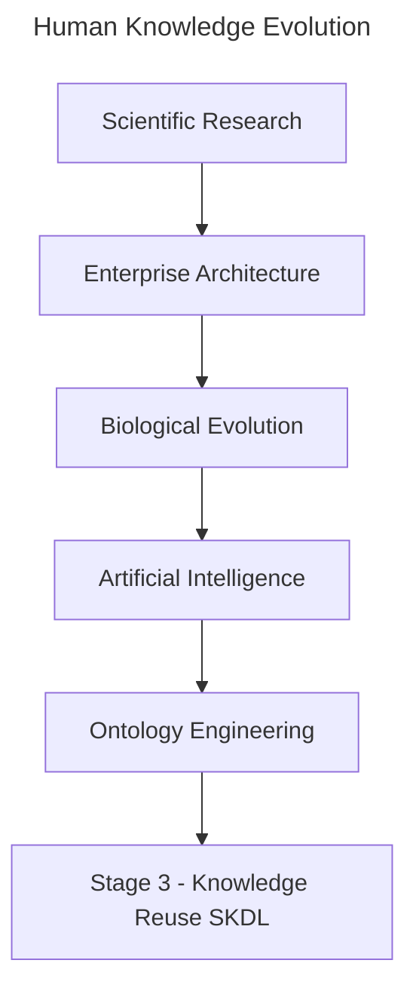
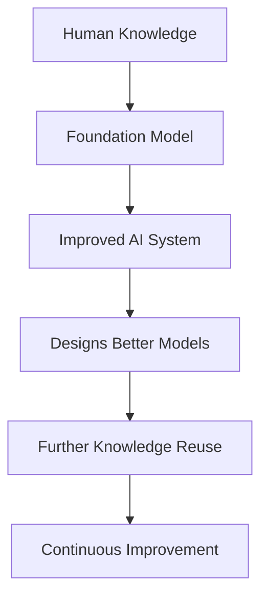
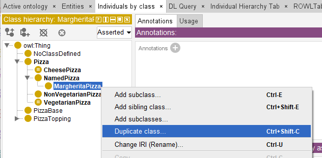
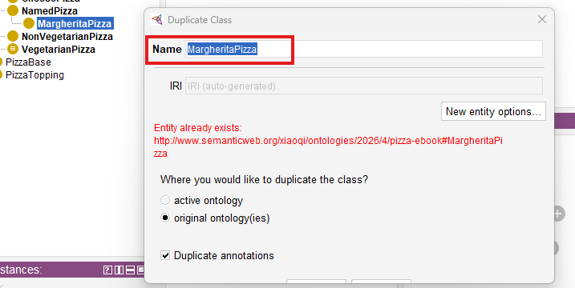
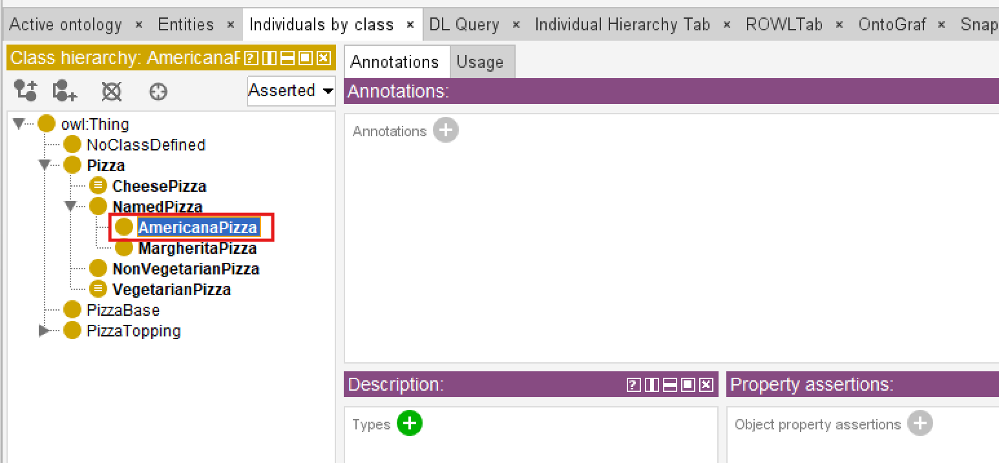
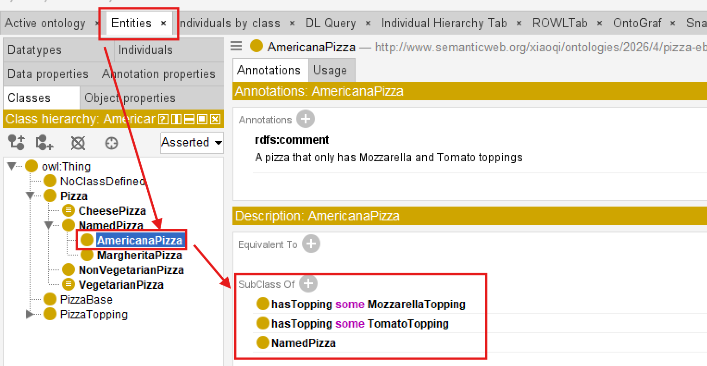
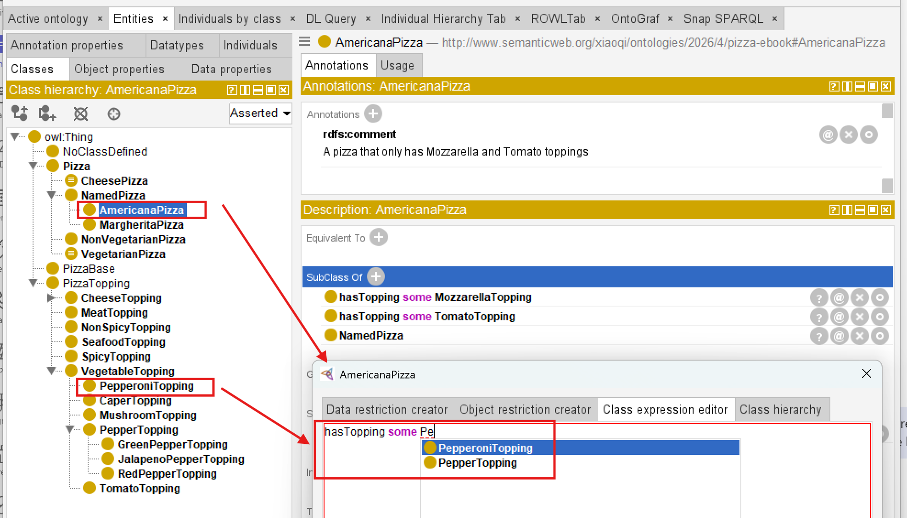
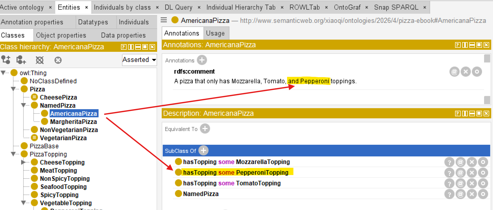
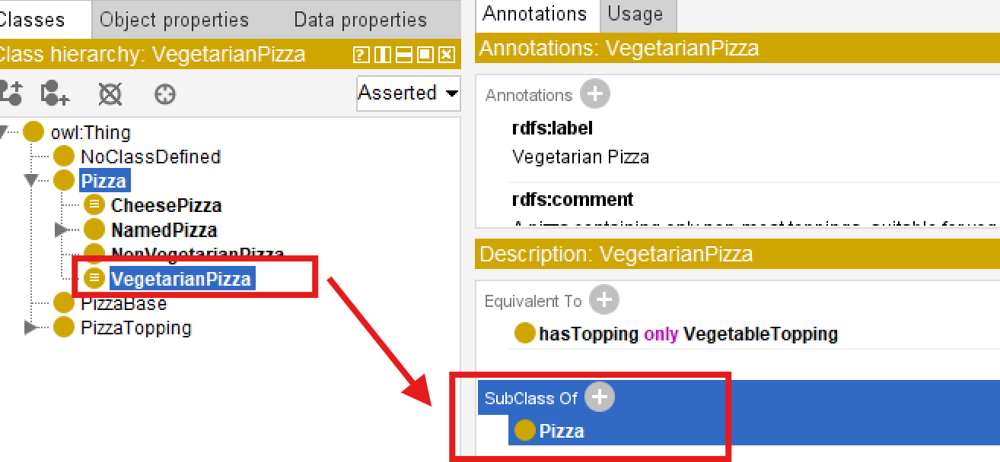
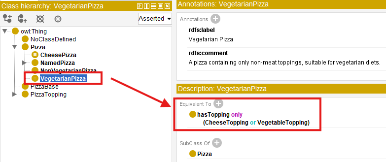

# Chapter 20 -- Knowledge Reuse: Stage 3 of the Semantic Knowledge Development Lifecycle

**Reusing Semantic Knowledge Through OWL Design Patterns**

> *"Knowledge becomes truly valuable not when it is created once, but when it can be reused many times.*

The first two stages of the **Semantic Knowledge Development Lifecycle (SKDL)** established the semantic foundations of ontology engineering.

During **Stage 1 -- Conceptual Modeling**, we identified the concepts that define a knowledge domain and organized them into a coherent semantic taxonomy.

During **Stage 2 -- Semantic Description**, we enriched those concepts with formal meaning using **Description Logic (DL)**, OWL restrictions, and class expressions

Chapter 18 established the conceptual vocabulary. Chapter 19 gave that vocabulary formal semantic meaning. By the end of **Chapter (19)**, our ontology was no longer simply a collection of class names.

It had become a **formal semantic knowledge model** whose concepts possess machine-understandable meaning.

At this point, however, another important engineering question naturally arises:

> **Once semantic knowledge has been created, how should it be managed as the ontology continues to grow?**

Should every new concept independently redefine knowledge that already exists?

Should ontology engineers repeatedly recreate similar semantic descriptions?

Or should previously established semantic knowledge itself become a reusable engineering asset?

Professional ontology engineering adopts the **third approach**.

Rather than viewing semantic definitions as isolated pieces of modeling work, mature ontologies treat them as **reusable knowledge assets** that can be shared, extended, specialized, and maintained systematically across the entire knowledge base.

This philosophy introduces **Stage 3 -- Knowledge Reuse** of the Semantic Knowledge Development Lifecycle (SKDL).

The objective of this stage is not to create additional semantic knowledge simply for its own sake.

Instead, it is to organize semantic knowledge so that it can be **reused consistently**, reducing duplication while improving maintainability, scalability, and long-term semantic quality.

Within the **Executable Knowledge Architecture (EKA)**, this transition represents another important increase in engineering maturity.

Knowledge is no longer viewed merely as information stored within an ontology.

Instead, semantic knowledge begins evolving into a reusable engineering asset capable of supporting
- multiple concepts,
- multiple ontologies,
- multiple applications, and
- eventually multiple intelligent systems.

Beginning with **Exercise 16** from the *Protégé 5 New OWL Pizza Tutorial*, this chapter explores how OWL enables semantic reuse through inheritance, logical abstraction, reusable modeling patterns, and carefully designed class definitions.

Along the way, we will examine knowledge reuse from multiple complementary perspectives, including software engineering, Enterprise Architecture, scientific research, biological evolution, mathematical abstraction, and modern Artificial Intelligence.

By the end of this chapter, you will recognize that **knowledge reuse is far more than another OWL modeling technique**.

It represents one of the universal engineering principles through which human knowledge continuously grows, evolves, and accumulates over time.



Whether knowledge is transmitted through scientific publications, enterprise architecture repositories, biological genomes, AI foundation models, or semantic ontologies, the underlying principle remains the same:

> **Progress is achieved not by repeatedly creating knowledge, but by continuously reusing, refining, and extending the knowledge that already exists.**

---

Table of Contents

- [20.1 Introduction -- From Individual Knowledge to Reusable Knowledge](#201-introduction----from-individual-knowledge-to-reusable-knowledge)
- [20.2 Why Knowledge Reuse Is a Universal Engineering Principle](#202-why-knowledge-reuse-is-a-universal-engineering-principle)
  - [20.2.1 Reuse in Software Engineering](#2021-reuse-in-software-engineering)
  - [20.2.2 Reuse in Enterprise Architecture](#2022-reuse-in-enterprise-architecture)
  - [20.2.3 Reuse in Scientific Research](#2023-reuse-in-scientific-research)
  - [20.2.4 Reuse in Biological Evolution](#2024-reuse-in-biological-evolution)
  - [20.2.5 Reuse in Artificial Intelligence](#2025-reuse-in-artificial-intelligence)
    - [20.2.5.1 From Knowledge Reuse to Recursive Improvement](#20251-from-knowledge-reuse-to-recursive-improvement)
  - [20.2.6 From Universal Principle to Ontology Engineering](#2026-from-universal-principle-to-ontology-engineering)
- [20.3 Exercise 16 -- Reusing Semantic Knowledge in Practice](#203-exercise-16----reusing-semantic-knowledge-in-practice)
  - [20.3.1 Engineering Objective of Exercise 16](#2031-engineering-objective-of-exercise-16)
  - [20.3.2 From Copying Classes to Reusing Knowledge](#2032-from-copying-classes-to-reusing-knowledge)
  - [20.3.3 Reuse Before Redesign](#2033-reuse-before-redesign)
  - [20.3.4 Knowledge Reuse versus Knowledge Duplication](#2034-knowledge-reuse-versus-knowledge-duplication)
  - [20.3.5 Looking Beyond the User Interface](#2035-looking-beyond-the-user-interface)
- [20.4 Reuse Before Rebuild -- An Engineering Pattern](#204-reuse-before-rebuild----an-engineering-pattern)
  - [20.4.1 The Pattern in Software Engineering](#2041-the-pattern-in-software-engineering)
  - [20.4.2 The Pattern in Enterprise Architecture](#2042-the-pattern-in-enterprise-architecture)
  - [20.4.3 The Pattern in Design and Manufacturing](#2043-the-pattern-in-design-and-manufacturing)
  - [20.4.4 From Copying to Knowledge Reuse](#2044-from-copying-to-knowledge-reuse)
  - [20.4.5 The Role of Variation in Knowledge Reuse](#2045-the-role-of-variation-in-knowledge-reuse)
  - [20.4.6 The Limits of Cloning](#2046-the-limits-of-cloning)
  - [20.4.7 The Engineering Attitude](#2047-the-engineering-attitude)
- [20.5 Reusable Semantic Patterns in OWL](#205-reusable-semantic-patterns-in-owl)
  - [20.5.1 Inheritance (`SubClassOf`)](#2051-inheritance-subclassof)
  - [20.5.2 Equivalent Class Definitions (`EquivalentTo`)](#2052-equivalent-class-definitions-equivalentto)
  - [20.5.3 Reusable Restriction Patterns](#2053-reusable-restriction-patterns)
  - [20.5.4 Ontology Imports (`owl:imports`)](#2054-ontology-imports-owlimports)
  - [20.5.5 Design Patterns](#2055-design-patterns)
  - [20.5.6 Semantic Alignment](#2056-semantic-alignment)
- [20.6 Reuse Across Disciplines - Mechanisms](#206-reuse-across-disciplines---mechanisms)
  - [20.6.1 Software Engineering -- Inheritance and Composition](#2061-software-engineering----inheritance-and-composition)
  - [20.6.2 Enterprise Architecture -- Capability Reuse and Reference Architecture](#2062-enterprise-architecture----capability-reuse-and-reference-architecture)
  - [20.6.3 Scientific Research -- Citation and Systematic Review](#2063-scientific-research----citation-and-systematic-review)
  - [20.6.4 Biology -- Gene Duplication and Regulatory Review](#2064-biology----gene-duplication-and-regulatory-review)
  - [20.6.5 Artificial Intelligence -- Transfer Learning and Model Adaptation](#2065-artificial-intelligence----transfer-learning-and-model-adaptation)
- [20.7 Mathematical Perspective -- Abstraction, Generalization and Reuse](#207-mathematical-perspective----abstraction-generalization-and-reuse)
  - [20.7.1 Generalization as Subset Inclusion](#2071-generalization-as-subset-inclusion)
  - [20.7.2 Abstraction and Dimension Reduction](#2072-abstraction-and-dimension-reduction)
  - [20.7.3 Posets and Lattices](#2073-posets-and-lattices)
  - [20.7.4 Reuse and Logical Consistency](#2074-reuse-and-logical-consistency)
- [20.8 Interesting Reading -- From Plato to Design Patterns](#208-interesting-reading----from-plato-to-design-patterns)
- [20.9 EKA Perspective -- Stage 3 Strengthens $K$ and Prepares $\\Gamma$](#209-eka-perspective----stage-3-strengthens-k-and-prepares-gamma)
- [20.10 Engineering Guidelines for Knowledge Reuse](#2010-engineering-guidelines-for-knowledge-reuse)
- [20.11 Key Concepts](#2011-key-concepts)
- [20.12 Chapter Summary](#2012-chapter-summary)
- [20.13 Looking Ahead -- Knowledge Governance](#2013-looking-ahead----knowledge-governance)


## 20.1 Introduction -- From Individual Knowledge to Reusable Knowledge

One of the defining characteristics of human civilization is that **knowledge accumulates through reuse rather than continual reinvention**.

Very few ideas are created in complete isolation.

Instead, almost every advance builds upon knowledge that already exists.

Scientists extend previous discoveries through research and citation.

Engineers improve proven designs rather than redesigning every component from first principles.

Software developers reuse libraries, frameworks, and design patterns instead of repeatedly implementing identical functionality.

Enterprise architects organize reusable business capabilities, reference architectures, and architectural building blocks that can support numerous initiatives across an organization.

Even biological evolution follows the same principle.

Rather than redesigning living organisms from the beginning, evolution preserves successful genetic information across generations while gradually introducing variation through mutation and natural selection.

Modern Artificial Intelligence demonstrates a remarkably similar pattern.

Foundation models learn from enormous collections of accumulated human knowledge, while techniques such as **transfer learning, Retrieval-Augmented Generation (RAG)**, and **knowledge distillation** continually reuse previously acquired knowledge to solve new problems more effectively.

Although these disciplines appear unrelated, they all reflect the same underlying engineering principle:

> **Progress is achieved not by repeatedly creating knowledge, but by continuously reusing, refining, and extending existing knowledge.**

Ontology engineering is no exception.

After completing **Stage 2 -- Semantic Description**, the `Pizza` ontology now contains its first meaningful semantic definitions.

For example, `MargheritaPizza` is no longer merely a concept within a taxonomy.

It possesses formal semantic descriptions through restrictions such as:

```text
hasTopping some MozzarellaTopping
hasTopping some TomatoTopping
```

These restrictions successfully describe one particular pizza.

However, an important engineering challenge immediately appears.

As the ontology expands from a handful of concepts to hundreds -- or even millions -- of concepts, should ontology engineers repeatedly recreate similar semantic definitions?

Or should those semantic descriptions themselves become reusable knowledge assets?

This question motivates **Stage 3 -- Knowledge Reuse** of the Semantic Knowledge Development Lifecycle (SKDL).

**Knowledge reuse** extends the engineering principles established in the previous chapters.

- **Stage 1** introduced reusable conceptual abstractions through semantic taxonomies.
- **Stage 2** introduced reusable logical constructors through Description Logic (DL).
- Now **Stage 3** goes one step further by creating **semantic knowledge itself as reusable**.

Rather than viewing each class definition as an isolated modeling exercise, ontology engineers identify semantic patterns that can be shared consistently across many concepts.

As ontologies continue to grow, this shift becomes increasingly important.

Without systematic reuse, semantic models gradually accumulate duplicated restrictions, inconsistent definitions, unnecessary maintenance effort, and increasingly governance complexity.

Small educational ontologies may tolerate such duplication

Large enterprise knowledge graphs containing tens of thousands of concepts **CANNOT**.

Knowledge reuse therefore should not be viewed simply as a convenient modeling technique.

It represents a fundamental engineering discipline for controlling semantic complexity while enabling ontologies to evolve sustainably over long periods of time.

This engineering philosophy is familiar across many mature disciplines.

Enterprise Architecture promotes the principle of **Reuse before Buy before Build**, encouraging organizations to maximize the value of existing architectural assets before acquiring or constructing new solutions.

Scientific research measures impact not only by creating new knowledge, but also by how frequently that knowledge is reused and extended through subsequent publications.

Likewise, successful ontologies are characterized not by the number of concepts they contain, but by the extent to which their semantic knowledge can be reused consistently throughout the knowledge base.

**Exercise 16** introduces this principle through a seemingly simple modeling activity.

Rather than creating entirely new semantic definitions from scratch, we begin constructing new ontology concepts by reusing semantic structures that already exist.

Although the practical exercise requires only a small number of operations within Protégé, its engineering significance extends far beyond the user interface.

It introduces one of the defining characteristics of every mature engineering discipline:

> **Well-designed knowledge should be created once, reused many times, and refined only when necessary.**

Throughout this chapter, we will examine knowledge reuse from practical, engineering, mathematical, architectural, biological, and artificial intelligence perspectives.

By the end of the chapter, you will recognize that reusable semantic knowledge is more than a modeling convenience.

It is a **reusable knowledge asset** -- one that enables ontologies, enterprise architectures, scientific knowledge, AI systems, and even biological life to grow in complexity while remaining coherent, maintainable, and sustainable.

## 20.2 Why Knowledge Reuse Is a Universal Engineering Principle

One of the most remarkable characteristics shared by mature engineering disciplines is that:

> **progress depends far more on reuse than on continual reinvention**.

Although innovation often receives the greatest attention, sustained progress is rarely achieved by repeatedly creating everything from the beginning.

Instead, successful systems grow by preserving proven knowledge while extending it to address new challenges.

This principle appears so consistently across science and engineering that it can reasonably be regarded as a universal engineering law.

Ontology engineering is no exception.

Once semantic knowledge has been carefully **designed**, **validated**, and **understood**, it becomes an engineering asset that should be reused rather than recreated. **Exercise 16** introduces this principle within the `Pizza` ontology, but its significance extends far beyond OWL or Protégé. It reflects a pattern that underlies software engineering, enterprise architecture, scientific research, biology, mathematics, and modern artificial intelligence.

The remainder of this chapter explores these perspectives to demonstrate that **knowledge reuse is not merely an ontology technique -- it is a fundamental mechanism through which complex knowledge systems evolve.**

### 20.2.1 Reuse in Software Engineering

Software engineering has long recognized that **maintainability depends upon systematic reuse**.

Modern applications are rarely developed entirely from scratch.

Instead, developers build upon existing programming languages, operating systems, libraries, frameworks, APIs, design patterns, and open-source ecosystems.

When creating a new application, an experienced engineer does not begin by writing a new compiler, networking stack, or database engine. Instead, existing components are reused whenever they have already demonstrated correctness, reliability, and maintainability.

This philosophy is reflected in principle such as:
- Design Patterns
- Don't Repeat Yourself (DRY)
- Convention over Configuration
- Framework-based Development
- Package Management Ecosystems

**Knowledge reuse** therefore reduces both development effort and engineering risk.

Ontology engineering follows exactly the same philosophy.

Instead of repeatedly redefining identical semantic structures, reusable ontology patterns become the semantic equivalent of software libraries.

### 20.2.2 Reuse in Enterprise Architecture

Enterprise Architecture extends this philosophy from software components to organizational knowledge.

Rather than designing every capability independently, mature EA practices encourage organizations to reuse proven architectural assets whenever possible.

A widely recognized principle is:

> **Reuse before Buy before Build**

The sequence reflects increasing cost and decreasing reuse --

1. Reuse existing enterprise assets.
2. Purchase proven commercial capability (Commercial Off-The-Shelf, or COTS) when suitable assets are unavailable.
3. Build new solutions only when neither reuse nor acquisition satisfies the business need.

This principle minimizes duplication, reduces operational risk, improves governance, and accelerates delivery.

Semantic knowledge should be treated in exactly the same way.

Well-designed ontology modules, reusable class expressions, common vocabularies, and shared semantic patterns become enterprise assets that can be leveraged across projects rather than recreated independently.

Within the EKA framework, reusable semantic knowledge represents reusable organizational intelligence.

### 20.2.3 Reuse in Scientific Research

Scientific knowledge advances through cumulative refinement rather than isolated discovery.

Every research paper begins with a literature review because no scientific contribution exists in isolation.

Researchers study previous work, identify existing theories, reproduce experiments, extend established results, and contribute only the incremental knowledge that advances the field.

Consequently, one indicator of a publication's long-term impact is the number of times it is cited by subsequent research.

A highly cited paper demonstrates that its knowledge has been successfully reused by the scientific community.

Knowledge therefore achieves influence not simply by being published, but by becoming reusable.

Ontology engineering follows the same principle.

A reusable ontology contributes value far beyond its original project because its semantic structures can support future ontologies, knowledge graphs, and intelligent applications.

### 20.2.4 Reuse in Biological Evolution

Biological inheritance provides a useful analogy for cumulative information preservation and variation.

The genomes of modern organisms are not created independently for every generation.

Instead, genetic information is inherited, reused, recombined, and gradually refined through evolutionary processes.

Successful biological structures persist because they continue to prove useful under changing environmental conditions.

Evolution therefore preserves accumulated biological knowledge while permitting incremental adaptation.

Complex life emerges through billions of years of reuse rather than continual recreation.

Ontology evolution follows a remarkably similar pattern.

Successful semantic structures should likewise be inherited, extended, specialized, and adapted instead of repeatedly reconstructed.

In short:
- Biology: inheritance -> variation -> selection
- Ontology: reuse -> specialization -> refinement

### 20.2.5 Reuse in Artificial Intelligence

Recent advances in Artificial Intelligence further illustrate the importance of reusable knowledge.

Large Language Models are trained on vast collections of accumulated human knowledge rather than beginning with an empty understanding of the world.

Subsequent techniques continue this philosophy:

- Transfer Learning
- Fine-Tuning
- Retrieval-Augmented Generation (RAG)
- Knowledge Distillation
- Model Adaptation

Each technique seeks to reuse previously learned knowledge instead of rediscovering it independently.

Knowledge distillation provides an especially compelling example.

Rather than retraining a smaller model from the beginning, knowledge learned by a larger model is transferred into a more efficient representation.

The objective is not to recreate intelligence but to reuse it.

Ontology engineering pursues the same objective.

Semantic definitions, once established, should become reusable knowledge assets capable of supporting future applications.

#### 20.2.5.1 From Knowledge Reuse to Recursive Improvement

Recent discussions surrounding **Artificial General Intelligence (AGI)** have introduced another perspective on knowledge reuse.

One frequently discussed hypothesis proposes that once an AI system becomes capable of contributing to AI research itself, it may begin improving the very models from which it originated.

Conceptually, the process can be viewed as:



Whether recursive self-improvement eventually produces AGI or even Artificial Super-Intelligence (ASI) remains an open scientific question.

Researchers continue to debate both its feasibility and its expected timescale. Nevertheless, one engineering observation is already evident:

> **each new generation of AI systems is built primarily by reusing the accumulated knowledge, architectures, and capabilities of previous generations.**

Modern foundation models do not rediscover mathematics, language, software engineering, medicine, or ontology engineering independently.

They inherit enormous amounts of previously created human knowledge through trained corpora, reusable model architectures, transfer learning, fine-tuning, retrieval mechanisms, and knowledge distillation.

Even when new capabilities emerge, they typically represent **extensions of existing knowledge rather than complete reinvention**.

Consequently, **knowledge reuse** is becoming not merely an optimization technique, but one of the central mechanisms through which modern AI systems continue to evolve.

Ontology engineering follows the same engineering philosophy.

Every reusable ontology, semantic pattern, and knowledge graph contributes to a growing body of machine-interpretable knowledge that future intelligent systems may build upon rather than recreate.

From the perspective of the **Executable Knowledge Architecture (EKA)**, reusable ontologies can be viewed as persistent organizational knowledge assets. As AI systems increasingly consume structured knowledge rather than isolated documents, well-governed ontologies and knowledge graphs become reusable semantic foundations upon with future intelligent systems can continuously build.

In this sense, **Stage 3 -- Knowledge Reuse** is concerned not only with reducing modeling effort today, but also with enabling the accumulation of semantic intelligence for tomorrow.

From this perspective, knowledge reuse is one important mechanism through which machine capabilities can accumulate and improve.

### 20.2.6 From Universal Principle to Ontology Engineering

Across all these disciplines, a common pattern emerges as below:

| Discipline | Reusable Asset |
| --- | --- |
| Software Engineering | Libraries, frameworks, APIs |
| Enterprise Architecture | Capability maps, reference architectures, reusable building blocks |
| Scientific Research | Publications, theories, experimental evidence |
| Biology | Genetic information |
| Artificial Intelligence | Learned representations, foundation models, distilled knowledge |
| Ontology Engineering | Ontologies, semantic patterns, reusable class expressions |

Although the artifacts differ, the engineering philosophy remains remarkably consistent.

> **Knowledge becomes increasingly valuable as its ability to be reused increases.**

**Exercise 16** now introduces this same principle within OWL ontology engineering.

The objective is no longer merely to define semantic knowledge correctly, but to organize that knowledge so it can be
- reused consistently,
- governed effectively, and
- extended systematically

throughout the remainder of the **Semantic Knowledge Development Lifecycle (SKDL)**.

However, reuse also introduces new responsibilities. Once semantic knowledge is shared across multiple concepts and applications, changes made to one reusable definition may affect many dependent models. Consequently, semantic reuse naturally raises questions of **ownership**, **versioning**, **validation**, and **governance**. These engineering concerns become the focus of the next stage of the SKDL as well.

Reuse does not merely preserve existing knowledge. It increases its value! Every successful reuse validates previous knowledge, extends its applicability, reduces future engineering, and creates a stronger foundation for subsequent innovation.

In this sense, the value of knowledge compounds through reuse in much the same way that financial capital compounds through investment.

Knowledge survives civilizations not because it is repeatedly rediscovered, but because it is successfully transmitted, reused, and refined across generations.

In short:

> **Human civilization advances because knowledge accumulates through systematic reuse.**
> **Ontology engineering simply makes this principle explicit and machine-interpretable.**

## 20.3 Exercise 16 -- Reusing Semantic Knowledge in Practice

In the previous section we examined why knowledge reuse represents one of the most fundamental engineering principles across science, software engineering, enterprise architecture, biology, and artificial intelligence.

**Exercise 16 -- Create `AmericanaPizza` by Cloning `MargheritaPizza` and Adding Additional Restrictions** now demonstrates how this principle is applied within an ontology.

At first glance, the exercise appears surprisingly simple.

Instead of creating a new pizza from scratch, we duplicate an existing class and introduce one additional semantic restriction.

Although this operation requires only a few clicks inside Protégé, it illustrates an engineering principle that scales to ontologies containing thousands -- or even millions -- of concepts.

The Protégé operation begins by copying an existing class definition. The engineering objective, however, is to reuse the semantic knowledge embodied in that definition while introducing only the differences required by the new concept.

This is precisely how mature knowledge systems evolve.

### 20.3.1 Engineering Objective of Exercise 16

**Exercise 16** asks us to create `AmericanaPizza` by duplicating `MargheritaPizza` and adding one additional topping restriction.

Conceptually the exercise can be summarized as:

```text
Existing Semantic Definition + Small Semantic Difference
= New Knowledge
```

Rather than redefining every characteristic, we preserve the semantic knowledge that has already been validated.

Only the distinguishing features is added.

This reflects one of the oldest engineering principles:

> **Never recreate what has already been proven correct**.

### 20.3.2 From Copying Classes to Reusing Knowledge

Protégé performs the operation using **Duplicate Selected Class**, either from Edit menu or simply right click on the class name:



In the "Duplicate Class" dialogue, change the name from `MargheritaPizza` to `AmericanaPizza`, leave all the other options as they are and select `OK`:

From:



to:


> Notice: when you change `Name`, the IRI identifier is also changed.

After clicking `OK`, new named pizza is added:



Switch to `Entities` tab, you may see this new named pizza `AmericanaPizza` contains the copied `SubClassOf` axioms from `MargheritaPizza`:



Now add one more restriction to make `AmericanaPizza` distinguished from the copied one: `hasTopping some PepperoniTopping`, noted that if you see dotted red line under any concept, e.g. below `Pepperonitopping`, it means you haven't added that Topping in ontology, add that first then back to class expressions editor:


After `PepperoniTopping` is added, you should see below:



Also modifying comment annotation, then the end state of **Exercise 16** should be like below:



From a software perspective this appears to be cloning.

From an ontology perspective something more interesting is occuring.

We are not merely copying a class.

We are reusing:

- conceptual placement,
- inherited semantics,
- logical restrictions,
- annotations,
- documentation, and
- modeling decisions.

Every one fo these represents accumulated knowledge.

The duplicated class therefore becomes the starting point for further semantic specialization rather than an independent creation.

Knowledge evolves through **modification** rather than **repeated invention**.

### 20.3.3 Reuse Before Redesign

When `AmericanaPizza` is created, almost everything already exists:

```text
NamedPizza
hasTopping some MozzarellaTopping
hasTopping some TomatoTopping
```

Only one new semantic statement is introduced:

```text
hasTopping some PepperoniTopping
```

The resulting definition becomes:

```text
MargheritaPizza + PepperoniTopping
= AmericanaPizza
```

From an engineering perspective, most of the semantic structure is retained, while a small number of additional axioms distinguish the new concept.

This ratio appears repeatedly throughout software engineering, enterprise architecture, and scientific modeling.

Innovation typically occurs by extending existing knowledge rather than replacing it.

### 20.3.4 Knowledge Reuse versus Knowledge Duplication

Although **Exercise 16** begins with duplication, duplication itself is not the engineering objective.

There is an important distinction.

| Duplication | Reuse |
| --- | --- |
| Copies information | Preserves validated knowledge |
| Produces independent artifacts | Maintains semantic lineage |
| Encourages divergence | Encourages consistency |
| Increases maintenance | Reduces maintenance effort |

The duplicate serves only as an intermediate step.

Its purposes is to accelerate semantic reuse while preserving correctness.

As the ontology matures, increasingly sophisticated reuse mechanisms -- such as reusable superclass patterns, equivalent class definitions, ontology imports, and modular ontologies -- will gradually replace simple cloning.

**Exercise 16** therefore introduces the simplest manifestation of a much broader engineering discipline.

### 20.3.5 Looking Beyond the User Interface

You may initially regard **Duplicate Selected Class** as merely a convenient Protégé feature.

It is considerably more important than that.

The command embodies a universal engineering philosophy.

Knowledge that has already been

- understood,
- validated,
- documented, and
- successfully applied

should become a **reusable asset** rather than disposable effort.

This principle explains:

- why software libraries exist,
- why enterprise architecture repositories exist,
- why scientific literature is cited,
- why biological evolution conserves successful genes, and
- why ontologies continue growing through semantic specialization instead of continual reinvention.

**Exercise 16**  therefore represents the first practical demonstration of **Stage 3 -- Knowledge Reuse** within the Semantic Knowledge Development Lifecycle (SKDL).

## 20.4 Reuse Before Rebuild -- An Engineering Pattern

The simple act of duplicating `MargheritaPizza` to create `AmericanaPizza` in **Exercise 16** illustrates a much broader engineering principle that extends far beyond Protégé  or OWL. It is a concrete manifestation of a pattern that appears across virtually every mature engineering discipline:

> **clone before create** -- or more formally, **reuse before build**.

This pattern is not merely a productivity shortcut.

It embodies a fundamental insight about how complex systems are constructed and maintained over time.

Engineering disciplines that have successfully scaled to manage extraordinary complexity -- from software engineering to aerospace systems, from enterprise architecture to semiconductor design -- all rely on some form of this principle.

Rather than beginning each new design from a blank canvas, engineers identify existing solutions that closely approximate the desired outcome, duplicate them, and then introduce only the modifications necessary to address the new requirements.

This approach is not an admission of limited creativity. It is a recognition that the vast majority of engineering effort is spent not on novel invention, but on the **adaptation**, **extension**, and **combination** of proven solutions.

By beginning with an existing artifact, engineers inherit the accumulated knowledge, testing, validation, and documentation embedded within it. Every hour spent designing a new solution from scratch is an hour that could have been spent refining a proven solution to fit a new context -- or, even more productively, improving the shared foundation so that everyone benefits.

### 20.4.1 The Pattern in Software Engineering

In software engineering, the **clone before create** patter appears in numerous forms:

- **Class inheritance**: Subclasses extend the behavior of parent class, inheriting their methods and attributes while adding or overriding specific features. This is not duplication; it is specialization.
- **Copy-to-write**: Data structures are shared until modification is required, reducing memory consumption and improving performance.
- **Forking**: Open-source projects are forked to create new projects that share a common codebase but evolve independently.
- **Scaffolding**: Code generators produce initial versions of applications or components based on established templates, which are then customized.
- **Design Patters**: Reusable solutions to common problems, such as the Factory pattern or Observer pattern, are applied across projects without being re-implemented from scratch.

Each of these mechanisms shares a common logic:

> **start with a working solution, modify only what is necessary, and preserve what already works.**

This logic is not accidental. It emerges from the observation that most engineering problems are variations of problems that have already been solved. To solve a new problem by reinventing the whole wheel is to ignore the accumulated knowledge of the engineering community. To solve it by adapting an existing solution is to build upon that knowledge.

The principle of **Don't Repeat Yourself (DRY)** formalizes this idea:

> every piece of knowledge should have a single, unambiguous representation within a system.

When knowledge is duplicated, changes must be made in multiple places, increasing the risk of inconsistency and the cost of maintenance. DRY is not merely a coding guideline -- it is a reuse discipline.

Similarly, **Convention over Configuration** reduces the need for repetitive specification by establishing default behaviors that can be overridden only when necessary. This allows engineers to reuse established patterns without explicitly redefining them for each new context.

**Package management ecosystems** -- such a `npm`, `Maven`, `PyPI`, and others -- represent reuse at an industrial scale. Rather than implementing common functionality themselves, developers declare dependencies on existing libraries that have been tested, documented, and maintained by others. This dramatically reduces development effort while improving reliability.

Ontology engineering follows exactly the same philosophy. Instead of repeatedly redefining identical semantic structure, reusable ontology patterns become the semantic equivalent of software libraries. Our `Pizza` ontology itself can be viewed as a reusable module that could be imported into larger food ontologies, menu systems, or nutritional knowledge graphs.

### 20.4.2 The Pattern in Enterprise Architecture

Enterprise Architecture formalizes the same principle through the **Reuse before Buy before Build** framework.

This principle is not merely a suggestion; it is a governance rle that guides investment decisions across the enterprise.

| Decision | Implication |
| --- | --- |
| **Reuse** | Leverage existing capabilities, reducing cost and risk |
| **Buy** | Acquire proven commercial solutions when reuse is not feasible |
| **Build** | Construct solutions only when neither reuse nor buy suffices |

The discipline enforced by this framework ensures that enterprise assets are not continually recreated.

Instead, architectural building blocks -- capabilities, applications, data models, and reference architectures -- are designed explicitly for reuse.

When a new project begins, the first question is not "*What should be build?* but rather "*What can we reused?*"

This is not merely an economic optimization. It is a strategy for managing complexity. Every time an existing asset is reused, the organization avoids introducing new variability into its architecture. Consistency improves. Governance becomes simpler. Maintenance effort declines.

**Reference Architectures** provide a particularly clear example. Rather than designing a new solution architecture for every project, organizations develop reference architectures that embody proven patterns, standards, and best (good) practices. These reference architectures are then adapted -- not recreated -- for each specific context.

**Capability-based planning** extends this thinking to the business level. Business capabilities are defined once and then realized through multiple projects and initiatives. The capability itself becomes a reusable asset that provides a stable foundation for investments decisions, roadmap planning, and architectural governance.

In enterprise architecture, reuse is not merely a technical practice -- it is a strategic discipline that aligns technology investment with business value.

### 20.4.3 The Pattern in Design and Manufacturing

Beyond software and architecture, the **clone before create** pattern appears in physical engineering as well:

- **Product line engineering**: Automobile manufacturers produce multiple vehicle models from shared platforms. The underlying chassis, powertrain, and electrical architecture are reused across models; only exterior styling and interior features vary. Volkswagen's MQB platform (*Modularer QuerBaukasten*, https://en.wikipedia.org/wiki/Volkswagen_Group_MQB_platform), for example, underpins dozens of models across multiple brands, sharing approximately 60% of components.
- **Design reuse in aerospace**: Aircraft designers are refined over decades. The Boeing 737, first introduced in 1967, has been continuously extended and modified, but its fundamental architecture remains recognizable. The 737 MAX shares the same basic airframe design as earlier models, enabling airlines to reuse pilot training, maintenance procedures, and spare parts.
- **Semiconductor design**: Integrated circuits (IC) are built from reusable intellectual property (IP) blocks -- processors, memory controllers, interface modules -- that are combined and configured rather than designed from scratch. Modern system-on-chip (SoC) designs typically integrated dozens of pre-verified IP blocks, dramatically reducing design time and risk.
- **Mechanical engineering**: Standardized fasteners, bearing, motors, and other components are also reused across products. Engineers do not design a new screw for every application; instead, they select from standard catalogs.

In each case, the pattern is identical:

> **establish a proven base, maximize the reuse of the elements in this base, extend it incrementally, and minimize the introduction of unproven elements.**

The alternative -- designing every system from the ground up -- is economically infeasible at scale.

Crucially, these physical engineering disciplines also demonstrate the limits of reuse. Components that are too tightly coupled to their original context cannot be reused without significant modification. Successful reuse requires thoughtful design for adaptability -- a theme we will return to in [**Section 20.4.6**](#2046-the-limits-of-cloning).

### 20.4.4 From Copying to Knowledge Reuse

The software and design examples above share one subtle but important characteristic:

> reuse in these disciplines is not merely about **copying**.

It is about:

> **preserving the knowledge embedded in the original artifact**.

When a software engineer extends a class, they inherit not only *the code* but also **the design decisions, testing, and documentation** that accompanied the original implementation.

When an automobile manufacturer reuses a platform, they inherit **crash-test results, manufacturing processes, and supply-chain relationships**.

When an ontology engineer duplicates a class, they inherit **the semantic decisions, logical restrictions, and validation history** attached to the original concept.

This is the key insight that distinguishes **reuse** from mere **copying**:

| | Copying | Knowledge Reuse |
| --- | --- | --- |
| **Preserves** | Text, Code, or Structure | Validated Knowledge, Design Rationale, and Engineering Decisions |
| **Reduces** | Typing Effort | Error Risk and Design Uncertainty |
| **Requires** | No Understanding | Understanding of What is being Reused |
| **Supports** | Independent Evolution | Consistent Evolution across Dependent Artifacts |
| **Outcome** | Redundant Artifacts | Coherent, Maintainable Knowledge Base |

The duplicate operation in **Exercise 16** is therefore not a mechanical copy operation. It is a deliberate act of knowledge transmission.

By duplicating `MargheritaPizza`, the ontology engineer inherits:

- **Conceptual Placement** -- the class's position within the `NamedPizza` hierarchy
- **Inherited Semantics** -- all restrictions inherited from `NamedPizza` and `Pizza`
- **Logical Restrictions** -- the existential restrictions on `MozzarellaTopping` and `TomatoTopping`
- **Annotation** -- labels, comments, and documentation
- **Modeling decisions** -- the choice of toppings and the semantic structure

The new class does not start from scratch; it starts from a position of existing semantic definitions --

> The ontology engineer's task is no longer to **recreate** but to **extend**.

This distinction becomes particularly important when considering large ontologies. In a knowledge base containing thousands of concepts, the difference between "copying and pasting" and "reusing previous established semantic knowledge" is not merely semantic -- it is the difference between a **maintainable ontology** and an **unmaintainable one**.

### 20.4.5 The Role of Variation in Knowledge Reuse

Critically, knowledge reuse does not imply **stagnation**.

Every reuse introduces variation. The new class is modified to accommodate new requirements.

In **Exercise 16**, `AmericanaPizza` receives an additional topping restriction that distinguishes it from `MargheritaPizza`.

This variation is not a defect; it is the mechanism through which knowledge evolves.

Biological evolution provides a useful analogy. Genetic information is inherited from parent to offspring, but mutations introduce variation. Most mutations are neutral or harmful; occasionally, one proves beneficial and is preserved. Over time, the population evolves -- not by reinventing the genome, but by accumulating beneficial variations on a shared genetic foundation.

Ontology engineering follows a similar pattern. Semantic knowledge is inherited, but variations are introduced to address new requirements. Most variations are minor and have limited impact; occasionally, one proves valuable and becomes part of the reusable foundation for future concepts. The ontology evolves -- not by reinventing its concepts, but by accumulating useful semantic variations.

In this sense, **Section 20.3.3**'s observation that approximately 90% of the semantic definition is reused is not a limitation of the exercise; it is a feature of how knowledge evolves in any mature discipline. Innovation typically occurs by extending existing knowledge rather than replacing it.

**Variation without reuse** leads to fragmentation. Each new concept becomes an silo island, unrelated to what came before. The ontology becomes difficult to navigate, govern, or reason over.

**Reuse without variation** leads to stagnation. The ontology cannot adapt to new requirements or domains. It becomes brittle and unresponsive.

**The balance between reuse and variation** is essential. It is the mechanism through which knowledge systems grow while maintaining coherence. This balance is not achieved automatically; it requires conscious engineering decisions about when to extend, when to specialize, and when to create something genuinely new.

### 20.4.6 The Limits of Cloning

While **cloning** is a useful starting point for knowledge reuse, it is not the ultimate mechanism.

As ontologies grow, simple duplication becomes insufficient for several reasons:

1. **Maintenance burden**: Changes to the original class are not automatically propagated to cloned classes. If `MargheritaPizza` is refined -- for example, if a new restriction is added or an annotation is corrected -- `AmericanaPizza` must be manually updated. In a large ontology, this manual synchronization becomes a significant maintenance cost.
2. **Semantic lineage**: The ontological relationship between cloned classes is not captured. The ontology knows that `AmericanaPizza` was copied from `MargheritaPizza` in a modeling session, but it does NOT know *why* they are related or what semantic relationship exists between them. This information is lost unless explicitly documented.
3. **Scalability**: Cloning is effective for small-scale reuse but becomes unwieldy when hundreds of classes must be derived from shared foundations. The manual effort of duplicating, renaming, and modifying each class scales linearly with the number of variants, while the potential for error grows super-linearly.
4. **Reasoning limitations**: The reasoner does not recognize the lineage between cloned classes. It treats `MargheritaPizza` and `AmericanaPizza` as unrelated concepts unless additional axioms are introduced. The semantic connection exists in the engineer's mind, but not in the ontology.
5. **Governance challenges**: When cloned classes diverge, they may become inconsistent over time. The conceptual relationship between them -- originally a shared foundation -- becomes obscured. Governing such an ontology requires additional effort to maintain consistency.

For these reasons, cloning is best understood as an **introductory mechanism** for knowledge reuse. As ontology engineers become more experienced, they adopt more sophisticated patterns:

- **Shared superclasses**: Common restrictions and properties are abstracted into parent classes that multiple subclasses inherit. For example, all named pizzas might inherit a common set of base restrictions.
- **Equivalent class definitions**: Classes are defined by logical conditions that can be independently applied and reused. A `VegetarianPizza` definition, once established, can be reused across multiple contexts.
- **Ontology modules**: Self-contained ontologies that can be imported and extended across projects. The `Pizza` ontology itself could become a module imported into larger food ontologies.
- **Design patterns**: Proven modeling templates that capture recurring semantic structures, such as the `hasTopping` restriction pattern.

**Exercise 16** introduces the simplest of these mechanisms because it establishes the fundamental principle:

> **The goal is not to copy; the goal is to reuse validated knowledge while introducing only necessary variation.**

Once this principle is understood, the more sophisticated mechanisms become natural extensions of the same practice.

### 20.4.7 The Engineering Attitude

Ultimately, the **clone before create** pattern is not a technique but an **engineering attitude**.

It is the disposition to ask, before beginning any new modeling activity:

- What existing knowledge can I reuse?
- How can I introduce only the minimum necessary novelty?
- What has already been validated that I can build upon?
- What will be the maintenance cost of creating something entirely new?

This attitude is not limited to ontology engineering. It is the attitude that has enabled every successful engineering discipline to scale. It is the recognition that progress is achieved not by repeatedly creating knowledge, but by continuously reusing, refining, and extending the knowledge that already exists.

**Exercise 16** serves as the first practical demonstration of this attitude within the Semantic Knowledge Development Lifecycle (SKDL). It is a small operation, but it embodies a large principle -- one that will reappear throughout the remaining stages of SKDL and across every mature engineering discipline that has ever managed to grow without collapsing under its own complexity.

The engineering attitude also requires humility.
- It acknowledges that most problems have been encountered before and that someone else has likely developed a solution worth studying.
- It does not devalue creativity; it redirects it toward the genuinely novel aspects of a problem rather than its routine elements.

In this sense, knowledge reuse is not merely a technique for managing complexity. It is a recognition of our inter-dependence as engineers -- an acknowledgement that we build upon the work of those who came before us and that our own work will, if we are fortunate, provide a foundation for those who follow.

## 20.5 Reusable Semantic Patterns in OWL

**Exercise 16** demonstrated reuse through the simplest possible mechanism: **cloning**.

But cloning, as **Section 20.4.6** established, is only the **entry point**.

OWL itself provides several formal mechanisms through which semantic knowledge cna be reused -- not by copying axioms, but by **referencing** them.

This distinction matters enormously.

> When knowledge is copied, two definitions now exist.
> When knowledge is referenced, one definition exists -- used in many places.

The remainder of this section catalogs the primary reuse mechanisms available in OWL, moving from the simplest (inheritance) to the most structurally significant (semantic alignment).

When possible, each mechanism is tied back to a specific exercise from the *Protege 5 New OWL Pizza Tutorial* (M. DeBellis), so you can see exactly where in your own ontology you already built, and will built, the patten being described.

### 20.5.1 Inheritance (`SubClassOf`)

The most fundamental reuse mechanism in OWL is one you have already used many times: `SubClassOf`.

When `VegetarianPizza` is declared `SubClassOf Pizza`, it does not redefine what a `Pizza` is.

Instead, it **reuses** the entire semantic definition of `Pizza` -- every restriction, every annotation, every axiom that applies to `Pizza` -- and add only what is genuinely new:

```text
Class: VegetarianPizza
  SubClassOf: Pizza
```



The relationship is often described as inheritance because it has a useful analogy with object-oriented inheritance. However, OWL inheritance is fundamentally logical rather than behavioral.

| OOP | OWL |
| --- | --- |
| Reuses behavior | Reuses semantic consequences |
| Methods / fields | Class axioms |
| Runtime behavior | Logical entailment |
| Overriding | No direct equivalent |
| Object-oriented type system | Description Logic semantics |

A subclass is subject to the logical consequences of the axioms that apply to its superclass -- everything the reasoner knows about `Pizza` becomes, *automatically and without restatement*, something the reasoner also knows about `VegetarianPizza`.

This is why [Section 20.2.6](#2026-from-universal-principle-to-ontology-engineering) described class hierarchy itself as the **first and most pervasive reuse pattern** in ontology engineering. Every hierarchy you have built since **Chapter (04)** has been a reuse structure, whether it was labeled as one or not.

There is, however, a precise logical limit to what `SubClassOf` reuses, and it it worth naming explicitly.

`SubClassOf` tells the reasoner that every member of the subclass must also satisfy the superclass definition. It does not say that satisfying the superclass definition is enough to become a member of the subclass.

A class defined only through `SubClassOf` axioms is called a **primitive class** -- and, as the tutorial's **Section 4.11** puts it directly, a primitive class is one where *"if something is a member of this class then it is necessary to fulfil these conditions,"* but the reverse can never be inferred.

Protégé will never automatically move an individual *into* a primitive class through classification, no matter how well that individual matches the class' intuitive description, because the ontology has never stated what would be *sufficient* to qualify.

> **Demonstrated in the tutorial**: Nearly every class built through **Exercises 4-19** -- `Pizza`, `PizzaTopping`, `NamedPizza`, `MargheritaPizza`, and their siblings -- is a primitive class, defined purely through `SubClassOf`. **Exercise 20** will build `CheesyPizza` the same way, as a primitive class, specifically so that **Exercise 21** can then demonstrate what changes when it becomes a defined class instead.

> [!Note]
> If you inspect the Pizza ontology's **Asserted** hierarchy against its **Inferred** hierarchy in Protégé (A distinction first introduced in **Chapter (06)**, and revisited in tutorial **Section 4.11**), primitive classes are exactly the ones where the two hierarchies never diverge. Their position in the tree is something you declared, not something the reasoner discovered.

### 20.5.2 Equivalent Class Definitions (`EquivalentTo`)

Inheritance reuses a class **as a starting point**.

`EquivalentTo` reuses a class **as a complete, standalone definition**.

Recall the classic pattern from **Chapter (15)**:

```text
Class: VegetarianPizza
  EquivalentTo: Pizza
    and (hasTopping only (CheeseTopping or VegetableTopping))
```



This is not merely a restriction attached to a class. It is a **logical definition** -- a statement that anything satisfying the right-hand side of the expression ***is***, by definition, a `VegetarianPizza`.

Once defined this way, the expression becomes reusable in a much stronger sense than inheritance allows. Any other class, anywhere in the ontology, can reference the same logical pattern -- `hasTopping only (CheeseTopping or VegetableTopping)` -- without needing to inherit from `VegetarianPizza` at all. The **pattern itself** becomes a reusable unit of semantic knowledge, independent of where it first appeared.

> Inheritance reuses **classes**.
> Equivalent class definitions reuse **logical conditions**.

A class defined through `EquivalentTo` is called a **defined class**, in direct contrast to the **primitive class** from **Section 20.5.1**.

Because the right-hand side of an `EquivalentTo` axiom states a necessary-**and**-sufficient condition, the reasoner can do something it cannot do for primitive classes:

> it can **automatically classify** any individual satisfying that condition as a member of the class, even if no engineer even if no engineer ever explicitly asserted the membership.

> **Demonstrated in the tutorial**:
> - Defined Class: **Exercise 21**, which takes the primitive `CheesyPizza` from **Exercise 20** and run `Edit > Convert to defined class` -- the exact moment the tutorial shows the reasoner beginning to auto-clarify `MargheritaPizza` and the other named pizzas as subclasses of `CheesyPizza` without being told to.
> - **Exercise 22** will repeat the pattern for `VegetarianPizza`, built directly as a defined class using a universal restriction.
> - **Exercise 24** shows a second flavor of the same mechanism: the enumerated class `Speciness`, defined as `EquivalentTo {Hot, Medium, Mild}` -- proof that `EquivalentTo` reuses not just restriction patterns but explicit value sets.

Two syntax variants are worth recognizing, since you will encounter both in Protégé and in the wider OWL ecosystem:

```text
# Manchester Syntax (used throughout this book and the tutorial's Class expression editor)
Class: VegetarianPizza
  EquivalentTo: Pizza and (hasTopping only (CheeseTopping or VegetableTopping))

# OWL Functional-Style Syntax (used in hte underlying RDF/XML and most OWL APIs)
EquivalentClasses(
  :VegetarianPizza
  ObjectIntersectionsOf(
    :Pizza
    ObjectAllValuesFrom(
      :hasTopping
      ObjectUnionOf(
        :CheeseTopping :VegetableTopping
      )
    )
  )
)
```

One pitfall deserves a direct warning, since it is common enough to have its own name in ontology engineering discussions: a class may legally carry **more than one `EquivalentTo` axiom in OWL**.

When it does, the reasoner treats every listed expression as equivalent not only to the class, but to **each other**. If those expressions were not intended to be logically identical, this silently over-constrains the ontology -- and because it is valid OWL syntax, no reasoner error will warn you.

> This is a reuse mechanism that punishes carelessness precisely because it is powerful.

### 20.5.3 Reusable Restriction Patterns

**Chapter (14) and (15)** introduced existential and universal restrictions individually. What was not emphasized at the time is that **the restrictions themselves are reusable patterns**, independent of any single class -- and the `Pizza` tutorial's Section 4.10.1 (page 30) actually names all three restriction families explicitly:
- **quantifier restrictions (`some` / `only`)**,
- **cardinality restrictions (`min` / `max` / `exactly`)**, and
- **hasValue restrictions**.

Consider the general shape of a quantifier restriction:

```text
<property> only (<ClassA> or <ClassB> or ...)
```

This is not specific to `VegetarianPizza`. It is a **Template**. The same template, applied to different properties and different classes, produces an entire family of definitions.

> **Demonstrated in the tutorial**:
> - Quantifier restriction: **Exercise 13** (`hasBase some PizzaBase`, the existential template), and **Exercise 12** (`hasTopping only (VegetableTopping or CheeseTopping)`, the universal template).

Cardinality restrictions generalize the same idea toward counting rather than membership:

```text
<property> min <n> <Class>      -- at least n relationships to Class
<property> max <n> <Class>      -- at most n relationships to Class
<property> exactly <n> <Class>  -- exactly n relationships to Class
```

> **Demonstrated in the tutorial**:
> - Cardinality restriction: **Exercise 26**, which will define `InterestingPizza` as `hasTopping min 3 PizzaTopping` -- a reusable "at least N fillers of this type" template that has nothing to do with pizza specifically and could be applied to any property and class pair.

The third family, hasValue restrictions, is **different** in kind: rather than requiring *some* or *only* individuals of a given class, it requires a relationship to one **specific** individual.

```text
<property> value <specific individual>
```

> **Demonstrated in the tutorial**:
> > hasValue restriction: **Exercise 25**, which will asserts `hasSpiciness value Hot` on `JalapenoPepperTopping`, then reuse that exact pattern one level up by defining `SpicyPizza` as `hasTopping some (hasSpiciness value Hot)` -- a restriction nested inside a restriction, and a good illustration of how these templates compose.

Recognizing all three restriction families as templates -- rather than one-off constructors -- is what separates ontology engineers who model efficiently from those who rebuild the same logical shape from scratch every time a new class is needed.

This is the same principle Section 20.2.1 identified in software engineering: a well-designed function is written once and called many times.

> A well-designed restriction pattern is written once and **instantiated many times**.

One caution belongs here, because it connects directly to the Open World Assumption first introduced in **Chapter 14** and revisited in the `Pizza` tutorial's Section 4.13: a cardinality or quantifier restriction constrains how many ***asserted or inferable*** relationships an individual has, not how many the ontology engineer happens to have typed into Protégé.

The same OWA reasoning that governed restrictions in **Chapter (14) and (15)** governs every restriction family identically.

### 20.5.4 Ontology Imports (`owl:imports`)

Every reuse mechanism discussed so far operates **within** a single ontology file.

`owl:imports` extends reuse **across** ontology files.

```text
Ontology: <http://example.org/pizza-extended.owl>
  Import: <http://example.org/pizza.owl>
```

When one ontology imports another, every class, property, and axiom defined in the imported ontology becomes available -- without copying a single line into the importing file. This is the OWL equivalent of a software library import, and it carries the same engineering benefit: the important ontology can be maintained, corrected, and extended **independently**, and every ontology that imports it inherits the improvement automatically.

> [!Note]
> Unlike every other mechanism in this section, `owl:imports` is **not** demonstrated anywhere in the `Pizza` Tutorial exercises, and this book's `Pizza.owl` does not use it either.
> The closest the tutorial comes is its Chapter 8, where a second, pre-populated version of the ontology is *loaded in place of* the original -- a replacement, not an import.
> `owl:imports` becomes essential once an ontology engineer begins working across multiple, independently maintained ontologies, a scenario more tipical of enterprise-scale EKA deployments than of a single teaching ontology.
> It is included here because it is one of OWL's core reuse mechanisms, even though neither the tutorial nor this book has yet occasion to use it.

Three technical details are worth knowing before you use `owl:imports` outside a teaching context, because each one is a common source of confusion the first time an ontology engineer encounters it.

**First, the IRI in an import statement is a logical identifier, not necessarily a network address.**
- `owl:imports` names 

### 20.5.5 Design Patterns

### 20.5.6 Semantic Alignment

## 20.6 Reuse Across Disciplines - Mechanisms

### 20.6.1 Software Engineering -- Inheritance and Composition

### 20.6.2 Enterprise Architecture -- Capability Reuse and Reference Architecture

### 20.6.3 Scientific Research -- Citation and Systematic Review

### 20.6.4 Biology -- Gene Duplication and Regulatory Review

### 20.6.5 Artificial Intelligence -- Transfer Learning and Model Adaptation

## 20.7 Mathematical Perspective -- Abstraction, Generalization and Reuse

### 20.7.1 Generalization as Subset Inclusion

### 20.7.2 Abstraction and Dimension Reduction

### 20.7.3 Posets and Lattices

### 20.7.4 Reuse and Logical Consistency

## 20.8 Interesting Reading -- From Plato to Design Patterns

## 20.9 EKA Perspective -- Stage 3 Strengthens $K$ and Prepares $\Gamma$

## 20.10 Engineering Guidelines for Knowledge Reuse

## 20.11 Key Concepts

## 20.12 Chapter Summary

## 20.13 Looking Ahead -- Knowledge Governance

---

Last updated at: 2026-08-13