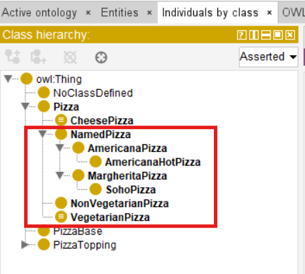
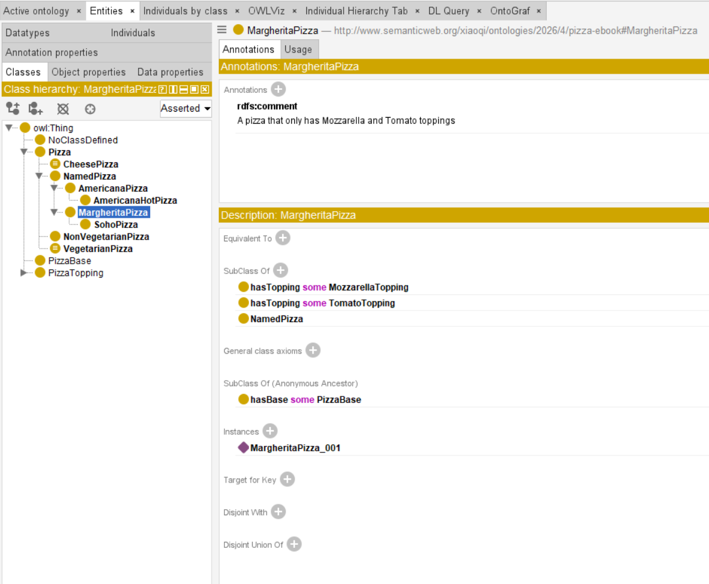
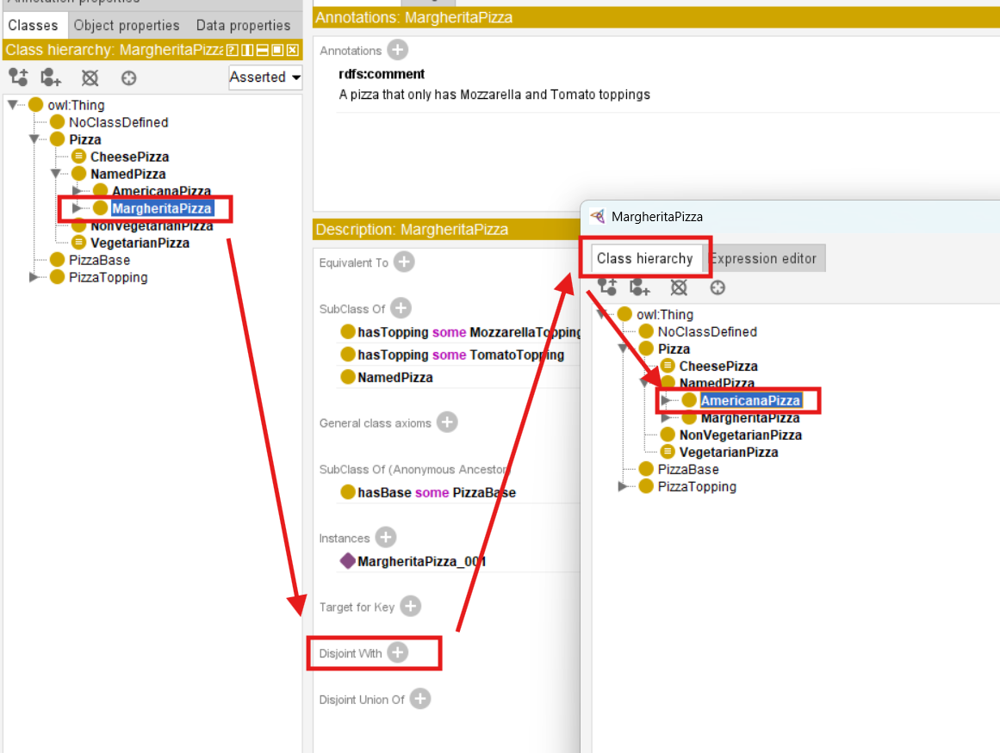
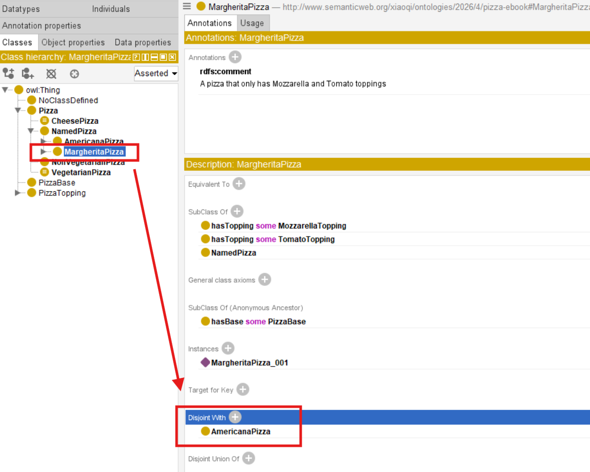
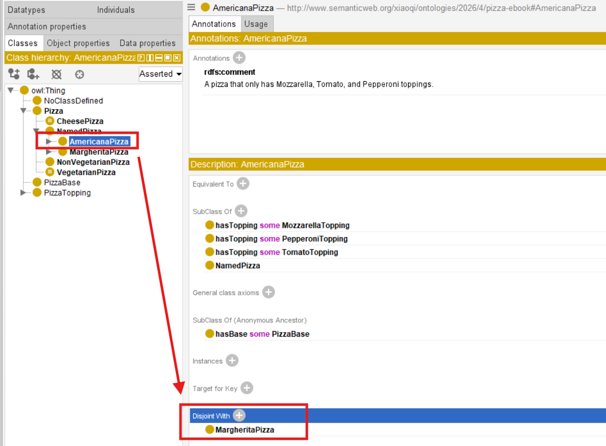
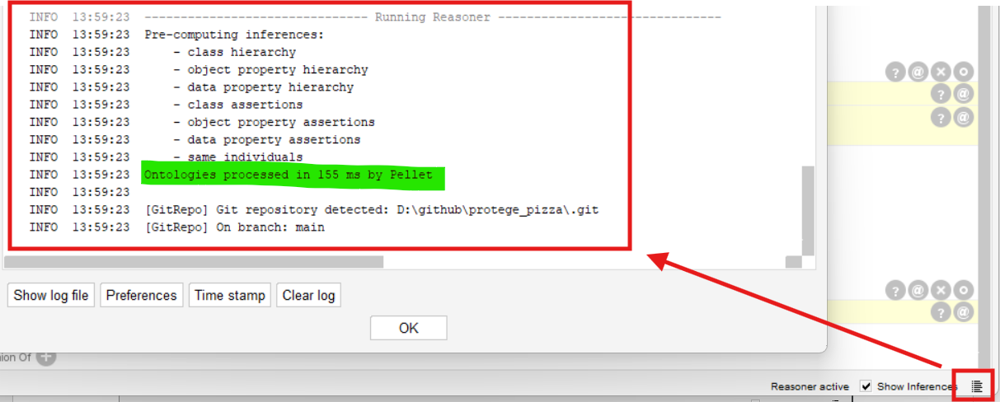
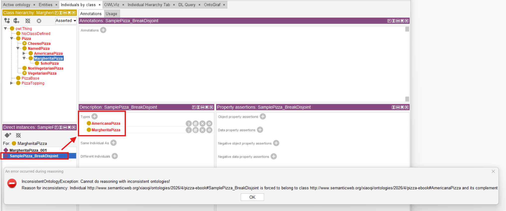
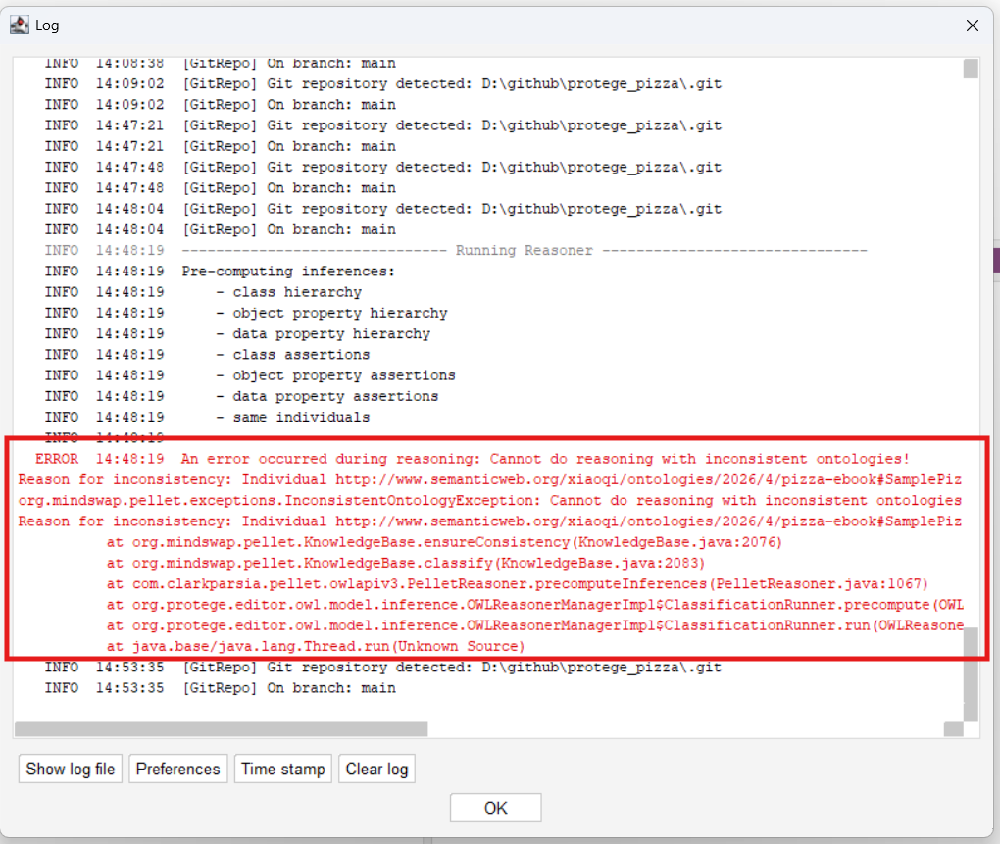
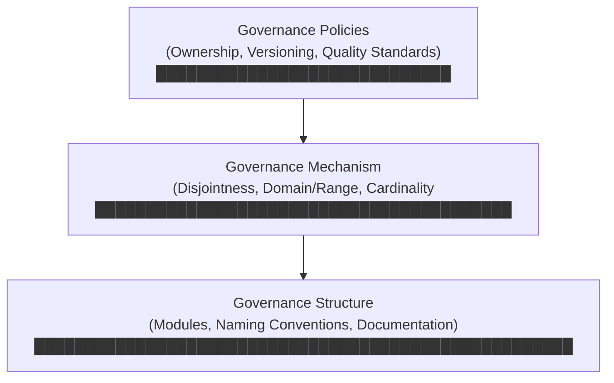

# Chapter 21 -- Semantic Governance: Stage 4 of Semantic Knowledge Development Lifecycle

**Protecting Semantic Integrity Through Disciplined Engineering Practice**

The first three stages of the Semantic Knowledge Development Lifecycle (SKDL) transformed an abstract conceptual vocabulary into a **reusable, machine-interpretable knowledge asset.**

- Conceptual Modeling gave us structure.
- Semantic Description gave us meaning.
- Knowledge Reuse gave us composability.

Now, as knowledge begins to flow across organizational boundaries and into production systems, a new challenge emerges:

> ***"How do we ensure that this knowledge remains trustworthy over time?"***

**Semantic Governance** answers this question.

It is the discipline of maintaining semantic integrity across an evolving knowledge ecosystem -- ensuring that the knowledge we have so carefully engineered does **not decay, fragment, or become unreliable** as it **grows, changes, and spreads**.

Governance is not an afterthought to ontology engineering; it is the infrastructure that makes knowledge **reusable**, **shareable**, and ultimately **executable** with <u>**confidence**</u>.

This chapter re-examines **Exercise 18** from Michael DeBellis' *Protégé 5 New OWL Pizza Tutorial* through the lens of semantic governance.

While **Exercise 17** (creating `AmericanaHotPizza` and `SohoPizza` through cloning) was covered in **Chapter (20)** as part of **Knowledge Reuse**, **Exercise 18** introduces the first explicit governance mechanism:

> declaring disjointness between sibling classes to enforce logical separation.

This exercise demonstrates how explicit constraints transform an ontology from a collection of reusable assets into a governed, trustworthy knowledge infrastructure.

Along the way, we will examine governance from multiple perspectives: mathematical, historical, corporate, geopolitical, and architectural -- revealing that the governance of knowledge is one of humanity's oldest and most essential disciplines.

---

**Table of Contents**
- [21.1 Chapter Introduction -- From Reuse to Governance](#211-chapter-introduction----from-reuse-to-governance)
- [21.2 Learning Objectives](#212-learning-objectives)
- [21.3 Positioning Within SKDL - Stage 4 Highlighted](#213-positioning-within-skdl---stage-4-highlighted)
- [21.4 Exercise 18 -- Making Subclasses of `NamedPizza` Disjoint](#214-exercise-18----making-subclasses-of-namedpizza-disjoint)
  - [21.4.1 Engineering Objective](#2141-engineering-objective)
  - [21.4.2 Implementation](#2142-implementation)
  - [21.4.3 The Result](#2143-the-result)
  - [21.4.4 Engineering Perspective](#2144-engineering-perspective)
- [21.5 From Disjointness to Governance Infrastructure](#215-from-disjointness-to-governance-infrastructure)
  - [21.5.1 Governance Is Not Validation](#2151-governance-is-not-validation)
  - [21.5.2 The Governance Infrastructure Pyramid](#2152-the-governance-infrastructure-pyramid)
- [21.6 True Mathematical Perspective -- Lattices, Order Theory, and Governed Semantics](#216-true-mathematical-perspective----lattices-order-theory-and-governed-semantics)
  - [21.6.1 Classes as Sets, Subclass as Subset](#2161-classes-as-sets-subclass-as-subset)
  - [21.6.2 Disjointness as Set Disjointness](#2162-disjointness-as-set-disjointness)
  - [21.6.3 Lattices and Semantic Governance](#2163-lattices-and-semantic-governance)
  - [21.6.4 Consistency, Satisfiability, and Governed Evolution](#2164-consistency-satisfiability-and-governed-evolution)
- [21.7 Interesting Reading -- From Plato's Academy to Sarbanes-Oxley: The Governance of Knowledge](#217-interesting-reading----from-platos-academy-to-sarbanes-oxley-the-governance-of-knowledge)
  - [21.7.1 Plato's Academy: The First Knowledge Governance Institution](#2171-platos-academy-the-first-knowledge-governance-institution)
  - [21.7.2 The Great Library of Alexandria: Knowledge Curation at Scale](#2172-the-great-library-of-alexandria-knowledge-curation-at-scale)
  - [21.7.3 Corporate Governance: Sarbanes-Oxley and the Regulation of Information](#2173-corporate-governance-sarbanes-oxley-and-the-regulation-of-information)

---

## 21.1 Chapter Introduction -- From Reuse to Governance

As we cross the threshold from Semantic Knowledge Development Lifecycle (SKDL) Stage 3 (Reuse) to Stage 4 (Governance), a foundational axiom of enterprise engineering becomes starkly apparent: **Reuse without governance is anarchy**. Without formal governance mechanisms, modular reuse merely scales ambiguity across the enterprise graph.

The first three stages of the SKDL established the foundations of ontology engineering.

**Stage 1 -- Conceptual Modeling** identified the concepts that define a knowledge domain and organized them into a coherent semantic taxonomy.

**Stage 2 -- Semantic Description** enriched those concepts with formal meaning using Description Logic, OWL restrictions, and class expressions.

**Stage 3 -- Knowledge Reuse** transformed validated semantic knowledge into reusable assets that could be shared, extended, and specialized systematically.

By the end of Stage 3, the `Pizza` ontology had evolved from a collection of isolated classes into a composable knowledge ecosystem. Classes such as `MargheritaPizza` and `AmericanaPizza` shared semantic lineage. Restrictions such as `hasTopping some MozzarellaTopping` had become reusable patterns.

> The ontology was no longer a single model -- it was infrastructure.

However, with **reuse** came new **responsibilities**.

Once semantic knowledge is shared across multiple concepts, ontologies, applications, and organizational teams, changes made to one reusable definition may affect many dependent models.

This raises questions that did not matter when each ontology was isolated:

- **Ownership**: Who is responsible for maintaining a reusable pattern?
- - **Versioning**: How do we track changes to reusable assets, and how do we signal compatibility?
- **Validation**: How do we ensure that changes to a reusable asset do not break its dependents?
- **Deprecation**: How do we retire obsolete patterns without disrupting existing users?
- **Trust**: How do we establish that a reusable asset is reliable enough to depend on?

These are not technical questions. They are **governance questions**.

**Governance** -- broadly defined as the structures and processes whereby an organization steers itself toward desired outcomes -- provides the mechanisms for answering these questions.

In the context of ontology engineering, **semantic governance** is the discipline of maintaining semantic integrity across an evolving knowledge ecosystem. It ensures that reusable assets remain trustworthy over time, and that the knowledge infrastructure built upon them does not decay.

**Exercise 18** from Michael DeBellis' *Protégé 5 New OWL Pizza Tutorial* introduces semantic governance through the seemingly simple act of declaring disjointness between sibling classes.

However, as this chapter will demonstrate, disjointness is merely the visible expression of a much deeper engineering discipline -- one that spans corporate compliance frameworks, international standards, and centuries of philosophical thinking about how knowledge should be organized and protected -- governed.

The progression across the first four stages can now be seen in full:

| SKDL Stage | Primary Outcome | EKA Contribution |
| --- | --- | --- |
| Stage 1 -- Conceptual Modeling | Identify concepts and organize them into a coherent semantic taxonomy | $K$ - Knowledge Graph (Structure) |
| Stage 2 -- Semantic Description | Enrich concepts with formal semantic meaning through Description Logic and OWL restrictions | $K$ (Meaning) + $R$ (Readiness) |
| Stage 3 -- Knowledge Reuse | Transform validated semantic knowledge into reusable assets that can be shared, extended, and specialized systematically | $K$ (Composable) + $\Gamma$ (Prepared) |
| Stage 4 -- Semantic Governance | Maintain semantic integrity through policies, standards, and lifecycle management. | $\Gamma$ - Governance |

Each stage has built upon the previous one.

- Stage 1 gave us concepts.
- Stage 2 gave us meaning.
- Stage 3 gave us reusability.
- Stage 4 now gives us **the discipline required to keep that reusability trustworthy.**

## 21.2 Learning Objectives

After completing this chapter, you should be able to achieve the following learning outcomes:

**Knowledge**:
- Explain why Semantic Governance is the fourth stage of the Semantic Knowledge Development Lifecycle (SKDL)
- Describe the purpose of disjointness axioms in maintaining semantic integrity
- Understand the relationship between governance, reuse, and trust in knowledge systems
- Explain the distinction between semantic governance and semantic validation
- Recognize the parallels between ontology governance and governance frameworks in enterprise architecture, information security, and international policy

**Practical Skills**:
- Declare disjointness between sibling classes using Protégé
- Apply naming conventions, versioning policies, and documentation standards
- Distinguish between logically necessary axioms and governance-enforced constraints
- Prepare an ontology for governance using **Exercise 18** from the `Pizza` tutorial

**Engineering Perspective**:
- Explain why governance must follow reuse within the SKDL
- Understand how semantic governance contributes to the **$\Gamma$ -- Governance layer** within the Executable Knowledge Architecture (EKA) framework
- Recognize Semantic Governance as the bridge between reusable knowledge and trustworthy execution
- Appreciate the multi-disciplinary nature of governance, spanning technical, organizational, and geopolitical dimensions.

## 21.3 Positioning Within SKDL - Stage 4 Highlighted

As introduced in **Chapter (17)**, ontology engineering progresses through seven stages of the Semantic Knowledge Development Lifecycle (SKDL), each stage contributing a distinct engineering objective toward the construction of executable semantic knowledge systems.

Having completed **Stage 3 -- Knowledge Reuse** in the previous chapter, this chapter advances to **Stage 4 -- Semantic Governance**。

The objective of this stage is to maintain semantic integrity across an evolving knowledge ecosystem.

At the completion of Stage 3, the ontology (`Pizza`) contained reusable semantic assets -- classes, restrictions, patterns, and modules -- that could be shared across multiple concepts and applications. However, the ontology lacked the governance infrastructure required to manage these assets over time.

Stage 4 addresses this gap by introducing:

- **Disjointness Axioms** -- enforcing logical separation between related concepts.
- **Naming Conventions** -- ensuring consistent, unambiguous entity identification
- **Ownership and Stewardship** -- assigning responsibility for maintenance and evolution
- **Versioning Policies** -- tracking changes and signaling compatibility
- **Documentation Standards** -- capturing design rationale and reuse intent
- **Quality Criteria** -- defining what makes a reusable asset trustworthy

Rather than introducing new semantic constructs, this stage establishes the engineering discipline required to keep semantic knowledge coherent, maintainable, and trustworthy as it grows.

This primary deliverable of **Stage 4** is therefore

> not a new logical axiom,

but

> a **governed ontology** -- one whose structure, naming, documentation, and lifecycle are managed systematically.

Within the EKA framework, **Stage 4** establishes the **$\Gamma$ -- Governance layer** by providing the policies, standards, and processes that ensure semantic knowledge remains reliable when it moves from an ontology model into
- production systems,
- enterprise decisions, and
- AI-driven automation.

## 21.4 Exercise 18 -- Making Subclasses of `NamedPizza` Disjoint

Having established the engineering motivation for **Semantic Governance**, we now turn to its practical implementation through **Exercise 18** in Michael DeBellis' *Protégé 5 New OWL Pizza Tutorial*.

This exercise represents the first hands-on activity of **Stage 4 -- Semantic Governance** within the Semantic Knowledge Development Lifecycle (SKDL).

Unlike the previous exercises, which introduced individual OWL constructs or semantic modeling patterns, Exercise 18 focuses on **governing the ontology** -- enforcing logical constraints that ensure semantic integrity.

> **Exercise 18: Make Subclasses of `NamedPizza` Disjoint**
> 
> 1. We want to make these subclasses of `NamePizza` disjoint from each other. I.e., any individual can belong to at most one of these classes. To do that first select `MargheritaPizza` (or any other subclass of `NamedPizza`).
> 2. Click on the `(+)` sign next to `Disjoint With` near the bottom of the Description view. This will bring up a Class hierarchy view. Use this to navigate to the subclasses of `NamedPizza` and use `<Ctrl>+<left click>` to select all of the other sibling classes to the one you selected. Then click `OK`. You should now see the appropriate disjoint axioms showing up on each subclass of `NamedPizza`. Synchronize the reasoner.

This exercise is not merely a modeling convenience -- it is a **governance mechanism** that enforces logical discipline across the ontology.

### 21.4.1 Engineering Objective

The objective of **Exercise 18** is to ensure that all subclasses of `NamedPizza` are mutually disjoint -- that is,

> no individual can belong to more than one of these classes simultaneously.

In OWL, disjointness is not assumed by default. Unlike many object-oriented programming languages where classes are implicitly disjoint unless inheritance creates overlap, OWL classes are assumed to **overlap** unless explicitly declared otherwise.

This reflects the Open World Assumption (OWA):

> In an open world, we cannot assume two classes are disjoint just because they  different;
> there might be individuals belonging to both that we simply don't know yet!

Explicitly declaring disjointness through **Exercise 18** introduces prescriptive constraints that prevent invalid data from entering the graph.

However, in the `Pizza` domain, certain classes are **inherently disjoint**. A pizza cannot be both a Margherita and an Americana. A pizza cannot be both a Soho and a Margherita. These are domain facts that must be explicitly declared.

Explicitly declaring disjointness servers several critical governance purpose:

1. **Logical Precision** -- Disjointness captures domain knowledge that is true but not logically entailed by other axioms. Without disjointness axioms, the ontology is incomplete -- it does not fully represent the domain.
2. **Error Detection** -- If an individual is mistakenly asserted to belong to two disjoint classes, the reasoner will flag an inconsistency. This enables early detection of modeling errors that might otherwise go unnoticed.
3. **Reasoning Efficiency** -- Disjointness axioms provide additional constraints that can accelerate reasoning. The reasoner can use these constraints to eliminate possibilities and focus its search.
4. **Semantic Clarity** -- Disjointness makes the ontology's intended structure more explicit and understandable. Anyone reading the ontology can immediately see which classes are intended to be mutually exclusive.
5. **Governance Enforcement** -- Disjointness axioms are **prescriptive**, not merely descriptive. They specify constraints that must be satisfied by any valid instance of the ontology. When these constraints are violated, the reasoner signals an error, preventing invalid data from being introduced into the knowledge base.

**Exercise 18** therefore demonstrates that governance is not merely about organization --

> it is also about **logical enforcement**.

### 21.4.2 Implementation

After previous **Exercise 17**'s discussion, our `NamedPizza` class hierarchy should look like below:



> [!Note]
> I've saved a separate RDF (`pizza-ebook_ex18.rdf`) in repository, however, it's no matter if you practice the hierarchy slightly different like this, e.g. your `SohoPizza` is directly under `NamedPizza` not `MargheritaPizzaq`, that's not impact the theoretical understanding in this chapter.
> And, my screenshot of `Pizza` may not represent fully semantic completeness and correct, e.g. putting `CheesePizza` in the same level as `NonVegetarianPizza` & `VegetarianPizza`, those may also need further governance and validation verification, for now, you can just focus on the `NamedPizza` class.

**Step 1: Select a subclass of `NamedPizza`**

1. Navigate to the `Classes` tab in Protégé.
2. Select `MargheritaPizza` from the class hierarchy (or any other subclass of `NamedPizza`)



**Step 2: Add disjointness axioms**

1. In the `Description` view, locate the `Disjoint With` section near the bottom. (not the `Disjoint Union of`)
2. Click the `(+)` icon next to `Disjoint With`.
3. In the dialog that appears, use the `Class hierarchy` tab to navigate to the subclasses of `NamedPizza`.
4. Use `<Ctrl>+<left click>` to select all of the other sibling classes to the one you selected. (In my RDF, only `AmericanaPizza`)
5. Click `OK`.



**Step 3: Verify the result**

1. You should now see the appropriate disjoint axioms showing up on each subclass of `NamedPizza`.
2. For example, `MargheritaPizza` will show that it is disjoint from `AmericanaPizza`, vice versa.

| Select `MargheritaPizza` | Select `AmericanaPizza` |
| --- | --- |
|  |  |

**Step 4: Synchronize the reasoner**

1. Select Reasoner > Synchronize reasoner.
2. Verify that no inconsistencies have been introduced.
3. Confirm that the disjointness axioms have been correctly applied.



### 21.4.3 The Result

After completing **Exercise 18**, each subclass of `NamedPizza` contains disjointness axioms indicating that it is disjoint from all other subclasses.

For example, as we only have two classes `MargheritaPizza` and `AmericanaPizza` under `NamedPizza` directly, below the `AmericanaPizza` now contains:

```text
AmericanaPizza
    SubClass Of:
        hasTopping some MozzarellaTopping
        hasTopping some PepperoniTopping
        hasTopping some TomatoTopping
        NamedPizza
        CheesePizza
    Disjoint With:
        MargheritaPizza
        VegetarianPizza
```

Since -- in the end of **Exercise 17** -- we have moved `AmericanaHotPizza` and `SohoPizza` further down the class hierarchy (e.g. `SohoPizza` now inherits its parent's disjointness), it appears as follows:

```text
SohoPizza
    SubClass Of:
        hasTopping some MozzarellaTopping
        hasTopping some OliveTopping
        hasTopping some ParmesanTopping
        hasTopping some TomatoTopping
        MargheritaPizza  --the parent/child relationship
    Disjoint:
        VegetarianPizza
        AmericanaPizza
```

The reasoner will now flag an inconsistency if any individual is asserted to belong simultaneously to two mutually disjoint sibling classes, such as `MargheritaPizza` and `AmericanaPizza`.

In the following example, a test pizza instance named `SamplePizza_BreakDisjoint` is created and asserted to be an instance of both `AmericanaPizza` and `MargheritaPizza`. When synchronizing the reasoner, the `InconsistentOntologyException` (visible in the Pellet stack trace) is triggered:



> Sample: **Error message: An error occurred during reasoning**
>
> InconsistentOntologyException: Cannot do reasoning with inconsistent ontologies!
> Reason for inconsistency: Individual http://www.semanticweb.org/xiaoqi/ontologies/2026/4/pizza-ebook#SamplePizza_BreakDisjoint is forced to belong to class http://www.semanticweb.org/xiaoqi/ontologies/2026/4/pizza-ebook#AmericanaPizza and its complement.
> org.mindswap.pellet.exceptions.InconsistentOntologyException: Cannot do reasoning with inconsistent ontologies!
> Reason for inconsistency: Individual http://www.semanticweb.org/xiaoqi/ontologies/2026/4/pizza-ebook#SamplePizza_BreakDisjoint is forced to belong to class http://www.semanticweb.org/xiaoqi/ontologies/2026/4/pizza-ebook#AmericanaPizza and its complement
>	at org.mindswap.pellet.KnowledgeBase.ensureConsistency(KnowledgeBase.java:2076)
>	at org.mindswap.pellet.KnowledgeBase.classify(KnowledgeBase.java:2083)
>	at com.clarkparsia.pellet.owlapiv3.PelletReasoner.precomputeInferences(PelletReasoner.java:1067)
>	at org.protege.editor.owl.model.inference.OWLReasonerManagerImpl$ClassificationRunner.precompute(OWLReasonerManagerImpl.java:447)
>	at org.protege.editor.owl.model.inference.OWLReasonerManagerImpl$ClassificationRunner.run(OWLReasonerManagerImpl.java:388)
>	at java.base/java.lang.Thread.run(Unknown Source)

The full stack trace from the reasoning log is shown below:



When an inconsistency occurs, your ontology class tree and associated views will be highlighted in **red**. There is no need to worry; this is a standard and expected diagnostic behavior in ontology engineering.

The ontology has not crashed; rather, it is providing a formal notification of a constraint violation. It is then up to you -- the ontology engineer -- to investigate and decide on the appropriate resolution.

You may need to correct the instance assertions if the rules are correct, or you may discover that the disjointness rule itself does not reflect true domain semantics (implying certain individuals should indeed belong to both classes simultaneously), prompting a re-evaluation of your model.

By learning from these inconsistencies, your ontology evolves safely and correctly over time.

### 21.4.4 Engineering Perspective

**Exercise 18** demonstrates one of the most important principles of semantic governance:

> **Governance enforces logical discipline through explicit constraints.**

When we declare disjointness axioms, we are not merely documenting the domain -- we are encoding governance rules directly into the ontology. These rules are then enforced automatically by the reasoner, preventing invalid data from being introduced.

This is governance in action: rules that ensure semantic integrity are encoded directly into the ontology, enabling automated enforcement at scale.

**Governance Implications Beyond the `Pizza` Domain**

The governance principles introduced in **Exercise 18** scale directly to enterprise knowledge systems.

Consider how disjointness applies to a financial services ontology:

- `RetailCustomer` is disjoint from `WholesaleCustomer`
- `FixedRateMortgage` is disjoint from `VariableRateMortgage`
- `USD_Risk` is disjoint from `EUR_Risk`

Or a healthcare ontology:

- `Inpatient` is disjoint from `Outpatient`
- `DiagnosticProcedure` is disjoint from `TherapeuticProcedure`
- `PediatricPatient` is disjoint from `AdultPatient`

In each case, disjointness axioms provide the **governance infrastructure** required to ensure that data is correctly classified and that error are detected early.

## 21.5 From Disjointness to Governance Infrastructure

**Exercise 18** introduces a single governance mechanism -- disjointness. However, when viewed in the broader context of the SKDL, it reveals a deeper pattern:

> the gradual construction of **governance infrastructure**.

### 21.5.1 Governance Is Not Validation

A crucial distinction must be made between governance and validation:

| Term | Capability | Question answered |
| --- | --- | --- |
| **Validation** | checks whether an ontology is logically consistent and semantically correct at a given point in time. | *"Is this ontology correct?"* |
| **Governance** | ensures that an ontology remains correct over time, despite ongoing changes, extensions, and reuse. | *"Will this ontology remain correct as it evolves?* |

Validation is a **snapshot**; governance is a **process**.

Validation detects **errors**; governance **prevents** them from being introduced in the first place.

Validation is **reactive**; governance is a **proactive**.

Within the SKDL, **Stage 5 -- Semantic Validation** will address the validation of individual ontology versions.

Now, **Stage 4 -- Semantic Governance** addresses the ongoing management of the ontology across its lifecycle.

### 21.5.2 The Governance Infrastructure Pyramid

Just as a building requires a foundation before walls can be erected, a governed ontology requires infrastructure before governance policies can be effectively applied.

The **governance infrastructure pyramid** consists of three layers, illustrated as below:



From bottom to top:

- **Layer 1 -- Governance Structure** provides the organizational foundation.
  - Modules organize concepts into coherent units.
  - Naming Conventions ensure consistent identification.
  - Documentation captures design rationale.
- **Layer 2 -- Governance Mechanisms** encode constraints directly into the ontology.
  - Disjointness axioms enforce logical separation.
  - Domain/Range restrictions constrain property usage.
  - Cardinality restrictions ensure data completeness.
- **Layer 3 -- Governance Policies** govern how the ontology evolves over time.
  - Ownership assignments determine who can modify what.
  - Versioning policies manage change.
  - Quality Standards define acceptance criteria.

**Exercise 18** operationalizes Layer 2 (Governance Mechanisms) through logical constraints, serving as the stepping stone before advancing up the pyramid toward Layer 3 (Organizational Policies, Versioning, and Ownership) in the broader architecture.

## 21.6 True Mathematical Perspective -- Lattices, Order Theory, and Governed Semantics

Throughout this book, we have examined ontology engineering from mathematical perspectives. **Chapter (18)** explored set theory and partial orders. **Chapter (19)** examined Description Logic and formal semantics. **Chapter (20)** explored abstraction and generalization.

**Chapter (21)** now introduces a new mathematical perspective:

> **lattice theory and order theory** as formal frameworks for understanding semantic governance.

### 21.6.1 Classes as Sets, Subclass as Subset

Recall from **Chapter (18)** that every OWL class may be interpreted as a set of individuals:

$$P = \{\text{all pizzas}\}$$

$$N = \{\text{all named pizzas}\}$$

$$M = \{\text{all Margherita pizzas}\}$$

$$A = \{\text{all Americana pizzas}\}$$

$$S = \{\text{all Soho pizzas}\}$$

The subclass relationship corresponds to subset inclusion:

$$M \subseteq N \subseteq P$$

$$A \subseteq N \subseteq P$$

$$S \subseteq M \subseteq N \subseteq P$$

This interpretation formed the foundation of our conceptual modeling approach.

### 21.6.2 Disjointness as Set Disjointness

Disjointness -- the governance mechanism introduced in **Exercise 18** -- corresponds to **set disjointness**:

$$M \cap A = \emptyset $$

In set theory, two sets are disjoint if they have no elements in common.

In OWL, two classes are disjoint if no individual can belong to both classes simultaneously.

When the reasoner processes a disjointness axiom, it checks whether any individual has been asserted to belong to both classes. **If so, the ontology is inconsistent.**

### 21.6.3 Lattices and Semantic Governance

A **lattice** is a partially ordered set (poset) in which every pair of elements has a unique **least upper bound** (join) and a unique **greatest lower bound** (meet).

In OWL, the class hierarchy forms a lattice:

- The **join** of two classes is their **union** -- the least class that contains both
- The **meet** of two classes is their **intersection** -- the greatest class contained in both

However, OWL does not require that all joins and meets exists -- only those that are explicitly defined or inferred.

Semantic governance can be understood as the discipline of maintaining the lattice structure as the ontology evolves. When new classes are added, they must be positioned correctly within the lattice. When constraints are added through disjointness, they must be consistent with the existing lattice structure.

### 21.6.4 Consistency, Satisfiability, and Governed Evolution

From a mathematical perspective, governance ensures that the ontology remains **consistent** and **satisfiable** as it evolves.

- **Consistency** means that no contradictions exist within the ontology -- no class is equivalent to `owl:Nothing`.
- **Satisfiability** means that every class has at least one potential instance.

When governance is absent, ontologies tend to accumulate inconsistencies and unsatisfiable classes over time. This is known as **semantic decay** or **ontology rot**.

Governance provides the mathematical discipline required to prevent decay -- ensuring that the lattice structure remains coherent as the ontology grows.

**Mathematical Takeaway**

The mathematical perspective reveals that semantic governance is not merely a practical convenience,

> it is a **logical necessity**.

Without governance, ontologies inevitably become
- inconsistent,
- unsatisfiable, and
- ultimately unusable.

Governance provides the discipline required to maintain logical integrity as knowledge evolves.

## 21.7 Interesting Reading -- From Plato's Academy to Sarbanes-Oxley: The Governance of Knowledge

The mathematical perspective examined just now reveals that semantic governance is logically sound.

But then a deeper question remains:

> Why does governance matter, and why has it become so important in modern organizations?

The answer lies in a tradition that spans philosophy, law, corporate regulation, and international diplomacy -- a tradition that ontology engineering now extends to the governance of machine-interpretable knowledge.

### 21.7.1 Plato's Academy: The First Knowledge Governance Institution

In 387 BCE, Plato fonded the Academy in Athens -- the first institution in Western history dedicated to the systematic pursuit and preservation of knowledge.

The Academy was not merely a school; it was a **governance institution** for knowledge. It established:

- **Curricular standards** -- what knowledge was worth pursuing
- **Membership criteria** -- who was qualified to participate
- **Transmission mechanisms** --how knowledge was preserved and transmitted
- **Quality control** -- how claims were evaluated and validated

For nearly 900 years, the Academy served as the institutional infrastructure for philosophical and scientific knowledge in the Mediterranean world.

The Academy's influence can still be felt today in every university, research institution, and learned society -- each of which is, in its own way, a governance institution for knowledge.

### 21.7.2 The Great Library of Alexandria: Knowledge Curation at Scale

In the 3rd century BCE, the Ptolemaic rulers of Egypt established the Library of Alexandria -- the largest repository of knowledge in the ancient world.

The Library was not merely a collection of scrolls; it was a **knowledge governance ecosystem**:

- **Acquisition policies** determined what was collected and preserved
- **Cataloging standards** ensured that knowledge could be discovered and retrieved
- **Translation programs** made knowledge accessible across language boundaries
- **Quality assessment** determined which texts were authoritative
- **Access policies** governed who could consult the collection

The Library's tragic decline -- through fire, neglect, and political upheaval -- demonstrates the fragility of knowledge governance infrastructure. Without disciplined stewardship, even the most valuable knowledge can be lost.

### 21.7.3 Corporate Governance: Sarbanes-Oxley and the Regulation of Information

In 2002, the United States Congress passed the Sarbanes-Oxley Act (SOX) -- a landmark piece of legislation that established new governance requirements for public companies.

SOX was a direct response to corporate scandals such as Enron and WorldCom, where fraudulent financial reporting had cost investors billions of dollars.

The Act established:

- **CEO and CFO certification** -- executives must personally certify the accuracy of financial reports
- **Internal controls** -- companies must implement and document internal control systems
- **Auditor independence** -- auditors cannot provide certain consulting services to companies they audit
- **Whistleblower protection** -- employees who report fraud

---

Last updated at 2026-08-31