# Chapter 22 - Semantic Validation: Stage 5 of Semantic Knowledge Development Lifecycle

**Verifying Semantic Correctness Before Deployment**

The first four stages of the Semantic Knowledge Development Lifecycle (SKDL) transformed an abstract conceptual vocabulary into a governed, reusable knowledge asset.

- Conceptual Modeling gave us structure.
- Semantic Description gave us meaning.
- Knowledge Reuse gave us composability.
- Semantic Governance gave us discipline.

Now, as knowledge begins to flow from ontology models into production systems, a new challenge emerges:

> *How do we verify that this knowledge is actually correct?*

Semantic Validation answers this question.

It is the discipline of verifying that an ontology is logically consistent, semantically complete, and fit for purpose before it is deployed into production systems, before it powers automated reasoning, and before it drives intelligent execution.

Validation is the **quality gate** of the SKDL -- the checkpoint where governance becomes enforceable, where reasoning becomes trustworthy, and where execution becomes safe.

This chapter examines **Exercise 19** from Michael DeBellis' *Protégé 5 New OWL Pizza Tutorial* through the lens of semantic validation.

While **Exercise 18** (declaring disjointness between sibling classes) introduced governance mechanisms, **Exercise 19** introduces a deliberate inconsistency -- **a Probe Class** -- to demonstrate how the reasoner detects errors that would otherwise poison the knowledge base.

Along the way, we will examine validation from multiple complementary perspectives: mathematical, engineering, historical, and architectural -- revealing that

> the validation of knowledge is one of humanity's oldest and most essential intellectual disciplines.

---

Table of Contents
- [22.1 Chapter Introduction -- From Governance to Validation](#221-chapter-introduction----from-governance-to-validation)
- [22.2 Learning Objectives](#222-learning-objectives)
- [22.3 Positioning Within SKDL -- Stage 5 Highlighted](#223-positioning-within-skdl----stage-5-highlighted)
- [22.4 What Is Semantic Validation?](#224-what-is-semantic-validation)
  - [22.4.1 Working Definition](#2241-working-definition)
  - [22.4.2 Validation vs. Reasoning: A Critical Distinction](#2242-validation-vs-reasoning-a-critical-distinction)
  - [22.4.3 Validation vs. Verification: Building It Right vs. Building the Right Thing](#2243-validation-vs-verification-building-it-right-vs-building-the-right-thing)
- [22.5 The Cost of Validation Failure](#225-the-cost-of-validation-failure)
  - [22.5.1 The Cascading Failure Problem](#2251-the-cascading-failure-problem)
  - [22.5.2 A Clinical Example](#2252-a-clinical-example)
- [22.6 Exercise 19 -- The Probe Class: A Deliberate Inconsistency for Validation](#226-exercise-19----the-probe-class-a-deliberate-inconsistency-for-validation)
  - [22.6.1 The Engineering Objective](#2261-the-engineering-objective)
  - [22.6.2 Implementation: Creating the Probe Class](#2262-implementation-creating-the-probe-class)
  - [22.6.3 The Result: Detecting the Inconsistency](#2263-the-result-detecting-the-inconsistency)
  - [22.6.4 The Probe Class Pattern: Detection Through Deliberate Error](#2264-the-probe-class-pattern-detection-through-deliberate-error)
  - [22.6.5 Why This Matters for Validation](#2265-why-this-matters-for-validation)
  - [26.6.6 From Probe to Production: The Validation Pipeline](#2666-from-probe-to-production-the-validation-pipeline)
- [22.7 Mathematical Perspective -- The Logic of Validation](#227-mathematical-perspective----the-logic-of-validation)
  - [22.7.1 Model-Theoretic Semantics: Consistency and Satisfiability](#2271-model-theoretic-semantics-consistency-and-satisfiability)
  - [22.7.2 The Algebra of Unsatisfiability: Roots and Derived Classes](#2272-the-algebra-of-unsatisfiability-roots-and-derived-classes)
  - [22.7.3 The Open World Assumption and Validation](#2273-the-open-world-assumption-and-validation)
  - [22.7.4 Tableau Algorithms: How Reasoners Validate](#2274-tableau-algorithms-how-reasoners-validate)
  - [22.7.5 Decidability and Computational Tractability](#2275-decidability-and-computational-tractability)
- [22.8 Logical Consistency Checking in Practice](#228-logical-consistency-checking-in-practice)
  - [22.8.1 Using Protégé's Reasoners](#2281-using-protégés-reasoners)
  - [22.8.2 Interpreting Reasoner Output](#2282-interpreting-reasoner-output)
  - [22.8.3 Common Consistency Error Patters](#2283-common-consistency-error-patters)
- [22.9 Constraint Validation: SHACL and OWL](#229-constraint-validation-shacl-and-owl)
  - [22.9.1 Why OWL's OWA Means It Infers Rather Than Validates](#2291-why-owls-owa-means-it-infers-rather-than-validates)
  - [22.9.2 Introduction to SHACL (Shapes Constraint Language)](#2292-introduction-to-shacl-shapes-constraint-language)
  - [22.9.3 Common SHACL Validation Patterns](#2293-common-shacl-validation-patterns)
  - [22.9.4 OWL Reasoning vs. SHACL Validation: Complementary, Not Competing](#2294-owl-reasoning-vs-shacl-validation-complementary-not-competing)
- [22.10 Validation Enables Triggers ($\\Theta$)](#2210-validation-enables-triggers-theta)
  - [22.10.1 Why Triggers Need Validated Knowledge](#22101-why-triggers-need-validated-knowledge)
  - [22.10.2 The Stability Requirement for Event Patterns.](#22102-the-stability-requirement-for-event-patterns)
- [22.11 Validation Protects Execution ($\\Phi$)](#2211-validation-protects-execution-phi)
  - [22.11.1 Why Execution Requires Trusted Inputs](#22111-why-execution-requires-trusted-inputs)
  - [22.11.2 The Trust Guarantee](#22112-the-trust-guarantee)
- [22.12 Validation as Governance Enforcement ($\\Gamma + K$)](#2212-validation-as-governance-enforcement-gamma--k)
  - [22.12.1 Connecting Back to Chapter (21)](#22121-connecting-back-to-chapter-21)
  - [22.12.2 The Governance-to-Validation (G2V) Pipeline](#22122-the-governance-to-validation-g2v-pipeline)
- [22.13 Engineering Perspective -- Validation as Testing](#2213-engineering-perspective----validation-as-testing)
  - [22.13.1 Mapping to Software Testing Practices](#22131-mapping-to-software-testing-practices)
  - [22.13.2 Software Engineering Principles Applied to Ontology Validation](#22132-software-engineering-principles-applied-to-ontology-validation)
  - [22.13.3 Shift-Left Validation](#22133-shift-left-validation)
- [22.14 Interesting Reading -- The Name-Reality Debate](#2214-interesting-reading----the-name-reality-debate)
  - [22.14.1 名实之辩 (Ming-Shi Debate): Names and Reality](#22141-名实之辩-ming-shi-debate-names-and-reality)
  - [22.14.2 循名责实 (Xun Ming Ze Shi): Tracing Names to Verify Reality](#22142-循名责实-xun-ming-ze-shi-tracing-names-to-verify-reality)
  - [22.14.3 Dialogical Logic: Validation as a Game](#22143-dialogical-logic-validation-as-a-game)
  - [22.14.4 The Probe Class in Historical Context](#22144-the-probe-class-in-historical-context)
- [22.15 Validation in the Enterprise Context](#2215-validation-in-the-enterprise-context)
  - [22.15.1 CI/CD for Ontologies](#22151-cicd-for-ontologies)
  - [22.15.2 Regression Testing](#22152-regression-testing)
  - [22.15.3 The `Pizza`-to-Enterprise Scaling](#22153-the-pizza-to-enterprise-scaling)
- [22.16 Common Validation Pitfalls](#2216-common-validation-pitfalls)
  - [22.16.1 The "Surprise Empty Class" Problem](#22161-the-surprise-empty-class-problem)
  - [22.16.2 Domain/Range Mismatches](#22162-domainrange-mismatches)
  - [22.16.3 Confusing `EquivalentTo` with `SubClassOf`](#22163-confusing-equivalentto-with-subclassof)
  - [22.16.4 Open World Surprises](#22164-open-world-surprises)
- [22.17 Key Concepts](#2217-key-concepts)
- [22.18 Chapter Summary](#2218-chapter-summary)
- [Reference](#reference)


## 22.1 Chapter Introduction -- From Governance to Validation

Consider what happens when an ontology that was validation in isolation is deployed into a production execution system. The reasoner was synchronized. No inconsistencies were found. But within hours, queries return unexpected results. A class that should have instances is empty. An inference that worked in testing now produces contradictory facts. The system is running, but it cannot be trusted. This is the cost of insufficient validation:

> not a crash, but a silent corruption of knowledge.

In **Chapter (21)**, we established Semantic Governance (Stage 4) as the discipline of maintaining semantic integrity across an evolving knowledge ecosystem. Governance gave us policies, standards and processes -- but governance alone does not verify that the ontology is correct. It establishes the rules, but it does not check whether the rules have been followed.

This is where **Stage 5 -- Semantic Validation** enters the lifecycle.

Validation is the quality gate of the SKDL.

It is the checkpoint where:
- Governance policies become **enforceable** constraints
- Knowledge graphs become **trustworthy** assets
- Reasoning becomes **sound** inference
- Triggers become **reliable** event patterns
- Execution becomes **safe** action

Without validation, every downstream stage of the SKDL is built on sand. A single unsatisfiable class can poison an entire inferred knowledge graph. A single inconsistent axiom can cause triggers to fire unpredictably. A single modeling error can lead execution systems to make dangerous decisions.

The first four stages have been building toward this moment.

- Stage 1 gave us concepts.
- Stage 2 gave us meaning.
- Stage 3 gave us reusability.
- Stage 4 gave us governance.
- Stage 5 now gives us the verification that all of this work is correct -- that the ontology is ready to be trusted.

**Exercise 19** in Michael DeBellis' *Protégé 5 New OWL Pizza Tutorial* introduces this validation discipline through a seemingly paradoxical activity:

> creating a deliberately inconsistent class.

The exercise asks us to create a class called `ProbeInconsistentTopping` with two disjoint superclasses: `CheeseTopping` and `VegetableTopping`. This class can never have any instances -- it is equivalent to `owl:Nothing`. The reasoner detects this inconsistency and flags it as an error.

At first glance, creating a deliberate error seems counterproductive. But this is precisely the point. The Probe Class pattern is validation's answer to the software engineer's "test-first" discipline. You create a test that should fail, confirm it fails, then fix the underlying issue. Ths probe class is that failing test -- a deliberate inconsistency that proves your validation infrastructure is working.

This chapter will explore why this technique matters, how it scales to enterprise knowledge systems, and how validation transform a governed ontology into a **trustworthy, executable knowledge asset**.

## 22.2 Learning Objectives

After completing this chapter, you should be able to achieve the following learning outcomes:

**Knowledge**

- Explain why Semantic Validation is the fifth stage of the Semantic Knowledge Development Lifecycle (SKDL)
- Distinguish between **validation** (ensuring the ontology says what was intended) and **reasoning** (deriving new knowledge)
- Distinguish between **verification** (conforming to governance policies) and **validation** (logical soundness and fitness for purpose)
- Describe the purpose of the **Probe Class** pattern in validation
- Understand why validation is the gatekeeper for triggers ($\Theta$) and execution ($\Phi$) in the EKA framework
- Understand the **Open World Assumption (OWA)** implications for validation -- why OWL reasoners "infer" rather than "reject"

**Practical Skills**

- User Protégé's built-in reasoner (Pellet, HermiT, FcCT++) to detect logical inconsistencies and unsatisfiable classes
- Create and use a Probe Class to test validation infrastructures
- Interpret common error patterns: inconsistent ontologies, unsatisfiable classes, violated domain/range constraints
- Apply SHACL (Shaped Constraint Language) to validate instance data against the ontology schema
- Explain the difference between OWL reasoning and SHACL validation

**Engineering Perspective**

- Understand validation as the bridge between **governance intent** and **executable knowledge**
- Map validation practices to software testing equivalent (unit testing, integration testing, regression testing, UAT)
- Articulate why validation is not just a technical check but a **trust guarantee** for execution systems
- Explain the cascading effect of an un-validated ontology on downstream EKA component ($R \to \Theta \to \Phi$)

**Mathematical Perspective**

- Understand model-theoretic semantics: consistency and satisfiability
- Explain the algebra of unsatisfiability: roots and derived classes
- Understand why tableau algorithms terminate with a definitive answer (decidability)

**Historical Perspective**

- Trace the validation tradition from ancient Chinese **名实之辩** (Ming-Shi Debate) to modern ontology validation
- Understand validation as a **dialogical game** between proponent (engineer) and opponent (reasoner)

## 22.3 Positioning Within SKDL -- Stage 5 Highlighted

As introduced in **Chapter (17)**, ontology engineering progresses through seven stages of the Semantic Knowledge Development Lifecycle (SKDL), each stage contributing a distinct engineering objective toward the construction of executable semantic knowledge systems.

Having completing **Stage 4 -- Semantic Governance** in the previous chapter, this chapter advances to **Stage 5 -- Semantic Validation**.

The objective of this stage is to

> verify ontology correctness before deployment by ensuring logical consistency and semantic quality.

At the completion of Stage 4, the `Pizza` ontology contained governance policies, naming conventions, ownership assignments, and versioning policies. However, the ontology had not yet been verified for correctness.

> The governance rules existed, but they had not been checked.

Stage 5 addresses this gap through introducing:

- **Logical Consistency Checking** -- verifying that the ontology contains no contradictions
- **Unsatisfiable Class Detection** -- identifying classes that can never have instances
- **Constraint Validation** -- checking that instance data conforms to schema constraints
- **Competency Question Validation** -- verifying that the ontology can answer the questions it was built to answer
- **Diagnostic Analysis** -- identifying the root causes of validation failures

Rather than introducing new semantic constructs, this stage establishes the engineering discipline required to verify that semantic knowledge is **correct**, **consistent**, and **ready for deployment**.

The primary deliverable of Stage 5 is therefore:

> **not a new logical axiom, but a validated ontology**
> **-- one whose correctness has been verified through rigorous consistency checking, constraint validation, and diagnostic analysis.**

Within the EKA framework, Stage 5 acts as the **gatekeeper** for the entire knowledge pipeline:

| EKA Layer | Validation's Role |
| --- | --- |
| **$K \text{(Knowledge Graph)}$** | Validation checks consistency and satisfiability |
| **$R \text{(Reasoning \& Rules)}$** | Validation ensures the ontology is ready for sound inference |
| **$\Theta \text{(Triggers)}$** | Validation ensures triggers fire on stable, meaningful conditions |
| **$\Phi \text{(Execution)}$** | Validation provides the trust guarantee for save execution |
| **$\Gamma \text{(Governance)}$** | Validation enforces governance policies |

## 22.4 What Is Semantic Validation?

### 22.4.1 Working Definition

**Semantic Validation** is the process of verifying that an ontology is logically consistent, semantically complete (for its intended scope), and conformant to governance policies before it is deployed into production systems.

It answers the question:

> ***"Is this ontology correct?***

Not "is it syntactically well-formed?" (Protégé will let you save almost anything).

Not "is it governed?" (governance policies may exist but not be enforced).

But "is it correct -- logically sound, internally consistent, and fit for purpose?"

This is fundamentally a **quality assurance** activity. It is the moment when the ontology engineer steps back from modeling and asks: "Have I built what I intended to build? Is this ready to be trusted?"

### 22.4.2 Validation vs. Reasoning: A Critical Distinction

One of the most common confusions in ontology engineering is the conflation of **validation** and **reasoning**.

They are related but distinct:

| Dimension | Validation | Reasoning |
| --- | --- | --- |
| **Question** | "Is this model broken?" | "What else can this model tell us?" |
| **Focus** | Correctness of the ontology itself | Derivation of new knowledge from the ontology |
| **Output** | Pass/fail: consistent or inconsistent | New inferences: classifications, relationships |
| **Timing** | Before reasoning begins | After validation passes |
| **Nature** | A quality gate | An inference process |

Validation ensures the ontology is logically sound.

Reasoning then derives new knowledge from that sound foundation.

This distinction is critical because **validation must precede reasoning**.

An inconsistent ontology entails everything under the standard entailment regime; once an inconsistency exists, every subsequent inference is unsound until the model is repaired.

### 22.4.3 Validation vs. Verification: Building It Right vs. Building the Right Thing

A second critical distinction must be made explicit: **Verification vs. Validation**.

This distinction, well-established in software engineering (BS 7000[^1], ISTQB[^2]), applies directly to ontology engineering.

| Dimension | Verification | Validation |
| --- | --- | --- |
| **Question** | "Are we building the **product right?**" | "Are we building the **right product?**" |
| **Focus** | Internal correctness, adherence to specifications | Fitness for purpose, meets user needs |
| **Methods** | Static: reviews, inspections, walkthroughs | Dynamic: testing, consistency checking |
| **Orientation** | Specification-driven | User/requirements-driven |
| **EKA Mapping** | $\Gamma$ (Governance) policy enforcement | $\Gamma + K$ (Governance + Knowledge) logical soundness |

**Verification** checks that the ontology conforms to its governance policies -- naming conventions, modularity rules, design patterns. It asks: "Did we build it right?"

**Validation** checks that the ontology is logically sound and fit for purpose -- consistent, satisfiable, capable of answering competency questions. It asks: "Did we build the right thing?"

> **"Verification ensures the ontology is well-formed; validation ensures it is well-founded.**

In practice, verification often uses SPARQL queries and SHACL shapes to check structural properties. Validation uses reasoners to check logical consistency and satisfiability. Both are essential; they serve different purposes.

The relationship can be visualized as:

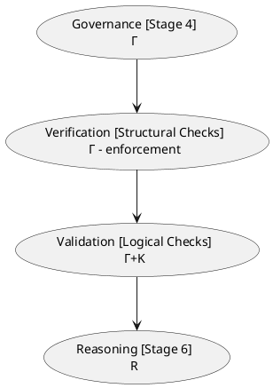

Verification checks compliance with governance policies.

Validation checks logical soundness.

Both are necessary before reasoning can be trusted.

## 22.5 The Cost of Validation Failure

### 22.5.1 The Cascading Failure Problem

A single flawed axiom can poison an entire inferred knowledge graph. This is not an exaggeration -- it is a mathematical consequence of how logic works.

In classical logic, an inconsistency entails everything (the principle of explosion, or *ex falso quodlibet* [^3]).

In OWL, an inconsistent ontology produces unsound inferences. The reasoner cannot distinguish between a true inference and one derived from contradiction.

Consider a healthcare ontology with a single unsatisfiable class. That class might be `HighRiskPatient` -- a critical concept for clinical decision support. If `HighRiskPatient` is unsatisfiable due to conflicting restrictions, no patient can ever to **classified** as high risk. The **trigger** for emergency alerts never fires. The **execution** system never intervenes. The patient is not protected!

The failure cascades:

1. **Modeling error**: A restriction conflict makes `HighRiskPatient` unsatisfiable
2. **Validation failure**: The error is not detected before deployment
3. **Reasoning corruption**: The reasoner produces unsound inferences (or fails to produce valid ones)
4. **Trigger failure**: The trigger for `HighRiskPatient` never fires
5. **Execution failure**: The clinical decision system does not act
6. **Real-world consequence**: Patient does not receive timely intervention

This is the **validation failure cascade**. Each stage amplifies the damage of the previous one.

### 22.5.2 A Clinical Example

To make this concrete:

> A clinical decision support system uses an ontology to classify patients for treatment recommendations. The ontology contains a class `AllergicToDrug` defined as `Patient and (hasAllergy some Drug)`. A governance policy requires that `AllergicToDrug` and `NonAllergicPatient` are disjoint. An engineer accidentally asserts (models) `AllergicToDrug SubClassOf NonAllergicPatient`. The ontology remains syntactically valid -- Protégé does not reject the axiom. The reasoner, when run, flags `AllergicToDrug` as unsatisfiable. But if the ontology is deployed without validation, the classification fails. No patient is ever classified as allergic, even those with documented allergies. The system recommends treatments without checking allergy status. This is not a crash. It is a silent, dangerous failure.

You can get this sample ontology file directly from `rdf` folder under ebook, or below URL:

https://yasenstar.github.io/protege_pizza/ebook/rdf/ch22-clinical-decision-support.rdf

The ontology has following class hierarchy leading to unsatisfiable reasoning result:


Validation is what prevent this cascade. It catches the unsatisfiable class before deployment, before reasoning, before execution, and before harm.

## 22.6 Exercise 19 -- The Probe Class: A Deliberate Inconsistency for Validation

Having established the cost of validation failure, we now turn to a deliberately engineered validation technique: **the Probe Class pattern**.

### 22.6.1 The Engineering Objective

**Exercise 19** in Michael DeBellis' *Protégé 5 New OWL Pizza Tutorial* asks us to create a class called `ProbeInconsistentTopping` with two disjoint superclasses: `CheeseTopping` and `VegetableTopping`. The class is defined as:

```text
Class: ProbeInconsistentTopping
    SubClassOf: CheeseTopping
    SubClassOf: VegetableTopping
```

At first glance, this appears to be a modeling error -- and **it is, by design**. The tutorial explicitly notes that "this class will be inconsistent. This is because we have given it 2 disjoint parents, which means it could never have any members (as nothing can simultaneously be a `CheeseTopping` and a `VegetableTopping`)."

The engineering objective is not to create a useful class, but to **create a detectable failure** -- a controlled inconsistency that serves as a validation probe.

### 22.6.2 Implementation: Creating the Probe Class

**Step 1: Navigate to the Classes tab in Protégé**

Ensure you have completed **Exercise 18**, which declared disjointness between `CheeseTopping` and `VegetableTopping`.

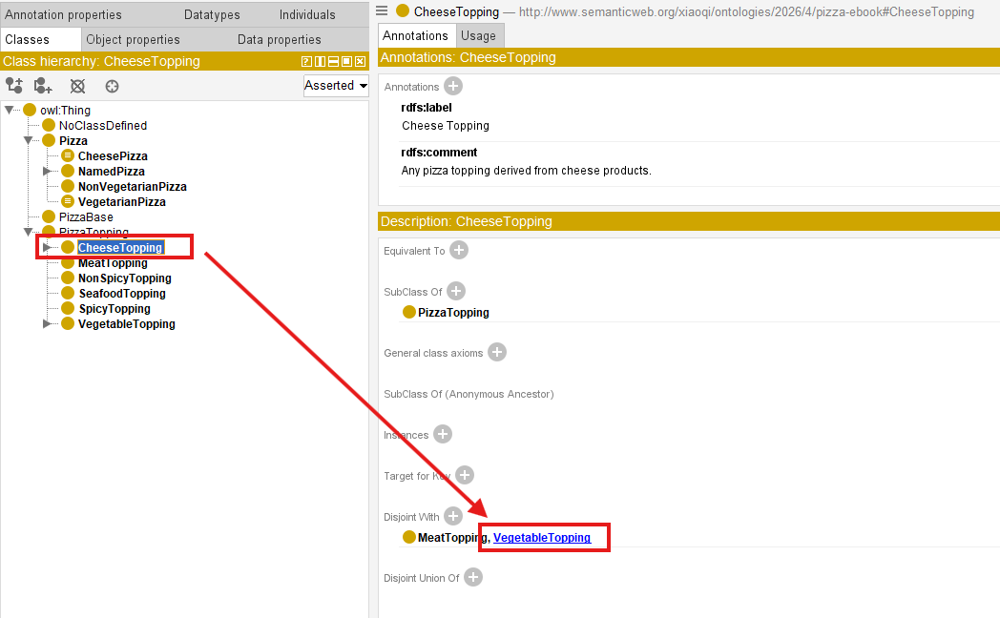

**Step 2: Create the new class**

1. Click on the "Add subclass" icon (or right-click on `owl:Thing` and select "Add subclass")
   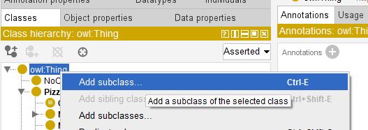
2. Name the class `ProbeInconsistentTopping`
   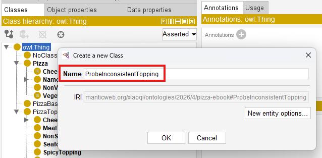
3. Click OK

**Step 3: Add disjoint superclass axioms**

1. Select `ProbeInconsistentTopping`
2. In the Description view, locate the SubClass Of section
3. Click the Add icon (+)
4. In the Class Expression Editor, enter `CheeseTopping`
   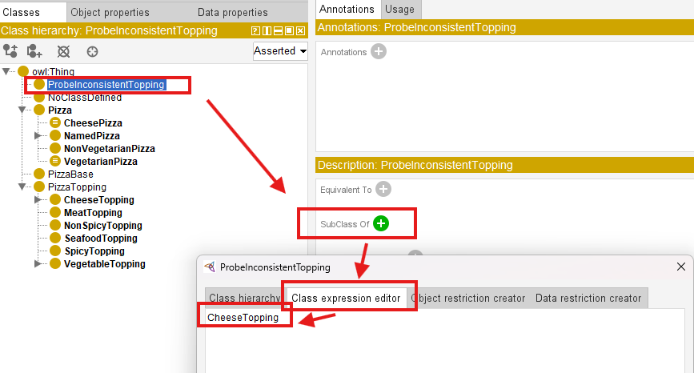
5. Click OK (Note that `ProbeInconsistentTopping` class is moved to under `CheeseTopping` class)
   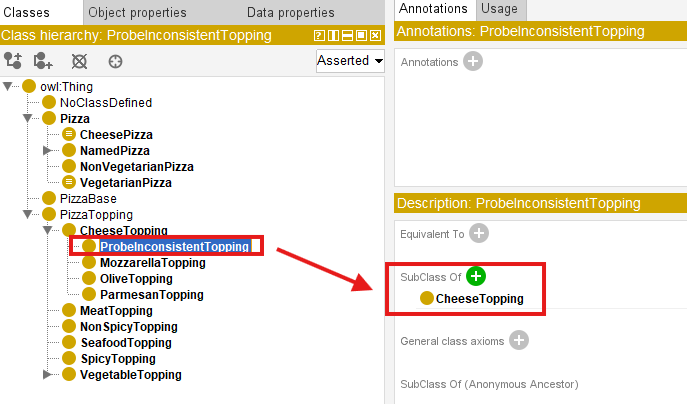
6. Repeat to add `VegetableTopping`
   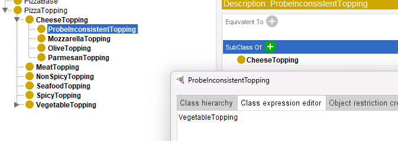
7. Observe `ProbeInconsistentTopping` is appearing under both `CheeseTopping` and `VegetableTopping` now.
   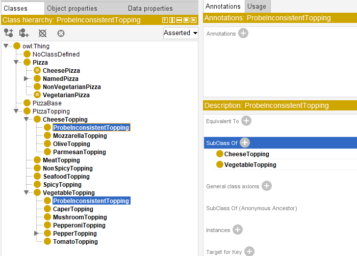

**Step 4: Synchronize the reasoner**

1. Select Reasoner > Synchronize reasoner, if you haven't activated reasoner, you may select "Start reasoner"
   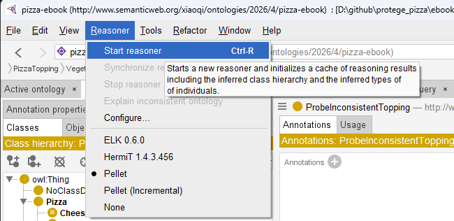
2. Observe the result

> [!Note]
> The steps described above are slightly different to the ones in `Pizza` tutorial, however, the results are identical. You can use either way to perform the practice.

The specific RDF file after this exercise 19 is named as `pizza-ebook_ex19.rdf`, you may find it under `ebook/rdf` subfolder.

### 22.6.3 The Result: Detecting the Inconsistency

When the reasoner is newly started or synchronized, `ProbeInconsistentTopping` is flagged as inconsistent. In Protégé, the class appears in red or with a warning icon. The reasoner reports that the class is equivalent to `owl:Nothing` -- it can never have any instances.

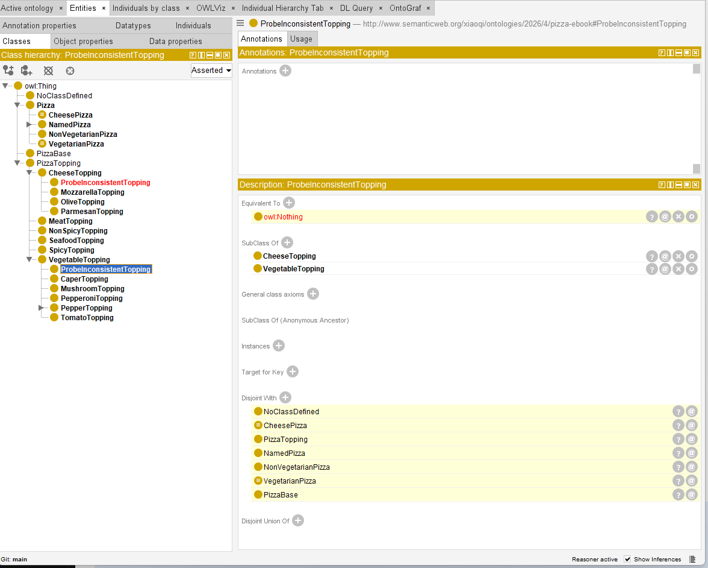

The reasoner's explanation reveals:

- `CheeseTopping` and `VegetableTopping` are disjoint
- `ProbeInconsistentTopping` is a subclass of both
- Therefore, `ProbeInconsistentTopping` has no possible instances

These explanation can be viewed through clicking question mark icon in the right of target description item, e.g. `EquivalentTo owl:Nothing`:

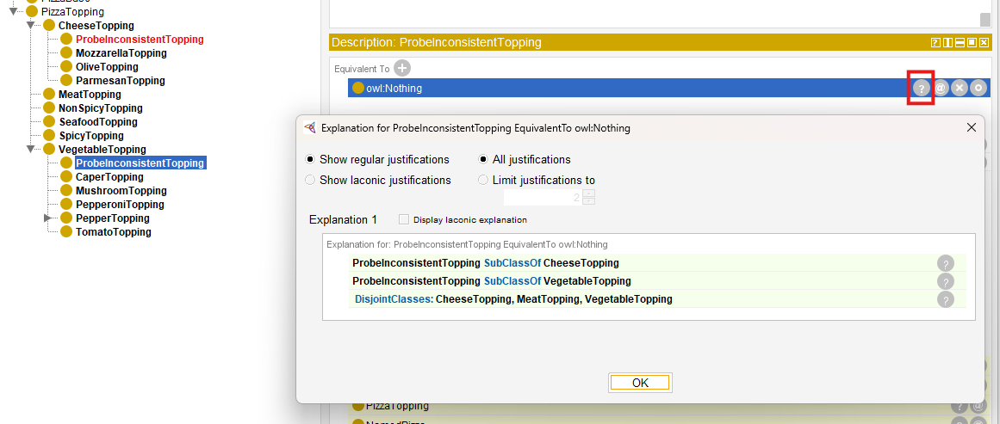

The reasoner does not **refuse** the axiom; instead, it **infers** inconsistency and **reports** it.

The ontology remains valid syntax, but the reasoner flags a logical error.

### 22.6.4 The Probe Class Pattern: Detection Through Deliberate Error

The **Probe Class** pattern works as follows:

| Step | Action | Validation Purpose |
| --- | --- | --- |
| **1. Create** | Define a class with two disjoint superclasses | Introduces a controlled inconsistency |
| **2. Run Reasoner** | Synchronize HermiT, Pellet, or FaCT++ | Detects the unsatisfiable class |
| **3. Observe** | The class appears red/highlighted;<br>reasoner reports `InconsistentOntologyException` | Confirms the validation mechanism works |
| **4. Investigate** | Use explanation features to find the root cause | Trains engineers to diagnose validation failures |
| **5. Remove** | Delete the probe class after validation | The probe is temporary;<br>it is not part of the production ontology |

The probe class is a **temporary**, **diagnostic** artifact.

As the `Pizza` tutorial notes, "such a class is called a **Probe Class**" -- a reusable diagnostic pattern built, used once to confirm a design assumption, and then deleted.

### 22.6.5 Why This Matters for Validation

The Probe Class pattern demonstrates three essential validation principles:

**1. Validation Requires Testability**

A class that "should" be inconsistent is the validation equivalent of a unit test that "should" fail. If the reasoner does not detect the inconsistency, the validation infrastructure is broken.

This is the same logic as writing a failing test before writing the code that fixes it. The test proves the validation mechanism works.

**2. Detection Is Not Prevention**

The reasoner does not refuse the axiom; if infers inconsistency and reports it. This reinforces the critical distinction introduced in **Chapter (13)**: OWL reasoner detect, they do not refuse.

Validation is the process of acting on that detection. The engineer sees the error, investigates the cause, and fixes the ontology.

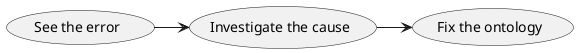

The reasoner's job is to **detect**, not to **prevent**.

**3. The Probe Is Temporary**

The probe class is created, used to confirm validation works, and then deleted. This mirrors the practice of writing a failing test, confirming it fails, then fixing the code. The test artifact is not production code.

### 26.6.6 From Probe to Production: The Validation Pipeline

The **Probe Class** pattern scales the enterprise validation in two ways:


**First**, as a **diagnostic technique**: When an ontology has many unsatisfiable classes, identifying the root cause is challenging. A probe class deliberately creates a root cause that is easy to identify -- training engineers to recognize root vs. derived unsatisfiability.

**Second**, as a **quality gate**: In CI/CD pipelines for ontologies, a probe class can be automatically created and checked before deployment. If the reasoner does not flag it as inconsistent, the validation pipeline fails -- preventing deployment of an ontology whose validation infrastructure is broken.

> **Engineering Takeaway:**
> The Probe Class pattern is validation's answer to the software engineer's "test-first" discipline. You write a test that should fail, confirm it fails, then fix the underlying issue. The probe class is that failing test -- a deliberate inconsistency that proves your validation infrastructure is working.

## 22.7 Mathematical Perspective -- The Logic of Validation

To understand why validation works -- and why the Probe Class pattern is logically sound -- we must examine the mathematical underpinnings of consistency checking, satisfiability, and structural tracing.

### 22.7.1 Model-Theoretic Semantics: Consistency and Satisfiability

An OWL ontology is a set of axioms. Its meaning is defined by **model-theoretic semantics**: an ontology is **consistent** if there exists an interpretation $\mathcal{I=(\Delta^I,\cdot^I)}$ such that every axiom in the ontology is satisfied.
- $\mathcal{\Delta^I}$ is a non-empty domain of individuals
- $\mathcal{\cdot^I}$ maps each class to a subset of $\mathcal{\Delta^I}$
- $\mathcal{\cdot^I}$ maps each property to a binary relation over $\mathcal{\Delta^I}$

**Consistency** asks: "Does there exist at least one model?" If the answer is yes, the ontology is consistent. If no, the ontology is inconsistent.

**Satisfiability** asks: "For a given class C, does there exist a model in which C has at least one instance?" If the answer is yes, C is satisfiable. If no, C is equivalent to `owl:Nothing`.

The Probe Class pattern creates a class that is **unsatisfiable by design**.

In the `Pizza` ontology:

- `CheeseTopping` and `VegetableTopping` are declared disjoint:
  $$\text{CheeseTopping } \cap \text{ VegetableTopping} = \emptyset$$
- `ProbeInconsistentTopping` is declared a subclass of both:
  $$\text{ProbeInconsistentTopping} \subseteq (\text{CheeseTopping } \cap \text{ VegetableTopping}) $$

By transitivity of subclass inclusion:

$$(\text{ProbeInconsistentTopping} \subseteq (\text{CheeseTopping } \cap \text{ VegetableTopping})) = \emptyset $$

Therefore, $\text{ProbeInconsistentTopping} \subseteq \text{owl:Nothing}$ -- it is unsatisfiable.

### 22.7.2 The Algebra of Unsatisfiability: Roots and Derived Classes

When an ontology contains multiple unsatisfiable classes, not all are independent. Some are **root causes**; others are **derived** consequences.

The formal relationship can be characterized by **subsumption-revealing transformations.**

Let $O$ be an ontology with unsatisfiable classes $C_1,C_2,\dots,C_n$.

The **Error Dependency Graph** $EDG = (V,E)$ captures dependencies:

- Each vertex $v \in V$ represents an unsatisfiable class
- Each edge $e: C \to D$ represents that $C$'s unsatisfiability depends on $D$
- The label $L(e) = S_{ax}$ represents the minimal set of axioms causing the dependency

A class $C$ is **derived** if there exists at least one outgoing edge $e: C \to D$ in the EDG.

A class with no outgoing edges is a **root cause**.

The Probe Class pattern deliberately creates a root cause that is trivial to identify:

> the class has exactly two axioms causing its unsatisfiability (the two superclass assertions plus the disjointness axiom).

This makes it an ideal educational tool.

### 22.7.3 The Open World Assumption and Validation

The Open World Assumption (OWA) fundamentally shapes validation in OWL.

Under OWA:
- Absence of information is not absence of truth
- The reasoner infers, it does not refuse
- Inconsistency is detected, not prevented

This means validation in OWL is inherently **diagnostic** rather than preventive. The Probe Class pattern demonstrates this perfectly: the inconsistent class is created, the reasoner detects it, and the engineer removes it. The ontology never reaches production with the inconsistency -- but the inconsistency existed temporarily.

> **Mathematical Takeaway:**
> An inconsistent ontology entails everything  under the standard entailment regime. Once an individual is asserted into two disjoint classes, every subsequent inference is unsound. Validation is the discipline that ensures this never happens in production.

### 22.7.4 Tableau Algorithms: How Reasoners Validate

OWL reasoners validate ontologies using **tableau algorithms** -- a form of automated theorem proving. The algorithm attempts to construct a model for the ontology. If it succeeds, the ontology is consistent. If it fails (because it encounters a contradiction), the ontology is inconsistent.

The tableau algorithm works by:

1. **Expansion rules**: Applying logical rules to decompose axioms into simpler forms
2. **Clash detection**: Identifying contradictions (e.g., an individual asserted to be in both $C$ and $\neg C$)
3. **Completion graph**: Building a graph that represents a potential model
4. **Backtracking**: If a contradiction is found, trying alternative paths

If the algorithm exhaustively tries all possibilities and finds no contradiction, the ontology is **consistent**. If it finds a contradiction that cannot be resolved, the ontology is **inconsistent** -- and the class that caused the contradiction is unsatisfiable.

The Probe Class pattern causes a clash in the tableau: the reasoner attempts to create an individual of `ProbeInconsistentTopping`, which would require it to be both a `CheeseTopping` and a `VegetableTopping`. The disjointness axiom makes this impossible. The tableau algorithm detects the clash and reports the class as unsatisfiable.

### 22.7.5 Decidability and Computational Tractability

The complexity of validation is $\text{NExpTime}$-complete for full $\text{OWL 2 DL}$ -- one reason why validations is a distinct stage before reasoning.

The reasoner must exhaustively search for a model; this search can be computationally expensive, but it terminates and produces a definitive answer.

This is the **decidability** property of Description Logic. Unlike unrestricted first-order logic, where consistency checking may never terminate, OWL reasoners are guaranteed to terminate with a definitive answer for supported reasoning tasks.

The Probe Class pattern is a lightweight, deterministic validation test that confirms the reasoner's tableau algorithm is functioning correctly.

> It is the validation equivalent of a "smoke test".

## 22.8 Logical Consistency Checking in Practice

### 22.8.1 Using Protégé's Reasoners

Protégé supports multiple OWL reasoners:

| Reasoner | Description | Best For |
| ---  | --- | --- |
| **Pellet** | OWL 2 DL reasoner; supports incremental reasoning | Large ontologies; explanation support |
| **HermiT** | OWL 2 DL reasoner; complete and sound | Most use cases; strong explanation support |
| FaCT++** | OWL 2 DL reasoner; fast | Performance-critical applications |

To run validation:

1. Select menu Reasoner > Configure... to choose scope of your reasoner (I used to check all if ontology is not too large)
   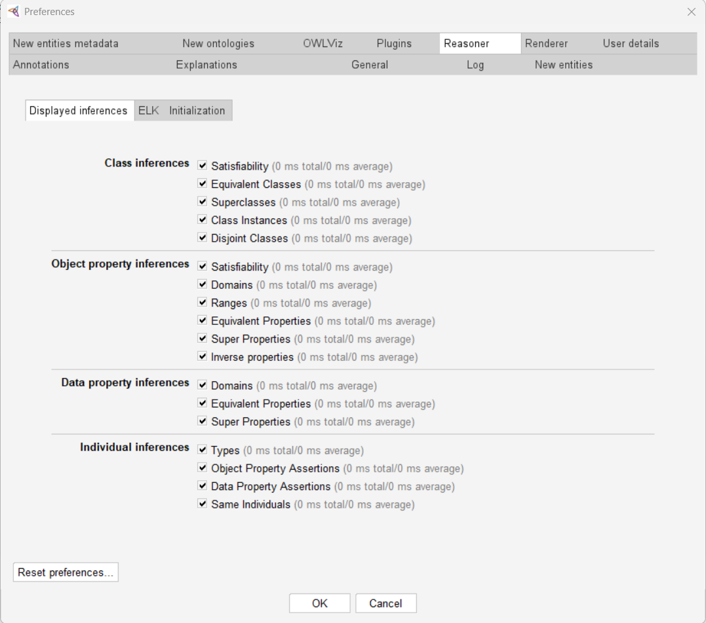
2. If not start reasoner yet, select Reasoner > Start reasoner (Ctrl+R)
   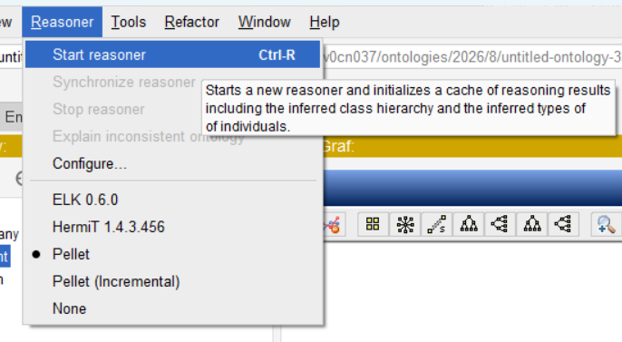
3. If reasoner is already started, select Reasoner > Synchronize reasoner (also Ctrl+R)
   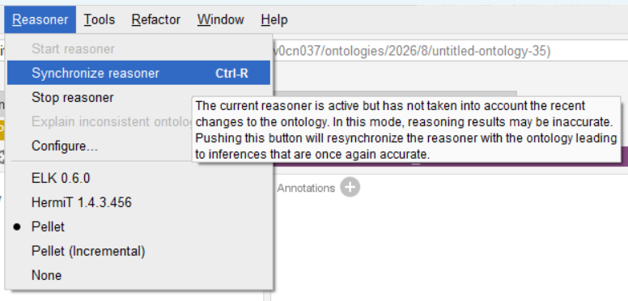
4. Observe the results in the class hierarchy

> [!note]
> Only when you have added / changed some new axioms or properties to your ontology, the "Synchronize reasoner" can be selected, otherwise, after you've just synchronized reasoner, you cannot click again:
> 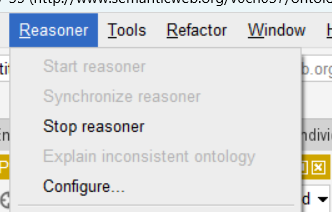

The reasoner will:

- Classify the ontology (compute all inferred subclass relationships)
- Check consistency (verify no contradictions)
- Identify unsatisfiable classes (classes equivalent to `owl:Nothing`)

### 22.8.2 Interpreting Reasoner Output

When a reasoner detects an inconsistency, it provides:

- **Error message**: Description of the inconsistency
- **Stack trace**: Detailed diagnostic information
- **Highlighting**: Unsatisfiable classes appear in red

For the Probe Class pattern, the reasoner reports:

```text
InconsistentOntologyException: Cannot do reasoning with inconsistent ontologies!
Reason for inconsistency: Individual ... is forced to belong to class
http://...CheeseTopping an dits complement.
```

The reasoner's explanation feature can be used to trace the root cause of the inconsistency. This is essential for diagnosing complex validation failures.

### 22.8.3 Common Consistency Error Patters

| Error Pattern | Description | Example | Detection |
| --- | --- | --- | --- |
| **Unsatisfiable Class** | Class can never have instances | `ProbeInconsistentTopping` | Reasoner reports class equivalent to `owl:nothing` |
| **Inconsistent Ontology** | Ontology contains contradictions | A class is both disjoint and equivalent to another | Reasoner reports `InconsistentOntologyException` |
| **Violated Domain/Range** | Property used with incompatible types | `hasTopping` used on `PizzaBase` | Reasoner infers `PizzaBase` is a `Pizza` or report inconsistency |
| **Circular Hierarchy** | `A SubClassOf B` and `B SubClassOf A` | `Pizza SubClassOf NamedPizza` and `NamedPizza SubClassOf Pizza` | Reasoner flags unsatisfiable classes or circularity |
| **Cardinality Conflict** | Property has conflicting cardinality constraints | `hasTopping exactly 1` and `hasTopping min 2` | Reasoner reports unsatisfiable class |

## 22.9 Constraint Validation: SHACL and OWL

### 22.9.1 Why OWL's OWA Means It Infers Rather Than Validates

As discussed in [Section 22.7.3](#2273-the-open-world-assumption-and-validation), the Open World Assumption means OWL reasoners infer rather than refuse. A missing assertion is not an error -- it is simply **unknown**.

This is a powerful feature for reasoning, but it is problematic for **data validation**. When checking instance data against a schema, we often want a **closed-world** interpretation: "Does this data conform to the expected structure?"

For example:

- In OWL, missing a `hasTopping` assertion on a pizza is not an error -- there might be toppings we simply don't know about yet.
- In data validation, missing a `hasTopping` assertion on a pizza **is** an error -- every pizza should have at least one topping.

OWL's OWA is designed for reasoning, not validation.

For validation, we need a different tool.

### 22.9.2 Introduction to SHACL (Shapes Constraint Language)

**SHACL (Shapes Constraint Language)** [^4] is a W3C standard for validating RDF graphs against a set of conditions (shapes).

Unlike OWL, which uses the open-world assumption, SHACL validation is typically **closed-world**. It checks that the data satisfies the constraints as-is.

A SHACL shape defines constraints on nodes:

- **Class constraints**: An individual must be of a certain type
- **Property constraints**: An individual must have certain properties with certain values
- **Cardinality constraints**: An individual must have exactly/min/max values of a property
- **Value constraints**: Property values must be of a certain type, within a certain range, or from a set

### 22.9.3 Common SHACL Validation Patterns

| SHACL Patter | Description | Example |
| --- | --- | --- |
| **Class Constraint** | Node must be of a specific type | `ex:PizzaShape a sh:NodeShape ;`<br>`sh:targetClass ex:Pizza .` |
| **Property Constraint** | Node must have a specific property | `sh:property [ sh:path ex:hasTopping; sh:minCount 1 ] .` |
| **Cardinality Constraint** | Node must have exactly `n` values | `sh:property [ sh:path ex:hasTopping; sh:maxCount 5 ] .` |
| **Value Type Constraint** | Property values must be of a specific type | `sh:property [ sh:path ex:hasTopping; sh:class ex:Topping ] .` |
| **Node Constraint** | Node must satisfy a nested condition | `sh:property [ sh:path ex:hasTopping; sh:node ex:ToppingShape ] .` |

### 22.9.4 OWL Reasoning vs. SHACL Validation: Complementary, Not Competing

OWL reasoning and SHACL validation serve different purposes:

| Dimension | OWL Reasoning | SHACL Validation |
| --- | --- | --- |
| **Assumption** | Open World | Closed World (typically) |
| **Purpose** | Derive new knowledge | Check data conformance |
| **Output** | New inferences | Pass/fail for data |
| **Focus** | Class-level consistency | Instance-level conformance |
| **Strength** | Expressiveness, inference | Precision, enforceability |

They are complementary:

1. **OWL** defines the semantic model -- the logical structure of the domain
2. **SHACL** defines the data validation rules -- the instance-level conformance checks
3. **Validation (Stage 5)** uses both: OWL for logical consistency, SHACL for data quality

In EKA terms, SHACL provides the executable enforcement of governance policies at the data level. It is the tool turns governance intent into machine-checkable constraints.

## 22.10 Validation Enables Triggers ($\Theta$)

### 22.10.1 Why Triggers Need Validated Knowledge

**Triggers ($\Theta$)** are event patterns that initiate actions on semantic conditions.

For a trigger to be trustworthy, the knowledge it depends on must be validated.

| Trigger Requirement | Validation Provides |
| --- | --- |
| **Stable Event Patterns** | - Validation ensures that class definitions are stable and not contradictory.<br>- A trigger on `MargheritaPizza` must know that `MargheritaPizza` is satisfiable and consistent. |
| **Reliable Classification** | - Validation ensures the reasoner will correctly classify individuals.<br>- A trigger fired on misclassified individuals is a false positive. |
| **Predictable Behavior** | - Validation ensures the ontology's behavior is deterministic.<br>- Inconsistent ontologies produce unpredictable reasoning results. |

### 22.10.2 The Stability Requirement for Event Patterns.

A trigger is defined by a semantic condition, e.g.:

> IF individual is classified as **HighRiskPatient**
> THEN send alert to clinician

If `HighRiskPatient` is unsatisfiable (no individual can ever be classified), the trigger never fires.

If `HighRiskPatient` is inconsistent (classification depends on contradictory axioms), the trigger fires unpredictably.

Validation ensures that:

1. `HighRiskPatient` is satisfiable (it can have instances)
2. `HighRiskPatient` is consistent (its definition is coherent)
3. The classification logic is sound (the reasoner will produce correct results)

Without validation, triggers are built on **sand**.

With validation, triggers are built on **bedrock**.

> **Example:**
> A clinical decision support system triggers an alert when a patient is classified as `HighRiskPatient`. If `HighRiskPatient` is unsatisfiable due to conflicting restrictions, the alert never fires. The patient does not receive timely intervention. Validation prevents this scenario.

## 22.11 Validation Protects Execution ($\Phi$)

### 22.11.1 Why Execution Requires Trusted Inputs

**Execution ($\Phi$)** is where knowledge drives action. This is the highest-stakes layer of EKA.

Validation protects execution by ensuring that:

| Execution Requirement | Validation Provides |
| --- | --- |
| **Correct Inputs** | - Execution decisions depend on facts derived from the knowledge graph.<br>- If the knowledge graph is inconsistent, execution decisions are unsound. |
| **Auditability** | - Validation provides a record that the ontology was verified before execution.<br>- This is essential for regulatory compliance and liability. |
| **Failure Isolation** | - Validation catches errors before they reach execution.<br>- A validation failure is a controlled failure; an execution failure may be catastrophic. |
| **Trust** | - Execution systems must trust their semantic inputs.<br>- Validation is the process that builds that trust. |

### 22.11.2 The Trust Guarantee

Validation provides a **trust guarantee** for execution:

> "The ontology is correct, consistent, and fit for purpose. You can act on its outputs with confidence."

Without validation, execution is guessing.

With validation, execution is confidence.

> **Example:**
> A clinical decision support system recommends treatment based on patient classification. If the ontology incorrectly classifies a patient as `AllergicToDrug` due to an unsatisfiable class or inconsistent reasoning, the execution layer may recommend a harmful treatment. Validation is the gate that prevents this: if the ontology is inconsistent, it fails validation before it ever reaches execution. This is the difference between a **trusted system** and a **dangerous one**.

## 22.12 Validation as Governance Enforcement ($\Gamma + K$)

### 22.12.1 Connecting Back to Chapter (21)

**Chapter (21)** established governance as the discipline of maintaining semantic integrity. Governance policies are essential, but they are just documents until they become enforceable.

Validation is where governance becomes enforceable. It is where $\Gamma$ (governance) meeting $K$ (knowledge graph):

| Governance Policy | Validation Check |
| --- | --- |
| Naming Conventions | Automated URI/IRI pattern checks |
| Design Patterns | Structural validation via SHACL/SPARQL |
| Modularity Rules | Import cycle detection |
| Disjointness Axioms | reasoner consistency checks |
| Versioning Policies | Compatibility verification |

### 22.12.2 The Governance-to-Validation (G2V) Pipeline

The progression from governance to validation is:

1. **Governance (Stage 4)**: Define the policies
   - Naming conventions: `Classes must use PascalCase`
   - Modularity: `Each module must be self-contained`
   - Design patterns: `Use the Value Partition pattern for enumerated concepts`
2. **Verification (Part of Stage 5)**: Check structural conformance
   - Run SPARQL queries to check naming conventions
   - Detect circular imports between modules
   - Validate use of design patterns
3. **Validation (Part of Stage 5)**: Check logical soundness
   - Run reasoner to detect inconsistencies
   - Identify unsatisfiable classes
   - Validate instance data with SHACL

The output is a **validated ontology** -- one that is structurally correct, logically sound, and ready for deployment.

> **The EKA Perspective:**
> Validation transforms static governance rule ($\Gamma$) into executable quality gates on the knowledge graph ($K$).
> - Without validation, governance is **aspiration**.
> - With validation, governance is **infrastructure**.

## 22.13 Engineering Perspective -- Validation as Testing

### 22.13.1 Mapping to Software Testing Practices

Your intuition to map validation to software testing is correct.

The full mapping is:

| Testing Phase | Ontology Engineering Analog | EKA Component |
| --- | --- | --- |
| **Unit Testing** | Class-level satisfiability checking (*"Is each class coherent on its own?"*) | $$K$$ |
| **Integration Testing** | Cross-module consistency (*"Do imported modules conflict?"*) | $$K + \Gamma$$ |
| **System Testing** | Full ontology consistency reasoning (*"Does the entire knowledge base have a model?"*) | $$K + R$$ |
| **User Acceptance Testing (UAT)** | Competency Question validation (*"Can the ontology answer the questions it was built to answer?"*) | $$\Theta + \Phi$$ |
| **Regression Testing** | Change impact analysis (*"Does a new axiom break existing inferences?"*) | $$\Gamma + K$$ |

### 22.13.2 Software Engineering Principles Applied to Ontology Validation

| Principle | Ontology Engineering Application |
| --- | --- |
| **"Test Early, Test Often** | Validate after every change, not just at the end (as established in **Chapter (21)**'s $\S$21.9.6) |
| **"Shift-Left Testing** | Governance (Stage 4) is shift-left; Validation (Stage 5) is execution. The earlier you catch errors, the cheaper they are to fix. |
| **"Red-Green-Refactor** | Detect inconsistency (Red) $\to$ Fix the model (Green) $\to$ Optimize/refine axioms (Refactor). This is the validation cycle. |
| **"Test Coverage"** | Do your validation tests cover all competency questions? All governance policies? This is where SHACL shapes serve as test cases. |
| **"Fuzzing"** | Feed the reasoner edge-case individuals to see if the ontology remains consistent. This tests robustness. |

### 22.13.3 Shift-Left Validation

"Shift-left" is a software testing principle:

> move testing earlier in the development process to catch errors sooner.

In ontology engineering:
- **Governance (Stage 4)** establishes the rules (the "design phase")
- **Validation (Stage 5)** enforces the rules (the "testing phase")

The earlier validation occurs, the cheaper it is to fix errors. A validation failure during modeling costs minutes. A validation failure during deployment costs hours. A validation failure in production costs days -- or worse.

> **Engineering Takeaway:**
> Semantic validation is to ontology engineering what integration testing is to software engineering: it verifies that independently developed components work together correctly before the system is deployed. If you are familiar with SIT, UAT, or regression testing, you already understand the discipline of validation -- you are simply applying it to knowledge instead of code.

## 22.14 Interesting Reading -- The Name-Reality Debate

### 22.14.1 名实之辩 (Ming-Shi Debate): Names and Reality

The Chinese tradition of **名实之辩** (Ming-Shi debate) -- the relationship between names (concepts) and reality -- offers a rich historical connection to validation.

| Concept | Chinese Dialectics | Ontology Engineering Analog |
| --- | --- | --- |
| **名 (Ming)** | The signifier, the concept, the term | OWL classes, individuals, properties |
| **实 (Shi)** | The actual things that exist | The domain entities that classes are supposed to describe |
| **正名 (ZhengMing)** | Rectifying names -- ensuring names are used correctly | Governance (Stage 4) establishes naming conventions; Validation (Stage 5) checks they are applied |

The Ming-Shi debate asked: *"Does the name (名) accurately reflect the reality (实)?"* This is precisely the question semantic validation answers: *"Do our OWL classes accurately describe the domain they intend to represent?"*

### 22.14.2 循名责实 (Xun Ming Ze Shi): Tracing Names to Verify Reality

循名责实 (Xun Ming Ze Shi) translates to "tracing the name to verify its correspondence to reality."

This ancient Chinese validation method -- ensuring that concepts accurately reflect the things they name -- is the philosophical ancestor of modern ontology validation.

When we run a reasoner to check consistency, we are engaging in a form of 循名责实: we trace the logical consequences of our class definitions (the names) to verify that they correspond to a coherent reality (the domain). If a class is unsatisfiable, the name does not correspond to any possible reality -- the validation fails.

### 22.14.3 Dialogical Logic: Validation as a Game

**Dialogical Logic**, developed by Paul Lorenzen and Kuno Lorenz, provides another powerful framing.

Validation is a **dialogue** between:
- **Proponent** (the ontology engineer, asserting "This ontology is correct")
- **Opponent** (the reasoner, trying to find a counterexample)

This dialogue continues until the opponent cannot find any inconsistency -- at which point the ontology is validated. The **Probe Class** pattern is a controlled move in this dialogue: the engineer intentionally creates a vulnerable assertion (`ProbeInconsistentTopping` is both a `CheeseTopping` and a `VegetableTopping`), and the reasoner (opponent) must find the contradiction. If the reasoner does, the validation infrastructure is working.

> **The Historical Connection:**
> The validation tradition extends back to ancient Chinese debates about the relationship between names and reality.
> When we "循名责实" -- tracing the name to verify its correspondence to reality -- we are engaging in the same intellectual discipline as ancient logicians, now executed by reasoner and SHACL validators.

### 22.14.4 The Probe Class in Historical Context

The **Probe Class** pattern can be understood as a modern application of **Socratic elenchus** -- the cross-examination technique used by Socrates to test claims by drawing out contradictions. Socrates would ask questions to expose inconsistencies in his interlocutors's beliefs; the **Probe Class** does the same for ontology axioms.

Similarly, the Chinese sage Mozi (墨翟, 墨子, c. 470-391 BCE) emphasized 校验 (JiaoYan) -- verification through practical testing. Mozi argued that claims must be tested against reality. The **Probe Class** tests claims (axioms) against logical reality: if the class is unsatisfiable, the claim is false.

The tools have changed dramatically -- from oral dialogue to OWL reasoners -- but the fundamental principle has remained constant:

> **Validation is the discipline of testing knowledge against reality to ensure it is true.**

## 22.15 Validation in the Enterprise Context

### 22.15.1 CI/CD for Ontologies

Validation should be integrated into a Continuous Integration / Continuous Deployment (CI/CD) pipeline for ontologies:

1. **Commit**: Engineer commits changes to ontology
2. **Build**: Ontology is compiled/validated
3. **Test**: Reasoner runs consistency checks; SHACL validation runs
4. **Deploy**: Validated ontology is deployed to production

The **Probe Class** pattern can be automated in this pipeline:

> create a probe class, run the reasoner, check that it fails, then remove it.

If the reasoner does not detect the inconsistency, the pipeline fails.

### 22.15.2 Regression Testing

Regression testing ensures that new axioms don't break existing inferences.

In ontology engineering:

1. **Baseline**: A validated ontology with known inferences
2. **Change**: New axioms are introduced
3. **Re-validation**: The reasoner runs on the changed ontology
4. **Comparison**: Inferences from the changed ontology are compared to the baseline

If any known inference is lost or changed unexpectedly, the regression test fails.

### 22.15.3 The `Pizza`-to-Enterprise Scaling

The validation discipline learned on the `Pizza` ontology scales directly to enterprise knowledge systems:

- Validating `Pizza` and `hasTopping` requires the same logic as validating `Application` and `supportsCapability`
- Checking disjointness of `PizzaTopping` scales to checking disjointness of `RiskCategory`
- Using SHACL for data quality on pizzas scales to using SHACL for data quality on customer transactions.

The principles are universal; only the domain concepts change.

## 22.16 Common Validation Pitfalls

### 22.16.1 The "Surprise Empty Class" Problem

A class becomes unsatisfiable when restrictions are too strict.

For example:

```text
Class: MargheritaPizza
   EquivalentTo: Pizza and (hasTopping only CheeseTopping)
```

If `MargheritaPizza` also requires `hasTopping some TomatoTopping` (from its parent), and `TomatoTopping` is not a `CheeseTopping`, the class becomes unsatisfiable.

**Detection**: The reasoner flags the class as equivalent to `owl:Nothing`.

### 22.16.2 Domain/Range Mismatches

Domain/range restrictions in OWL **do not reject** bad assertions; they **infer**.

If a property is used with incompatible types, the reasoner may infer unexpected classifications.

For example, if `hasTopping` has domain `Pizza`, and an individual of type `PizzaBase` uses `hasTopping`, the reasoner infers that `PizzaBase` is a `Pizza`. This may be unintended.

**Detection**: The reasoner produces unexpected classification results. Validation checks for these.

### 22.16.3 Confusing `EquivalentTo` with `SubClassOf`

Using `EquivalentTo` when `SubClassOf` was intended can over-constrain an ontology.

A class defined as equivalent to a complex expression must match that expression exactly; if any instance fails to satisfy it, the class becomes unsatisfiable.

**Detection**: The reasoner flags the class as unsatisfiable if there are no instances satisfying the equivalent expression.

### 22.16.4 Open World Surprises

*"Why didn't the reasoner flag this as an error?"* is a common question.

The answer is often the Open World Assumption:

> missing information is not an error.

A pizza with no `hasTopping` assertions is not invalid -- there might be toppings we simply don't know about yet.

For closed-world validation (e.g., data quality checks), use SHACL instead of OWL reasoning.

## 22.17 Key Concepts

| Concept | Description |
| --- | --- |
| **Semantic Validation** | The process of verifying that an ontology is logically consistent, semantically complete, and fit for purpose before deployment |
| **Consistency** | An ontology is consistent if there exists at least one model satisfying all axioms. |
| **Satisfiability** | A class is satisfiable if there exists at lease one model with an instance of that class |
| **Unsatisfiable Class** | A class equivalent to `owl:Nothing` -- can never have instances; a validation failure |
| **Probe Class** | A deliberately inconsistent class created to test validation infrastructure; a temporary diagnostic artifact |
| **Verification** | Checking conformance to governance policies (naming, modularity, patterns) |
| **Validation** | Checking logical soundness and fitness for purpose (consistency, satisfiability, competency questions) |
| **SHACL** | Shapes Constraint Language -- a W3C standard for closed-world data validation on RDF graphs |
| **Derived Class (Unsatisfiability)** | A class whose unsatisfiability is a consequence of another unsatisfiable class |
| **Root Cause (Unsatisfiability)** | The original source of an inconsistency; classes with no outgoing dependencies in the Error Dependency Graph |
| **Tableau Algorithm** | The reasoning algorithm used by OWL reasoners to check consistency and satisfiability |
| **名实之辩 (Ming-Shi)** | Ancient Chinese debate about the relationship between names (concepts) and reality |
| **循名责实 (Xun Ming Ze Shi)** | "Tracing the name to verify its correspondence to reality" -- the philosophical ancestor of validation |

## 22.18 Chapter Summary

This chapter introduced Stage 5 -- Semantic Validation of the Semantic Knowledge Development Lifecycle (SKDL), making the transition from governance knowledge to validated, trustworthy knowledge.

In **Chapter (21)**, we established **Semantic Governance** as the discipline of maintaining semantic integrity through policies, standards, and lifecycle management. Governance gave us the rules. But rules alone do not verify correctness.

This chapter addressed that gap by introducing **Semantic Validation** as the discipline of verifying that an ontology is logically consistent, semantically complete, and fit for purpose before deployment.

Using **Exercise 19** from Michael DeBellis' *Protégé 5 New OWL Pizza Tutorial* as a practical case study, we explored how ontology engineers use the Probe Class pattern -- a deliberately inconsistent class -- to test their validation infrastructure. Although this modeling activity appears to be creating an 3error, its engineering significance is precisely the opposite:

> it is creating a detectable failure to prove that the validation mechanism works.

Throughout the chapter, we demonstrated that validation is not merely a technical check -- it is the gatekeeper for the entire EKA pipeline:

- **Validation ensures consistency ($K$)**: The knowledge graph is coherent and contradiction-free
- **Validation enables reasoning & rules ($R$)**: Reasoning operates on a sound foundation
- **Validation stabilizes triggers ($\Theta$)**: Triggers fire on reliable event patterns
- **Validation protects execution ($\Phi$)**: Execution acts on trusted knowledge
- **Validation enforces governance ($\Gamma$)**: Policies become enforceable constraints

We then broadened this perspective by examining validation from multiple complementary disciplines:

- **Mathematical perspective** -- demonstrating that validation corresponds to model-theoretic consistency checking, satisfiability testing, and tableau-based reasoning algorithms.
- **Engineering perspective** -- mapping validation to software testing practices (unit testing, integration testing, regression testing, UAT) and software principles (test early, shift-left, test coverage)
- **Historical perspective** -- tracing the validation tradition from ancient Chinese 名实之辩 (Ming-Shi) and 循名责实 (Xun Ming Ze Shi) to modern dialogical logic and Socratic elenchus
- **Architectural perspective** -- positioning validation as the critical gatekeeper for the entire EKA pipeline, protecting every downstream layer from unsound inputs

Then progression established across the first five stages for SKDL can therefore be summarized as:

| SKDL Stage | Primary Outcome |
| --- | --- |
| Stage 1 -- Conceptual Modeling | Identify concepts and organize them into a coherent semantic taxonomy |
| Stage 2 -- Semantic Description | Enrich those concepts with formal semantic meaning through Description Logic and OWL restrictions |
| Stage 3 -- Knowledge Reuse | Transform validated semantic knowledge into reusable assets |
| Stage 4 -- Semantic Governance | Maintain semantic integrity through policies, standards, and lifecycle management |
| Stage 5 -- Semantic Validation | Verify correctness before deployment through consistency checking and constraint validation |

Together, these five stages establish both the **semantic foundation** and the **quality assurance** required for trustworthy knowledge systems.

The **Probe Class** pattern -- a deliberately inconsistent class used to test validation infrastructure -- embodies the spirit of this stage:

> **validation is the discipline of testing knowledge against reality to ensure it is true!**

---

Last updated as 2026-09-09

## Reference

[^1]: BS 7000: bsi.knowledge, https://landingpage.bsigroup.com/LandingPage/Series?UPI=BS%207000
[^2]: ISTQB - International Software Testing Qualifications Board, https://istqb.org/
[^3]: *Ex falso quodlibet* is a Latin phrase that translates to "from falsehood, anything follows." https://en.wikipedia.org/wiki/Principle_of_explosion
[^4]: SHACL - W3C Recommendation 20 July 2017, https://www.w3.org/TR/shacl/