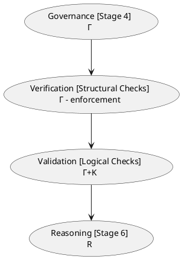
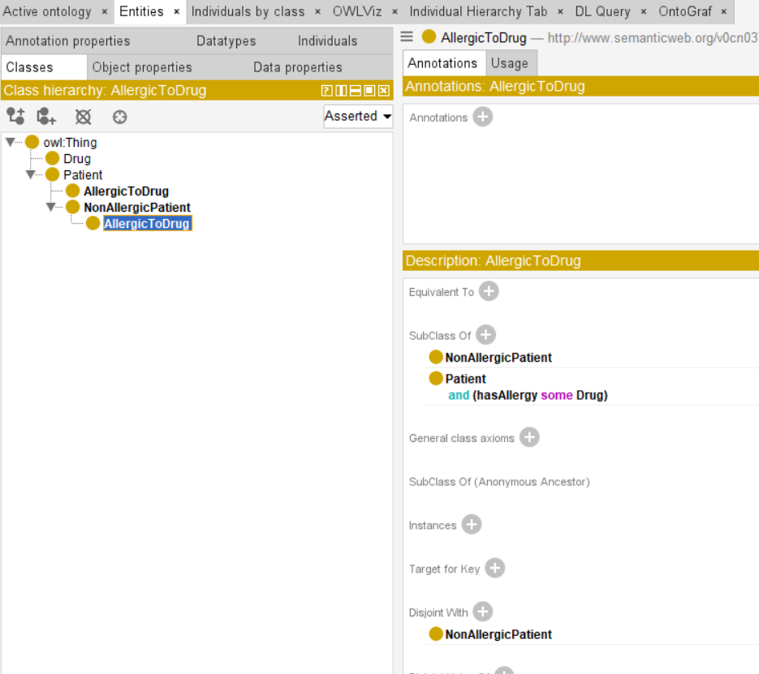

# Chapter 22 - Semantic Validation: Stage 5 of Semantic Knowledge Development Lifecycle

**Verifying Semantic Correctness Before Deployment**

The first four stages of the Semantic Knowledge Development Lifecycle (SKDL) transformed an abstract conceptual vocabulary into a governed, reusable knowledge asset.

- Conceptual Modeling gave us structure.
- Semantic Description gave us meaning.
- Knowledge Reuse gave us composability.
- Semantic Governance gave us discipline.

Now, as knowledge begins to flow from ontology models into production systems, a new challenge emerges:

> *How do we verify that this knowledge is actually correct?*

Semantic Validation answers this question.

It is the discipline of verifying that an ontology is logically consistent, semantically complete, and fit for purpose before it is deployed into production systems, before it powers automated reasoning, and before it drives intelligent execution.

Validation is the **quality gate** of the SKDL -- the checkpoint where governance becomes enforceable, where reasoning becomes trustworthy, and where execution becomes safe.

This chapter examines **Exercise 19** from Michael DeBellis' *Protégé 5 New OWL Pizza Tutorial* through the lens of semantic validation.

While **Exercise 18** (declaring disjointness between sibling classes) introduced governance mechanisms, **Exercise 19** introduces a deliberate inconsistency -- **a Probe Class** -- to demonstrate how the reasoner detects errors that would otherwise poison the knowledge base.

Along the way, we will examine validation from multiple complementary perspectives: mathematical, engineering, historical, and architectural -- revealing that

> the validation of knowledge is one of humanity's oldest and most essential intellectual disciplines.

---

Table of Contents
- [22.1 Chapter Introduction -- From Governance to Validation](#221-chapter-introduction----from-governance-to-validation)
- [22.2 Learning Objectives](#222-learning-objectives)
- [22.3 Positioning Within SKDL -- Stage 5 Highlighted](#223-positioning-within-skdl----stage-5-highlighted)
- [22.4 What Is Semantic Validation?](#224-what-is-semantic-validation)
  - [22.4.1 Working Definition](#2241-working-definition)
  - [22.4.2 Validation vs. Reasoning: A Critical Distinction](#2242-validation-vs-reasoning-a-critical-distinction)
  - [22.4.3 Validation vs. Verification: Building It Right vs. Building the Right Thing](#2243-validation-vs-verification-building-it-right-vs-building-the-right-thing)
- [22.5 The Cost of Validation Failure](#225-the-cost-of-validation-failure)
  - [22.5.1 The Cascading Failure Problem](#2251-the-cascading-failure-problem)
  - [22.5.2 A Clinical Example](#2252-a-clinical-example)
- [Reference](#reference)

## 22.1 Chapter Introduction -- From Governance to Validation

Consider what happens when an ontology that was validation in isolation is deployed into a production execution system. The reasoner was synchronized. No inconsistencies were found. But within hours, queries return unexpected results. A class that should have instances is empty. An inference that worked in testing now produces contradictory facts. The system is running, but it cannot be trusted. This is the cost of insufficient validation:

> not a crash, but a silent corruption of knowledge.

In **Chapter (21)**, we established Semantic Governance (Stage 4) as the discipline of maintaining semantic integrity across an evolving knowledge ecosystem. Governance gave us policies, standards and processes -- but governance alone does not verify that the ontology is correct. It establishes the rules, but it does not check whether the rules have been followed.

This is where **Stage 5 -- Semantic Validation** enters the lifecycle.

Validation is the quality gate of the SKDL.

It is the checkpoint where:
- Governance policies become **enforceable** constraints
- Knowledge graphs become **trustworthy** assets
- Reasoning becomes **sound** inference
- Triggers become **reliable** event patterns
- Execution becomes **safe** action

Without validation, every downstream stage of the SKDL is built on sand. A single unsatisfiable class can poison an entire inferred knowledge graph. A single inconsistent axiom can cause triggers to fire unpredictably. A single modeling error can lead execution systems to make dangerous decisions.

The first four stages have been building toward this moment.

- Stage 1 gave us concepts.
- Stage 2 gave us meaning.
- Stage 3 gave us reusability.
- Stage 4 gave us governance.
- Stage 5 now gives us the verification that all of this work is correct -- that the ontology is ready to be trusted.

**Exercise 19** in Michael DeBellis' *Protégé 5 New OWL Pizza Tutorial* introduces this validation discipline through a seemingly paradoxical activity:

> creating a deliberately inconsistent class.

The exercise asks us to create a class called `ProbeInconsistentTopping` with two disjoint superclasses: `CheeseTopping` and `VegetableTopping`. This class can never have any instances -- it is equivalent to `owl:Nothing`. The reasoner detects this inconsistency and flags it as an error.

At first glance, creating a deliberate error seems counterproductive. But this is precisely the point. The Probe Class pattern is validation's answer to the software engineer's "test-first" discipline. You create a test that should fail, confirm it fails, then fix the underlying issue. Ths probe class is that failing test -- a deliberate inconsistency that proves your validation infrastructure is working.

This chapter will explore why this technique matters, how it scales to enterprise knowledge systems, and how validation transform a governed ontology into a **trustworthy, executable knowledge asset**.

## 22.2 Learning Objectives

After completing this chapter, you should be able to achieve the following learning outcomes:

**Knowledge**

- Explain why Semantic Validation is the fifty stage of the Semantic Knowledge Development Lifecycle (SKDL)
- Distinguish between **validation** (ensuring the ontology says what was intended) and **reasoning** (deriving new knowledge)
- Distinguish between **verification** (conforming to governance policies) and **validation** (logical soundness and fitness for purpose)
- Describe the purpose of the **Probe Class** pattern in validation
- Understand why validation is the gatekeeper for triggers ($\Theta$) and execution ($\Phi$) in the EKA framework
- Understand the **Open World Assumption (OWA)** implications for validation -- why OWL reasoners "infer" rather than "reject"

**Practical Skills**

- User Protégé's built-in reasoner (Pellet, HermiT, FcCT++) to detect logical inconsistencies and unsatisfiable classes
- Create and use a Probe Class to test validation infrastructures
- Interpret common error patterns: inconsistent ontologies, unsatisfiable classes, violated domain/range constraints
- Apply SHACL (Shaped Constraint Language) to validate instance data against the ontology schema
- Explain the difference between OWL reasoning and SHACL validation

**Engineering Perspective**

- Understand validation as the bridge between **governance intent** and **executable knowledge**
- Map validation practices to software testing equivalent (unit testing, integration testing, regression testing, UAT)
- Articulate why validation is not just a technical check but a **trust guarantee** for execution systems
- Explain the cascading effect of an un-validated ontology on downstream EKA component ($R \to \Theta \to \Phi$)

**Mathematical Perspective**

- Understand model-theoretic semantics: consistency and satisfiability
- Explain the algebra of unsatisfiability: roots and derived classes
- Understand why tableau algorithms terminate with a definitive answer (decidability)

**Historical Perspective**

- Trace the validation tradition from ancient Chinese **名实之辩** (Ming-Shi Debate) to modern ontology validation
- Understand validation as a **dialogical game** between proponent (engineer) and opponent (reasoner)

## 22.3 Positioning Within SKDL -- Stage 5 Highlighted

As introduced in **Chapter (17)**, ontology engineering progresses through seven stages of the Semantic Knowledge Development Lifecycle (SKDL), each stage contributing a distinct engineering objective toward the construction of executable semantic knowledge systems.

Having completing **Stage 4 -- Semantic Governance** in the previous chapter, this chapter advances to **Stage 5 -- Semantic Validation**.

The objective of this stage is to

> verify ontology correctness before deployment by ensuring logical consistency and semantic quality.

At the completion of Stage 4, the `Pizza` ontology contained governance policies, naming conventions, ownership assignments, and versioning policies. However, the ontology had not yet been verified for correctness.

> The governance rules existed, but they had not been checked.

Stage 5 addresses this gap through introducing:

- **Logical Consistency Checking** -- verifying that the ontology contains no contradictions
- **Unsatisfiable Class Detection** -- identifying classes that can never have instances
- **Constraint Validation** -- checking that instance data conforms to schema constraints
- **Competency Question Validation** -- verifying that the ontology can answer the questions it was built to answer
- **Diagnostic Analysis** -- identifying the root causes of validation failures

Rather than introducing new semantic constructs, this stage establishes the engineering discipline required to verify that semantic knowledge is **correct**, **consistent**, and **ready for deployment**.

The primary deliverable of Stage 5 is therefore:

> **not a new logical axiom, but a validated ontology**
> **-- one whose correctness has been verified through rigorous consistency checking, constraint validation, and diagnostic analysis.**

Within the EKA framework, Stage 5 acts as the **gatekeeper** for the entire knowledge pipeline:

| EKA Layer | Validation's Role |
| --- | --- |
| **$K \text{(Knowledge Graph)}$** | Validation checks consistency and satisfiability |
| **$R \text{(Reasoning \& Rules)}$** | Validation ensures the ontology is ready for sound inference |
| **$\Theta \text{(Triggers)}$** | Validation ensures triggers fire on stable, meaningful conditions |
| **$\Phi \text{(Execution)}$** | Validation provides the trust guarantee for save execution |
| **$\Gamma \text{(Governance)}$** | Validation enforces governance policies |

## 22.4 What Is Semantic Validation?

### 22.4.1 Working Definition

**Semantic Validation** is the process of verifying that an ontology is logically consistent, semantically complete (for its intended scope), and conformant to governance policies before it is deployed into production systems.

It answers the question:

> ***"Is this ontology correct?***

Not "is it syntactically well-formed?" (Protégé will let you save almost anything).

Not "is it governed?" (governance policies may exist but not be enforced).

But "is it correct -- logically sound, internally consistent, and fit for purpose?"

This is fundamentally a **quality assurance** activity. It is the moment when the ontology engineer steps back from modeling and asks: "Have I built what I intended to build? Is this ready to be trusted?"

### 22.4.2 Validation vs. Reasoning: A Critical Distinction

One of the most common confusions in ontology engineering is the conflation of **validation** and **reasoning**.

They are related but distinct:

| Dimension | Validation | Reasoning |
| --- | --- | --- |
| **Question** | "Is this model broken?" | "What else can this model tell us?" |
| **Focus** | Correctness of the ontology itself | Derivation of new knowledge from the ontology |
| **Output** | Pass/fail: consistent or inconsistent | New inferences: classifications, relationships |
| **Timing** | Before reasoning begins | After validation passes |
| **Nature** | A quality gate | An inference process |

Validation ensures the ontology is logically sound.

Reasoning then derives new knowledge from that sound foundation.

This distinction is critical because **validation must precede reasoning**.

An inconsistent ontology entails everything under the standard entailment regime; once an inconsistency exists, every subsequent inference is unsound until the model is repaired.

### 22.4.3 Validation vs. Verification: Building It Right vs. Building the Right Thing

A second critical distinction must be made explicit: **Verification vs. Validation**.

This distinction, well-established in software engineering (BS 7000[^1], ISTQB[^2]), applies directly to ontology engineering.

| Dimension | Verification | Validation |
| --- | --- | --- |
| **Question** | "Are we building the **product right?**" | "Are we building the **right product?**" |
| **Focus** | Internal correctness, adherence to specifications | Fitness for purpose, meets user needs |
| **Methods** | Static: reviews, inspections, walkthroughs | Dynamic: testing, consistency checking |
| **Orientation** | Specification-driven | User/requirements-driven |
| **EKA Mapping** | $\Gamma$ (Governance) policy enforcement | $\Gamma + K$ (Governance + Knowledge) logical soundness |

**Verification** checks that the ontology conforms to its governance policies -- naming conventions, modularity rules, design patterns. It asks: "Did we build it right?"

**Validation** checks that the ontology is logically sound and fit for purpose -- consistent, satisfiable, capable of answering competency questions. It asks: "Did we build the right thing?"

> **"Verification ensures the ontology is well-formed; validation ensures it is well-founded.**

In practice, verification often uses SPARQL queries and SHACL shapes to check structural properties. Validation uses reasoners to check logical consistency and satisfiability. Both are essential; they serve different purposes.

The relationship can be visualized as:

Verification checks compliance with governance policies.

Validation checks logical soundness.

Both are necessary before reasoning can be trusted.

## 22.5 The Cost of Validation Failure

### 22.5.1 The Cascading Failure Problem

A single flawed axiom can poison an entire inferred knowledge graph. This is not an exaggeration -- it is a mathematical consequence of how logic works.

In classical logic, an inconsistency entails everything (the principle of explosion, or *ex falso quodlibet* [^3]).

In OWL, an inconsistent ontology produces unsound inferences. The reasoner cannot distinguish between a true inference and one derived from contradiction.

Consider a healthcare ontology with a single unsatisfiable class. That class might be `HighRiskPatient` -- a critical concept for clinical decision support. If `HighRiskPatient` is unsatisfiable due to conflicting restrictions, no patient can ever to **classified** as high risk. The **trigger** for emergency alerts never fires. The **execution** system never intervenes. The patient is not protected!

The failure cascades:

1. **Modeling error**: A restriction conflict makes `HighRiskPatient` unsatisfiable
2. **Validation failure**: The error is not detected before deployment
3. **Reasoning corruption**: The reasoner produces unsound inferences (or fails to produce valid ones)
4. **Trigger failure**: The trigger for `HighRiskPatient` never fires
5. **Execution failure**: The clinical decision system does not act
6. **Real-world consequence**: Patient does not receive timely intervention

This is the **validation failure cascade**. Each stage amplifies the damage of the previous one.

### 22.5.2 A Clinical Example

To make this concrete:

> A clinical decision support system uses an ontology to classify patients for treatment recommendations. The ontology contains a class `AllergicToDrug` defined as `Patient and (hasAllergy some Drug)`. A governance policy requires that `AllergicToDrug` and `NonAllergicPatient` are disjoint. An engineer accidentally asserts (models) `AllergicToDrug SubClassOf NonAllergicPatient`. The ontology remains syntactically valid -- Protégé does not reject the axiom. The reasoner, when run, flags `AllergicToDrug` as unsatisfiable. But if the ontology is deployed without validation, the classification fails. No patient is ever classified as allergic, even those with documented allergies. The system recommends treatments without checking allergy status. This is not a crash. It is a silent, dangerous failure.

You can get this sample ontology file directly from `rdf` folder under ebook, or below URL:

https://yasenstar.github.io/protege_pizza/ebook/rdf/ch22-clinical-decision-support.rdf

The ontology has following class hierarchy leading to unsatisfiable reasoning result:

Validation is what prevent this cascade. It catches the unsatisfiable class before deployment, before reasoning, before execution, and before harm.

---

Last updated as 2026-09-06

## Reference

[^1]: BS 7000: bsi.knowledge, https://landingpage.bsigroup.com/LandingPage/Series?UPI=BS%207000
[^2]: ISTQB - International Software Testing Qualifications Board, https://istqb.org/
[^3]: *Ex falso quodlibet* is a Latin phrase that translates to "from falsehood, anything follows." https://en.wikipedia.org/wiki/Principle_of_explosion