<!-- SPDX-License-Identifier: CC-BY-NC-SA-4.0 -->
# Chapter 23 - Semantic Reasoning: Stage 6 of the Semantic Knowledge Development Lifecycle

**Deriving New Knowledge Through Automated Inference**

The first five stages of the Semantic Knowledge Development Lifecycle (SKDL) transformed an abstract conceptual vocabulary into a **governed**, **reusable**, **validated** knowledge asset.

- Conceptual Modeling gave us structure.
- Semantic Description gave us meaning.
- Knowledge Reuse gave us composability.
- Semantic Governance gave us discipline.
- Semantic Validation gave us trust.

Now, as knowledge begins to flow from ontology models into production systems, a new challenge emerges:

> **"What new knowledge can we derive from what we already know?"**

Semantic Reasoning answers this question.

It is the discipline of deriving new, logical entailed knowledge from an existing ontology through automated inference.

>It transforms a static knowledge base into a dynamic, intelligent system capable of discovering relationships, classifications, and consequences that were never explicitly asserted.

Reasoning is the engine of intelligence in an ontology.

This chapter examines **Exercise 20** and **Exercise 21** from Michael DeBellis' *Protégé 5 New OWL Pizza Tutorial* through the lens of semantic reasoning. While **Exercise 18** introduced governance mechanisms (disjointness axioms), and **Exercise 19** introduced validation (the Probe Class patter), **Exercise 20** and **Exercise 21** introduce the core distinction that makes reasoning possible:

- **Primitive Classes** (defined with `SubClassOf`) express only necessary conditions. They describe what something *must* be, but they do not enable auto-classification.
- **Defined Classes** (defined with `EquivalentTo`) express both necessary and sufficient conditions. They describe what something *is*, and they also enable the reasoner to classify individuals and classes automatically.

This distinction is the **gateway to automated reasoning**. Once a class is defined with sufficient conditions, the reasoner can recognize instances of that class without being told.

Along the way, we will examine reasoning from multiple complementary perspectives: mathematical, historical, engineering, architectural, and industrial -- revealing that

> **automated reasoning is not a modern invention, but the culmination of more than two thousand years of logical thought.**

---

Table of Content
- [23.1 Chapter Introduction -- From Verification to Discovery](#231-chapter-introduction----from-verification-to-discovery)
  - [23.1.1 The Journey So Far](#2311-the-journey-so-far)
  - [23.1.2 The New Question](#2312-the-new-question)
  - [23.1.3 The Central Insight](#2313-the-central-insight)
- [23.2 Learning Objectives](#232-learning-objectives)
- [23.3 Positioning Within SKDL - Stage 6 Highlighted](#233-positioning-within-skdl---stage-6-highlighted)
- [23.4 What Is Semantic Reasoning?](#234-what-is-semantic-reasoning)
  - [23.4.1 A Working Definition](#2341-a-working-definition)
  - [23.4.2 Asserted Knowledge vs. Inferred Knowledge](#2342-asserted-knowledge-vs-inferred-knowledge)
  - [23.4.3 Reasoning vs. Querying vs. Validation](#2343-reasoning-vs-querying-vs-validation)
  - [23.5 Exercise 20 -- Primitive Classes and the Limits of Inference](#235-exercise-20----primitive-classes-and-the-limits-of-inference)
  - [23.5.1 The Engineering Objective](#2351-the-engineering-objective)
  - [23.5.2 Implementation: Creating the Primitive Class](#2352-implementation-creating-the-primitive-class)
  - [23.5.3 The Result: What the Reasoner Does Not Do](#2353-the-result-what-the-reasoner-does-not-do)

## 23.1 Chapter Introduction -- From Verification to Discovery

### 23.1.1 The Journey So Far

The first five stages of the Semantic Knowledge Development Lifecycle (SKDL) established the foundations of ontology engineering.

**Stage 1 -- Conceptual Modeling** identified the concepts that define a knowledge domain and organized them into a coherent semantic taxonomy.

**Stage 2 -- Semantic Description** enriched those concepts with formal meaning using Description Logic, OWL restrictions, and class expressions.

**Stage 3 -- Knowledge Reuse** transformed validated semantic knowledge into reusable assets that could be shared, extended, and specialized systematically.

**Stage 4 -- Semantic Governance** established the policies, standards, and processes required to maintain semantic integrity across an evolving knowledge ecosystem.

**Stage 5 -- Semantic Validation** verified that the ontology is logically consistent, semantically complete, and fit for purpose before deployment.

By the end of Stage 5, the `Pizza` ontology had been validated. It was consistent, satisfiable, and free of contradictions. The governance rules had been enforced. The probe class had been created, used, and removed.

The ontology was correct.

But correctness is not the same as intelligence.

A correct ontology that cannot derive new knowledge is like a well-organized library where no noe can find a needed book. It contains knowledge, but it does not *use* knowledge. It is passive, not active.

This is where **Stage 6 -- Semantic Reasoning** enters the lifecycle.

### 23.1.2 The New Question

Validation asked: **"Is this model broken?**

Reasoning asks: **"What else can this model tell us?"**

The distinction is fundamental.

Validation ensures that the ontology is logically sound. Reasoning derives new knowledge from that sound foundation.

Without validation, reasoning produces unsound inferences.

Without reasoning, validation produces a correct but static model.

Together, they produce trustworthy intelligence.

### 23.1.3 The Central Insight

The central insight of this chapter is deceptively simple:

> **Reasoning does not generate new facts -- it makes explicit what was already implicit in the axioms.**

The reasoner does not invent knowledge. It discovers the logical consequences of the axioms the engineer has written. Every inferred statement was already entailed by the ontology. The reasoner simply makes the entailment explicit.

This is the power of formal semantic:

> from a seed of **asserted knowledge**, the reasoner grows a tree of **inferred knowledge**.

## 23.2 Learning Objectives

After completing this chapter, you should be able to achieve the following learning outcomes:

**Knowledge:**

- Explain why Semantic Reasoning is the sixty stage of the Semantic Knowledge Development Lifecycle (SKDL)
- Distinguish between **primitive classes** (`SubClassOf` only) and **defined classes** (`EquivalentTo`)
- Understand the difference between **asserted knowledge** and **inferred knowledge**
- Explain how a reasoner derives new subclass relationships automatically
- Identify major RDF reasoners beyond Protégé and explain their differences
- Understand how reasoning applies in industrial contexts (problem-solving, decision-making, safety, compliance)
- Explain the mathematical foundations of reasoning: subsumption, entailment, tableau algorithm, decidability

**Practical Skills:**

- Create a primitive class (`CheesyPizza`) using `SubClassOf` only
- Convert a primitive class to a defined class using `Edit > Convert to defined class`
- Observe the reasoner automatically classifying individuals and classes
- Use Protégé's explanation feature to understand why an inference was made
- Compare reasoning results across different reasoners (Pellet, HermiT, ELK, JFact)
- Select the appropriate reasoner for a given task

**Engineering Perspective:**

- Understand reasoning as "automated knowledge discovery"
- Explain why defined classes enable automation while primitive classes do not
- Map reasoning activities to the EKA $R$ layer
- Apply reasoning to industrial problem-solving, safety, and compliance scenarios

**Mathematical Perspective:**

- Understand model-theoretic semantics: interpretations, models, entailment
- Explain subsumption as set inclusion and logical consequence
- Understand the tableau algorithm as a decision procedure
- Explain decidability and computational complexity
- Connect reasoning to Description Logic semantics

**Historical Perspective:**

- Trace the reasoning tradition from Aristotle's syllogism to modern automated reasoning
- Connect modern OWL reasoners to th 2,000-year quest for automated inference

## 23.3 Positioning Within SKDL - Stage 6 Highlighted

As introduced in **Chapter (17)**, ontology engineering progresses through seven stages of the Semantic Knowledge Development Lifecycle (SKDL), each stage contributing a distinct engineering objective toward the construction of executable semantic knowledge systems.

Having completed **Stage 5 -- Semantic Validation** in the previous chapter, this chapter advances to **Stage 6 -- Semantic Reasoning**.

The objective of this stage is to derive new knowledge through automated inference.

At the completion of **Stage 5**, the `Pizza` ontology contained a validated knowledge graph, governance policies, and a verified semantic model. However, the ontology had not yet been used to derive new knowledge. The reasoner had been used to **check consistency**, but not to **compute classifications**.

**Stage 6** addresses this gap by introducing:

- **Automated Classification** -- computing all inferred subclass relationships
- **Defined Classes** -- classes with necessary and sufficient conditions that enable auto-classification
- **Inferred KNowledge** -- knowledge derived by the reasoner from the asserted axioms
- **Reasoner Selection** -- choosing the appropriate reasoner for the tasks
- **Reasoning in Production** -- deploying reasoners in enterprise knowledge systems

Rather than introducing new constructs, this stage establishes the engineering discipline required to derive new knowledge from a validated ontology.

The primary deliverable from **Stage 6** is therefore:

> **not a new logical axiom, but an intelligent ontology -- one whose inferred knowledge has been computed and made available for querying, governance, and execution.**

Within the EKA framework, **Stage 6** establishes the **$\text{R -- Reasoning \& Rules}$** layer by providing the inference engine that derives new knowledge from the validated knowledge graph.

The progression across the first six stages can now be seen in full:

| SKDL Stage | Primary Outcome | EKA Contribution |
| --- | --- | --- |
| Stage 1 -- Conceptual Modeling | Identify concepts and organize them into a coherent semantic taxonomy | $K$ -- Knowledge Graph (Structure) |
| Stage 2 -- Semantic Description | Enrich concepts with formal semantic meaning through Description Logic and OWL restrictions | $K$ (Meaning) + $R$ (Readiness) |
| Stage 3 -- Knowledge Reuse | Transform validated semantic knowledge into reusable assets | $K$ (Composable) + $\Gamma$ (Prepared) |
| Stage 4 -- Semantic Governance | Maintain semantic integrity through policies, standards, and lifecycle management | $\Gamma$ -- Governance |
| Stage 5 -- Semantic Validation | Verify correctness before deployment through consistency checking and constraint validation | $\Gamma + K$ -- Validation |
| Stage 6 -- Semantic Reasoning | Derive new knowledge through automated inference | $R$ -- Reasoning & Rules |

Each stage has built upon the previous one.

- Stage 1 gave us concepts.
- Stage 2 gave us meaning.
- Stage 3 gave us reusability.
- Stage 4 gave us governance.
- Stage 5 gave us trust.

Stage 6 now gives us intelligence.

## 23.4 What Is Semantic Reasoning?

### 23.4.1 A Working Definition

**Semantic Reasoning** is the process of deriving new, logically entailed knowledge from an existing ontology through automated inference.

It answers the question:

> ***"What else can this model tell us?"***

Not "is it syntactically well-formed?" (Protégé will let you save almost anything).

Not "is it consistent?" (validation already answered that).

But "what new knowledge can be derived from what we already know?"

This is fundamentally a **knowledge discovery** activity. It is the moment when the ontology becomes intelligent -- when it can derive conclusions that the engineer never explicitly wrote.

**Key characteristics of semantic reasoning** include:

- **Reasoning derives, not invents.** -- Every inferred statement was already entailed by the asserted axioms.
- **Reasoning is deterministic.** -- Given the same ontology, the reasoner always produces the same inferences. It does not guess. It does not hallucinate.
- **Reasoning is decidable.** -- In OWL DL, reasoning is guaranteed to terminate with a definitive answer.
- **Reasoning is explainable.** -- The reasoner can justify every inference it makes.

**Key Insight**:

> "The reasoner is not a fortune teller. It is a logical engine. It computes the consequences of your axioms -- no more, no less.
> - If the axioms are correct, the inferences are correct.
> - If the axioms are flawed, the reasoner reveals the flaw.

### 23.4.2 Asserted Knowledge vs. Inferred Knowledge

The distinction between asserted and inferred knowledge is fundamental to understanding reasoning.

| Type | Definition | Example |
| --- | --- | --- |
| **Asserted Knowledge** | Statements explicitly written in the ontology by the engineer | `MargheritaPizza SubClassOf NamedPizza` |
| **Inferred Knowledge** | Statements derived by the reasoner fro the asserted axioms | `MargheritaPizza SubClassOf Pizza` (derived via transitivity) |

When the engineer writes `MargheritaPizza SubClassOf NamedPizza` and `NamedPizza SubClassOf Pizza`, the reasoner can infer `MargheritaPizza SubClassOf Pizza` -- even though the engineer never wrote that statement explicitly.

The inferred statement is not new knowledge in the sense of being invented. It was always entailed by the asserted axioms. The reasoner simply made the entailment explicit.

**Key Insight:**

> "The ontology engineer writes a small number of axioms. The reasoner discovers the logical consequences of those axioms. This is the power of formal semantics: **from a seed of asserted knowledge, the reasoner grows a tree of inferred knowledge**.

### 23.4.3 Reasoning vs. Querying vs. Validation

It is important to distinguish reasoning from querying and validation:

| Activity | Question | Timing | Tool |
| --- | --- | --- | --- |
| **Validation** | "Is this model correct?" | Before reasoning | Reasoner (consistency check) |
| **Reasoning** | "What else can this model tell us?" | After validation, before execution | Reasoner (classification) |
| **Querying** | "What does the model say about X?" | After reasoning | SPARQL / DL Query |

- **Validation** ensures that the ontology is logically sound. It answers the question: "Is this model broken?"
- **Reasoning** derives new knowledge from the validated ontology. It answers the question: " What else can this model tell us?"
- **Querying** retrieves knowledge from the ontology. It answers the question: "What does the model say about X?"

The key distinction between reasoning and querying is this: **querying retrieves asserted facts; reasoning derives new facts**.

A query over an unclassified ontology returns only what was explicitly written.

A query over a classified ontology returns both asserted and inferred knowledge.

**Key Insight:**

> "Reasoning is not querying. Querying retrieves. Reasoning derives.
> - A query over an unclassified ontology is like searching a library where only the books you already know about are listed.
> - A query over a classified ontology is like searching a catalog that has been enriched with connections you never knew existed."

### 23.5 Exercise 20 -- Primitive Classes and the Limits of Inference

Having established the principles of semantic reasoning, we now turn to its practical implementation through **Exercise 20** in Michael DeBellis' *Protégé 5 New OWL Pizza Tutorial*.

This exercise represents the first hands-on activity of **Stage 6 -- Semantic Reasoning** within the Semantic Knowledge Development Lifecycle (SKDL).

Unlike previous exercises, which introduced individual OWL constructs or governance mechanisms, **Exercise 20** focuses on the distinction that makes reasoning possible:

> the difference between primitive and defined classes.

### 23.5.1 The Engineering Objective

**Exercise 20** asks us to create a class called `CheesyPizza` defined using only `SubClassOf`.

The definition is simple: a `CheesyPizza` is a `Pizza` that has cheese as a topping. In OWL Manchester Syntax:

```text
Class: CheesyPizza
    SubClassOf: Pizza
    SubClassOf: hasTopping some CheeseTopping
```

At first glance, this appears to ba a complete definition. But **it is not**. This definition creates a **primitive class** -- a class defined only by necessary conditions.

The engineering objective of **Exercise 20** is not to create a fully defined class, but to demonstrate the limits of primitive classes. The exercise deliberately creates a class that the reasoner **cannot** use for auto-classification. This prepare the ground for **Exercise 21**, where the class is converted to a **defined class** and the reasoner can suddenly do something it could not do before.

**Key Insight:**

> "**Exercise 20** is a lesson in what the reasoner cannot do. It is only by understanding the limits of primitive classes that we can appreciate the power of defined classes."

### 23.5.2 Implementation: Creating the Primitive Class

Let's walk through the implementation step by step.

> Note: you may find the RDF file `pizza-ebook_ex20.rdf` in `ebook\rdf` folder for reference.

**Step 1: Navigate to the `Classes` tab in Protégé**

Open the `Pizza` ontology in Protégé. Navigate to the `Classes` tab.

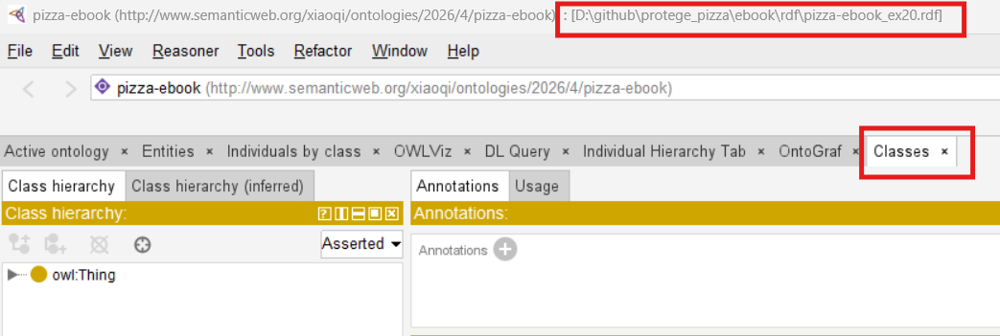

**Step 2: Create the new class**

1. Select `Pizza` in the class hierarchy
   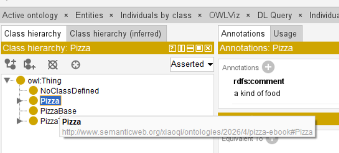
2. Click the "Add subclass` icon (or right-click and select "Add subclass")
   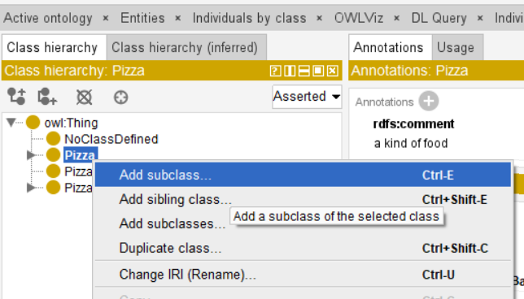
3. Name the class `CheesyPizza`
   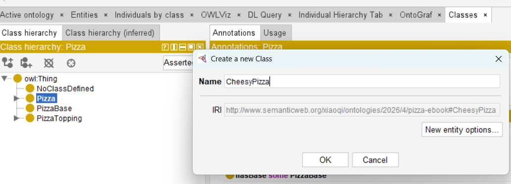
4. Click `OK`
   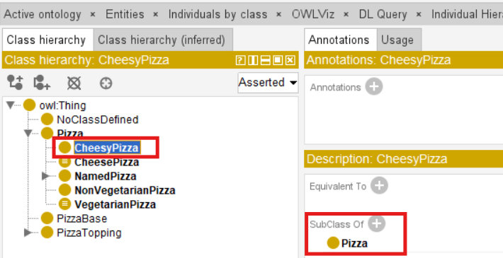

> Note: after this step, `CheesyPizza` is already `SubClass Of` the `Pizza` class.

**Step 3: Add the `SubClassOf` axioms**

1. Select `CheesyPizza` in the class hierarchy
2. In the Description View, locate the **`SubClassOf`** section
   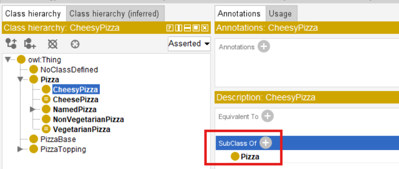
3. Click the Add icon (+)
   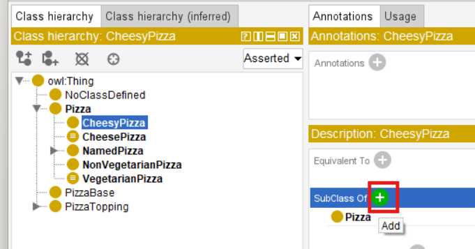
4. In the Class Expression Editor, enter `hasTopping some CheeseTopping`
   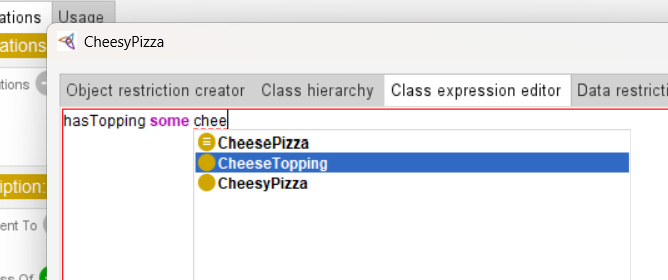
5. Click OK
   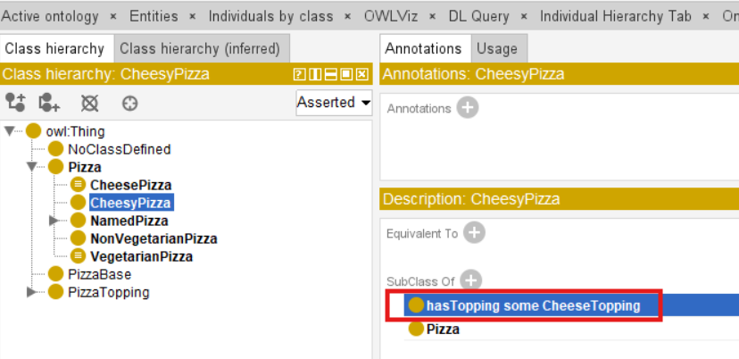

After completing these steps, `CheesyPizza` should have the following description:

```
CheesyPizza
    SubClassOf: Pizza
    SubClassOf: hasTopping some CheeseTopping
```

**Step 4: Synchronize the reasoner**

1. Select [Reasoner] > [Start reasoner] (or `Ctrl+R` if the reasoner is already running)
   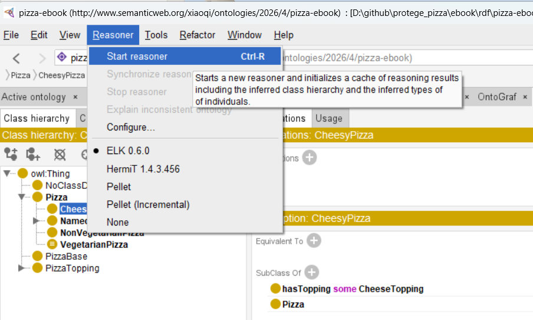
2. Observe the result
   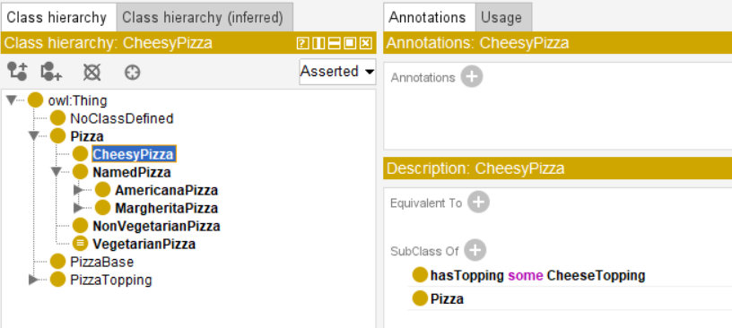

### 23.5.3 The Result: What the Reasoner Does Not Do

When the reasoner is synchronized, something important - or rather, something important does ***NOT*** happen.

**What to observe:**

- `CheesyPizza` appears in the asserted hierarchy as a subclass of `Pizza`
- The inferred hierarchy is **identical** to the asserted hierarchy
- The reasoner does **NOT** auto-classify `MargheritaPizza` or other pizzas as subclasses of `CheesyPizza` -- even though they all have cheese toppings.

This is the critical observation. The reasoner has all the information it needs to conclude that `MargheritaPizza` is a `CheesyPizza` (because Margherita has mozzarella, which is a cheese topping).

But it does not make that inference!

WHY?

Because `CheesyPizza` is defined only with **necessary conditions**. The ontology says: "If something is a `CheesyPizza`, then it must be a `Pizza` that has cheese." It does *not* say: "If something is a `Pizza` that has cheese, then it is a `CheesyPizza`.


---

Last updated at 2026-09-11