<!-- SPDX-License-Identifier: CC-BY-NC-SA-4.0 -->
# Chapter 23 - Semantic Reasoning: Stage 6 of the Semantic Knowledge Development Lifecycle

**Deriving New Knowledge Through Automated Inference**

The first five stages of the Semantic Knowledge Development Lifecycle (SKDL) transformed an abstract conceptual vocabulary into a **governed**, **reusable**, **validated** knowledge asset.

- Conceptual Modeling gave us structure.
- Semantic Description gave us meaning.
- Knowledge Reuse gave us composability.
- Semantic Governance gave us discipline.
- Semantic Validation gave us trust.

Now, as knowledge begins to flow from ontology models into production systems, a new challenge emerges:

> **"What new knowledge can we derive from what we already know?"**

Semantic Reasoning answers this question.

It is the discipline of deriving new, logical entailed knowledge from an existing ontology through automated inference.

>It transforms a static knowledge base into a dynamic, intelligent system capable of discovering relationships, classifications, and consequences that were never explicitly asserted.

Reasoning is the engine of intelligence in an ontology.

This chapter examines **Exercise 20** and **Exercise 21** from Michael DeBellis' *Protégé 5 New OWL Pizza Tutorial* through the lens of semantic reasoning. While **Exercise 18** introduced governance mechanisms (disjointness axioms), and **Exercise 19** introduced validation (the Probe Class patter), **Exercise 20** and **Exercise 21** introduce the core distinction that makes reasoning possible:

- **Primitive Classes** (defined with `SubClassOf`) express only necessary conditions. They describe what something *must* be, but they do not enable auto-classification.
- **Defined Classes** (defined with `EquivalentTo`) express both necessary and sufficient conditions. They describe what something *is*, and they also enable the reasoner to classify individuals and classes automatically.

This distinction is the **gateway to automated reasoning**. Once a class is defined with sufficient conditions, the reasoner can recognize instances of that class without being told.

Along the way, we will examine reasoning from multiple complementary perspectives: mathematical, historical, engineering, architectural, and industrial -- revealing that

> **automated reasoning is not a modern invention, but the culmination of more than two thousand years of logical thought.**

---

Table of Content
- [23.1 Chapter Introduction -- From Verification to Discovery](#231-chapter-introduction----from-verification-to-discovery)
  - [23.1.1 The Journey So Far](#2311-the-journey-so-far)
  - [23.1.2 The New Question](#2312-the-new-question)
  - [23.1.3 The Central Insight](#2313-the-central-insight)
- [23.2 Learning Objectives](#232-learning-objectives)
- [23.3 Positioning Within SKDL - Stage 6 Highlighted](#233-positioning-within-skdl---stage-6-highlighted)
- [23.4 What Is Semantic Reasoning?](#234-what-is-semantic-reasoning)
  - [23.4.1 A Working Definition](#2341-a-working-definition)
  - [23.4.2 Asserted Knowledge vs. Inferred Knowledge](#2342-asserted-knowledge-vs-inferred-knowledge)
  - [23.4.3 Reasoning vs. Querying vs. Validation](#2343-reasoning-vs-querying-vs-validation)
- [23.5 Exercise 20 -- Primitive Classes and the Limits of Inference](#235-exercise-20----primitive-classes-and-the-limits-of-inference)
  - [23.5.1 The Engineering Objective](#2351-the-engineering-objective)
  - [23.5.2 Implementation: Creating the Primitive Class](#2352-implementation-creating-the-primitive-class)
  - [23.5.3 The Result: What the Reasoner Does Not Do](#2353-the-result-what-the-reasoner-does-not-do)
  - [23.5.4 Why Primitive Classes DO Not Enable Auto-Classification](#2354-why-primitive-classes-do-not-enable-auto-classification)
  - [23.5.5 The Engineering Value of Primitive Classes](#2355-the-engineering-value-of-primitive-classes)
  - [23.5.6 Engineering Perspective: Exercise 20 as a Case Study](#2356-engineering-perspective-exercise-20-as-a-case-study)
- [23.6 Exercise 21 -- Defined Classes and the Power of Auto-Classification](#236-exercise-21----defined-classes-and-the-power-of-auto-classification)
  - [23.6.1 The Engineering Objective](#2361-the-engineering-objective)
  - [23.6.2 Implementation: Converting to a Defined Class](#2362-implementation-converting-to-a-defined-class)
  - [23.6.3 Why Defined Classes Enable Auto-Classification](#2363-why-defined-classes-enable-auto-classification)
  - [23.6.4 The Moment of Auto-Classification](#2364-the-moment-of-auto-classification)
  - [23.6.5 Primitive vs. Defined Classes: A Summary](#2365-primitive-vs-defined-classes-a-summary)
  - [23.6.6 Engineering Perspective: Exercise 21 as a Case Study](#2366-engineering-perspective-exercise-21-as-a-case-study)
- [23.7 The Reasoner Landscape -- From Protégé to Production](#237-the-reasoner-landscape----from-protégé-to-production)
  - [23.7.1 Why Reasoners Matter Beyond Protégé](#2371-why-reasoners-matter-beyond-protégé)
  - [23.7.2 The Major RDF/OWL Reasoners](#2372-the-major-rdfowl-reasoners)
  - [23.7.3 Reasoner Selection Criteria](#2373-reasoner-selection-criteria)
  - [23.7.4 The Protégé Reasoner Plugin Architecture](#2374-the-protégé-reasoner-plugin-architecture)
  - [23.7.5 Hands-On Comparison: Running the Same Ontology Through Multiple Reasoners](#2375-hands-on-comparison-running-the-same-ontology-through-multiple-reasoners)
  - [23.7.6 When to Use Which Reasoner](#2376-when-to-use-which-reasoner)
  - [23.7.7 The Engineering Takeaway](#2377-the-engineering-takeaway)
- [23.8 The Mathematical Foundations of Inference](#238-the-mathematical-foundations-of-inference)
  - [23.8.1 Model-Theoretic Semantics: Interpretations and Models](#2381-model-theoretic-semantics-interpretations-and-models)
  - [23.8.2 Subsumption: The Core Operation of Classification](#2382-subsumption-the-core-operation-of-classification)
  - [23.8.3 Entailment: The Logical Consequence Relation](#2383-entailment-the-logical-consequence-relation)
  - [23.8.4 Subsumption Testing via Unsatisfiability](#2384-subsumption-testing-via-unsatisfiability)
  - [23.8.5 The Tableau Algorithm: A Decision Procedure for Description Logic](#2385-the-tableau-algorithm-a-decision-procedure-for-description-logic)
  - [23.8.6 Decidability: The Guarantee of Termination](#2386-decidability-the-guarantee-of-termination)
  - [23.8.7 Computational Complexity: The Cost of Reasoning](#2387-computational-complexity-the-cost-of-reasoning)
  - [23.8.8 From Mathematics to Engineering](#2388-from-mathematics-to-engineering)
- [23.9 From Aristotle to Modern Reasoners -- A Historical Perspective](#239-from-aristotle-to-modern-reasoners----a-historical-perspective)
  - [23.9.1 Aristotle's Syllogism: The First Reasoning Engine](#2391-aristotles-syllogism-the-first-reasoning-engine)
  - [23.9.2 Leibniz's Calculus Ratiocinator: The Dream of Mechanical Reasoning](#2392-leibnizs-calculus-ratiocinator-the-dream-of-mechanical-reasoning)
  - [23.9.3 Frege's Predicate Logic: Making Reasoning Formal](#2393-freges-predicate-logic-making-reasoning-formal)
  - [23.9.4 Description Logic: Making Logic Computable](#2394-description-logic-making-logic-computable)
  - [23.9.5 The Modern Reasoner: From Theory to Tool](#2395-the-modern-reasoner-from-theory-to-tool)
- [23.10 Reasoning in Industrial Contexts](#2310-reasoning-in-industrial-contexts)
  - [23.10.1 Why Reasoning Matters in Industry](#23101-why-reasoning-matters-in-industry)
  - [23.10.2 Logical Reasoning for Complex Systems](#23102-logical-reasoning-for-complex-systems)
  - [23.10.3 Problem-Solving Through Reasoning](#23103-problem-solving-through-reasoning)
  - [23.10.4 Automated Reasoning for Error Detection and Risk Management](#23104-automated-reasoning-for-error-detection-and-risk-management)
  - [23.10.5 Safety and Compliance Through Reasoning](#23105-safety-and-compliance-through-reasoning)
  - [23.10.6 Reasoning as a Strategic Capability](#23106-reasoning-as-a-strategic-capability)
- [References](#references)

## 23.1 Chapter Introduction -- From Verification to Discovery

### 23.1.1 The Journey So Far

The first five stages of the Semantic Knowledge Development Lifecycle (SKDL) established the foundations of ontology engineering.

**Stage 1 -- Conceptual Modeling** identified the concepts that define a knowledge domain and organized them into a coherent semantic taxonomy.

**Stage 2 -- Semantic Description** enriched those concepts with formal meaning using Description Logic, OWL restrictions, and class expressions.

**Stage 3 -- Knowledge Reuse** transformed validated semantic knowledge into reusable assets that could be shared, extended, and specialized systematically.

**Stage 4 -- Semantic Governance** established the policies, standards, and processes required to maintain semantic integrity across an evolving knowledge ecosystem.

**Stage 5 -- Semantic Validation** verified that the ontology is logically consistent, semantically complete, and fit for purpose before deployment.

By the end of Stage 5, the `Pizza` ontology had been validated. It was consistent, satisfiable, and free of contradictions. The governance rules had been enforced. The probe class had been created, used, and removed.

The ontology was correct.

But correctness is not the same as intelligence.

A correct ontology that cannot derive new knowledge is like a well-organized library where no noe can find a needed book. It contains knowledge, but it does not *use* knowledge. It is passive, not active.

This is where **Stage 6 -- Semantic Reasoning** enters the lifecycle.

### 23.1.2 The New Question

Validation asked: **"Is this model broken?**

Reasoning asks: **"What else can this model tell us?"**

The distinction is fundamental.

Validation ensures that the ontology is logically sound. Reasoning derives new knowledge from that sound foundation.

Without validation, reasoning produces unsound inferences.

Without reasoning, validation produces a correct but static model.

Together, they produce trustworthy intelligence.

### 23.1.3 The Central Insight

The central insight of this chapter is deceptively simple:

> **Reasoning does not generate new facts -- it makes explicit what was already implicit in the axioms.**

The reasoner does not invent knowledge. It discovers the logical consequences of the axioms the engineer has written. Every inferred statement was already entailed by the ontology. The reasoner simply makes the entailment explicit.

This is the power of formal semantic:

> from a seed of **asserted knowledge**, the reasoner grows a tree of **inferred knowledge**.

## 23.2 Learning Objectives

After completing this chapter, you should be able to achieve the following learning outcomes:

**Knowledge:**

- Explain why Semantic Reasoning is the sixty stage of the Semantic Knowledge Development Lifecycle (SKDL)
- Distinguish between **primitive classes** (`SubClassOf` only) and **defined classes** (`EquivalentTo`)
- Understand the difference between **asserted knowledge** and **inferred knowledge**
- Explain how a reasoner derives new subclass relationships automatically
- Identify major RDF reasoners beyond Protégé and explain their differences
- Understand how reasoning applies in industrial contexts (problem-solving, decision-making, safety, compliance)
- Explain the mathematical foundations of reasoning: subsumption, entailment, tableau algorithm, decidability

**Practical Skills:**

- Create a primitive class (`CheesyPizza`) using `SubClassOf` only
- Convert a primitive class to a defined class using `Edit > Convert to defined class`
- Observe the reasoner automatically classifying individuals and classes
- Use Protégé's explanation feature to understand why an inference was made
- Compare reasoning results across different reasoners (Pellet, HermiT, ELK, JFact)
- Select the appropriate reasoner for a given task

**Engineering Perspective:**

- Understand reasoning as "automated knowledge discovery"
- Explain why defined classes enable automation while primitive classes do not
- Map reasoning activities to the EKA $R$ layer
- Apply reasoning to industrial problem-solving, safety, and compliance scenarios

**Mathematical Perspective:**

- Understand model-theoretic semantics: interpretations, models, entailment
- Explain subsumption as set inclusion and logical consequence
- Understand the tableau algorithm as a decision procedure
- Explain decidability and computational complexity
- Connect reasoning to Description Logic semantics

**Historical Perspective:**

- Trace the reasoning tradition from Aristotle's syllogism to modern automated reasoning
- Connect modern OWL reasoners to th 2,000-year quest for automated inference

## 23.3 Positioning Within SKDL - Stage 6 Highlighted

As introduced in **Chapter (17)**, ontology engineering progresses through seven stages of the Semantic Knowledge Development Lifecycle (SKDL), each stage contributing a distinct engineering objective toward the construction of executable semantic knowledge systems.

Having completed **Stage 5 -- Semantic Validation** in the previous chapter, this chapter advances to **Stage 6 -- Semantic Reasoning**.

The objective of this stage is to derive new knowledge through automated inference.

At the completion of **Stage 5**, the `Pizza` ontology contained a validated knowledge graph, governance policies, and a verified semantic model. However, the ontology had not yet been used to derive new knowledge. The reasoner had been used to **check consistency**, but not to **compute classifications**.

**Stage 6** addresses this gap by introducing:

- **Automated Classification** -- computing all inferred subclass relationships
- **Defined Classes** -- classes with necessary and sufficient conditions that enable auto-classification
- **Inferred KNowledge** -- knowledge derived by the reasoner from the asserted axioms
- **Reasoner Selection** -- choosing the appropriate reasoner for the tasks
- **Reasoning in Production** -- deploying reasoners in enterprise knowledge systems

Rather than introducing new constructs, this stage establishes the engineering discipline required to derive new knowledge from a validated ontology.

The primary deliverable from **Stage 6** is therefore:

> **not a new logical axiom, but an intelligent ontology -- one whose inferred knowledge has been computed and made available for querying, governance, and execution.**

Within the EKA framework, **Stage 6** establishes the **$R$ -- Reasoning & Rules** layer by providing the inference engine that derives new knowledge from the validated knowledge graph.

The progression across the first six stages can now be seen in full:

| SKDL Stage | Primary Outcome | EKA Contribution |
| --- | --- | --- |
| Stage 1 -- Conceptual Modeling | Identify concepts and organize them into a coherent semantic taxonomy | $K$ -- Knowledge Graph (Structure) |
| Stage 2 -- Semantic Description | Enrich concepts with formal semantic meaning through Description Logic and OWL restrictions | $K$ (Meaning) + $R$ (Readiness) |
| Stage 3 -- Knowledge Reuse | Transform validated semantic knowledge into reusable assets | $K$ (Composable) + $\Gamma$ (Prepared) |
| Stage 4 -- Semantic Governance | Maintain semantic integrity through policies, standards, and lifecycle management | $\Gamma$ -- Governance |
| Stage 5 -- Semantic Validation | Verify correctness before deployment through consistency checking and constraint validation | $\Gamma + K$ -- Validation |
| Stage 6 -- Semantic Reasoning | Derive new knowledge through automated inference | $R$ -- Reasoning & Rules |

Each stage has built upon the previous one.

- Stage 1 gave us concepts.
- Stage 2 gave us meaning.
- Stage 3 gave us reusability.
- Stage 4 gave us governance.
- Stage 5 gave us trust.

Stage 6 now gives us intelligence.

## 23.4 What Is Semantic Reasoning?

### 23.4.1 A Working Definition

**Semantic Reasoning** is the process of deriving new, logically entailed knowledge from an existing ontology through automated inference.

It answers the question:

> ***"What else can this model tell us?"***

Not "is it syntactically well-formed?" (Protégé will let you save almost anything).

Not "is it consistent?" (validation already answered that).

But "what new knowledge can be derived from what we already know?"

This is fundamentally a **knowledge discovery** activity. It is the moment when the ontology becomes intelligent -- when it can derive conclusions that the engineer never explicitly wrote.

**Key characteristics of semantic reasoning** include:

- **Reasoning derives, not invents.** -- Every inferred statement was already entailed by the asserted axioms.
- **Reasoning is deterministic.** -- Given the same ontology, the reasoner always produces the same inferences. It does not guess. It does not hallucinate.
- **Reasoning is decidable.** -- In OWL DL, reasoning is guaranteed to terminate with a definitive answer.
- **Reasoning is explainable.** -- The reasoner can justify every inference it makes.

**Key Insight**:

> "The reasoner is not a fortune teller. It is a logical engine. It computes the consequences of your axioms -- no more, no less.
> - If the axioms are correct, the inferences are correct.
> - If the axioms are flawed, the reasoner reveals the flaw.

### 23.4.2 Asserted Knowledge vs. Inferred Knowledge

The distinction between asserted and inferred knowledge is fundamental to understanding reasoning.

| Type | Definition | Example |
| --- | --- | --- |
| **Asserted Knowledge** | Statements explicitly written in the ontology by the engineer | `MargheritaPizza SubClassOf NamedPizza` |
| **Inferred Knowledge** | Statements derived by the reasoner fro the asserted axioms | `MargheritaPizza SubClassOf Pizza` (derived via transitivity) |

When the engineer writes `MargheritaPizza SubClassOf NamedPizza` and `NamedPizza SubClassOf Pizza`, the reasoner can infer `MargheritaPizza SubClassOf Pizza` -- even though the engineer never wrote that statement explicitly.

The inferred statement is not new knowledge in the sense of being invented. It was always entailed by the asserted axioms. The reasoner simply made the entailment explicit.

**Key Insight:**

> "The ontology engineer writes a small number of axioms. The reasoner discovers the logical consequences of those axioms. This is the power of formal semantics: **from a seed of asserted knowledge, the reasoner grows a tree of inferred knowledge**.

### 23.4.3 Reasoning vs. Querying vs. Validation

It is important to distinguish reasoning from querying and validation:

| Activity | Question | Timing | Tool |
| --- | --- | --- | --- |
| **Validation** | "Is this model correct?" | Before reasoning | Reasoner (consistency check) |
| **Reasoning** | "What else can this model tell us?" | After validation, before execution | Reasoner (classification) |
| **Querying** | "What does the model say about X?" | After reasoning | SPARQL / DL Query |

- **Validation** ensures that the ontology is logically sound. It answers the question: "Is this model broken?"
- **Reasoning** derives new knowledge from the validated ontology. It answers the question: " What else can this model tell us?"
- **Querying** retrieves knowledge from the ontology. It answers the question: "What does the model say about X?"

The key distinction between reasoning and querying is this: **querying retrieves asserted facts; reasoning derives new facts**.

A query over an unclassified ontology returns only what was explicitly written.

A query over a classified ontology returns both asserted and inferred knowledge.

**Key Insight:**

> "Reasoning is not querying. Querying retrieves. Reasoning derives.
> - A query over an unclassified ontology is like searching a library where only the books you already know about are listed.
> - A query over a classified ontology is like searching a catalog that has been enriched with connections you never knew existed."

## 23.5 Exercise 20 -- Primitive Classes and the Limits of Inference

Having established the principles of semantic reasoning, we now turn to its practical implementation through **Exercise 20** in Michael DeBellis' *Protégé 5 New OWL Pizza Tutorial*.

This exercise represents the first hands-on activity of **Stage 6 -- Semantic Reasoning** within the Semantic Knowledge Development Lifecycle (SKDL).

Unlike previous exercises, which introduced individual OWL constructs or governance mechanisms, **Exercise 20** focuses on the distinction that makes reasoning possible:

> the difference between primitive and defined classes.

### 23.5.1 The Engineering Objective

**Exercise 20** asks us to create a class called `CheesyPizza` defined using only `SubClassOf`.

The definition is simple: a `CheesyPizza` is a `Pizza` that has cheese as a topping. In OWL Manchester Syntax:

```text
Class: CheesyPizza
    SubClassOf: Pizza
    SubClassOf: hasTopping some CheeseTopping
```

At first glance, this appears to ba a complete definition. But **it is not**. This definition creates a **primitive class** -- a class defined only by necessary conditions.

The engineering objective of **Exercise 20** is not to create a fully defined class, but to demonstrate the limits of primitive classes. The exercise deliberately creates a class that the reasoner **cannot** use for auto-classification. This prepare the ground for **Exercise 21**, where the class is converted to a **defined class** and the reasoner can suddenly do something it could not do before.

**Key Insight:**

> "**Exercise 20** is a lesson in what the reasoner cannot do. It is only by understanding the limits of primitive classes that we can appreciate the power of defined classes."

### 23.5.2 Implementation: Creating the Primitive Class

Let's walk through the implementation step by step.

> Note: you may find the RDF file `pizza-ebook_ex20.rdf` in `ebook\rdf` folder for reference.

**Step 1: Navigate to the `Classes` tab in Protégé**

Open the `Pizza` ontology in Protégé. Navigate to the `Classes` tab.


**Step 2: Create the new class**

1. Select `Pizza` in the class hierarchy
   
2. Click the "Add subclass` icon (or right-click and select "Add subclass")
   
3. Name the class `CheesyPizza`
   
4. Click `OK`
   

> Note: after this step, `CheesyPizza` is already `SubClass Of` the `Pizza` class.

**Step 3: Add the `SubClassOf` axioms**

1. Select `CheesyPizza` in the class hierarchy
2. In the Description View, locate the **`SubClassOf`** section
   
3. Click the Add icon (+)
   
4. In the Class Expression Editor, enter `hasTopping some CheeseTopping`
   
5. Click OK
   

After completing these steps, `CheesyPizza` should have the following description:

```
CheesyPizza
    SubClassOf: Pizza
    SubClassOf: hasTopping some CheeseTopping
```

**Step 4: Synchronize the reasoner**

1. Select [Reasoner] > [Start reasoner] (or `Ctrl+R` if the reasoner is already running)
   
2. Observe the result
   

### 23.5.3 The Result: What the Reasoner Does Not Do

When the reasoner is synchronized, something important - or rather, something important does ***NOT*** happen.

**What to observe:**

- `CheesyPizza` appears in the asserted hierarchy as a subclass of `Pizza`
- The inferred hierarchy is **identical** to the asserted hierarchy
- The reasoner does **NOT** auto-classify `MargheritaPizza` or other pizzas as subclasses of `CheesyPizza` -- even though they all have cheese toppings.

This is the critical observation. The reasoner has all the information it needs to conclude that `MargheritaPizza` is a `CheesyPizza` (because Margherita has mozzarella, which is a cheese topping).

But it does not make that inference!

WHY?

Because `CheesyPizza` is defined only with **necessary conditions**. The ontology says: "If something is a `CheesyPizza`, then it must be a `Pizza` that has cheese." It does *not* say: "If something is a `Pizza` that has cheese, then it is a `CheesyPizza`.

The reasoner cannot conclude that `MargheritaPizza` is a `CheesyPizza` because the ontology has not stated what is *sufficient* to qualify.

**Key Insight:**

> "A primitive class is like a club with no membership criteria. You can say 'all members must wear a hot,' but you haven't said that wearing a hat makes you a member. The reasoner cannot conclude that any particular pizza is a `CheesyPizza`, because the ontology has not stated what is sufficient to qualify."

### 23.5.4 Why Primitive Classes DO Not Enable Auto-Classification

To understand why primitive classes do not enable auto-classification, we need to examine the semantics of `SubClassOf`.

In OWL, `SubClassOf` expresses a **necessary condition**:

```text
CheesyPizza SubClassOf hasTopping some CheeseTopping
```

This means: "Every instance of `CheesePizza` must have at least one cheese topping."

But it does NOT mean: "Every pizza with at least one cheese topping is a `CheesyPizza`.

The distinction is **subtle** but **fundamental**.

It is the difference between:

- **Necessary condition**: "If A, then B" (A implies B)
- **Sufficient condition**: "If B, then A" (B implies A)

`SubClassOf` expresses only the necessary condition. It tells the reasoner: "If you find a `CheesyPizza`, check that it has cheese." It does not tell the reasoner: "If you find a pizza with cheese, call is a `CheesyPizza`."

Mathematically, the axiom is:

$$\mathsf{CheesyPizza} \sqsubseteq \mathsf{Pizza} \ \sqcap \ \exists \mathsf{hasTopping.CheeseTopping} $$

This says: "Every `CheesyPizza` is a subset of the set of `Pizzas` that have at least one cheese topping."

But it does NOT say the reverse.

A pizza with cheese is not necessary a `CheesyPizza` -- it might be a `MargheritaPizza` that also happens to be a `CheesyPizza`, or it might be something else entirely.

**Key Insight:**

> "The primitive class tells the reasoner: 'If you find a `CheesyPizza`, check that it has cheese.' It does not tell the reasoner: 'If you find a pizza with cheese, call it a `CheesyPizza`.' The distinction is subtle but fundamental.

### 23.5.5 The Engineering Value of Primitive Classes

Primitive classes are not a mistake. They are an essential tool in the ontology engineer's toolkit.

**Why primitive classes matter:**

1. **Incremental modeling**: Primitive classes allow the engineer to say "this concept exists" without committing to a complete definition. This is essential during early modeling, when the domain is still being understood.
2. **Open World Assumption (OWA)**: Primitive classes support the Open World Assumption. They allow knowledge to grow incrementally without requiring the engineer to specify everything at once.
3. **Conceptual scaffolding**: Primitive classes provide the structural framework of the ontology. They define the hierarchy and the relationships between concepts, even before the concepts are fully defined.
4. **Flexibility**: Primitive classes can be refined over time.As the domain understanding matures, the engineer can add restrictions and, eventually, convert the class to a defined class.

**Key Insight:**

> "Primitive classes are the scaffolding of ontology development. They hold the structure in place while the engineer figures out the details. But scaffolding is not the building. To enable automation, we need defined classes."

### 23.5.6 Engineering Perspective: Exercise 20 as a Case Study

From the perspective of Protégé, **Exercise 20** involves creating a class and adding two restrictions. It appears to be a simple modeling activity.

From the perspective of ontology engineering, however, something more significant has occurred. The exercise has demonstrated the limits of primitive classes. It has shown that the reasoner cannot auto-classify based on necessary conditions alone.

This is a crucial lesson!

Many beginners assume that if they define a class with the right restrictions, the reasoner will automatically classify individuals into that class. **Exercise 20** shows that this is not the case.

The reasoner is not a mind reader. It does not infer what the engineer *intended*. It infers only what the axioms *entail*. If the engineer wants auto-classification, they must provide sufficient conditions -- and that means using `EquivalentTo`, not `SubClassOf`.

**Key Insight:**

> "**Exercise 20** is a lesson in humility. It teaches us that the reasoner does exactly what we tell it to do -- no more, no less. If we want auto-classification, we must give the reasoner the tools to perform it."

## 23.6 Exercise 21 -- Defined Classes and the Power of Auto-Classification

Having established the limits of primitive classes, we now turn to **Exercise 21**, which introduces defined classes and demonstrates the power of auto-classification.

This exercise represent the **"aha moment"** of ontology engineering -- the moment when the ontology becomes intelligent.

In Github repository, you may find `pizza-ebook_ex21.rdf` within `ebook/rdf` folder.

### 23.6.1 The Engineering Objective

**Exercise 21** asks us to convert `CheesyPizza` from a primitive class to a **defined class**.

This is done using `Edit > Convert to defined class` (also can from right-click pop up menu or `Ctrl+D` directly) in Protégé.

The conversion changes the class from `SubClassOf` to `Equivalentto`, given `CheesyPizza` both necessary **AND** sufficient conditions.

After conversion, the definition of `CheesyPizza` becomes:

```text
Class: CheesyPizza
    EquivalentTo: Pizza and (hasTopping some CheeseTopping)
```

The engineering objective of **Exercise 21** is to demonstrate what happens when a class has sufficient conditions: the reasoner can now auto-classify individuals and classes into it.

**Key Insight:**

> "**Exercise 21** is the moment the ontology becomes intelligent. The reasoner can now recognize a `CheesyPizza` when it sees one. The engineer did not have a manually classify `MargheritaPizza`. The reasoner discovered it."

### 23.6.2 Implementation: Converting to a Defined Class

Let's walk through the conversion step by step.

**Step 1: Select `CheesyPizza`**

In the `Classes` tab, select `CheesyPizza`.

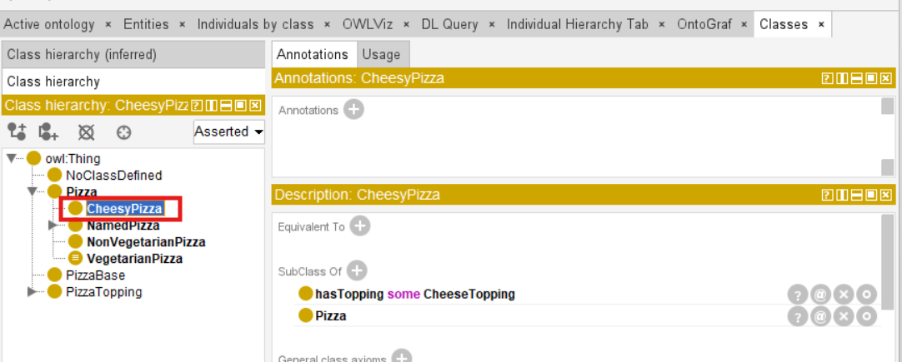

**Step 2: Convert to defined class**

Select `Edit > Convert to defined class`.

Observe what happens in the Description view. The `SubClassOf` axioms are replaced by an `EquivalentTo` axiom.

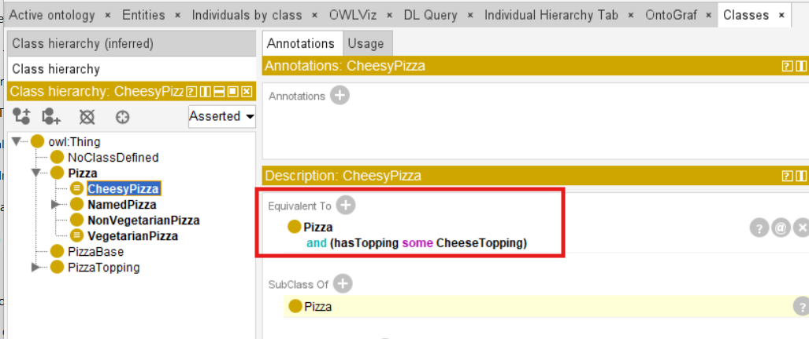

Before conversion:

```text
CheesyPizza
    SubClassOf: Pizza
    SubClassOf: hasTopping some CheeseTopping
```

After conversion:

```text
CheesyPizza
    SubClassOf: Pizza
    EquivalentTo: Pizza and (hasTopping some CheeseTopping)
```

**Step 3: Synchronize the reasoner**

Select `Reasoner > Synchronize reasoner` or (`Ctrl+R`).

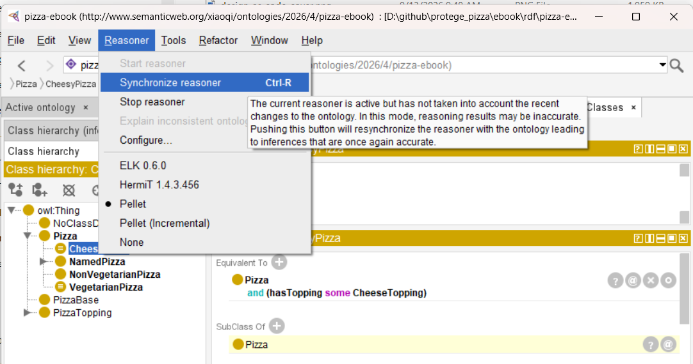

**Step 4: Observe the result**

This is the moment of truth. Teh reasoner now performs **classification** -- it computes all inferred subclass relationships.

What to observe (I'm putting **Exercise 20** and **Exercise 21** side-by-side):

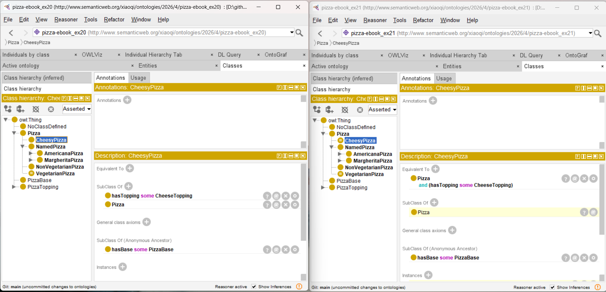

- The reasoner **automatically classifies** `MargheritaPizza` as a subclass of `CheesyPizza`
  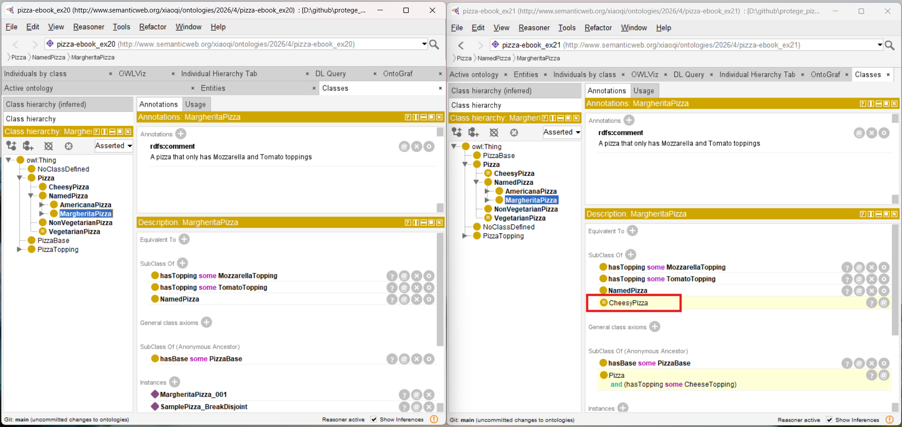
- Other pizzas with cheese toppings (e.g., `AmericanaPizza`) are also classified under `CheesyPizza`
  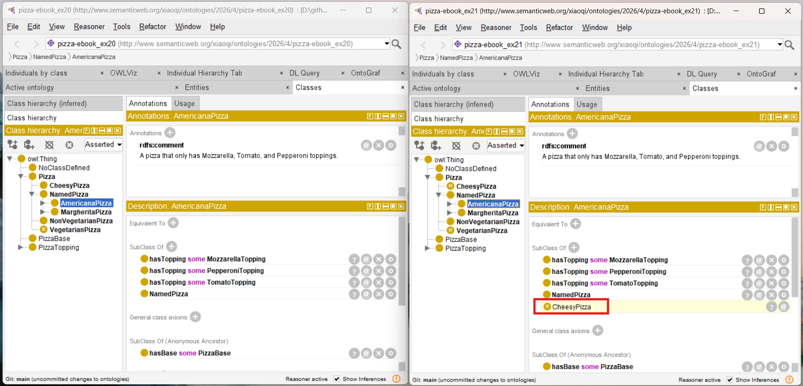
- The inferred hierarchy now **differs** from the asserted hierarchy
- New subclass relationships appear that were never explicitly asserted

The reasoner has done something remarkable: it has recognized that `MargheritaPizza` is a `CheesyPizza` -- without the engineer saying so.

**Key Insight:**

> "The moment `CheesyPizza` becomes a defined class, the reasoner can do something it could not do before: it can recognize a `CheesyPizza` when it sees one. The engineer did not have to manually assert that `MargheritaPizza` is a `CheesyPizza`. The reasoner discovered it."

### 23.6.3 Why Defined Classes Enable Auto-Classification

To understand why defined classes enable auto-classification, we need to examine the semantics of `EquivalentTo`.

In OWL, `EquivalentTo` expresses **necessary and sufficient conditions**:

```text
CheesyPizza EquivalentTo Pizza and (hasTopping some CheeseTopping)
```

This means: "Something is a `CheesyPizza` if and only if it is a `Pizza` that has at least one cheese topping."

The "**if and only if"** is the key.

It gives the reasoner a rule it can apply in both directions:

- If something is a `CheesyPizza`, then it is a `Pizza` with cheese (necessary condition)
- If something is a `Pizza` with cheese, then it is a `CheesyPizza` (sufficient condition)

The second direction is what enable **auto-classification**. The reasoner can now look at any pizza, check whether if satisfies the condition `Pizza and (hasTopping some CheeseTopping)`, and if it does, classify it as a `CheesyPizza`.

Mathematically, the axiom is:

$$\mathsf{CheesyPizza} \equiv \mathsf{Pizza} \ \sqcap \ \exists \mathsf{hasTopping.CheeseTopping}$$

The $\equiv$ (equivalence) symbol is the key. It means tht two sides of the equation are logically identical. Any individual that satisfies the right-hand side automatically satisfies the left-hand side, and vice versa.

**Key Insight:**

> "The defined class tells the reasoner: 'If you find a pizza with cheese, it is a `CheesyPizza`.' The reasoner now has a rule it can apply automatically. This is the difference between a passive taxonomy and an active classification engine."

### 23.6.4 The Moment of Auto-Classification

When the reasoner is synchronized after the conversion, it performs **classification**.

Classification is the process of computing all inferred subclass relationships. The reasoner examines every class in the ontology and determines where it belongs in the inferred hierarchy.

For `MargheritaPizza`, the reasoner performs the following reasoning:

1. `MargheritaPizza` is defined as a `Pizza` that has `MozzarellaTopping` and `TomatoTopping`
   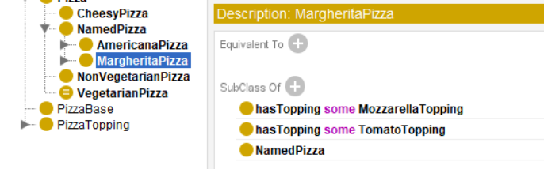
2. `MozzarellaTopping` is a subclass of `CheeseTopping`
   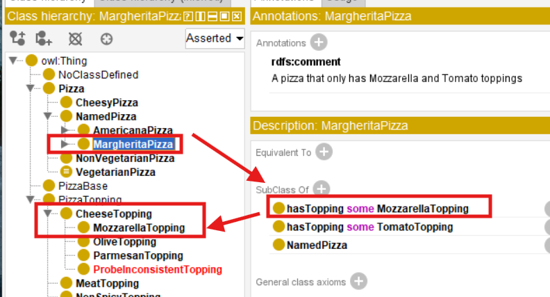
3. Therefore, `MargheritaPizza` has at least one `CheeseTopping`
4. `CheesyPizza` is defined as a `Pizza` that has at least one `CheeseTopping`
   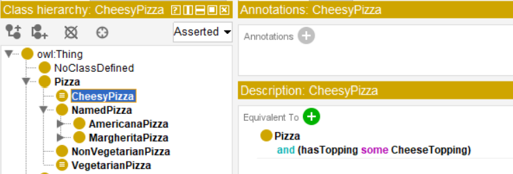
5. Therefore, `MargheritaPizza` satisfies the definition of `CheesyPizza`
6. Therefore, `MargheritaPizza` is a subclass of `CheesyPizza`
   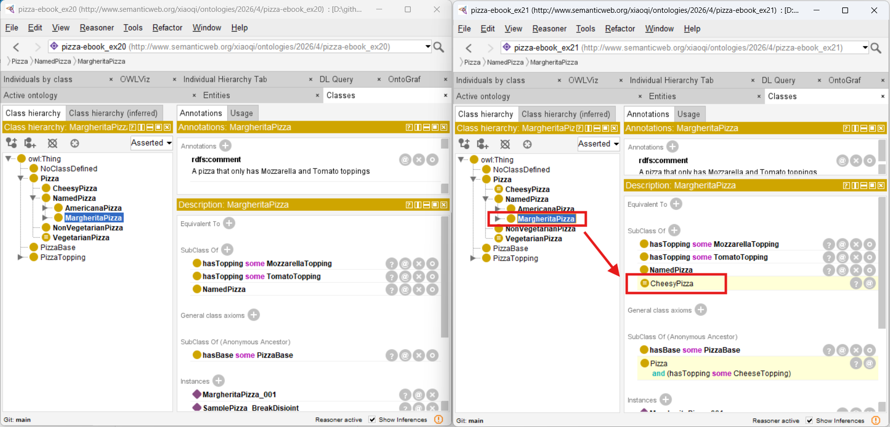

The reasoner has derived a new subclass relationship that was never explicitly asserted. This is the power of **reasoning**.

**Key Insight:**

> "The ontology engineer does not manually classify `MargheritaPizza` as a `CheesyPizza`. The reasoner does it. This is the power of reasoning: the ontology can grow -- not in size, but in intelligence -- without additional manual effort."

### 23.6.5 Primitive vs. Defined Classes: A Summary

The distinction between primitive and defined classes is one of the most important distinctions in ontology engineering. It is the difference between a static taxonomy and an intelligent classification engine.

| Dimension | Primitive Class | Defined Class |
| --- | --- | --- |
| **Axiom** | `SubClassOf` | `EquivalentTo` |
| **Condition** | Necessary only | Necessary and sufficient |
| **Reasoner behavior** | No auto-classification | Auto-classification |
| **Asserted vs. inferred** | Same | Might different |
| **Use case** | Early modeling, evolving concepts | Stable concepts, automation |

**When to use primitive classes:**
- During early modeling, when the domain knowledge is still being understood
- For concepts that are still evolving
- When the engineer wants to say "this concepts exists" without committing to a complete definition

**When to use defined classes:**
- When the concept has a clear, stable definition already
- When auto-classification is desired
- When the engineer is confident that the definition captures the intended meaning

**Key Insight:**

> "Primitive classes define what something must be. Defined classes define what something is. The first supports incremental modeling. The second enables automation."

### 23.6.6 Engineering Perspective: Exercise 21 as a Case Study

From the perspective of Protégé, **Exercise 21** involves a single menu command: `Edit > Convert to defined class`. It appears to be a **trivial operation**.

From the perspective of ontology engineering, however, something profound has occurred. The ontology has become intelligent. The reasoner can now derive new knowledge that the engineer never explicitly wrote.

This is the **"aha moment"** of ontology engineering. It is the moment when the engineer realizes that the ontology is not just a static representation of knowledge -- it is a dynamic system capable of discovery.

The engineering contribution of **Exercise 21** can be summarized as follows:

| Engineering Perspective | Contribution from **Exercise 21** |
| --- | --- |
| **SKDL Stage** | Stage 6 - Semantic Reasoning |
| **Primary Objective** | Demonstrate the power of defined classes for auto-classification |
| **Modeling Activity** | Convert `CheesyPizza` from a primitive class to a defined class |
| **Engineering Outcome** | Enable the reasoner to auto-classify `MargheritaPizza` and other cheese-topped pizzas as `CheesyPizza` |
| **Preparation for Later Chapters** | Establish the reasoning foundation required for triggers ($\Theta$) and execution ($\Phi$) |

**Key Insight:**

> "**Exercise 21** is a small operation with a large consequence. A single menu command transforms the ontology from a static taxonomy into an intelligent classification engine. This is the power of defined classes."

## 23.7 The Reasoner Landscape -- From Protégé to Production

Having explored the mechanics of reasoning through **Exercise 20** and **Exercise 21**, we now turn to the practical question:

> *"Which reasoner should we use?"*

Protégé is an ontology editor, not a reasoner. It provides a plugin architecture that allows different reasoners to be integrated. However, in production systems, reasoners run as **standalone engines** -- not inside Protégé.

Understanding the landscape of available reasoners is essential for enterprise deployment.

### 23.7.1 Why Reasoners Matter Beyond Protégé

Protégé is a powerful ontology editor, but it does not include a reasoner by default. Instead it provides a **plugin architecture** that allows different reasoners to be integrated. See below Protégé architecture illustration [^1]:

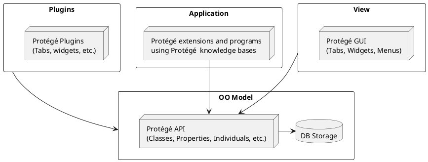

When you click `Start reasoner` in Protégé, you are invoking an external reasoning engine through the OWL API. The reasoner runs as a separate process (or thread), computes the inferences, and returns the results to Protégé for display.

This separation is important for several reasons:

1. **Flexibility**: Different reasoners can be plugged into Protégé without changing the ontology.
2. **Specialization**: Different reasoners are optimized for different tasks (e.g., HermiT for DL ontologies, ELK for EL ontologies).
3. **Production deployment**: In production systems, reasoners runs independently of Protégé, often as part of a larger knowledge graph infrastructure.

**Key Insight:**

> "Protégé is the workshop. The reasoner is the engine. You can sway engines without changing the workshop -- but different engines produce different results, at different speeds and characteristics, with different trade-offs."

### 23.7.2 The Major RDF/OWL Reasoners

The following table summarizes the major RDF/OWL reasoners available today.

| Reasoner | Developer | Language | OWL Profile |
| --- | --- | --- | --- |
| **Pellet** | Clark & Parsia (now Stardog) | Java | OWL 2 DL |
| **HermiT** | University of Oxford | Java | OWL 2 DL |
| **ELK** | University of Oxford | Java | OWL 2 EL |
| **JFact** | Teh OWL API community | Java | OWL 2 DL |
| **FaCT++** | University of Manchester | C++ | OWL 2 DL |
| **Konclude** | University of Ulm | C++ | OWL 2 DL |
| **Openllet** | Community fork of Pellet | Java | OWL 2 DL |
| **Jena** | Apache Software Foundation | Java | RDFS, OWL Lite, OWL DL (partial) |
| **DotNetRDF** | Community | .NET | RDFS, OWL (partial) |

### 23.7.3 Reasoner Selection Criteria

Choosing the right reasoner is an engineering decision.

The following criteria should be considered:

| Criterion | Consideration |
| --- | --- |
| **Expressivity** | Does the reasoner support the OWL profile your need? (DL, EL, Full) |
| **Completeness** | Does the reasoner guarantee complete inference? |
| **Explanation** | Does the reasoner support explanation of inference? |
| **Incremental Reasoning** | Can the reasoner update inferences without re-computing everything? |
| **Performance** | How large is your ontology? How complex are the axioms? |
| **Integration** | Does the reasoner integrate with your toolchain (Protégé, Jena, OWL API)? |
| **Licensing** | Is the reasoner open-source? Or commercial? |

### 23.7.4 The Protégé Reasoner Plugin Architecture

Refer to the diagram in previous [23.7.1](#2371-why-reasoners-matter-beyond-protégé), Protégé uses the **OWL API** to interface with reasoners.

Any reasoner that implements the OWL API reasoner interface can be plugged into Protégé.

To select a reasoner in Protégé:

1. Select `Reasoner` menu
2. Choose the reasoner from the list
   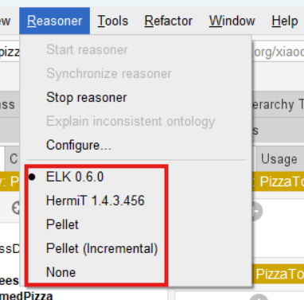
3. Select `Reasoner > Start reasoner` (or `Synchronize reasoner` if already running)

Protégé will use the selected reasoner for all subsequent reasoning tasks.

**Key Insight:**

> "Protégé does not have a reasoner. It has a reasoner interface (API). The reasoner is a separate engine that Protégé invokes. This separation is what allows the ontology engineering community to experiment with different reasoning strategies without changing the ontology."

### 23.7.5 Hands-On Comparison: Running the Same Ontology Through Multiple Reasoners

One of the most valuable exercises in ontology engineering is to run the same ontology through multiple reasoners and compare the results. This reveals the strengths and limitations of each reasoner.

**Steps:**

1. Open the `Pizza` ontology in Protégé (after **Exercise 21**)
2. Select `Reasoner > Configure...` (or from the list of menu)
3. Choose one reasoner (e.g., HermiT)
4. Synchronize and record the inferred hierarchy
5. Repeat with each reasoner (Pellet, ELK, JFact)
6. Compare the results

**Expected Results**:

| Comparison | Expected Outcome | Explanation |
| --- | --- | --- |
| **HermiT vs. Pellet** | Identical inferred hierarchies | Both support OWL 2 DL; complete reasoners should agree |
| **ELK vs. HermiT/Pellet** | ELK may produce incomplete inferences if ontology uses non-EL constructs | ELK supports only OWL 2 EL; ignores fails on DL constructs |
| **JFact vs. HermiT/Pellet** | Identical inferred hierarchies | JFact is a complete OWL 2 DL reasoner |

**Interpreting Differences:**

| Difference | Possible Cause | Action |
| --- | --- | --- |
| Missing inference in ELK | ELK does not support the required OWL construct | Use a DL reasoner (HermiT/Pellet) |
| Different explanation text | Reasoner-specific explanation algorithms | Compare explanations manually |
| Performance difference | Reasoner optimization differences | Choose the faster reasoner for the task |
| Inconsistent results | Likely a bug in one reasoner, or ontology inconsistency | Validate the ontology with multiple reasoners |

**Key Insight:**

> "Differences between reasoners are not failures. They are information. They tell you about the expressively of your ontology and the capabilities of your tools."

### 23.7.6 When to Use Which Reasoner

The following table provides guidance on reasoner selection for common scenarios.

| Scenario | Recommended Reasoner | Rationale |
| --- | --- | --- |
| **General OWL DL reasoning** | HermiT or Pellet | Complete, mature, good explanation support |
| **Large ontologies with EL profile** | ELK | Orders of magnitude faster than DL reasoners for EL |
| **Incremental reasoning** | Pellet | Supports incremental updates without full re-computation |
| **Explanation-heavy workflows** | HermiT or Pellet | Strong explanation features in Protégé |
| **High-performance production** | Konclude | Parallelized, optimized for large-scale reasoning |
| **RDF/SPARQL-centric workflows** | Jena | Integrated with Apache Jena ecosystem |
| **.NET ecosystem** | DotNetRDF | Native .NET integration |

**Key Insight:**

> "There is no single 'best' reasoner. The best reasoner depends on the ontology, the task, and the deployment environment. Understanding the trade-offs is part of professional ontology engineering."

### 23.7.7 The Engineering Takeaway

The reasoner landscape is diverse, and no single reasoner is best for all tasks.

The professional ontology engineer should:

- **Always test your ontology with more than one reasoner.** If reasoners disagree (with different results), investigate why.
- **Choose the reasoner that best fit your expressivity and performance requirements.**
- **Document which reasoner you used and why.** This is essential for reproducibility and governance.
- **Consider the production environment.** Protégé is a development tool, but production systems may use different reasoners.

**Key Insight:**

> "Reasoner independence is a quality check. If your ontology produces the same inferences under multiple reasoners, yo can be more confident in its correctness."

## 23.8 The Mathematical Foundations of Inference

Throughout this chapter, we have explored reasoning from a practical and engineering perspective. Now we turn to the mathematical foundations that make reasoning **precise**, **reliable**, and **trustworthy**.

Understanding these foundations is not required to use a reasoner effectively, but it provides valuable insight into why reasoning works and why it can be trusted.

### 23.8.1 Model-Theoretic Semantics: Interpretations and Models

The meaning of an OWL ontology is defined by model-theoretic semantics. This is the mathematical framework that gives OWL its precise meaning.

An interpretation $I = (\Delta^I, \cdot^I)$ consists of:

- A non-empty domain $\Delta^I$ of individuals
- An interpretation function $\cdot^I$ that maps:
  - Each class $\text{C}$ to a subset $\text{C}^I \subseteq \Delta^I$
  - Each property $\text{R}$ to a binary relation $\text{R}^I \subseteq \Delta^I \times \Delta^I$
  - Each individual $\text{a}$ to a element $\text{a}^I \in \Delta^I$

**Satisfaction**: An interpretation $I$ **satisfies** an axiom $\mathcal{a}$ if the axiom holds under $I$. We write $I \models \mathcal{a}$.

**Model**: An interpretation $I$ is a **model** of an ontology $\mathcal{O}$ if $I$ satisfies every axiom in $\mathcal{O}$. We write $I \models \mathcal{O}$.

**Consistency**: An ontology $\mathcal{O}$ is **consistent** if it has at least one model.

**Key Insight:**

> "The model-theoretic semantics gives OWL its precise meaning. Every axiom is a constraint on interpretations. The reasoner searches for interpretations that satisfy all constraints -- or proves that none exist."

### 23.8.2 Subsumption: The Core Operation of Classification

The core mathematical operation in reasoning is **subsumption**.

**Definition** Class $\text{C}$ is **subsumed by** class $\text{D}$ if, in every model $I$ of the ontology, $\text{C}^I \subseteq \text{D}^I$.

**Formal definition:**

$$\text{C} \sqsubseteq \text{D} \text{ iff for every interpretation I: 
} \text{C}^I \subseteq \text{D}^I$$

**Subsumption as set inclusion:** Subsumption is the semantic counterpart of subset inclusion. $\text{C} \sqsubseteq \text{D}$ means "every instance of $\text{C}$ is an instance of $\text{D}$.

**Subsumption vs. `SubClassOf`:**
- `SubClassOf` is the syntactic axiom: $\text{C SubClass D}$
- $\sqsubseteq$ is the semantic relation: $\text{C} \sqsubseteq \text{D}$
- The reasoner computes the semantic relation from the syntactic axioms

**Key Insight:**

> "Subsumption is the mathematical heart of classification. When the reasoner classifies an ontology, it is computing all valid subsumption relations. The inferred hierarchy is the set of all $\text{C} \sqsubseteq \text{D}$ relations that hold."

### 23.8.3 Entailment: The Logical Consequence Relation

**Definition:** An ontology $\mathcal{O}$ **entails** as statement $\phi$ (written $\mathcal{O} \models \phi$) if $\phi$ is true in every model of $\mathcal{O}$.

**Formal definition:**

$$\mathcal{O} \models \phi \text{ iff for every interpretation I: } \text{I} \models \mathcal{O} \text{, then } \text{I} \models \phi$$

**Logical closure:** The set of all statements entailed by $\mathcal{O}$ is called the **logical closure** of $\mathcal{O}$. Reasoning is the process of computing this closure.

**Monotonicity:** Description Logics are **monotonic:** adding new axioms to an ontology can never invalidate existing entailments. If $\mathcal{O}_1 \models \phi$, then $\mathcal{O}_1 \cup \mathcal{O}_2 \models \phi$.

**Key Insight:**

> "Entailments is the mathematical definition of 'what follows from the ontology.' The reasoner computes entailments. When it classifies `MargheritaPizza` as a subclass of `CheesyPizza`, it has discovered an entailment: the ontology entails $\text{MargheritaPizza} \subseteq \text{CheesyPizza}$, even though this was never explicitly asserted."

### 23.8.4 Subsumption Testing via Unsatisfiability

There is a key theorem that connects subsumption to unsatisfiability:

**Theorem:** $\text{C} \sqsubseteq \text{D}$ if and only if $\text{C} \sqcap \neg \text{D}$ is unsatisfiable.

**Proof sketch:**

- If $\text{C} \sqsubseteq \text{D}$, then no individual can be in $\text{C}$ but not in $\text{D}$. Therefore, $\text{C} \sqcap \neg \text{D}$ has no instances -- it is unsatisfiable.
- Conversely, if $\text{C} \sqcap \neg \text{D}$ is unsatisfiable, then every instance of $\text{C}$ must be an instance of $\text{D}$. Therefore, $\text{C} \sqsubseteq \text{D}$.

**Engineering consequence:** Classification reduces to consistency checking. To determine whether $\text{C} \sqsubseteq \text{D}$, the reasoner checks whether $\text{C} \sqcap \neg \text{D}$ is consistent. If it is inconsistent, then $\text{C} \sqsubseteq \text{D}$.

**Key Insight:**

> "This theorem is the bridge between consistency checking (**Stage 5**) and classification (**Stage 6**). Classification is not a separate algorithm -- it is consistency checking applied to subsumption queries."

### 23.8.5 The Tableau Algorithm: A Decision Procedure for Description Logic

The **tableau algorithm** is a decision procedure for consistency and subsumption in Description Logic. It is the algorithm used by most OWL DL reasoners.

**How it works:**

1. **Negation normal form**: Transform the ontology into negation normal form (NNF) [^2], where negation is applied only to atomic concepts.
2. **Completion graph**: Build a completion graph representing a potential model. Each node represents an individual; each edge represents a relationship.
3. **Expansion rules**: Apply expansion rules to decompose complex concepts:
   - **$\sqcap$-rule**: If $\text{C} \sqcap \text{D}$ is present, add both $\text{C}$ and $\text{D}$.
   - **$\sqcup$-rule**: If $\text{C} \sqcup \text{D}$ is present, create two branches: one with $\text{C}$, the other with $\text{D}$.
   - **$\exists$-rule**: If $\exists \text{R}.\text{C}$ is present, crete a new node $\text{x}$ with $\text{R}$-edge to it and add $\text{C}$ to $\text{x}$.
   - **$\forall$-rule**: If $\forall \text{R}.\text{C}$ is present and there is an $\text{R}$-edge to $\text{x}$, add $\text{C}$ to $\text{x}$.
4. **Clash detection**: If a node contains both $\text{C}$ and $\neg \text{C}$, a **clash** is detected. The branch is closed.
5. **Termination**: If all branches are closed, the ontology is inconsistent. If at least one branch remains open, the ontology is consistent.

**Example (Probe Class pattern):**

- To check whether `ProbeInconsistentTopping` is satisfiable, the tableau algorithm tries to construct a model.
- The model adds `CheeseTopping` and `Vegetabletopping` to the node (from the two `SubClassOf` axioms).
- It also adds $\neg \text{CheeseTopping} \sqcup \neg \text{VegetableTopping}$ (from the disjointness axiom).
- The $\sqcup$-rule creates two branches: one with $\neg \text{CheeseTopping}$, one with $\neg \text{VegetableTopping}$.
- Both branches contain a clash ($\text{CheeseTopping}$ and $\neg \text{CheeseTopping}$, or $\text{VegetableTopping}$ and $\neg \text{VegetableTopping}$).
- Both branches are closed. The class is unsatisfiable.

**Key Insight:**

> "The tableau algorithm is a systematic search for a model.
> - If it fines one, the ontology is consistent.
> - If it proves that no model exists, the ontology is inconsistent.
> 
> Classification is the same algorithm applied to subsumption queries.

### 23.8.6 Decidability: The Guarantee of Termination

**Definition:** A logic is **decidable** if every reasoning task is guaranteed to terminate with a definitive answer.

**Description Logic decidability**: OWL DL is based on Description Logic, which is decidable. Every consistency check, subsumption query, and classification task terminates.

**Why decidability matters:**

- Without decidability, a reasoner might run forever.
- Decidability guarantees that reasoning is a reliable engineering tool.
- It is the reason OWL DL is used in production systems.

**Comparison with first-order logic:** Unrestricted first-order logic is **undecidable**. Description Logic is a carefully designed decidable fragment of first-order logic.

**Key Insight:**

> "Decidability is the engineering guarantee that makes reasoning practical. It is why OWL chose Description Logic over unrestricted first-order logic. The expressivity is lower, but the reliability is higher."

### 23.8.7 Computational Complexity: The Cost of Reasoning

**Complexity of OWL DL reasoning:**

- Consistency checking in OWL DL is **NExpTime-complete** in the worst case.
- Subsumption and classification have the same complexity.
- In practice, optimized reasoners handle large ontologies efficiently.

**Complexity of OWL EL reasoning:**

- Consistency checking in OWL EL is **PTIME-complete**.
- This is why ELK is orders of magnitude faster than DL reasoners for EL ontologies.

**Practical implications:**

- The worst-case complexity is rarely encountered in practice.
- Reasoner optimization (e.g., modularization, incremental reasoning) mitigates the cost.
- Ontology design decisions (e.g., avoiding unnecessary disjunction) affect performance.

**Key Insight:**

> "The complexity of reasoning is the price of expressivity. OWL DL is more expressive than OWL EL, but also more expensive. Choosing the right OWL profile is one trade-off between expressivity and performance."

### 23.8.8 From Mathematics to Engineering

The mathematical foundations of reasoning have direct engineering consequences.

The following table summarizes the connections:

| Mathematical Concept | Engineering Consequences |
| --- | --- |
|**Model-theoretic semantics** | Every axiom constrains interpretations; the reasoner searches for models |
| **Subsumption** | Classification computes all $\text{C} \sqsubseteq \text{D}$ relations |
| **Entailment** | Reasoning computes the logical closure of the ontology |
| **Unsatisfiability testing** | Subsumption reduces to consistency checking |
| **Tableau algorithm** | A systematic search for models; terminates with a definitive answer |
| **Decidability** | Reasoning is a reliable engineering tool |
| **Complexity** | Expressivity vs. performance trade-off; OWL profile selection matters |

**Key Insight:**

> "The mathematics of reasoning is not abstract theory. It is the foundation of every engineering decision: which OWL profile to use, which reasoner to choose, and how to design axioms for performance. Understanding the math makes you a better engineer."

## 23.9 From Aristotle to Modern Reasoners -- A Historical Perspective

The mathematical foundations examined in the previous section reveal how reasoning works.

But a deeper question remains:

> ***"Why does the human mind seek to automate reasoning?"***

The answer is not merely practical convenience. It is rooted in a philosophical tradition that stretches back more than two millennia -- a tradition that ontology engineering now brings to its logical conclusion by making reasoning not only human-readable, but machine-executable.

This section traces that intellectual lineage. It is not a diversion into abstract philosophy, but a recognition that the reasoner you invoke in Protégé is the culmination of one of humanity's oldest intellectual quests.

### 23.9.1 Aristotle's Syllogism: The First Reasoning Engine

More than two thousand years before computers existed, Aristotle (384-322 BCE) established two foundations of **formal logic**.

His most influential contribution was the **syllogism** -- a three-part argument consisting of two premises and a conclusion:

- All men are mortal.
- Socrates is a man.
- Therefore, Socrates is mortal.

The syllogism was the first formal system of **deductive reasoning**.

> It showed that valid conclusions could be derived form premises by applying rules of logic, independent of the content of the premises.

The connection to ontology engineering is direct. When the reasoner infers that `MargheritaPizza` is a subclass of `CheesyPizza`, it is performed a syllogism:

1. All pizzas with cheese are `CheesyPizza`.
2. `MargheritaPizza` is a pizza with cheese.
3. Therefore, `MargheritaPizza` is a `CheesyPizza`.

The form of reasoning is the same as Aristotle's. Only the notation has changed.

**Key Insight:**

> "When the reasoner infers that `MargheritaPizza` is a subclass of `CheesyPizza`, it is performing a syllogism. The form of reasoning is the same as Aristotle's. Only the notation has changed."

### 23.9.2 Leibniz's Calculus Ratiocinator: The Dream of Mechanical Reasoning

The next major milestone in the history of reasoning came during the seventeenth century, through the work of Gottfried Wilhelm Leibniz (1646-1716).

Leibniz dreamed of a universal symbolic language -- the **Characteristica Universalis** -- in which all human knowledge could be expressed with mathematical precision. He also proposed a **Calculus Ratiocinator** -- a symbolic reasoning system through which disagreements could be resolved by calculation rather than debate.

Leibniz famously imagined two scholars ending an argument by saying:

> ***"Let us calculate."***

Although the mathematics and computing technology necessary to realize this vision did not yet exist, the philosophical objective was remarkably similar to that of modern ontology engineering.

Today, OWL ontologies assign every concept a globally unique IRI, express semantic meaning through formal logic, and allow reasoners to derive conclusions automatically. The vision is no longer philosophical speculation. It has become practical engineering.

**Key Insight:**

> "Leibniz imagined a machine that could reason. Three centuries later, that machine exists -- not as a physical device, but as a **software reasoner**."

### 23.9.3 Frege's Predicate Logic: Making Reasoning Formal

The next major milestone occurred during the nineteenth century through the work of Gottlob Frege (1848-1925).

Where Aristotle's logic primarily analyzed categorical statements, Frege introduced **predicate logic**, providing a far more expressive mathematical language for representing knowledge.

Most importantly, predicate logic introduced **quantifiers**, allowing logical statements to describe entire collections of objects rather than individual examples.

Two quantifiers became fundamental:

| Quantifier | Meaning | Manchester OWL Equivalent |
| :---: | --- | --- |
| **$\forall$** | For all | `only` |
| **$\exists$** | There exists | `some` |

The existential restriction introduced in **Chapter (19)** (`hasTopping some MozzarellaTopping`) has deep historical roots. It expresses the Description Logic statement $\exists \text{hasTopping.MozzarellaTopping}$, whose logical origin can be traced directly to Frege's formal treatment of existential quantification.

Similarly, universal restrictions such as `hasTopping only CheeseTopping` correspond to universal quantification.

Frege supplied the mathematical langauge that eventually enabled logic to become computational rather than merely philosophical.

**Key Insight:**

> "Frege gave us the language. Description Logic gave us the computable subset. The reasoner gives us the engine!"

### 23.9.4 Description Logic: Making Logic Computable

Although predicate logic is extremely expressive, unrestricted first-order logic is computationally difficult. Many reasoning tasks become **undecidable**, meaning that no algorithm can guarantee termination for every possible knowledge base.

During the late twentieth century, researchers in knowledge representation sought a practical compromise. The result was **Description Logic (DL)**.

Rather than attempting to represent every possible logical statement, Description Logic deliberately limits the available language to carefully designed constructors that preserve **decidability**.

This engineering decision allows automated reasoners to perform important tasks such as:

- Satisfiability testing
- Consistency checking
- Subsumption computation
- Equivalence detection
- Automatic classification

In other words, Description Logic sacrifices unrestricted expressive power in exchange for reliable computation.

This balance explains why OWL is based upon Description Logic rather than unrestricted predicate logic.

**Key Insight:**

> "Description Logic is the engineering compromise between expressivity and computability. It is expressive enough to model complex domains, but restricted enough to guarantee termination."

### 23.9.5 The Modern Reasoner: From Theory to Tool

The publication of OWL (Web Ontology Language) by the World Web Consortium (W3C) represents the modern culmination of this intellectual journey.

OWL did not invent conceptual classification, logical definition, or formal reasoning.

Instead, it integrated ideas developed over more than those two thousand years into a practical engineering language for machine-understandable and machine-executable knowledge.

Modern OWL reasoners -- Pellet, HermiT, ELK, FaCT++, Konclude, etc. -- implement the tableau algorithm and its variants. They are the practical realization of centuries of logical theory.

They run in milliseconds on ontologies that would take humans hours to analyze manually.

**Key Insight:**

> "The reasoner is hte culmination of 2,000 years of logical thought. When you click `Synchronize reasoner...`, you are participating in one of humanity's oldest intellectual traditions."

## 23.10 Reasoning in Industrial Contexts

Throughout this chapter, we have explored reasoning from a theoretical and engineering perspective. But reasoning is not confined to academic exercises or Protégé demonstrations.

In industrial contexts, reasoning is essential for problem-solving and decision-making. It enables organizations to analyze complex systems, optimize processes, detect errors, manage risk, and ensure compliance with safety regulations.

This section explores how reasoning applies in industrial settings.

### 23.10.1 Why Reasoning Matters in Industry

In industrial engineering, logical reasoning helps analyze complex systems, optimize processes, and make data-driven decisions. It involves structured thinking to evaluate situations and solve problems effectively.

Reasoning is not an academic exercise -- it is a critical capability for industrial problem-solving and decision-making.

**Key Insight:**

> "In an industrial context, reasoning is not about deriving abstract truths. It is about **making better decisions**, **faster**, with **greater confidence** -- and with a **verifiable audit trail**.

### 23.10.2 Logical Reasoning for Complex Systems

Industrial systems are complex: many components, many interactions, many constraints, -- and in many circumstances, in very legacy technology stack.

Logical reasoning provides a structured approach to analyzing these systems.

It enables engineers to:
- Evaluate situations systematically
- Identify inconsistencies or conflicts
- Derive conclusions from known conditions
- Make data-driven decisions

**Industrial Example:**

> A manufacturing ontology defines `ProductionLine`, `Machine`, `MaintenanceTask` and `SafetyConstraint`. Using reasoning, the system can infer that if a machine is scheduled for maintenance, and a safety constraint prohibits operation during maintenance, then the production line must be halted. This inference is not explicitly asserted -- it is derived by the reasoner.

**key Insight:**

> "Logical reasoning in industry is not about abstract philosophy. It is about structured thinking that leads to effective problem-solving."

### 23.10.3 Problem-Solving Through Reasoning

Industrial problems are often complex and multi-faceted. Applying logical reasoning skills allows engineers to navigate complex problems, analyze data critically, and make informed decisions.

Reasoning allows engineers to:

- Analyze data critically
- Navigate complex problems methodically
- Make informed decisions based on logical consequences
- Streamline processes by automating inference

**Industrial Example:**

> A supply chain ontology defines `Supplier`, `Part`, `Inventory`, and `LeadTime`. When a supplier's lead time increases, the reasoner can infer which production schedules are affected, which orders are at risk, and which alternative suppliers could be used -- all without explicit programming.

**Key Insight:**

> "Reasoning transforms data into decisions. It is the bridge between raw information and informed action."

### 23.10.4 Automated Reasoning for Error Detection and Risk Management

Automated reasoning applies formal logic and structured knowledge to derive conclusions from known conditions.

It enhances human error detection by:

- Checking consistency across many rules
- Identifying violation sof constraints
- Detecting unsafe combinations that humans might miss

It enables organizations to manage risks effectively by:

- Providing an auditable trail of inferences
- Supporting regulatory compliance
- Automating the detection of risk conditions

**Industrial Example:**

> An industrial safety ontology defines `Worker`, `SafetyTraining`, `HazardousZone`, and `AccessPermission`. The reasoner can infer that a work without valid safety training should not have access to a hazardous zone -- and flag a violation if the permission exists. This is automated reasoning applied to safety compliance.

**Key Insight:**

> "Automated reasoning does not replace human judgment. If amplifies it -- by checking what humans cannot check at scale, and by catching what humans might overlook."

### 23.10.5 Safety and Compliance Through Reasoning

In industrial safety, reasoning is vital for understanding workplace hazards and ensuring compliance with safety regulations. It helps in identifying potential risks and implementing measures to mitigate them.

OWL ontologies can encode safety rules as axioms. The reasoner can then check compliance automatically.

**Industrial Example**:

> A regulatory ontology defines `Equipment`, `InspectionRequirement`, and `ComplianceStatus`. The reasoner can infer that any equipment whose last inspection exceeds the required interval is non-compliant -- and trigger a notification. This is reasoning applied to regulatory compliance.

**Key Insight:**

> "Safety and compliance are not checkboxes. They are logical consequences of well-designed rules. Reasoning makes those consequences explicit and actionable."

### 23.10.6 Reasoning as a Strategic Capability

Reasoning is not just a technical feature, it is a **strategic capability**.

Organizations that master reasoning can:

- Make more consistent decisions
- Respond faster to changing conditions
- Reduce risk through automated compliance
- Scale expertise beyond individual experts

**Key Insight:**

> "In the industrial context, reasoning is the difference between a system that stores data and a system that makes decisions. 
> - The first is a database.
> - The second is an intelligent system."


---

Last updated at 2026-09-16

## References

[^1]: Original figure uploaded by Natasha Noy here https://www.researchgate.net/figure/Protege-architecture-Protege-is-built-using-a-tiered-architecture-The-Protege-knowledge_fig3_6151206
[^2]: NNF - Negation normal form, https://en.wikipedia.org/wiki/Negation_normal_form