# Chapter 24 - Executable Knowledge: Stage 7 of Semantic Knowledge Development Lifecycle

**From Intelligent Knowledge to Actionable Systems**

The first six stages of the Semantic Knowledge Development Lifecycle (SKDL) transformed an abstract conceptual vocabulary into a  **validated**, **intelligent**, **machine-reasonable** knowledge asset.

- Conceptual Modeling gave us structure.
- Semantic Description gave us meaning.
- Knowledge Reuse gave us composability.
- Semantic Governance gave us discipline.
- Semantic Validation gave us trust.
- Semantic Reasoning gave us intelligence.

Now, as knowledge begins to flow from ontology models into **production systems**, a new challenge emerges:

> ***"How do we act on this knowledge?"***

Executable Knowledge answers this question.

It is the discipline of encoding semantic knowledge with sufficient logical constraints to be interpreted deterministically and to drive action -- closing the loop between reasoning and execution.

Executable Knowledge transforms an ontology from a system that *knows* into a system that *acts*.

This chapter examines Exercise 22 through 26 from Michael DeBellis' *Protégé 5 New OWL Pizza Tutorial* through the **lens of executability**. While **Exercise 20** and **Exercise 21** (**Chapter (23)**) demonstrated the power of reasoning. **Exercise 22-26** introduce the OWL constructs that make reasoning *actionable*: universal restrictions, closure axioms, enumerated classes, `hasValue` restriction, and cardinality restrictions.

These constructs are the **execution primitives** of an ontology. They are what separate a descriptive model from an operational one.

Along the way, we will examine executability from multiple complementary perspectives: mathematical, engineering, architectural, and industrial -- revealing that executable knowledge is not a new invention, but the natural culmination of the entire SKDL arc.

**Table of Content**
- [24.1 Chapter Introduction -- From Intelligence to Action](#241-chapter-introduction----from-intelligence-to-action)
  - [24.1.1 The Journey So Far](#2411-the-journey-so-far)
  - [24.1.2 The New Question](#2412-the-new-question)
  - [24.1.3 The Central Insight](#2413-the-central-insight)
- [24.2 Learning Objectives](#242-learning-objectives)
- [24.3 Positioning Within SKDL -- Stage 7 Highlighted](#243-positioning-within-skdl----stage-7-highlighted)
- [24.4 What is Executable Knowledge?](#244-what-is-executable-knowledge)
  - [24.4.1 A Working Definition](#2441-a-working-definition)
  - [24.4.2 The Three Layers of Semantic Knowledge](#2442-the-three-layers-of-semantic-knowledge)
  - [24.4.3 Executable Knowledge vs. Reasoning vs. Validation](#2443-executable-knowledge-vs-reasoning-vs-validation)
  - [24.4.3 The Open World Assumption and Executability](#2443-the-open-world-assumption-and-executability)
- [24.5 Exercise 22 -- Universal Restrictions and Deterministic Classification](#245-exercise-22----universal-restrictions-and-deterministic-classification)
  - [24.5.1 The Engineering Objective](#2451-the-engineering-objective)
  - [24.5.2 Implementation: Creating the Universal Restriction](#2452-implementation-creating-the-universal-restriction)
  - [24.5.3 The Result: What the Reasoner Does Not Do](#2453-the-result-what-the-reasoner-does-not-do)
  - [24.5.4 Why the Universal Restriction Is Not Enough](#2454-why-the-universal-restriction-is-not-enough)
  - [24.5.5 Engineering Perspective: Exercise 22 as a Case-Study](#2455-engineering-perspective-exercise-22-as-a-case-study)
- [24.6 Exercise 23 -- Closure Axioms and the Open World Assumption](#246-exercise-23----closure-axioms-and-the-open-world-assumption)
  - [24.6.1 The Engineering Objective](#2461-the-engineering-objective)
  - [24.6.2 Implementation: Adding Closure Axioms to `MargheritaPizza` and `SohoPizza`](#2462-implementation-adding-closure-axioms-to-margheritapizza-and-sohopizza)
  - [24.6.3 Extending the Demonstration: Closure at the Individual Level](#2463-extending-the-demonstration-closure-at-the-individual-level)

## 24.1 Chapter Introduction -- From Intelligence to Action

### 24.1.1 The Journey So Far

The first six stages of the Semantic Knowledge Development Lifecycle established the foundations of ontology engineering.

**Stage 1 -- Conceptual Modeling** identified the concepts that define a knowledge domain and organized them into a coherent semantic taxonomy.

**Stage 2 -- Semantic Description** enriched those concepts with formal meaning using Description Logic, OWL restrictions, and class expressions.

**Stage 3 -- Knowledge Reuse** transformed validated semantic knowledge into reusable assets that could be shared, extended, and specialized systematically.

**Stage 4 -- Semantic Governance** established the policies, standards, and processes required to maintain semantic integrity across an evolving knowledge ecosystem.

**Stage 5 -- Semantic Validation** verified that the ontology is logically consistent, semantically complete, and fit for purpose before deployment.

**Stage 6 -- Semantic Reasoning** derived new knowledge through automated inference -- computing the logical consequences of the asserted axioms.

By the end of **Stage 6**, the `Pizza` ontology had become intelligent. The reasoner auto-classified `MargheritaPizza` and other cheese-topped pizzas as subclasses of `CheesyPizza`. The inferred hierarchy now contained knowledge that was never explicitly asserted.

The ontology had become **intelligent**.

But intelligent is **not action**.

An intelligent ontology that cannot act is like a brilliant advisor who never speaks. It contains valuable knowledge, but it does not use that knowledge to change the world.

It is passive, not active!

This is where **Stage 7 -- Executable Knowledge** enters the lifecycle.

### 24.1.2 The New Question

Reasoning asked: ***What else can this model tell us?***

Executable Knowledge asks: ***What should happen, given what we know?***

The distinction is fundamental.

Reasoning derives new knowledge from a validated ontology. Executable Knowledge uses that derived knowledge to **drive action**.

Without reasoning, execution has no foundation.

Without execution, reasoning has no consequence.

Together, they produce actionable intelligence.

### 24.1.3 The Central Insight

The central insight of this chapter is deceptively simple:

> **Every OWL axiom you write is a potential execution rule. The question is not whether your ontology can be executed -- it is whether you have written the axioms that make execution possible.**

The reasoner infers facts.

But inference alone does not trigger action.

Action requires:

- **Determinism** -- the ontology must produce a single, unambiguous result
- **Completeness** -- the ontology must guarantee that required data is present
- **Closure** -- the ontology must define boundaries, not leave them open

These are not automatic. They must be **engineered** through deliberate axioms.

**Exercise 22-26** introduce these axioms.

## 24.2 Learning Objectives

After completing this chapter, you should be able to achieve the following learning outcomes:

**Knowledge:**
- Explain why Executable Knowledge is the seventh stage of the Semantic Knowledge Development Lifecycle (SKDL)
- Distinguish between descriptive knowledge and executable knowledge
- Understand the role of universal restrictions, closure axioms, enumerated classes, `hasValue` restrictions, and cardinality restrictions in enabling execution
- Explain how the Open World Assumption affects executability
- Understand how OWL constructs become execution primitives in the EKA framework

**Practical Skills:**
- Create universal restrictions (`only`) in Protégé
- Define closure axioms using combinations of `only` and cardinality restrictions
- Create enumerated classes using `EquivalentTo`
- Define `hasValue` restrictions to bind properties to specific individuals
- Define cardinality restrictions (`min`, `max`, `exactly`) to enforce data completeness
- Test executability by running the reasoner against test individuals

**Mathematical Perspective:**
- Understand how closure axioms convert open-world semantics to closed-world specifications
- Explain the mathematical relationships between `some`, `only`, `exactly`, and `value` restrictions
- Understand how enumeration defines a finite value domain
- Explain how cardinality restrictions constrain the extension of a class

**Historical Perspective:**
- Trace the concept of executability from early expert systems to modern rule engines
- Understand how the "knowledge is action" principle connects to cybernetics, control theory, and business process management

**Engineering Perspective:**
- Understand execution as the operationalization of semantic knowledge
- Explain why closure axioms are necessary for deterministic execution
- Map executable knowledge to the $\Theta$ (Trigger) and $\Phi$ (Execution) layers in the EKA framework
- Apply executable knowledge to industrial scenarios (manufacturing, compliance, safety)

## 24.3 Positioning Within SKDL -- Stage 7 Highlighted

As introduced in **Chapter (17)**, ontology engineering progresses through seven stages of the Semantic Knowledge Development Lifecycle (SKDL), each stage contributing a distinct engineering objective toward the construction of **executable semantic knowledge systems**.

Having completed **Stage 6 -- Semantic Reasoning** in the previous chapter, this chapter advances to **Stage 7 -- Executable Knowledge**.

The objective of this stage is to operationalize semantic knowledge -- to encode the ontology with the constraints required for **deterministic**, **actionable** execution.

At the completion of **Stage 6**, the `Pizza` ontology contained an inferred hierarchy that included knowledge derived by the reasoner. However, the ontology was still **descriptive**. It could tell us that `MargheritaPizza` is a subclass of `CheesyPizza`. But it could not yet tell us what to ***do*** about it.

**Stage 7** addresses this gap by introducing:

- **Universal Restrictions** -- encoding exclusion and deterministic classification
- **Closure Axioms** -- converting open-world descriptions to closed-world specifications
- **Enumerated Classes** -- defining finite value domains
- **`hasValue` Restrictions** -- binding properties to specific values
- **Cardinality Restrictions** -- enforcing data completeness

Rather than introducing new semantic constructs, this stage establishes the engineering discipline required to make semantic knowledge actionable.

The primary deliverable of **Stage 7** is therefore:

> **not a new logical axiom, but an executable ontology -- one whose inferred knowledge can drive triggers, execute actions, and produce real-world effects.**

Within the EKA framework, **Stage 7** establishes the **$\Theta$ -- Trigger** and **$\Phi$ -- Execution** layers by providing the semantic conditions that fire triggers and the action bindings that execute them.

The progression across all sever stages can now be seen in full:

| SKDL Stage | Primary Outcome | EKA Contribution |
| --- | --- | --- |
| Stage 1 -- Conceptual Modeling | Identify concepts and organize them into a coherent semantic taxonomy | $K$ (Knowledge Graph) (Structure) |
| Stage 2 -- Semantic Description | Enrich concepts with formal semantic meaning through Description Logic and OWL restrictions | $K$ (Meaning) + $R$ (Readiness) |
| Stage 3 -- Knowledge Reuse | Transform validated semantic knowledge into reusable assets | $K$ (Composable) + $\Gamma$ (Prepared) |
| Stage 4 -- Semantic Governance | Maintain semantic integrity through policies, standards, and lifecycle management | $\Gamma$ (Governance) |
| Stage 5 -- Semantic Validation | Verify correctness before deployment through consistency checking and constraint validation | $\Gamma$ + $K$ (Validation) |
| Stage 6 -- Semantic Reasoning | Derive new knowledge through automated inference | $R$ (Reasoning & Rules) |
| Stage 7 -- Executable Knowledge | Operationalize semantic knowledge for deterministic action | $\Theta$ (Trigger) + $\Phi$ (Execution) |

Each stage has built upon the previous one.

- **Stage 1** gave us concepts.
- **Stage 2** gave us meaning.
- **Stage 3** gave us reusability.
- **Stage 4** gave us governance.
- **Stage 5** gave us trust.
- **Stage 6** gave us intelligence.
- **Stage 7** now gives us **action**.

## 24.4 What is Executable Knowledge?

### 24.4.1 A Working Definition

**Executable Knowledge** is semantic knowledge that has been encoded with sufficient logical constraints to be interpreted deterministically and to drive action.

It answers the question:

> ***"What should happen, given what we know?"***

Not "what is true?" (that is reasoning).

Not "what is correct?" (that is validation).

But "what should be **done**?"

This is fundamentally an **operationalization** activity. It is the moment when the ontology becomes a decision system -- when its axioms do not merely describes the world but specify what to do about it.

**Key characteristics of executable knowledge:**

- **Deterministic** -- Given the same facts, the same action is triggered. No ambiguity.
- **Closed** -- The ontology specify boundaries, not open-ended descriptions.
- **Complete** -- The ontology guarantees that required data is present before acting.
- **Actionable** -- The ontology binds semantic conditions to executable actions.

**Key Insight:**

> "Reasoning tells us what is true. Executable Knowledge tells us what to do about it. Without executability, the ontology is a library. With it, the ontology is a decision system."

### 24.4.2 The Three Layers of Semantic Knowledge

Semantic knowledge is an ontology operates at three distinct layers:

| Layer | Question | OWL Constructs | Stage |
| --- | --- | --- | --- |
| **Description** | What is true? | `SubClassOf`, `some`, `only` | Stage 1-2 |
| **Validation** | What is trustworthy? | Disjointness, domain/range, SHACL | Stage 4-5 |
| **Execution** | What should happen? | Closure axioms, cardinality, `hasValue, enumerated classes | Stage 7 |

The **description layer** defines concepts. The **validation layer** ensures correctness. The **execution layer** enables action.

Without the execution layer, the ontology is correct but passive. With it, the ontology is actionable.

**Key Insight:**

> "Description without validation is unchecked. Validation without execution is theoretical. Execution without description and validation is dangerous. The three layers together form a complete semantic system."

### 24.4.3 Executable Knowledge vs. Reasoning vs. Validation

It is important to distinguish executability from reasoning and validation:

| Activity | Question | Timing | Output |
| --- | --- | --- | --- |
| **Validation** | "Is this model correct?" | Before reasoning | Pass/fail -- the ontology is consistent or not |
| **Reasoning** | "What else can this model tell us?" | After validation | Inferred facts -- new classification, relationships |
| **Executable Knowledge** | "What should happen?" | After reasoning | Actions -- triggered operations, workflow steps |

**Validation** ensures correctness. **Reasoning** derives new knowledge. **Executable Knowledge** acts on that knowledge.

The key distinction is this: **reasoning produces facts; executability produces actions.**

A reasoned ontology knows that a patient is `HighRiskPatient`, then an executable ontology sends an alert to the clinician.

**Key Insight:**

> "Reasoning is the brain. Execution is the hand. A brain without a hand is a philosopher. A hand without a brain is a hazard. Together, they produce intelligent action."

### 24.4.3 The Open World Assumption and Executability

The Open World Assumption (OWA) is foundational to OWL. It states that just because something is not asserted does not mean it is false. This is correct for reasoning -- but it creates a problem for execution.

Consider a pizza with `hasTopping some MozzarellaTopping`. Under OWA, the reasoner cannot conclude that the pizza has ***only*** mozzarella. There might by other toppings we simply don't know about.

For reasoning, this is correct.

For execution, it is problematic.

An execution system that recommends a pizza based on an incomplete description may recommend the wrong thing.

**Key Insight:**

> "The Open World Assumption is correct for reasoning and dangerous for execution. Execution requires the closed world. **Closure axioms** are the bridge."

This tension is the reason **Exercise 22-26" exist. They introduce the OWL constructs that allow us to ***close*** the world when execution requires it.

## 24.5 Exercise 22 -- Universal Restrictions and Deterministic Classification

Having established the principles of executable knowledge, we now turn to its practical implementation through **Exercise 22** in Michael DeBellis' *Protégé 5 New OWL Pizza Tutorial*.

This exercise represents the first hands-on activity of **Stage 7 -- Executable Knowledge** within the Semantic Knowledge Development Lifecycle (SKDL).

Unlike previous exercises, which introduced individual OWL constructs or semantic modeling patterns, **Exercise 22** focuses on the construct that makes deterministic classification possible: **the universal restriction**.

### 24.5.1 The Engineering Objective

**Exercise 22** introduces that **universal restriction**, represented in OWL Manchester Syntax by the keyword `only`.

The universal restriction specifies that **all** values of a property must satisfy a specified condition. It does not require that any values exist -- only that, if they exist, they must satisfy the condition.

The definition for a vegetarian pizza, for example, might be:

```text
Class: VegetarianPizza
  SubClassOf: Pizza
  SubClassOf: hasTopping only (CheeseTopping or VegetableTopping)
```

This means: "Every topping on a vegetarian pizza must be either a cheese topping or a vegetable topping."

The engineering objective of **Exercise 22** is to introduce the `only` construct and demonstrate how it enables deterministic classification -- the ability to ***execute*** as well as include.

**Key Insight:**

> - Existential restrictions tell the reasoner what must be present.
> - Universal restrictions tell the reasoner what must not be present.
> **Execution needs both.**

### 24.5.2 Implementation: Creating the Universal Restriction

Let's walk through the implementation step by step. As you'll see, the exercise **deliberately** includes a moment where the expected result does ***not*** appear -- and that moment is the most important part of the lesson.

**Step 1: Open the `Pizza` ontology**

The RDF file for this exercise is named as `pizza-ebook_ex22.rdf`. You may find it in the ebook's `\rdf` folder. Open it in Protégé. Navigate to the Classes tab. (Tip: you may open `pizza-ebook_ex21.rdf` as the starting ontology snapshot.)

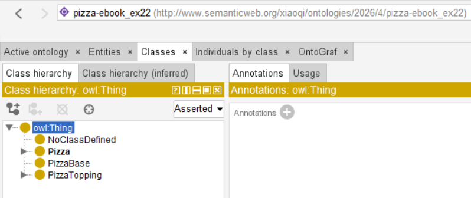

**Step 2: Select `VegetarianPizza`**

Select `VegetarianPizza` in the class hierarchy. In a previous exercise, we have already defined this class as

```text
Class: VegetarianPizza
  SubClassOf: Pizza
  SubClassOf: hasBase some PizzaBase
  EquivalentTo: hasTopping only VegetableTopping
```

We will update it now to match **Exercise 22**.

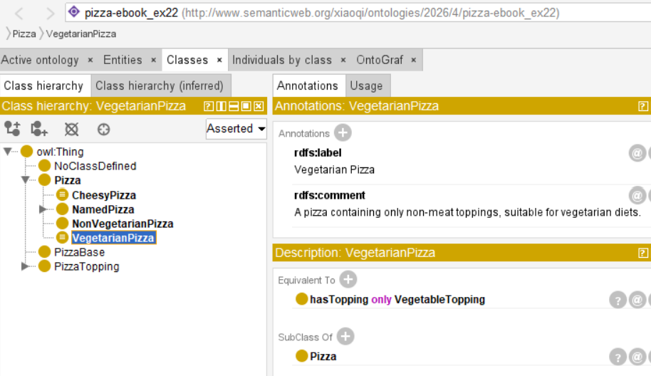

**Step 3: Add the universal restriction**

1. In the Description view, locate the **SubClassOf** section
2. Click the Add icon (+)
3. In the Class Expression Editor, enter `hasTopping only (CheeseTopping or VegetableTopping)`
4. Click OK

After this step, `VegetarianPizza` has:

```text
Class: VegetarianPizza
  SubClassOf: Pizza
  SubClassOf: hasTopping only (CheeseTopping or VegetableTopping)
```

The ontology after this step is as below:

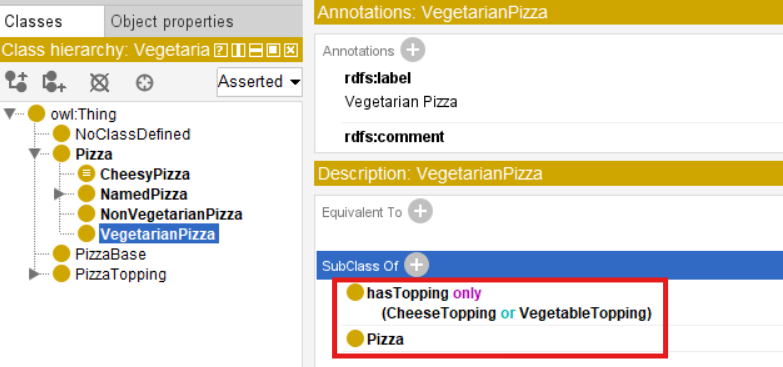

**Step 4: Add a test individual**

To observe the effect of the universal restriction, let's add a test individual.

1. Navigate to the `Individual by class` tab
   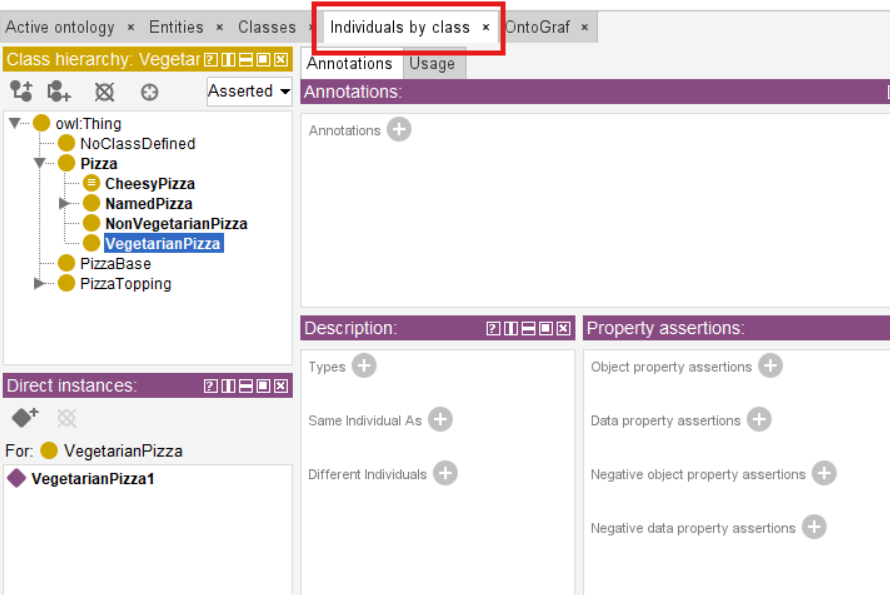
2. Keep class `Pizza` selected in the class hierarchy, create a new individual named `TestVegetarianPizza`
   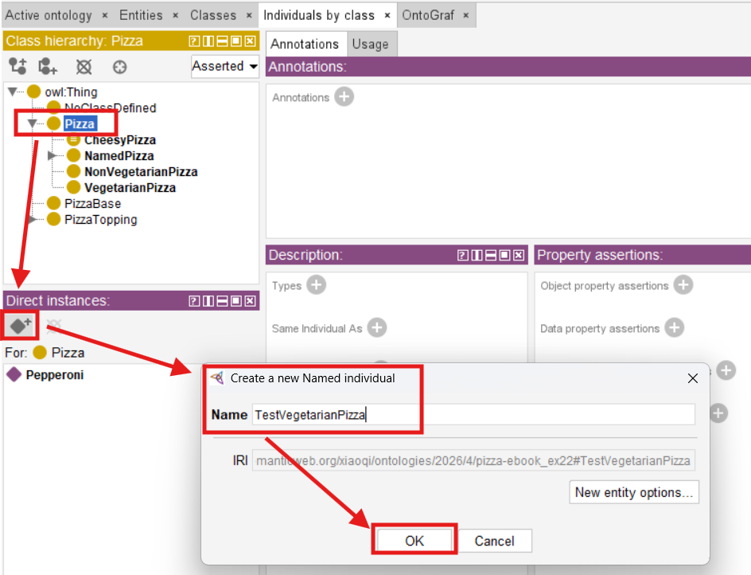
3. After click `OK`, notice the type of individual is `Pizza` now
   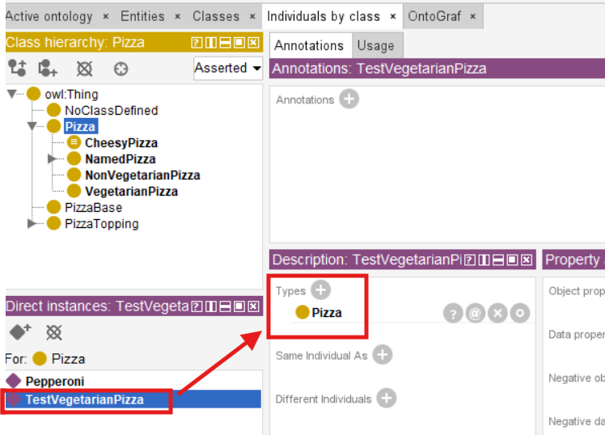
4. Add the property assertion `hasTopping some MozzarellaTopping`
   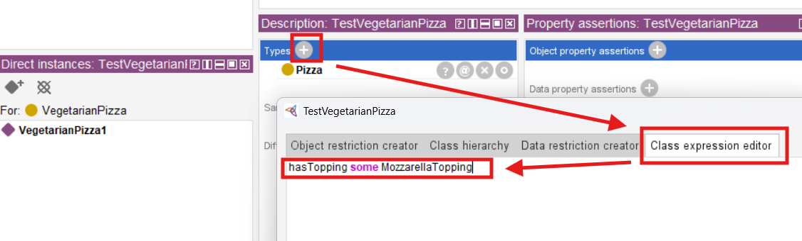
5. Add the property assertion `hasTopping some TomatoTopping`
   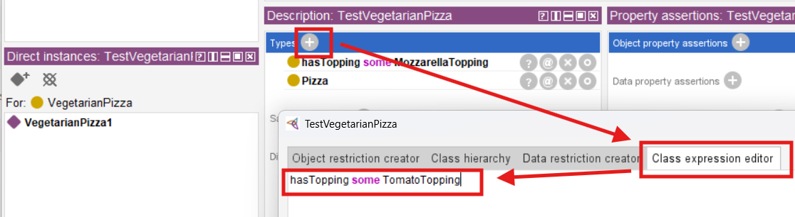
6. Now ensure your ontology is looked like this
   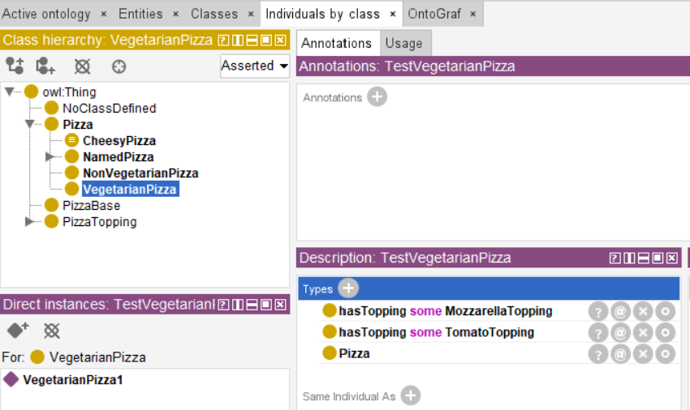

**Step 5: Synchronize the reasoner**

Select `Reasoner > Synchronize reasoner` (Ctrl+R).

Observe the result.

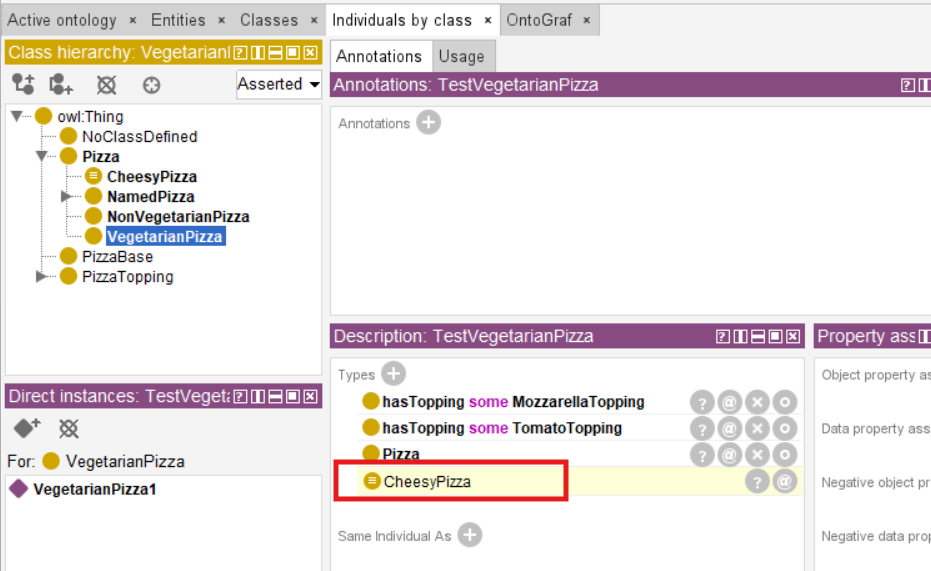

With ontology designed so far, the reasoner classifies `TestVegetarianPizza` as a `CheesyPizza`, because we have defined `CheesyPizza` earlier using `EquivalentTo` (defined class) and `TestVegetarianPizza` has toppings `MozzarellaTopping` (a `CheeseTopping`):

```text
Class: CheesyPizza
  Equivalent To: Pizza and (hasTopping some CheeseTopping)
  SubClass Of: Pizza
```

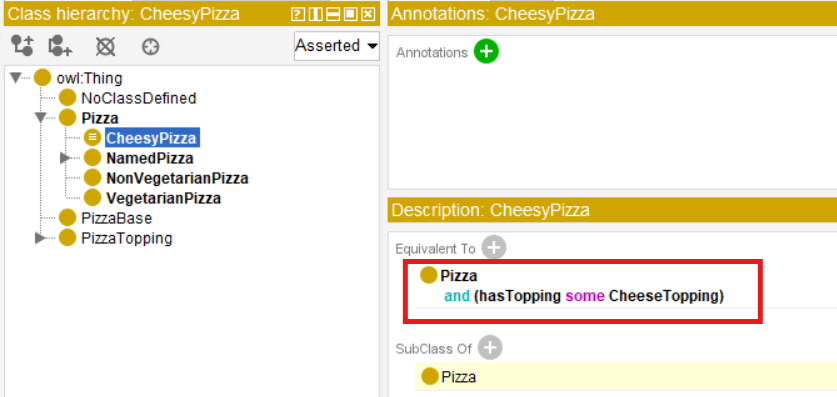

But till now the `VegetarianPizza` is still under only `SubClassOf` (primitive class), so base on Open World Assumption (OWA), the reasoner cannot infer `TestVegetarianPizza` as a type of `VegetarianPizza`.

**Step 6: Convert `VegetarianPizza` to a defined class**

This is the crucial step. Select `VegetarianPizza` in the Classes tab, then select `Edit > Convert to defined class` (or from right-click menu).

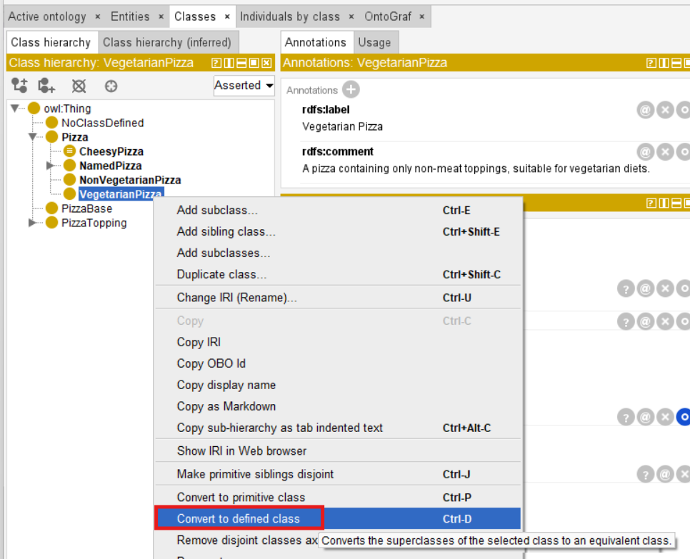

Observe what happens in the Description view. The `SubClassOf` axiom for the universal restriction is moved to `EquivalentTo`:

```text
Class: VegetarianPizza
  Equivalent To: Pizza and (hasTopping only (CheeseTopping or VegetableTopping))
  SubClass Of: Pizza
```

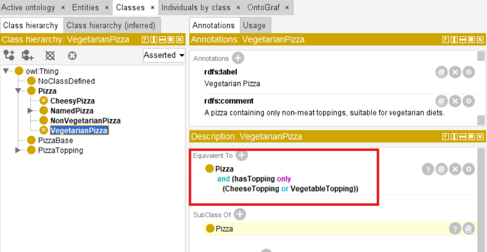

> [!Note]
> The `VegetarianPizza` is now shown with three horizontal stripes in the class icon -- the visual indicator that it is a defined class.

**Step 7: Synchronize the reasoner again**

Select `Reasoner > Synchronize reasoner` (Ctrl+R)

**Step 8 -- Observe the result -- and be surprised!**

Look at `TestVegetarianPizza` in the **Individual by class** tab.

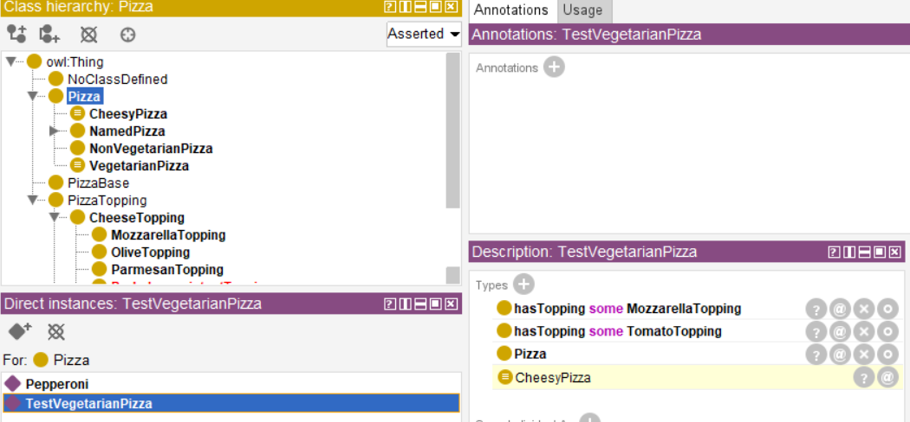

You will see that the reasoner has kept classifying `TestVegetarianPizza` as:

- :white_check_mark: `CheesyPizza` (because it has at least one cheese topping -- mozzarella)

But it has **NOT** classified `TestVegetarianPizza` as:

- :x: `VegetarianPizza`

This is surprising. `TestVegetarianPizza` has only mozzarella and tomato toppings. Both are vegetarian. **Why is it not a `VegetarianPizza`?**

**Step 9 -- Pause and understand**

This result is not a bug. It is still the **Open World Assumption (OWA)** in action, although we have converted `VegetarianPizza` from primitive class to defined class, and it is one of the most important lessons in ontology engineering.

When we define `VegetarianPizza` as:

```text
Pizza and (hasTopping only (CheeseTopping or VegetableTopping))
```

we are saying: **"All toppings must be `CheeseTopping` or `VegetableTopping`.**

But `TestVegetarianPizza` only has two *asserted* toppings. Under the Open World Assumption, the reasoner cannot conclude that these are the *only* toppings -- there might be other toppings that exist in the world (somewhere, anywhere) not been added to the ontology yet.

The reasoner can only classify an individual into a defined class when it has enough information to prove that the individual satisfies the definition. And it does not have enough information here.

**Why `CheesyPizza` works but `VegetarianPizza` doesn't**:

| Class | Definition | Reasoner behavior |
| --- | --- | --- |
| `CheesyPiza` | `Pizza and (hasTopping some CheeseTopping)` | Existential restriction.<br>The reasoner only needs to find **one** cheese topping -- which exists (`MozzarellaTopping`).<br>:white_check_mark: Classified. |
| `VegetarianPizza` | `Pizza and (hasTopping only (CheeseTopping or VegetableTopping))` | Universal restriction.<br>The reasoner must verify that **all** toppings satisfy the constraint -- but OWA prevents it from knowing that no other toppings exist.<br>:x: Not classified. |

> Something unexpected has happened. `TestVegetarianPizza` has only mozzarella topping (a `CheeseTopping`) and tomato topping (a `Vegetabletopping`). We defined `VegetarianPizza` as a defined class using a universal restriction. And yet the reasoner has classified `TestVegetarianPizza` as a `CheesyPiza` but **not** as a `VegetarianPizza`.
>
> This is not a bug in Protégé, and it is even not an error in our ontology. It is a fundamental property of OWL that every ontology engineer must understand. The reason for this behavior -- and the construct that resolves it -- is the subject of the next exercise.

### 24.5.3 The Result: What the Reasoner Does Not Do

When the reasoner is synchronized, something important -- or rather, something important does **not** happen.

**What to observe:** (let's recap)

- `CheesyPizza` is correctly inferred for `TestVegetarianPizza` (highlighted in yellow, indicating a reasoner inference).
- `TestVegetarianPizza` is **not** classified as a `VegetarianPizza`.

The reasoner has all the information it needs to conclude that `TestVegetarianPizza` is a `VegetarianPizza` -- it has mozzarella (a `CheeseTopping`) and tomato (a `VegetableTopping`), both of which are permitted by the universal restriction on `VegetarianPizza`. **And yet it does not make that inference**.

This is unexpected. We defined `VegetarianPizza` as a defined class with the universal restriction `hasTopping only (CheeseTopping or VegetableTopping)`. We created `TestVegetarianPizza` with exactly the kinds of toppings that restriction permits. Intuitively, from human being's perspective, the reasoner should classify it as a `VegatarianPizza`.

**But it does not.**

**Key Insight:**

> "The universal restriction tells the reasoner what is allowed. It does not tell the reasoner what is *exhaustively* present. This distinction is the difference between a description and a specification.

Why this happens -- and what construct resolves it -- is the subject of **Exercise 23**.

### 24.5.4 Why the Universal Restriction Is Not Enough

To understand why the reasoner does not classify `TestVegetarianPizza` as a `VegetarianPizza`, we need to examine how universal restrictions behave under the **Open World Assumption (OWA)**.

The universal restriction:

```text
VegetarianPizza
  EquivalentTo
    Pizza and (hasTopping only (CheeseTopping or VegetableTopping))
```

means: "If something is a `VegetarianPizza`, then every one of its toppings must be either a `CheeseTopping` or a `VegetableTopping`."

For the reasoner to conclude the `TestVegetarianPizza` **is** a `VegetarianPizza`, it must verify that the universal restriction holds -- that *all* of `TestVegetarianPizza`'s toppings are cheese or vegetable. But under the Open World Assumption, the reasoner cannot assume that the two toppings it knows about are the *only* toppings. There might be other toppings that exist but have not been asserted.

So the reasoner cannot prove that `TestVegetarianPizza` satisfies the universal restriction, and therefore cannot classify it as a `VegetarianPizza`.

This is not a flaw in the ontology. It is a faithful consequence of how OWL is designed. The Open World Assumption is what makes OWL suitable for open, federated domains -- but it is also what makes universal restriction insufficient for classification on their own.

**Key Insight:**

> "The universal restriction tells the reasoner: 'If you find a `VegetarianPizza`, check that all its toppings are either cheese or vegetable.' It does not tell the reasoner: 'If you fine a pizza whose known toppings are all cheese or vegetable, it is a `VegetarianPizza`.' The second statement requires more information than the universal restriction alone can supply."

### 24.5.5 Engineering Perspective: Exercise 22 as a Case-Study

From the perspective of Protégé, **Exercise 22** involves adding a single restriction and creating a test individual. (Note: the adding test individual is the addition from tutorial's exercise to trigger more discussion.) It appears to be a small modeling activity.

From the perspective of ontology engineering, however, something significant has occurred. The exercise has introduced the first executive primitive -- the universal restriction -- *and* surfaced the first significant engineering obstacle:

> the OWA between what a universal restriction describes and what execution requires.

The engineering contribution of **Exercise 22** can be summarized as follows:

| Engineering Perspective | Contribution from Exercise 22 |
| --- | --- |
| **SKDL Stage** | Stage 7 -- Executable Knowledge |
| **Primary Objective** | Introduce the universal restriction as an execution primitive |
| **Modeling Activity** | Add `hasTopping only (VegetableTopping or CheeseTopping)` to `VegetarianPizza`; convert to defined class; add `TestVegetarianPizza` individual |
| **Engineering Outcome** | Demonstrate the universal restriction's expressive power -- and its limitation under OWA |
| **Preparation for Later Sections** | Set up the OWL problem that **Exercise 23** will resolve through closure axioms |

**Key Insight:**

> "**Exercise 22** is a lesson in what the universal restriction can and cannot do. It can **exclude**. It cannot, on its own, **proved** exhaustiveness. The task belongs to the closure axiom."

## 24.6 Exercise 23 -- Closure Axioms and the Open World Assumption

In **Exercise 22**, we saw a surprising result: even though `VegetarianPizza` was correctly defined with a universal restriction, the reasoner did not classify `TestVegetarianPizza` as a `VegetarianPizza`. The reason was the Open World Assumption (OWA) -- the reasoner could not conclude that `TestVegetarianPizza` has *only* mozzarella and tomato toppings, because it could not rule out the existence of other toppings that had not been asserted.

This is the same phenomenon that Michael DeBellis demonstrates in Section 4.13 of the `Pizza` Tutorial, where he shows that `MargheritaPizza` and `SohoPizza` -- despite having only cheese and vegetable toppings -- are not automatically classified as subclasses of `VegetarianPizza` by the reasoner.

The construct that resolves this problem is called the **closure axiom**.

This exercise follows the tutorial's **Exercise 23**, and then extends it slightly to tie back to the `TestVegetarianPizza` individual from the previous exercise.

### 24.6.1 The Engineering Objective

**Exercise 23** introduces the **closure axiom** -- a universal restriction that explicitly specifies the complete set of values a property may take for a class or an individual.

A closure axiom for `MargheritaPizza` would be:

```text
Class: MargheritaPizza
  SubClassOf: hasTopping only (MozzarellaTopping or TomatoTopping)
```

This says: "Every toppings on a `MargheritaPizza` must be either `MozzarellaTopping` or `TomatoTopping`, and no other toppings exist."

By adding this axiom, we close the world for `MargheritaPizza`. The reasoner nwo knows that the two toppings we asserted for `MargheritaPizza` are the *only* toppings it has. This is the information it needs to classify `MargheritaPizza` as a subclass of `VegetarianPizza`.

**Key Insight:**

> "A closure axiom is the OWL equivalent of saying 'this is the complete picture.'
> - Without closure, the reasoner remains cautious.
> - With closure, the reasoner can be decisive."

### 24.6.2 Implementation: Adding Closure Axioms to `MargheritaPizza` and `SohoPizza`

We begin with the tutorial's **Exercise 23**, including the discussion in tutorial's Section 4.13 (before the exercise), which applies closure axioms at the class level.

**Step 1: Open the `Pizza` ontology**

Open `pizza-ebook_ex22.rdf` in Protégé -- the file from the previous exercise, which already contains `TestVegetarianPizza` and the inferred-but-incomplete classification we observed.

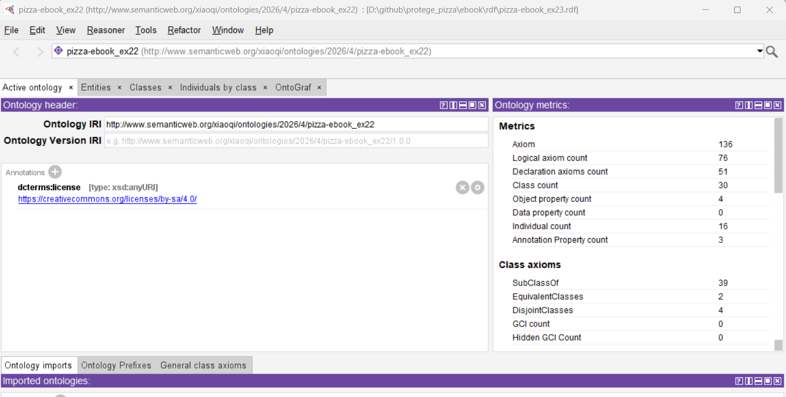

> [!Note]
> The finished state of **Exercise 23** will be saved as `pizza-ebook_ex23.rdf`.

**Step 2: Select `MargheritaPizza`**

In the Classes tab, select `MargheritaPizza` in the class hierarchy.

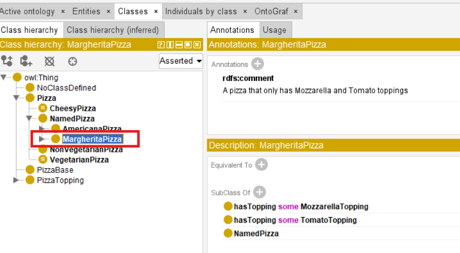

So far, the `MargheritaPizza` is defined as:

```text
Class: MargheritaPizza
  SubClassOf: NamedPizza
  SubClassOf: hasTopping some MozzarellaTopping
  SubClassOf: hasTopping some TomatoTopping
```

**Step 3: Add the closure axiom to `MargheritaPizza`**

1. In the Description view, locate the **SubClass Of** section
   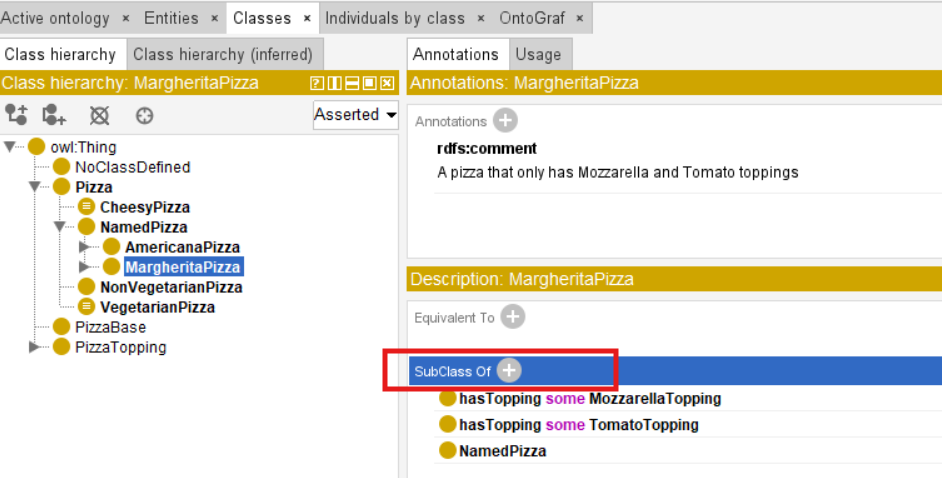
2. Click the Add icon (+)
   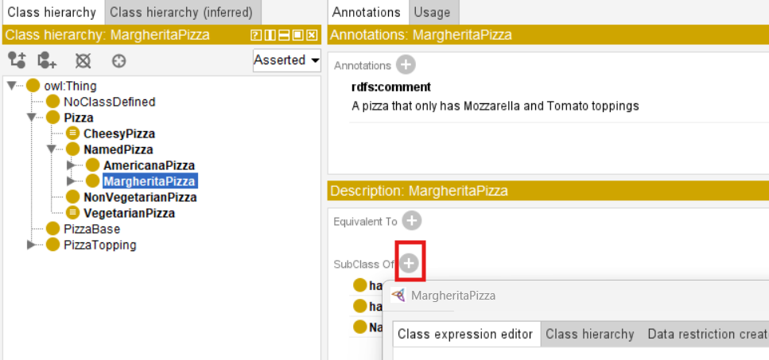
3. In the Class Expression Editor, enter: `hasTopping only (MozzarellaTopping or TomatoTopping)`
   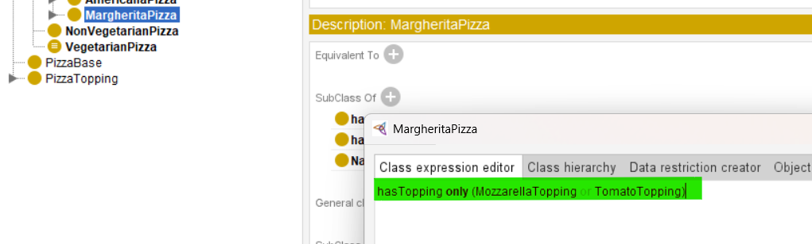
4. Click `OK`.

After this step, `MargheritaPizza` has the following description:

```text
Class: MargheritaPizza
  SubClassOf: NamedPizza
  SubClassOf: hasTopping some MozzarellaTopping
  SubClassOf: hasTopping some TomatoTopping
  SubClassOf: hasTopping only (MozzarellaTopping or TomatoTopping)
```

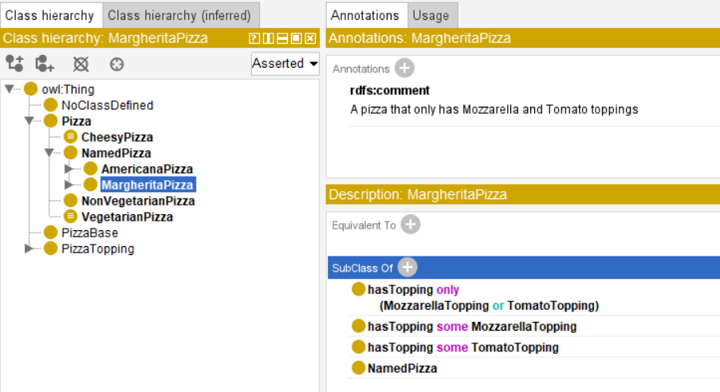

**Step 4: Add the closure axiom to `SohoPizza`**

Repeat Step 2-3, but this time select `SohoPizza` and enter the axiom:

```text
hasTopping only (MozzarellaTopping or TomatoTopping or ParmesanTopping or OliveTopping)
```

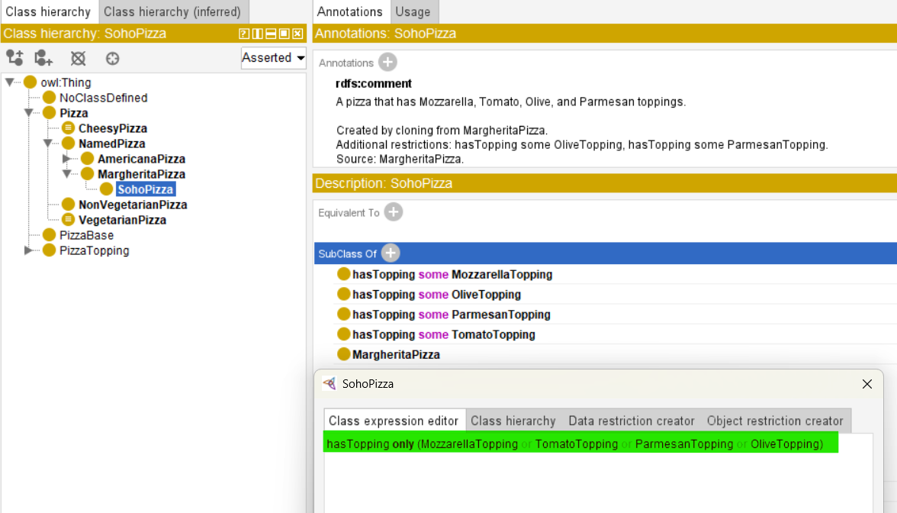

After this step, `SohoPizza` has the closure axiom that enumerates its full set of allowed toppings.

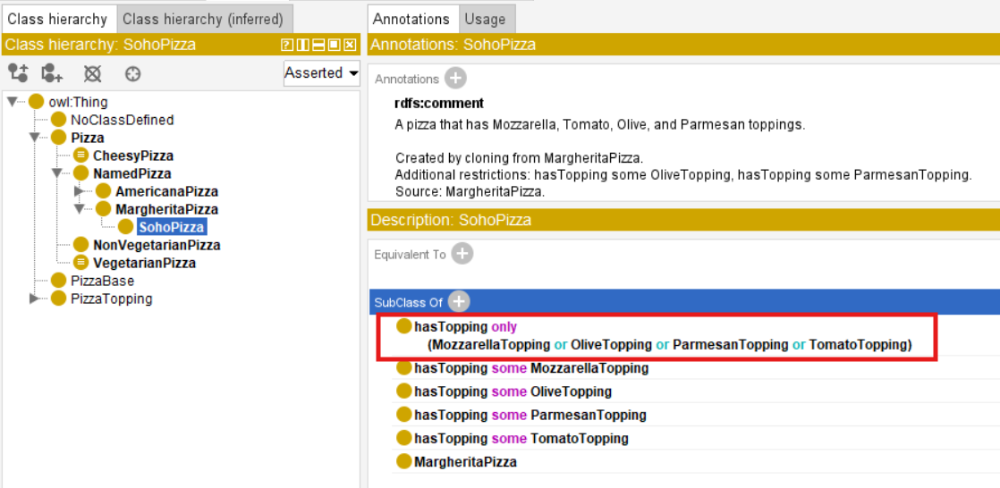

**Step 5: Synchronize the reasoner**

Select `Reasoner > Synchronize reasoner` (Ctrl+R)

**Step 6: Observe the result**

Look at the **Class hierarchy (inferred)** tab.

The reasoner now classifies both `MargheritaPizza` and `SohoPizza` (subclass of `MargheritaPizza` still) as subclasses of `VegetarianPizza`. **This is the result we were looking for:**

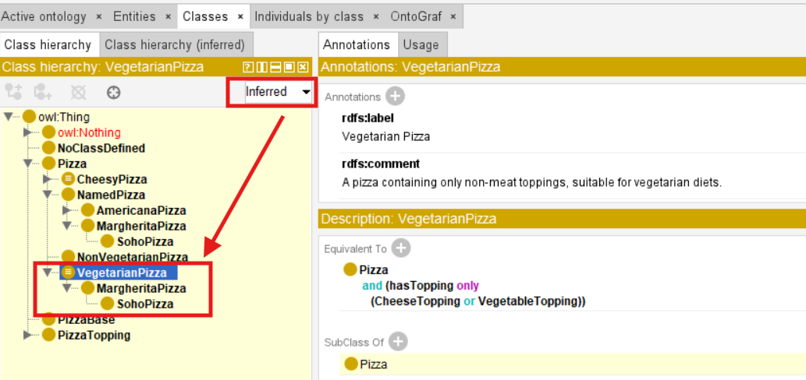

Why does it work now? Because the closure axiom supplier the missing information (knowledge) -- it tells the reasoner that *only* the enumerated toppings exist for these classes. Without that information, the reasoner could not verify that the universal restriction on `VegetarianPizza` held for `MargheritaPizza` and `SohoPizza`.

**Key Insight:**

> "The reasoner did not change. The definition of `VegetarianPizza` did not change. Only the ***world*** changed -- from **open** to **closed**. Once the world is closed, the reasoner can make the inference."

### 24.6.3 Extending the Demonstration: Closure at the Individual Level

We have now seen closure axioms applied at the **class** level, following the tutorial. But our `TestVegetarianPizza` individual from **Exercise 22** is still unclassified. Let's resolve that too, using the same principle.

**Step 1: Select `TestVegetarianPizza` individual**

Navigate to the **Individual by class** tab and select `TestVegetarianPizza`.

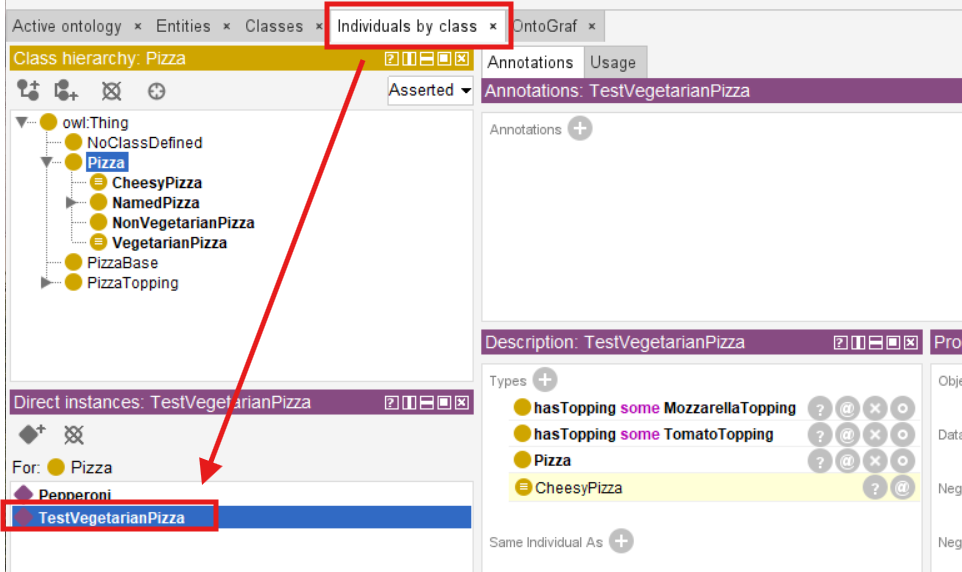

**Step 2: Add the closure axiom**

1. In the Description view, locate the **Types** section
   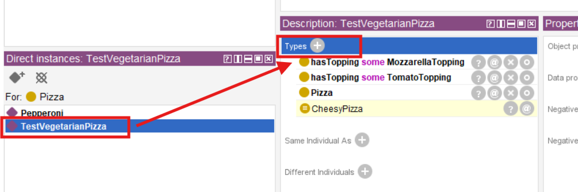
2. Click the Add icon (+)
   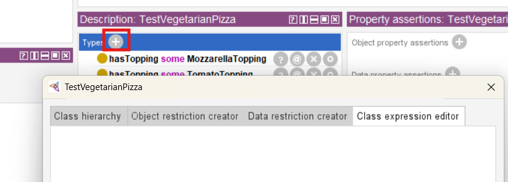
3. In the Class Expression Editor, enter: `hasTopping only (MozzarellaTopping or TomatoTopping)`
   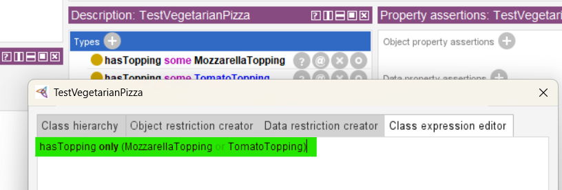
4. Click `OK`
   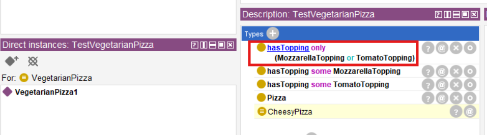

**Step 3: Synchronize the reasoner**

Select `Reasoner > Synchronize reasoner` (Ctrl+R)

**Step 4: Observe the result**

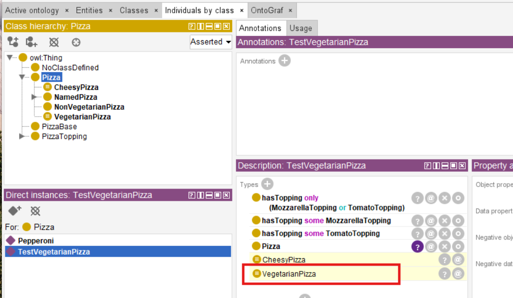

`TestVegetarianPizza` is now classified as a `VegetarianPizza`, along with `CheesyPizza`. The closure axiom has resolved the same OWA problem at the individual level that it resolved at the class level.

This confirms that closure axioms are effective at both levels. In production ontologies, they are usually applied at the class level (as we did for `MargheritaPizza` and `SohoPizza`) so that every instance of the class inherits the closure. But the same principle applies to individual-level closure when a one-off case requires it.

**Key Insight:**

> "Closure axioms are a general mechanism. They close the world for whatever they are attached to -- a class or an individual. The reasoning principle is the same."


---

Last updated at 2026-09-25