# Chapter 25 - Stage 7 of SKDL -- Executable Knowledge (Part 2): Value Specification & Precise Binding


**Table of Content**
- [25.1 Chapter Introduction](#251-chapter-introduction)
  - [25.1.1 How Chapter 25 Continues Chapter 24](#2511-how-chapter-25-continues-chapter-24)
- [25.2 Learning Objectives](#252-learning-objectives)
- [25.3 A Brief Note on OWL Design Patterns](#253-a-brief-note-on-owl-design-patterns)
- [25.4 Exercise 24 -- Enumerated Classes and Deterministic Value Sets](#254-exercise-24----enumerated-classes-and-deterministic-value-sets)
  - [25.4.1 The Engineering Objective](#2541-the-engineering-objective)
  - [25.4.2 Implementation: Creating the Enumerated Class](#2542-implementation-creating-the-enumerated-class)
  - [25.4.3 The Result: A Deterministic Value Domain](#2543-the-result-a-deterministic-value-domain)
  - [25.4.4 Why Enumerated Classes Matter for Execution](#2544-why-enumerated-classes-matter-for-execution)
  - [25.4.5 Engineering Perspective: Exercise 24 as a Case Study](#2545-engineering-perspective-exercise-24-as-a-case-study)
- [25.5 Exercise 25 -- `hasValue` Restrictions and Specific-Value Binding](#255-exercise-25----hasvalue-restrictions-and-specific-value-binding)
  - [25.5.1 The Engineering Objective](#2551-the-engineering-objective)
  - [25.5.2 Implementation: Creating the `hasValue` Restriction](#2552-implementation-creating-the-hasvalue-restriction)
  - [25.5.3 The Result: Value-Based Execution Logic](#2553-the-result-value-based-execution-logic)
  - [25.5.4 Why `hasValue` Restrictions Matter for Execution](#2554-why-hasvalue-restrictions-matter-for-execution)
  - [25.5.5 Engineering Perspective: Exercise 25 as a Case Study](#2555-engineering-perspective-exercise-25-as-a-case-study)
- [25.6 Chapter Summary](#256-chapter-summary)
- [25.7 Looking Ahead -- A Bridge to Chapter 26](#257-looking-ahead----a-bridge-to-chapter-26)

## 25.1 Chapter Introduction

In **Chapter 24**, we built the first layer of an executable ontology: the **boundary layer**. Universal restrictions told the reasoner what wa allowed; closure axioms closed the world around those boundaries. By the end of that chapter, the ontology could classify `MargheritaPizza` and `SohoPizza` as `VegetarianPizza` -- deterministically and without ambiguity.

But a boundary tells the system what is *permitted*, it does not tell the system what to *do*.

Consider a pizza that is `Hot`. Or an order whose status is `Pending`. Or a customer whose tier is `Gold`. Each of these is a specific value -- not a boundary, not a range, but one point in a closed set. Execution often fires on exactly these points. "If the spiciness is `Hot`, alert the kitchen. If the order is `Pending`, send a reminder. If the tier is `Gold`, apply the discount."

Chapter 25 builds the layer that makes these triggers possible: the **value layer**.

The value layer has two halves:

- An **enumerated class** closes the *value domain* -- it declares the complete, finite set of values a property may take. `Spiciness = {Hot, Medium, Mild}`. No other value is possible.
- A **`hasValue` restriction** binds a property to *one specific value* from that domain. `JalapenoPepperTopping hasSpiciness value Hot`. Not a class of values -- the value itself.

Together they allow the ontology to express and execute rules that depend on *specific values* rather than *categories*. This is the semantic foundation of the trigger.

This chapter follows **Exercise 24** and **Exercise 25** in Michael DeBellis' *Protégé 5 New OWL Pizza Tutorial*, read through the lens of executability. It is the second of three chapters on **Stage 7 -- Executable Knowledge** .

**Key Insight:**

> "A boundary tells the system what is allowed. A value tells the system what to act on. The value layer is where execution becomes specific."

### 25.1.1 How Chapter 25 Continues Chapter 24

Chapter 24 built the boundary layer from two primitives: the universal restriction (**Exercise 22**) and the closure axiom (**Exercise 23**). Chapter 25 builds the value layer from two more: the enumerated class (**Exercise 24**) and the `hasValue` restriction (**Exercise 25**).

| Layer | Primitive | Exercise | What It Closes |
| --- | --- | --- | --- |
| Boundary | Universal Restriction (`only`) | Ex 22 | What is permitted |
| Boundary | Closure Axiom | Ex 23 | What exhaustively exists |
| Value | Enumerated Class | Ex 24 | The set of possible values |
| Value | `hasValue` Restriction | Ex 25 | The specific value to act on |
| Integrity | Cardinality Restriction | Ex 26 (Ch 26) | The number of values required |

Each layer depends on the one before it. The value layer is meaningless without the boundary layer -- binding a value to a property whose permitted range is not closed would leave the binding ambiguous. Conversely, the boundary layer is incomplete without the value layer -- a boundary that cannot fire on specific values cannot drive action.

**Key Insight:**

> "The boundary layer says what is closed. The value layer says what to fire on. Execution needs both."

## 25.2 Learning Objectives

After competing this chapter, you should be able to achieve the following learning outcomes:

**Knowledge:**

- Explain why the value layer is the second layer of executable knowledge
- Distinguish between a *closed value domain* and a *specific value biding*
- Understand how enumerated classes differ from asserted class membership
- Understand how `hasValue` restrictions differ from `some` and `only` restrictions
- Explain why both primitives are required for value-based triggers

**Practical Skills (Stage 7, Chapter 25):**

- Create an enumerated class using `EquivalentTo {...}` in Protégé
- Create the individuals that populate an enumerated class
- Create an object property with a defined domain and range
- Add a `hasValue` restriction to a class
- Define a class using a nested restriction (`some` containing `value`)
- Convert a class to a defined class
- Test value-based classification by synchronizing the reasoner

**Mathematical Perspective:**

- Understand enumeration as the finite specification of a class extension: $C \equiv \{a_1, \dots, a_n\}$
- Understand `hasValue` as a restriction whose filler is an individual, not a class: $p \text{ value } a$
- Explain the composition of `some` and `value` as a nested restriction: $\exists p.(\exists q.\{a\})$
- Understand the relationship between enumeration, closure, and exhaustiveness

**Engineering Perspective:**

- Understand the value layer as the semantic foundation of triggers
- Map the enumerated class to the concept of an `enum` in programming
- Map the `hasValue` restriction to the concept of a state-machine transition condition
- Apply the two primitive to industrial scenarios (alerting, workflow routing, decision tables)

> [!Note] Note on scope.
> This learning objectives are scoped to **Chapter 25**. Chapter 16 will add cardinality restrictions and the consolidated Stage 7 architecture. Chapter 24 (already covered) introduced the boundary layer.

## 25.3 A Brief Note on OWL Design Patterns

Before we build our next execution primitive, it is worth pausing to name a concept that has quietly been present throughout this book: **the design pattern**.

The idea of a design pattern comes originally from architecture -- Christopher Alexander's *A Pattern Language* (1977) -- and was brought into software engineering by the "Gang of Four" in their 1994 book *Design Patterns*.

> **Alexander's insight** was that good design does not begin from nothing; it draws on a shared vocabulary of proven solutions to recurring problems. Each solution can be adapted to a specific context without being reinvented.

In OWL, the same idea applies. A **design pattern** is a reusable combination of OWL constructs that solves a recurring modeling problem. It sits at a higher level of abstraction than a single class or axiom -- it is a **shape**, not a thing!

By this point in the book, you have already used several OWL design patterns without necessarily calling them that:

| Pattern | Introduced | Purpose |
| --- | --- | --- |
| **Probe Class** | Chapter 22 (Exercise 19) | A deliberately inconsistent class used to test whether validation infrastructure works |
| **Closure Axiom** | Chapter 24 (Exercise 23) | A universal restriction that closes the world for a class or individual |
| **Enumerated Class** | This chapter (Exercise 24) | A class whose extension is defined by listing all of its instances |
| **`hasValue` Restriction** | This chapter (Exercise 25) | A restriction that binds a property to a specific individual |
| **Cardinality Restriction** | Chapter 26 (Exercise 26, upcoming) | A restriction on the number of values a property may have |

Each of these is a **reusable shape**, not a one-off modeling decision. You can apply the same shape to any class in any domain -- pizza, manufacturing, financing, healthcare -- and it will work the same way.

That reusability is what makes design patterns valuable for governance and execution:

- **Reuse**: A pattern written once can be instantiated many times.
- **Consistency**: Different engineers applying the same pattern produce structurally similar (or even same) models.
- **Governance**: Patterns can be named, documented, and governed like any other asset.
- **Execution**: The execution primitives in this chapter (closure, enumeration, `hasValue`, cardinality) are effectively the design patterns of Stage 7.

The full OWL design pattern landscape -- the ODP catalog (http://www.ontologydesignpatterns.org/index.php/Ontology_Design_Patterns_._org_(ODP)), logical vs. content patterns, pattern composition, and pattern selection strategies -- is a topic of its own. It belongs to the era of **Knowledge Graph Engineering**, when you are building systems that span multiple ontologies and reuse libraries of proven patterns.

We will return to it in **Volume 5**.

For now, the key point is this:

> **when you build an execution primitive in this chapter, you are not just writing an axiom -- you are instantiating a design pattern.**

The patterns will grow with you as your ontology grows.

## 25.4 Exercise 24 -- Enumerated Classes and Deterministic Value Sets

Having established closure axioms in **Exercise 23**, we now turn to the first execution primitive of the **value layer**: the enumerated class.

As we saw in **Section 24.6.7**, the enumerated class is one of the design patterns of Stage 7 — here we instantiate it.

### 25.4.1 The Engineering Objective

**Exercise 24** introduces the **enumerated class** -- a class whose extension is defined by explicitly listing all of its instances.

An enumerated class for spiciness, for example, would be:

```text
Class: Spiciness
  EquivalentTo: {Hot, Medium, Mild}
```

This means: "The class `Spiciness` has exactly three instances: `Hot`, `Medium`, and `Mild`."

The engineering objective for **Exercise 24** is to demonstrate how enumeration provides a **complete, deterministic value domain** -- a prerequisite for execution.

Why does execution need enumeration?

Consider an execution rule that fires when a pizza is "spicy". For the rule to be reliable, the system must know the complete set of possible spiciness values. If the ontology only says "there exists a `Spiciness` value" but does not enumerate what that value could be, the rule cannot be exhaustively evaluated.

Enumeration closes the value domain. It says: *these are all the possible values -- nothing more, nothing less.*

This is the value-domain analogue of the closure axiom. The closure axiom closed the set of permitted *toppings* for a class; the enumerated class closes the set of permitted *values* for a property. Both replace an open-world description with a closed-world specification -- one at the property-range level, one at the value level. Together, they are the two halves of boundary closure.

**Key Insight:**

> "An enumerated class is a closed-world specification of a value domain. It says not just what values exist, but that **no other values exist.**"

### 25.4.2 Implementation: Creating the Enumerated Class

Let's walk through the implementation step by step.

As you'll see, the workflow is slightly different from **Exercises 22 and 23** -- enumerated classes are created by combining three OWL constructs: a class, its three instances, and an `EquivalentTo` axiom that lists them.

**Step 1: Open the `Pizza` ontology**

Open `pizza-ebook_ex23.rdf` in Protégé - the file from the previous exercise, which now contains closure axioms on `MargheritaPizza` and `SohoPizza`, and the individual-level closure on `TestVegetarianPizza`.

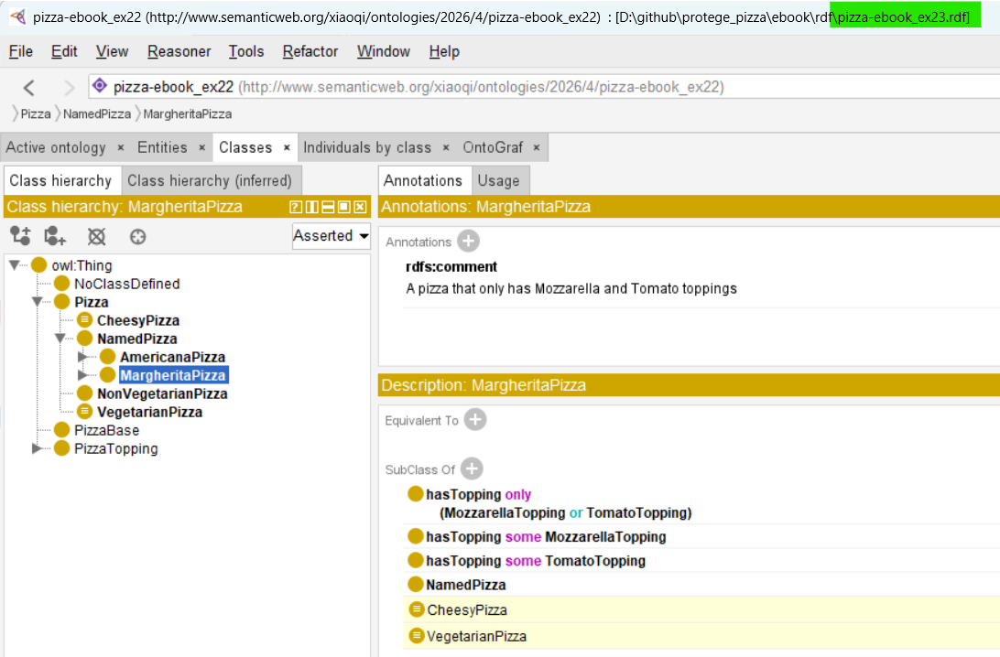

> [!Note]
> The finished state of **Exercise 24** is saved as `pizza-ebook_ex24.rdf`.

**Step 2: Create the `Spiciness` class**

1. Navigate to the Classes tab. (You may already at this tab)
2. Select `owl:Thing` in the class hierarchy
   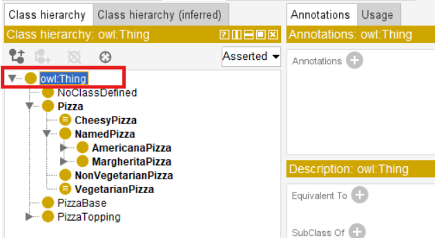
3. Click the **Add subclass** icon.
   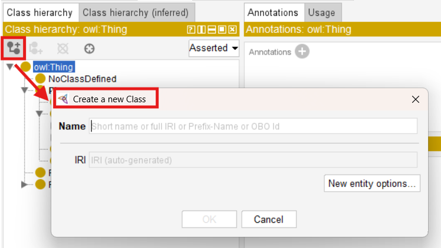
4. Name the new class `Spiciness`
   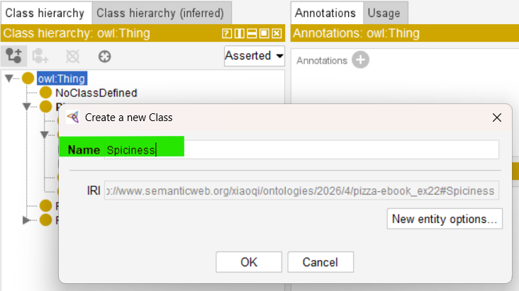
5. Click `OK`
   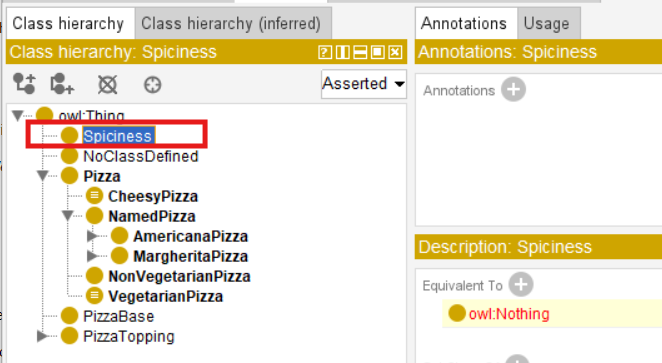

At this point, `Spiciness` is an empty class -- a class with no instances and no definition. We will now give it both.

**Step 3: Create the individuals for the enumerated class**

1. In the Classes tab, make sure `Spiciness` is selected. (After above Step2.5, the cursor should be by default on `Spiciness`.)
2. In the Description view, locate the `Instances` section near the bottom. (You may also switch to **Individuals by class** tab)
   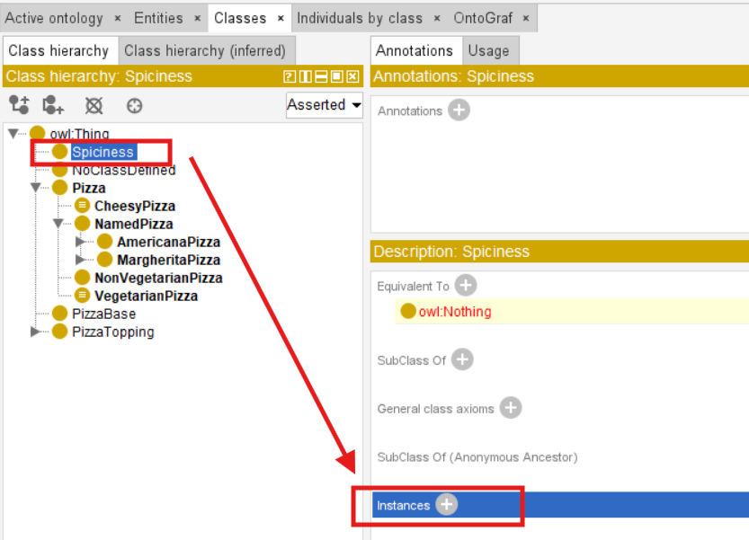
3. Click the Add icon (+) next to **Instances**
   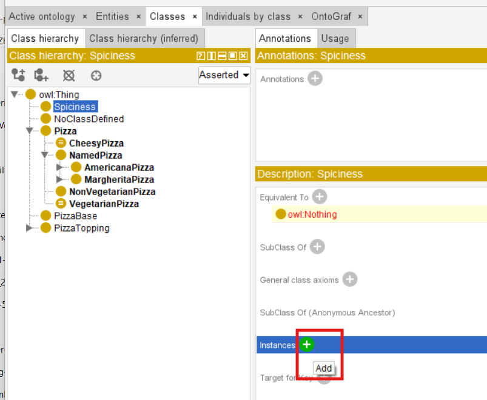
4. A dialog will appear with a diamond icon (create new individual) and a delete icon. Use the diamond icon to create three individuals in sequence: `Hot`, `Medium`, and `Mild`.
   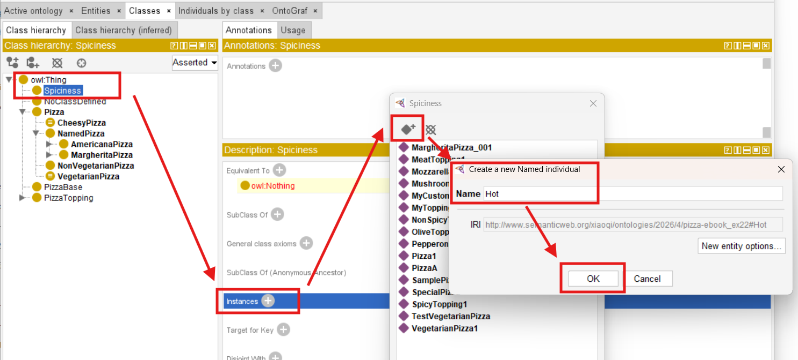
5. After creating, your `Spiciness` class' individuals should be like below:
   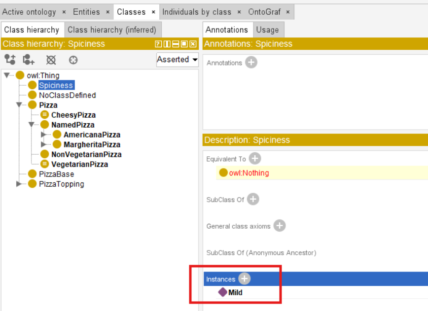

> [!Tip]
> You may also use **Individuals by class** tab to create those individuals, below is the screen of the three individuals after creating:
> 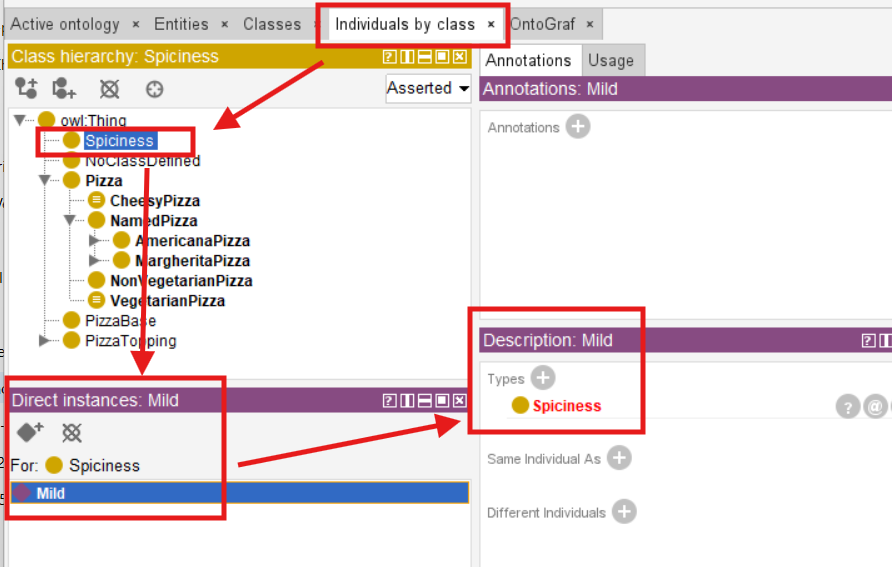
> Choose either way which you are preferred.

> [!Note]
> You may notice that only one of the three new individuals is actually created as an instance of `Spiciness` at this point. That is expected. The next step will supply the reasoner with enough information to recognize all three as instances of the class.

**Step 4: Define `Spiciness` as an enumerated class**

1. Make sure `Spiciness` is still selected
   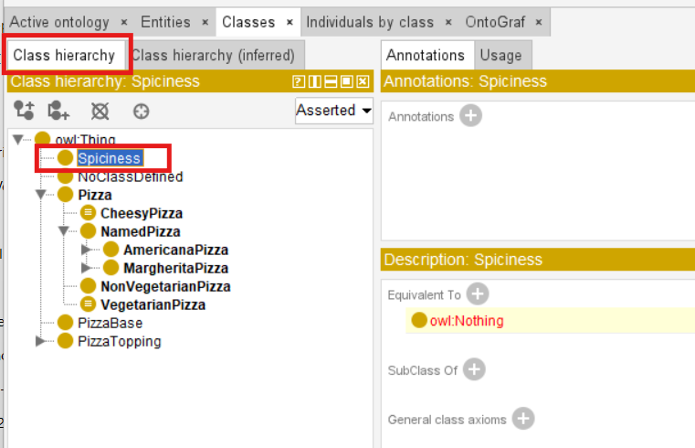
2. In the Description view, locate the **`Equivalent To`** section.
   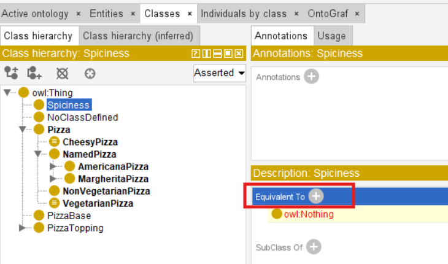
3. Click the Add icon (+)
   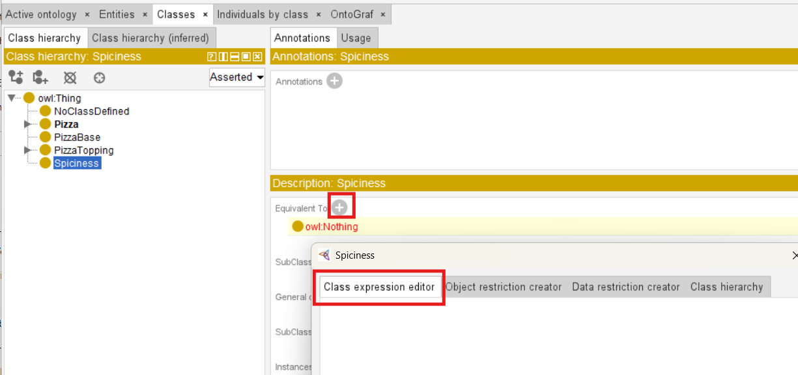
4. In the Class Expression Editor, enter: `{Hot, Medium, Mild}`. (Tip: remember you may click Tab while typing to get possible choices)
   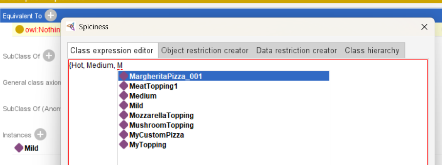
5. Click `OK`.
   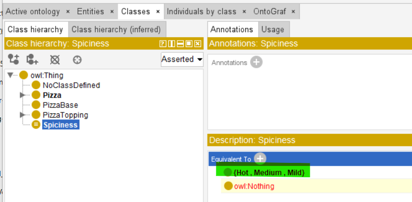

After this step, `Spiciness` class has the following description:

```text
Class: Spiciness
  EquivalentTo: {Hot, Medium, Mild}
```

**Step 5: Synchronize the reasoner**

Select `Reasoner > Synchronize reasoner` (Ctrl+R)

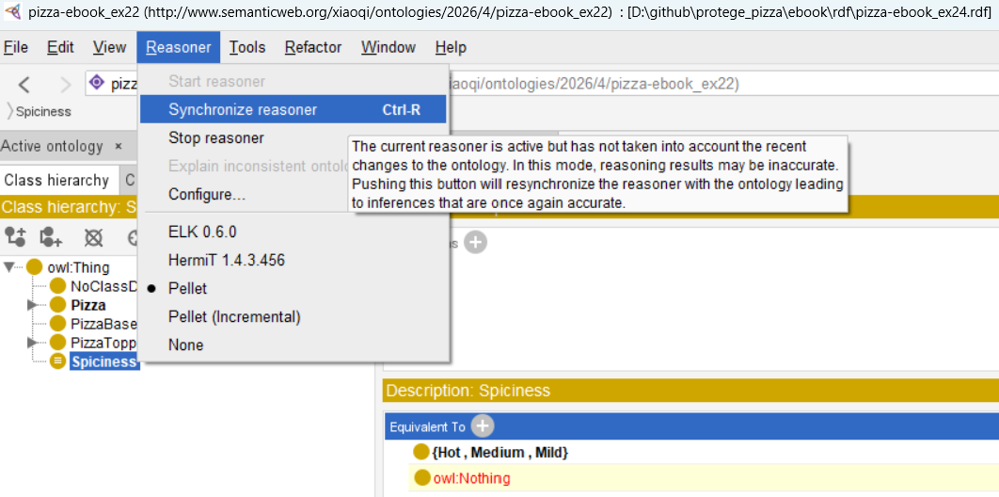

**Step 6: Observe the result**

Look at `Spiciness` in the Classes tab.

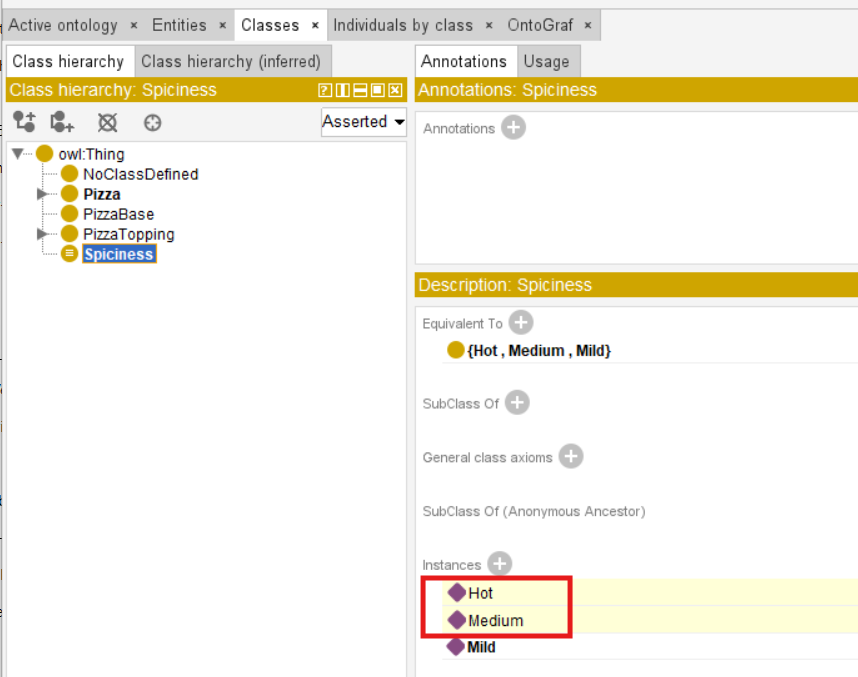

The reasoner now recognizes `Spiciness` as a **defined class** (three horizontal stripes in the class icon), with exactly three instances: `Hot`, `Medium`, and `Mild`. No other individual can be an instance of `Spiciness`, because the class definition enumerates the complete set of allowed values.

The reasoner has done two things:

1. **Classified the three individuals as instances of `Spiciness`** -- even though we asserted only one of them directly, the enumeration definition now covers all three.
2. **Closed the value domain** -- the class `Spiciness` now has exactly three instances, and no more are possible.

This is the first time in the chapter that we have closed the world for *values* rather than for *properties*. The effect is immediate: what was previously an open-ended class with unknown membership is now a fully specified enumeration.

**Key Insight:**

> "Before the `EquivalentTo` axiom, `Spiciness` was an empty class -- a name without an extension. After the axiom, `Spiciness` has a complete, closed-world specification: exactly three values, and no others."

### 25.4.3 The Result: A Deterministic Value Domain

The enumerated class has provided a **deterministic value domain** for `Spiciness`.

For execution, this is essential. When an execution system encounters a `Spiciness` value, it knows the value must be one of `Hot`, `Medium`, or `Mild`. It can handle all possible cases exhaustively.

Contrast this with the alternative. If we had only declared `Spiciness` as a class (with `Hot`, `Medium`, and `Mild` as asserted instances), the reasoner would still recognize those three individuals as instances of `Spiciness`. But it would not know that they are the *only* instances. Under the Open World Assumption, there might be other spiciness values not yet asserted.

Enumeration removes this uncertainty. The `EquivalentTo {Hot, Medium, Mild}` axiom does two things simultaneously:

- It says that `Hot`, `Medium`, and `Mild` **are** instances of `Spiciness` (sufficient condition).
- It also says that anything else is **not** an instance of `Spiciness` (necessary condition).

This is what makes enumeration a closed-world specification.

**Key Insight:**

> "Enumerated classes are the OWL equivalent of an `enum` in a programming language. They define the complete set of possible values -- nothing more, nothing less."

### 25.4.4 Why Enumerated Classes Matter for Execution

Enumerated classes are essential for execution because:

1. **The define finite value domains.** Execution systems need to know the complete range of possible values to handle every case.
2. **They enable exhaustiveness checking.** If an execution system handles `Hot`, `Medium`, and `Mild`, it has handled all cases -- because the ontology guarantees there are no others.
3. **They convert open-world value domains into closed-world specifications.** Without enumeration, a property might have unknown or additional values. With enumeration, all values are known.
4. **They compose with other execution primitives.** Enumeration works with `hasValue` restrictions (**Exercise 25**) and cardinality restrictions (**Exercise 26**) to build richer execution logic. For example, an execution rule can fire on `hasSpiciness value Hot`, confident that `Hot` is a fixed, well-known value from a closed enumeration.

The table below contrasts the behavior of a property with and without an enumerated value domain:

| Aspect | Without Enumeration | With Enumeration |
| --- | --- | --- |
| **Value domain** | Open -- any value is possible in principle | Closed -- only the listed values are possible |
| **Reasoner behavior** | Cannot exhaustively check value conditions | Can exhaustively check value conditions |
| **Semantic strength** | Description of a class | Specification of a value domain |
| **Execution readiness** | Not executable for value-based triggers | Executable for value-based triggers |

**Key Insight:**

> "Execution cannot handle unknown values. Enumeration is how the ontology guarantees that all values are known."

### 25.4.5 Engineering Perspective: Exercise 24 as a Case Study

From the perspective of Protégé, **Exercise 24** involves creating a class, creating three individuals, and adding a single `EquivalentTo` axiom. It appears to be a small modeling activity.

From the perspective of ontology engineering, however, something significant has occurred. The ontology now contains a **completely specified value domain** -- a closed-world set of possible values.

> What was previously an open class has become a fully enumerated one.

The engineering contribution of **Exercise 24** can be summarized as follows:

| Engineering Perspective | Contribution from Exercise 24 |
| --- | --- |
| **SKDL Stage** | Stage 7 -- Executable Knowledge |
| **Primary Objective** | Introduce the enumerated class as a value-domain specification |
| **Modeling Activity** | Define `Spiciness` as `{Hot, Medium, Mild}` |
| **Engineering Outcome** | Provide a finite, deterministic value domain for execution; the reasoner now treats `Spiciness` as a closed-world enumeration |
| **Preparation for Later Sections** | Establish the enumerated value foundation for the `hasValue` restrictions in **Exercise 25** and the cardinality-based logic in **Exercise 26** |

**Key Insight:**

> "**Exercise 24** is the moment the ontology specifies a complete value domain. This is essential for exhaustive execution logic."

> [!Tip]
> Following the Tutorial
>
> **Exercise 24** in the original `Pizza` Tutorial introduces the enumerated class `Spiciness` with the individuals `Hot`, `Medium`, and `Mild`, and defines `Spiciness` as `EquivalentTo {Hot, Medium, Mild}`. The tutorial then demonstrates the reasoner recognizing all three individuals as instances of the class.
>
> In this book, we have followed the tutorial exactly -- same class, same individuals, same axiom. The only difference is presentational: we have added the observation that this constitutes a *closed-world specification of a value domain*, which is what makes enumeration as execution primitive for **Stage 7**. The tutorial introduces the construct; the book frames it in terms of executability.

## 25.5 Exercise 25 -- `hasValue` Restrictions and Specific-Value Binding

Having established the enumerated value domain in **Exercise 24**, we now turn to **Exercise 25**, which introduces the `hasValue` **restriction** -- the construct that binds a property to a specific individual.

This exercise completes the value-binding layer of Stage 7. in **Exercise 24**, we closed the world for a *value domain* (`Spiciness = {Hot, Medium, Mild}`). In **Exercise 25**, we close the world for a *specific value* -- binding a property to one particular individual from that domain.

### 25.5.1 The Engineering Objective

**Exercise 25** introduces the `hasValue` **restriction**, which specifies that a property must have exactly one specific value.

A `hasValue` restriction for a spicy pizza, for example, would be:

```text
Class: SpicyPizza
  EquivalentTo: Pizza and (hasTopping some (hasSpiciness value Hot))
```

This means:

> "A pizza is a `SpicyPizza` if and only if (`iff`) it has at least one topping whose spiciness is `Hot`."

The engineering objective of **Exercise 25** is to demonstrate how `hasValue` restrictions enable **value-based execution logic** -- the ability to fire a trigger on a specific value rather than a general class of values.

Why does execution need `hasValue`?

Consider an execution rule that fires when a pizza's spiciness is `Hot`. For the rule to be reliable, the system must be able to detect the *specific value* `Hot` -- not just any value from the `Spiciness` class. The `hasValue` restriction is the OWL construct that expresses this specific-value condition.

Where **Exercise 24** gave us the *closed value domain*, **Exercise 25** gives us the *specific value binding*.

Together, they form the value layer of executability.

**Key Insight:**

> "The `hasValue` restriction is the semantic equivalent of a conditional statement. It says: if the value is $X$, then the condition is true."

### 25.5.2 Implementation: Creating the `hasValue` Restriction

Let's walk through the implementation step by step. The workflow introduces a new property, then uses it to bind a specific value in two places: on a topping class, and in a defined pizza class.

**Step 1: Open the `Pizza` ontology**

Open `pizza-ebook_ex24.rdf` in Protégé -- the file from the previous exercise, which now contains the enumerated class `Spiciness` with its three instances `Hot`, `Medium`, and `Mild`, it also contains closure axioms from **Exercise 23**.

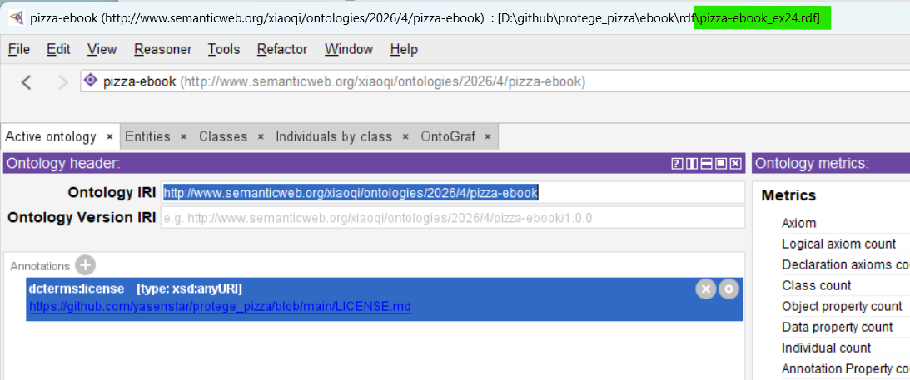

> [!Note]
> The finished state of **Exercise 25** will be saved as `pizza-ebook_ex25.rdf`.
> Two changes in the RDF for your attention:
> 1. Ontology IRI remove the exercise number context, keep as `http://www.semanticweb.org/xiaoqi/ontologies/2026/4/pizza-ebook` so that you don't need to change PREFIX when you create SPARQL queries.
> 2. License link is updated as https://github.com/yasenstar/protege_pizza/blob/main/LICENSE.md

**Step 2: Create the `hasSpiciness` object property**

1. Navigate to the **Object properties** tab. (Under **Entities** tab)
   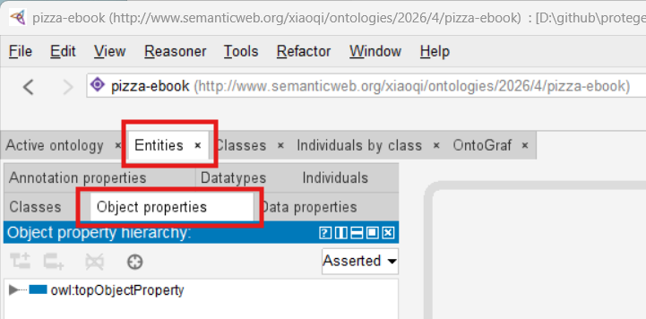
2. Select `owl:topObjectProperty` in the property hierarchy
   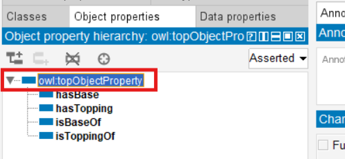
3. Click the **Add sub property** icon
   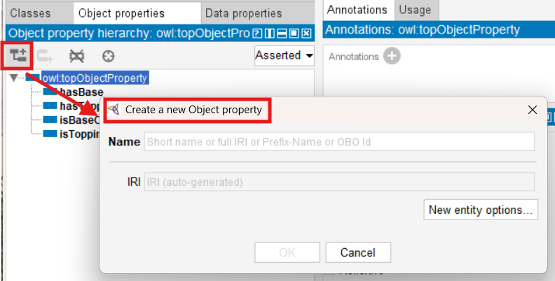
4. Name the new property `hasSpiciness`
   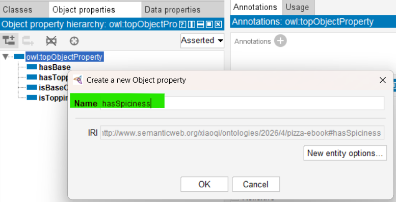
5. Click `OK`.
   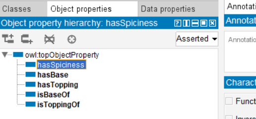

**Step 3: Define the domain and range of `hasSpiciness**

1. Select `hasSpiciness` in the property hierarchy
2. In the Description view, locate the **Domains (intersection)** section
   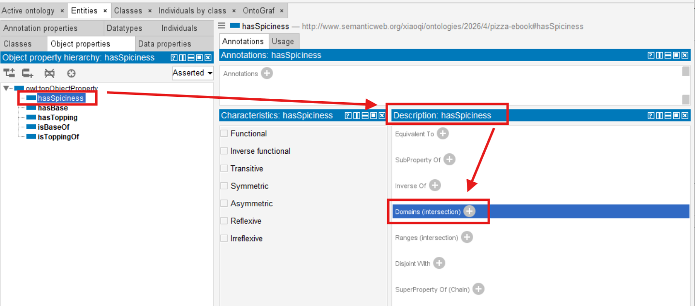
3. Click the Add icon (+), it may keep showing your previous tab, like this `Class expression editor`
   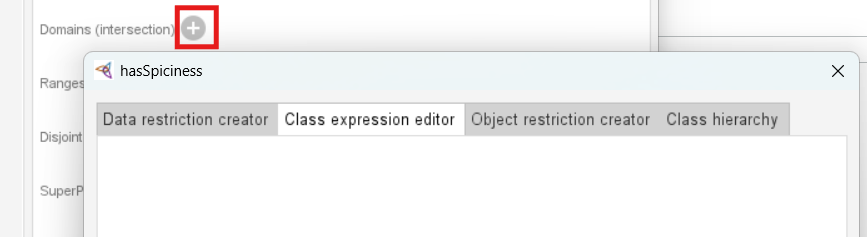
4. In the dialog, use the **Class hierarchy** tab to select `PizzaTopping`
   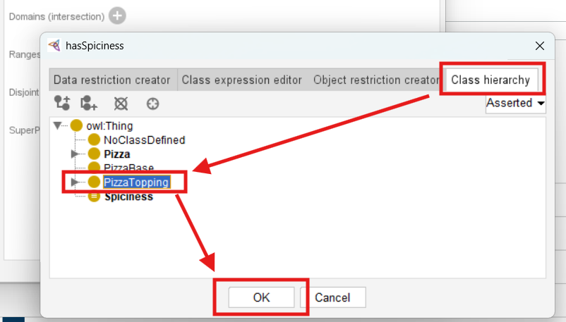
5. Click `OK`
   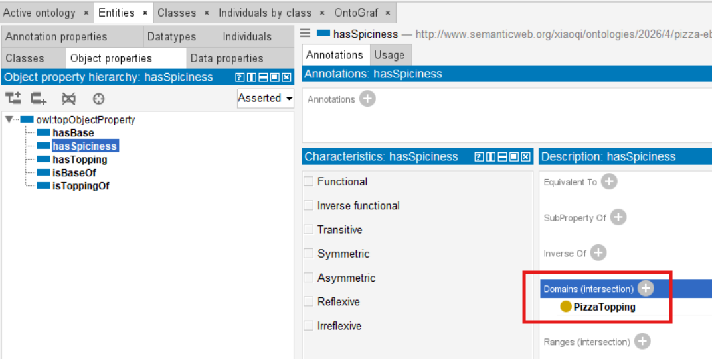
6. In the Description view, locate the **Range (intersection)** section
   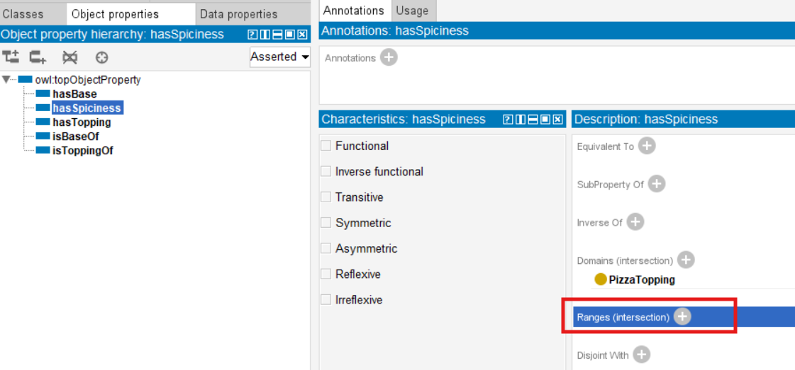
7. Click the Add icon (+)
   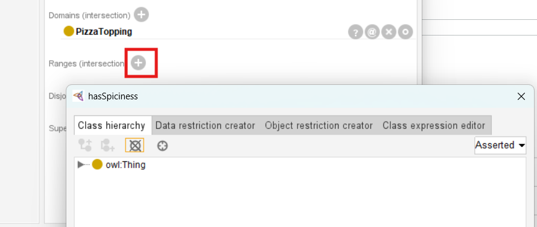
8. In the dialog, use the **Class hierarchy** tab to select `Spiciness`
   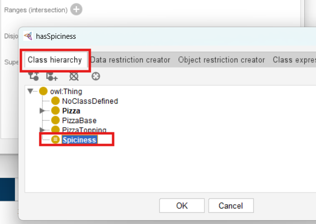
9. Click `OK`
   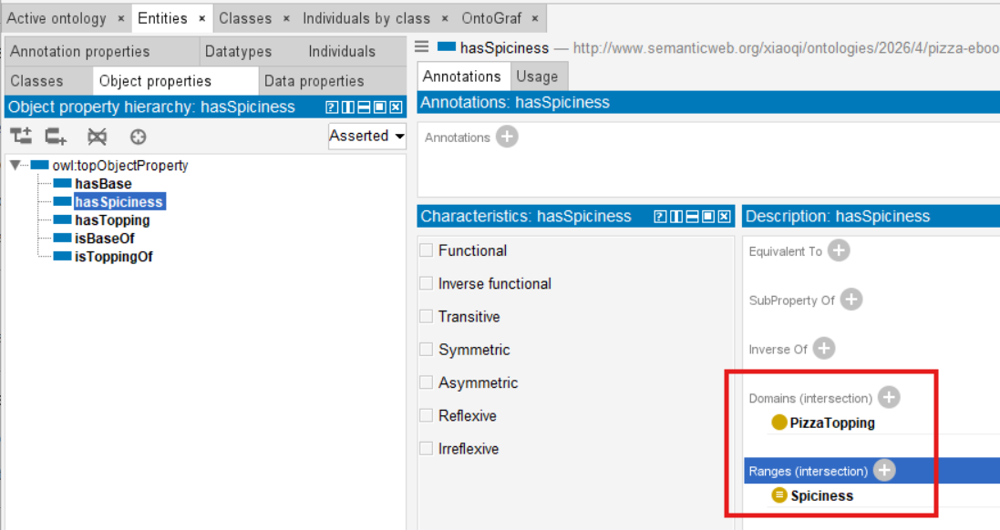

After this step, `hasSpiciness` has the following description:

```text
Object Property: hasSpiciness
   Domain: PizzaTopping
   Range: Spiciness
```

**Step 4: Synchronize the reasoner**

Select `Reasoner > Synchronize reasoner` (Ctrl+R).

The reasoner now knows about the new property and its domain/range constraints. This is important before we use the property in restrictions -- the reasoner will validate that the restrictions we add are consistent with the property's signature.

**Step 5: Add the `hasValue` restriction to `JalapenoPepperTopping`**

1. Navigate to the **Classes** tab
   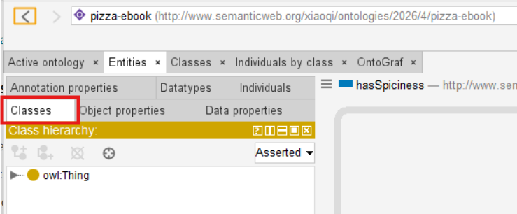
2. Select `JalapenoPepperTopping` in the class hierarchy
   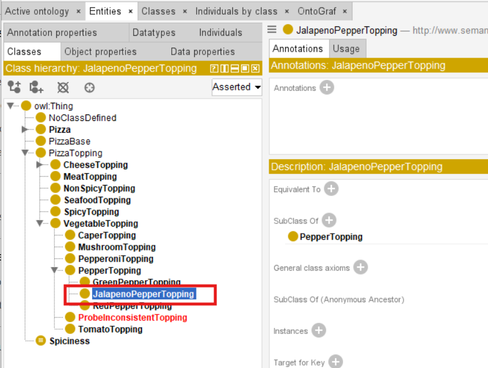
3. In the **Description** view, locate the **SubClass Of** section
   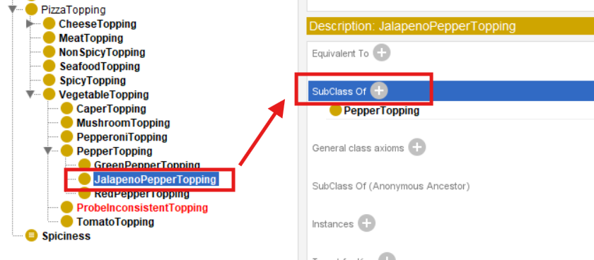
4. Click the Add icon (+)
   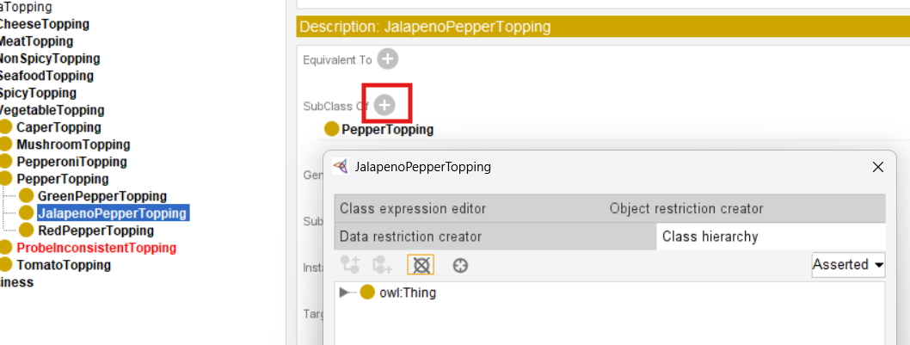
5. In the Class Expression Editor, enter: `hasSpiciness value Hot`
   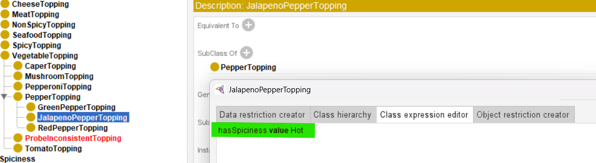
6. Click `OK`
   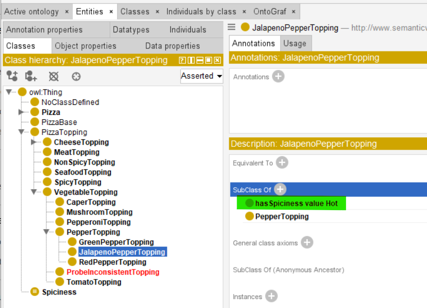

After this step, `JalapenoPepperTopping` has:

```text
Class: JalapenoPepperTopping
   SubClassOf: PepperTopping
   SubClassOf: hasSpiciness value Hot
```

> [!Note]
> This is a different kind of restriction from the ones we have ever used before. In `some` and `only` restrictions, the filler was a *class* -- `hasTopping some CheeseTopping` says "at least one cheese topping," but does not specify *which* cheese topping. In a `value` restriction, the filler is a *specific individual* -- `hasSpiciness value Hot` says the spiciness must be exactly the individual `Hot`. This is why the keyword is `value` rather than `some` or `only`.

**Step 6: Create the `SpicyPizza` class**

1. Make sure `Pizza` is selected in the class hierarchy
   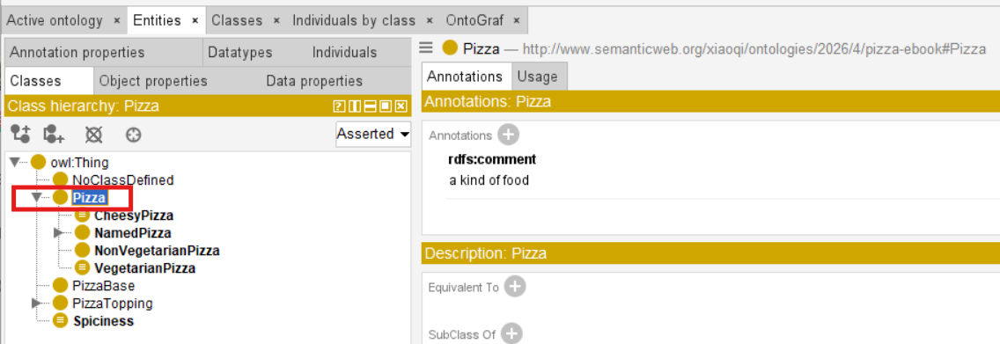
2. Click the **Add subclass** icon.
   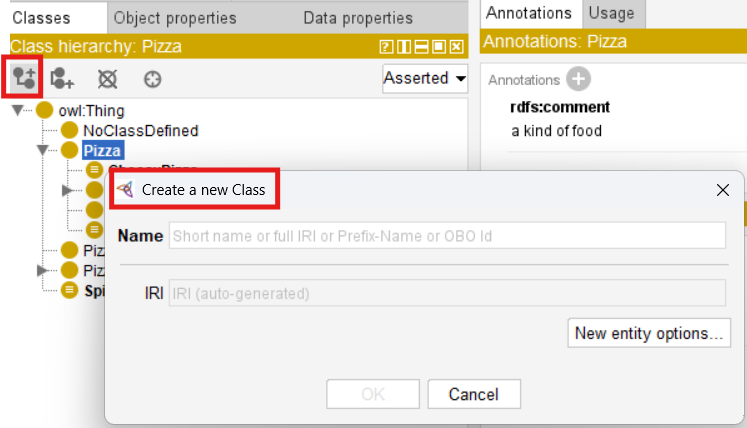
3. Name the new class `SpicyPizza`
   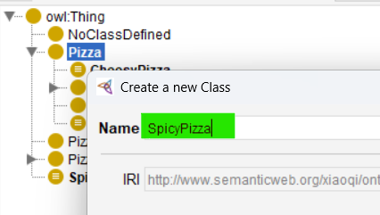
4. Click `OK`
   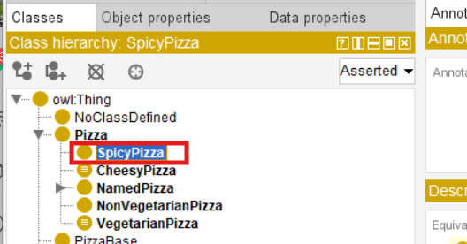

**Step 7: Add the nested `hasValue` restriction to `SpicyPizza`**

1. Select `SpicyPizza`
2. In the **Description** view, locate the **SubClass Of** section
   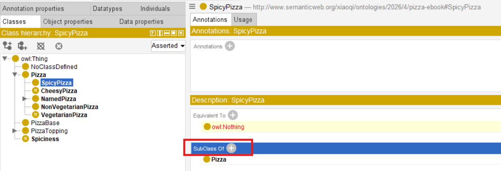
3. Click the Add icon (+)
   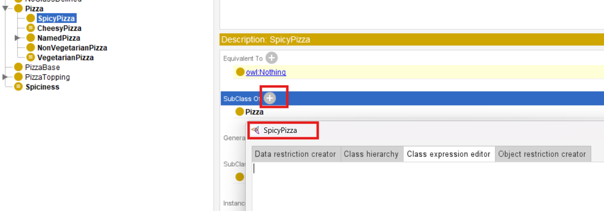
4. In the Class Expression Editor, enter: `hasTopping some (hasSpiciness value Hot)`
   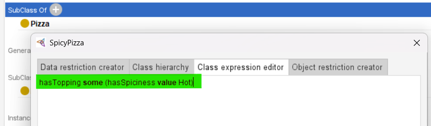
5. Click `OK`
   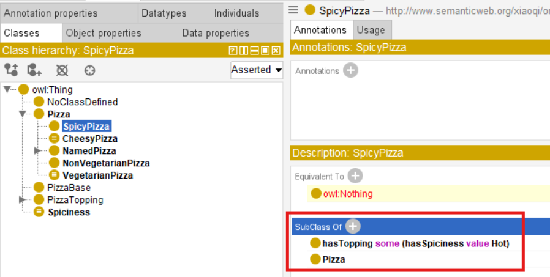

After this step, `SpicyPizza` has:

```text
Class: SpicyPizza
   SubClassOf: Pizza
   SubClassOf: hasTopping some (hasSpiciness value Hot)
```

This says: "A `SpicyPizza` must have at least one topping whose `hasSpiciness` property value is `Hot`." Note the *nesting*: `hasTopping some (...)` is an existential restriction whose filler is itself a `hasValue` restriction. This composition is what makes the pattern powerful -- a restriction inside a restriction.

**Step 8: Convert `SpicyPizza` to a defined class**

1. Make sure `SpicyPizza` is still selected
2. Select `Edit > Convert to defined class` (or from right-click menu)
   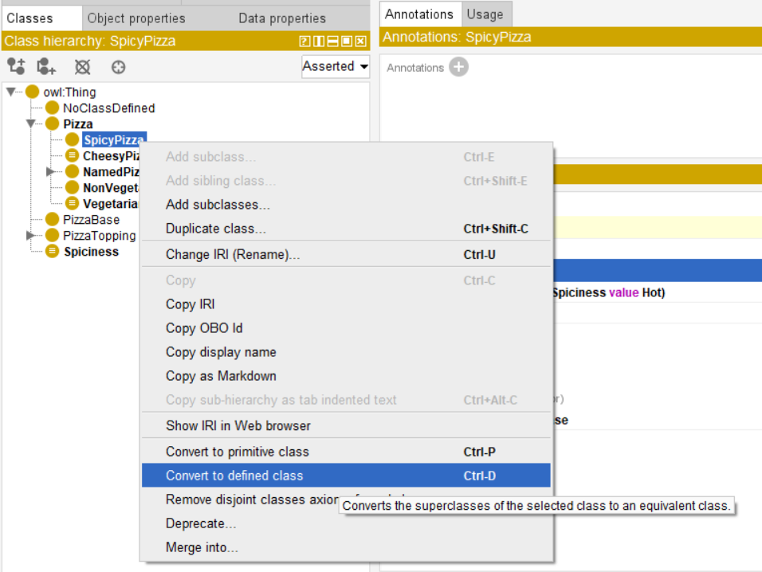

Observe what happens in the Description view. The `SubClassOf` axiom for the existential restriction is moved to `EquivalentTo`:

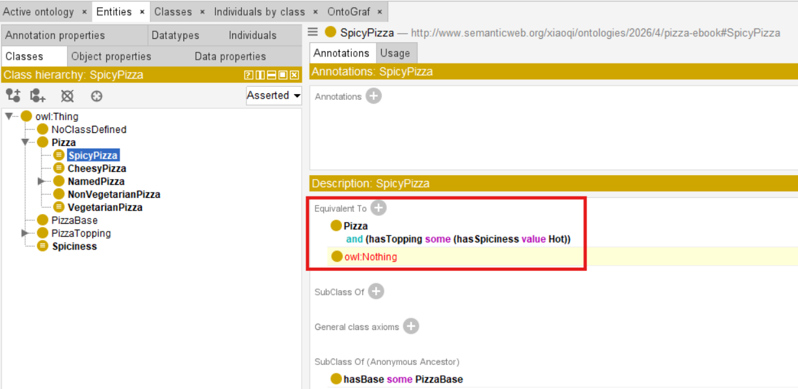

```text
Class: SpicyPizza
   EquivalentTo: Pizza and (hasTopping some (hasSpiciness value Hot))
   SubClassOf: Pizza
```

> [!Note]
> The `SpicyPizza` class is now shown with three horizontal stripes in the class icon -- the visual indicator that it is a defined class.

**Step 9: Synchronize the reasoner**

Select `Reasoner > Synchronize reasoner` (Ctrl+R)

**Step 10: Observe the result**

Look at the **Class hierarchy (inferred)** tab:

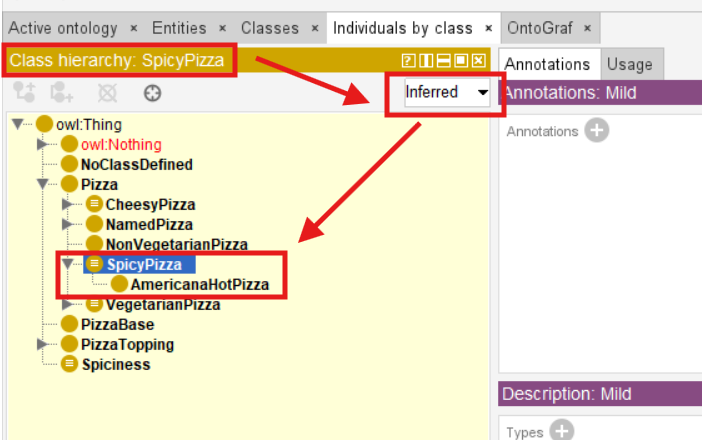

The reasoner now classifies `AmericanaHotPizza` as a **subclass of** `SpicyPizza`. This is because:

1. `AmericanaHotPizza` has a topping `JalapenoPepperTopping` (inherited from `AmericanaPizza`)
   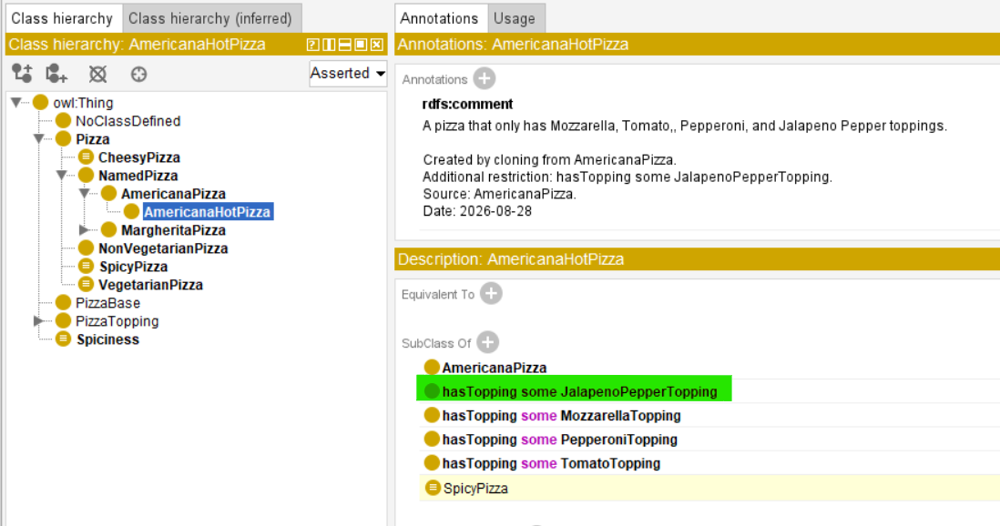
2. `JalapenoPepperTopping` has `hasSpiciness value Hot`.
   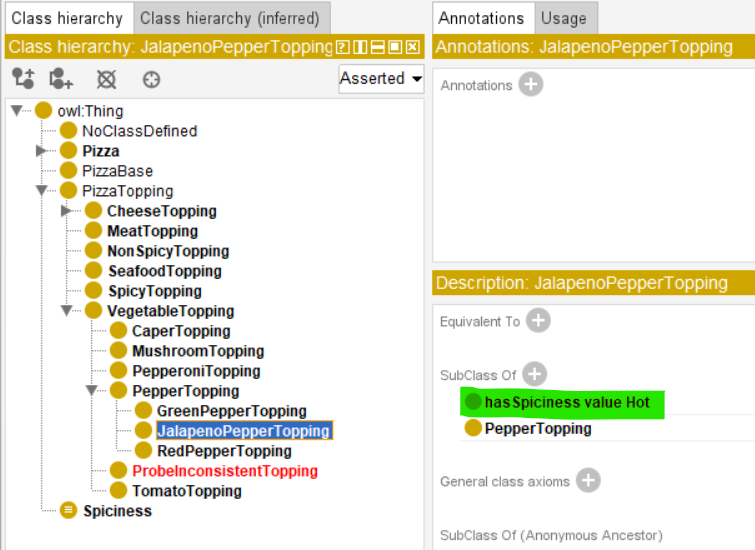
3. `SpicyPizza` is defined as a `Pizza` that has at least one topping whose `hasSpiciness` value is `Hot`
   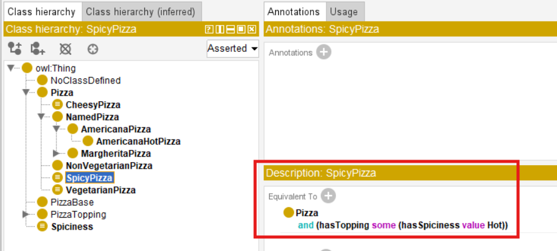
4. Therefore, `AmericanaHotPizza` satisfies the definition of `SpicyPizza`
   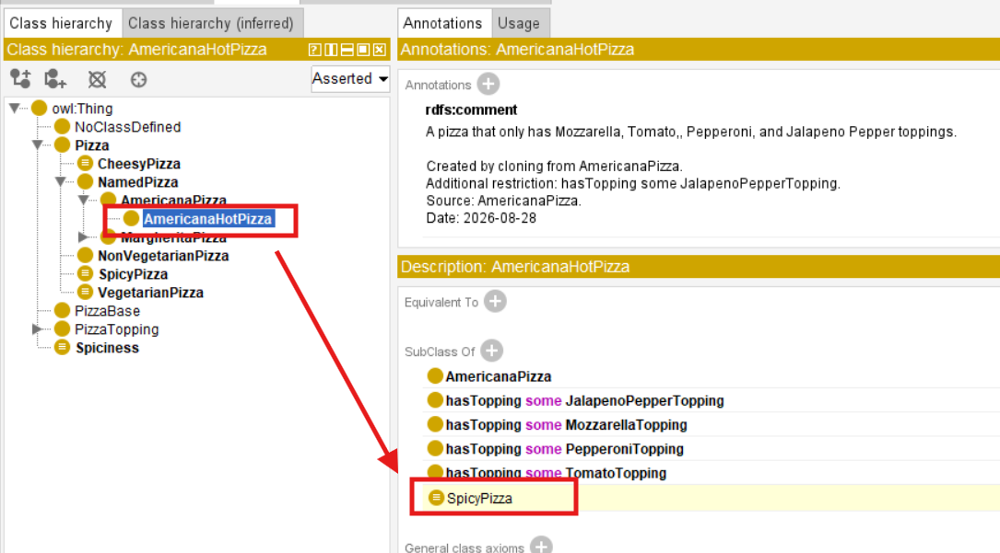

The reasoner has done something the human ontology engineer did not explicitly state. We never asserted that `AmericanaHotPizza` is a `SpicyPizza`. We asserted that it has `JalapenoPepperTopping`, and that `JalapenoPepperTopping` has spiciness `Hot`. The reasoner combined these facts with the definition of `SpicyPizza` and derived the classification automatically.

**Key Insight:**

> "The reasoner did not change. The definition of `SpicyPizza` did not change. Only the chain of facts changed -- from '`JalapenoPepperTopping` is a topping of `AmericanaHotPizza`' and '`JalapenoPepperTopping` has spiciness `Hot`' to '`AmericanaHotPizza` is a `SpicyPizza`'. Once the chain is complete, the reasoner can make the inference."

### 25.5.3 The Result: Value-Based Execution Logic

The `hasValue` restriction has enabled **value-based execution logic**.

For execution, this is essential. Many execution rules depend on **specific values**, not general classes of values.

For example:
- "If the temperature reading is `Critical`, then trigger an alert."
- "If the order status is `Pending`, then send a reminder."
- "If the customer tier is `Gold`, then apply a discount."

Each of these rules fires on a *specific value* from a closed value domain. The `hasValue` restrictions is the OWL construct that expresses this condition.

Contrast this with the alternative. In **Exercise 22**, we used to universal restriction (`hasTopping only ...`) to describe *what is allowed*. That restriction expressed a boundary, not a specific trigger. In **Exercise 23**, we used closure axioms to *close the world* for those boundaries. Now, in **Exercise 25**, we use `hasValue` to *bind a trigger* to a specific value.

The four constructs work together:

| Construct | Role | Exercise |
| --- | --- | --- |
| Universal restriction (`only`) | Defines what is allowed | Ex 22 |
| Closure axiom | Closes the world for a class or individual | Ex 23 |
| Enumerated class | Defines a closed value domain | Ex 24 |
| **`hasValue` restriction** | **Binds a property to a specific value** | **Ex 25** |

Each construct builds on the previous one. The universal restriction establishes a boundary. The closure axiom makes the boundary usable for classification. The enumerated class narrows the value domain to a finite set. And the `hasValue` restriction binds a trigger to one specific value within that domain.

**Key Insight:**

> "`hasValue` is the most direct connection between ontology and execution logic. It is the semantic equivalent of a state-machine transition -- `when the value is $X$, do $Y$.'"

### 25.5.4 Why `hasValue` Restrictions Matter for Execution

`hasValue` restrictions are essential for execution because:

1. **They bind properties to specific values.** Execution rules often depend on specific values, not general categories. The `hasValue` restriction is how OWL expresses this specificity.
2. **They enable precise triggers.** A trigger can be defined as "fire if the property has this specific value." Without `hasValue`, a trigger on `Spiciness` could fire on any spiciness -- `Hot`, `Medium`, or `Mild`. With `hasValue value Hot`, the trigger fires only on `Hot`.
3. **They compose with other constructs.** `hasValue` can be nested inside existential or universal restrictions, enabling complex conditions. The `SpicyPizza` definition -- `hasTopping some (hasSpiciness value Hot)` -- is a restriction inside a restriction. This composition is what makes the pattern expressive enough for real execution logic.
4. **They connect closed value domains to specific triggers.** In **Exercise 24**, we closed the value domain ("world") for `Spiciness`. In **Exercise 25**, we use that closed domain to bind specific triggers. The two constructs work as a team.

The table below contrasts the behavior of a property with and without `hasValue`:

| Aspect | Without `hasValue` | With `hasValue` |
| --- | --- | --- |
| **Trigger condition** | Fires on any value of the property | Fires on one specific value |
| **Reasoner behavior** | Cannot distinguish between values | Can distinguish specific values |
| **Semantic strength** | Description of a class of conditions | Specification of a specific condition |
| **Execution readiness** | Not executable for value-specific triggers | Executable for value-specific triggers |

**Key Insight:**

> "Every semantic trigger is ultimately a `hasValue` restriction somewhere. The trigger fires when the property has the specific value that the trigger was designed to detect."

### 25.5.5 Engineering Perspective: Exercise 25 as a Case Study

From the perspective of Protégé, **Exercise 25** involves creating a property, adding a restriction to a topping class, and defining a pizza class with a nested restriction. It appears to be moderate modeling activity.

From the perspective of ontology engineering, however, something important has occurred. The ontology now contains **value-based conditions** -- the semantic equivalent of conditional logic. The reasoner can fire on a specific value, not just a class of values.

The engineering contribution of **Exercise 25** can be summarized as follows:

| Engineering Perspective | Contribution from Exercise 25 |
| --- | --- |
| **SKDL Stage** | Stage 7 -- Executable Knowledge |
| **Primary Objective** | Introduce the `hasValue` restriction as a value-binding primitive |
| **Modeling Activity** | 1. Create `hasSpiciness` property;<br>2. Add `hasSpiciness value Hot` to `JalapenoPepperTopping`;<br>3. Define `SpicyPizza` using `hasTopping some (hasSpiciness value Hot)` |
| **Engineering Outcome** | Enable value-based execution logic; the reasoner now classifies `AmericanaHotPizza` as a subclass of `SpicyPizza` by composing the value binding with the topping relationship |
| **Preparation for Later Sections** | Establish the value-binding foundation for the trigger conditions in **Exercise 26** and the execution synthesis in **§25.6** |

**Key Insight:**

> "**Exercise 25** is the moment the ontology gains the ability to express value-based conditions. This is the semantic foundation of triggers."

> [!Tip] Following the Tutorial
> **Exercise 25** in the original `Pizza` Tutorial creates the `hasSpiciness` property with domain `PizzaTopping` and range `Spiciness`, adds the `hasSpiciness value Hot` restriction to `JalapenoPepperTopping`, and defines `SpicyPizza` as `hasTopping some (hasSpiciness value Hot)`, then converts it to a defined class and synchronizes the reasoner.
>
> In this book, we have followed the tutorial's construction -- same property, same restriction, same defined class. The only difference is **presentational**: we have added the observation that this constitutes a *value-binding execution primitive*, and we have explicitly noted that the `value` keyword differs from `some` and `only` in binding a specific individual rather than a class of individuals.
> 
> The tutorial introduces the construct; the book frames it in terms of executability.

## 25.6 Chapter Summary

## 25.7 Looking Ahead -- A Bridge to Chapter 26

---

Last updated at 2026-10-02