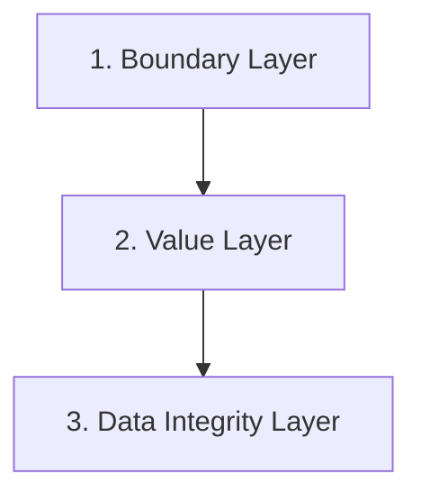

# Chapter 26 - Stage 7 of SKDL -- Executable Knowledge (Part 3): Data Integrity & Comprehensive Architecture

**Completing the Executable Ontology**

Chapter 24 built the boundary layer of an executable ontology. Chapter 25 built the value layer. This chapter builds the last layer -- **data integrity** -- and then steps back to view the whole of Stage 7 as a single architecture.

By the end of this chapter, we will have consolidated **five execution primitives** into a single anatomy, examined executability from four complementary perspectives (mathematical, historical, industrial, and EKA), and closed the design-pattern family that began in Chapter 22.

This is the final chapter of Stage 7. It completes the SKDL lifecycle and prepares the synthesis that follows in Chapter 27

- [26.1 Chapter Introduction](#261-chapter-introduction)
- [26.2 Learning Objectives](#262-learning-objectives)
- [26.3 Exercise 26 -- Cardinality Restrictions and Data Completeness](#263-exercise-26----cardinality-restrictions-and-data-completeness)
- [26.4 The Anatomy of an Executable Ontology](#264-the-anatomy-of-an-executable-ontology)
- [26.5 Mathematical Perspective](#265-mathematical-perspective)
- [26.6 Historical Perspective](#266-historical-perspective)
- [26.7 Industrial Perspective](#267-industrial-perspective)
- [26.8 EKA Perspective -- Stage 7 Establishes $\\Theta$ + $\\Phi$](#268-eka-perspective----stage-7-establishes-theta--phi)
- [26.9 Engineering Guidelines for Executable Knowledge](#269-engineering-guidelines-for-executable-knowledge)
- [26.10 Key Concepts](#2610-key-concepts)
- [26.11 Chapter Summary](#2611-chapter-summary)
- [26.12 Looking Ahead -- Toward SKDL Synthesis](#2612-looking-ahead----toward-skdl-synthesis)

## 26.1 Chapter Introduction

We have now built two layers of an executable ontology.

**The boundary layer** (Chapter 24). Universal restrictions told the reasoner what was *allowed*; closure axioms closed the world around those boundaries. The ontology could classify `MargheritaPizza` and `SohoPizza` as `VegetarianPizza`, deterministically and without ambiguity.

**The value layer** (Chapter 25). Enumerated classes closed the *set of possible values* for a property (`Spiciness = {Hot, Medium, Mild}`). `hasValue` restrictions bound a property to a *specific value* from that set (`JalapenoPepperTopping hasSpiciness value Hot`). The ontology could fire a trigger on a specific value rather than a category.

But a boundary and a value together are still not enough to execute safely.

Consider what happens when the ontology classifies a pizza as `SpicyPizza` because it has at least one `Hot` topping. What if the pizza has *no* topping? What if it has *two* `hasBase` assertions? What if the property that the rule depends on is simply *missing*?

The reasoner under the Open World Assumption will not complain. It will simply *not* fire the rule, and the execution system will silently do nothing. That is the quiet failure mode of an ontology that has not been engineered for **integrity**.

The third layer of executability solves this. It is the **data integrity layer** -- the layer that guarantees the *presence and cardinality* of the data that triggers depend on.

This chapter introduces the last execution primitive -- the **cardinality restriction** (**Exercise 26**) -- and then consolidates all five primitives into a single architecture.

**key Insight:**

> "A boundary tells the system what is permitted. A value tells the system what to act on. Cardinality tells the system *when it has enough to act*. Only all three together make execution safe."

## 26.2 Learning Objectives

After completing this chapter, you should be able to achieve the following learning outcomes:

**Knowledge:**

- Explain why data integrity is the third layer of an executable ontology
- Distinguish the three cardinality restrictions: `min`, `maz`, and `exactly`
- Understand how cardinality differs from the closure and value layers
- Explain how the five execution primitives of Stage 7 form a single anatomy
- Trace the two historical lineages of executability: AI reasoning and industrial process
- Apply executable knowledge to industrial scenarios (manufacturing, compliance, process)

**Practical Skills:**

- Create cardinality restrictions (`min`, `max`, `exactly`) in Protégé
- Use `hasTopping min 3 PizzaTopping` and other cardinality patterns
- Convert a class using cardinality to a defined class
- Test cardinality-based classification by synchronizing the reasoner
- Verify that reasoner-inferred classifications match the intended integrity constraints

**Mathematical Perspective:**

- Understand cardinality as the bounded-extension restriction on a property
- Explain the relationship between cardinality, functional properties, and `hasValue`
- Understand how cardinality restrictions close the "number of values" dimension

**Engineering Perspective:**

- Understand data integrity as the *last* layer, not the first
- May the five Stage 7 primitives to the $\Theta/\Phi$ architecture
- Apply executable ontologies in industrial contexts

## 26.3 Exercise 26 -- Cardinality Restrictions and Data Completeness

## 26.4 The Anatomy of an Executable Ontology

Syntheses of the five primitives + EKA mapping

## 26.5 Mathematical Perspective

Closure as set restriction, enumeration as finite extension, `hasValue1 as singleton binding, cardinality as bounded extension

## 26.6 Historical Perspective

From expert systems and production rules to modern rule engines and executable knowledge

## 26.7 Industrial Perspective

ISA-95 / Rhize and the reasoning-to-execution pipeline in manufacturing

## 26.8 EKA Perspective -- Stage 7 Establishes $\Theta$ + $\Phi$

## 26.9 Engineering Guidelines for Executable Knowledge

## 26.10 Key Concepts

## 26.11 Chapter Summary

## 26.12 Looking Ahead -- Toward SKDL Synthesis

---

Last updated at 2026-10-03