# Chapter 26 - Stage 7 of SKDL -- Executable Knowledge (Part 3): Data Integrity & Comprehensive Architecture

**Completing the Executable Ontology**

Chapter 24 built the boundary layer of an executable ontology. Chapter 25 built the value layer. This chapter builds the last layer -- **data integrity** -- and then steps back to view the whole of Stage 7 as a single architecture.

By the end of this chapter, we will have consolidated **five execution primitives** into a single anatomy, examined executability from four complementary perspectives (mathematical, historical, industrial, and EKA), and closed the design-pattern family that began in Chapter 22.

This is the final chapter of Stage 7. It completes the SKDL lifecycle and prepares the synthesis that follows in Chapter 27

- [26.1 Chapter Introduction](#261-chapter-introduction)
- [26.2 Learning Objectives](#262-learning-objectives)
- [26.3 Exercise 26 -- Cardinality Restrictions and Data Completeness](#263-exercise-26----cardinality-restrictions-and-data-completeness)
  - [26.3.1 The Engineering Objectives](#2631-the-engineering-objectives)
  - [26.3.2 Implementation: Creating the Cardinality Restriction](#2632-implementation-creating-the-cardinality-restriction)
  - [26.3.3 Why the Reasoner Did Not Classify the Three Pizzas](#2633-why-the-reasoner-did-not-classify-the-three-pizzas)
  - [26.3.4 How to Make the Cardinality Fire](#2634-how-to-make-the-cardinality-fire)
    - [Attempt 1 -- Add a closure axiom (the pattern from Chapter 24)](#attempt-1----add-a-closure-axiom-the-pattern-from-chapter-24)
    - [Attempt 2 -- Correct the Stage 1 modeling error, then re-test](#attempt-2----correct-the-stage-1-modeling-error-then-re-test)
      - [Attempt 2.1 -- Diagnose the remaining two pizzas](#attempt-21----diagnose-the-remaining-two-pizzas)
      - [Attempt 2.2 -- Correct all three Stage 1 modeling errors](#attempt-22----correct-all-three-stage-1-modeling-errors)
    - [Approach 2 -- Assert the cardinality directly](#approach-2----assert-the-cardinality-directly)
  - [26.3.5 Understanding Protégé UI Behavior: Why "SubClass Of" Becomes Empty After Conversion](#2635-understanding-protégé-ui-behavior-why-subclass-of-becomes-empty-after-conversion)
- [26.4 The Anatomy of an Executable Ontology](#264-the-anatomy-of-an-executable-ontology)
- [26.5 Mathematical Perspective](#265-mathematical-perspective)
- [26.6 Historical Perspective](#266-historical-perspective)
- [26.7 Industrial Perspective](#267-industrial-perspective)
- [26.8 EKA Perspective -- Stage 7 Establishes $\\Theta$ + $\\Phi$](#268-eka-perspective----stage-7-establishes-theta--phi)
- [26.9 Engineering Guidelines for Executable Knowledge](#269-engineering-guidelines-for-executable-knowledge)
- [26.10 Key Concepts](#2610-key-concepts)
- [26.11 Chapter Summary](#2611-chapter-summary)
- [26.12 Looking Ahead -- Toward SKDL Synthesis](#2612-looking-ahead----toward-skdl-synthesis)

## 26.1 Chapter Introduction

We have now built two layers of an executable ontology.

**The boundary layer** (Chapter 24). Universal restrictions told the reasoner what was *allowed*; closure axioms closed the world around those boundaries. The ontology could classify `MargheritaPizza` and `SohoPizza` as `VegetarianPizza`, deterministically and without ambiguity.

**The value layer** (Chapter 25). Enumerated classes closed the *set of possible values* for a property (`Spiciness = {Hot, Medium, Mild}`). `hasValue` restrictions bound a property to a *specific value* from that set (`JalapenoPepperTopping hasSpiciness value Hot`). The ontology could fire a trigger on a specific value rather than a category.

But a boundary and a value together are still not enough to execute safely.

Consider what happens when the ontology classifies a pizza as `SpicyPizza` because it has at least one `Hot` topping. What if the pizza has *no* topping? What if it has *two* `hasBase` assertions? What if the property that the rule depends on is simply *missing*?

The reasoner under the Open World Assumption will not complain. It will simply *not* fire the rule, and the execution system will silently do nothing. That is the quiet failure mode of an ontology that has not been engineered for **integrity**.

The third layer of executability solves this. It is the **data integrity layer** -- the layer that guarantees the *presence and cardinality* of the data that triggers depend on.

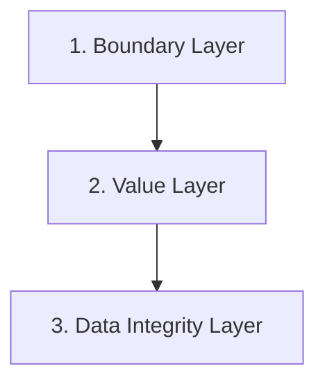
```mermaid
flowchart TD
A[1. Boundary Layer]-->B[2. Value Layer]-->C[3. Data Integrity Layer]
```

This chapter introduces the last execution primitive -- the **cardinality restriction** (**Exercise 26**) -- and then consolidates all five primitives into a single architecture.

**key Insight:**

> "A boundary tells the system what is permitted. A value tells the system what to act on. Cardinality tells the system *when it has enough to act*. Only all three together make execution safe."

## 26.2 Learning Objectives

After completing this chapter, you should be able to achieve the following learning outcomes:

**Knowledge:**

- Explain why data integrity is the third layer of an executable ontology
- Distinguish the three cardinality restrictions: `min`, `max`, and `exactly`
- Understand how cardinality differs from the closure and value layers
- Explain how the five execution primitives of Stage 7 form a single anatomy
- Trace the two historical lineages of executability: AI reasoning and industrial process
- Apply executable knowledge to industrial scenarios (manufacturing, compliance, process)

**Practical Skills:**

- Create cardinality restrictions (`min`, `max`, `exactly`) in Protégé
- Use `hasTopping min 3 PizzaTopping` and other cardinality patterns
- Convert a class using cardinality to a defined class
- Test cardinality-based classification by synchronizing the reasoner
- Verify that reasoner-inferred classifications match the intended integrity constraints

**Mathematical Perspective:**

- Understand cardinality as the bounded-extension restriction on a property
- Explain the relationship between cardinality, functional properties, and `hasValue`
- Understand how cardinality restrictions close the "number of values" dimension

**Engineering Perspective:**

- Understand data integrity as the *last* layer, not the first
- May the five Stage 7 primitives to the $\Theta/\Phi$ architecture
- Apply executable ontologies in industrial contexts

## 26.3 Exercise 26 -- Cardinality Restrictions and Data Completeness

Having established closure in **Exercise 23** and value binding in **Exercise 24 and 25**, we not turn to the final primitive of Stage 7: the **cardinality restriction.**.

This exercise follows the tutorial's **Exercise 26**, which introduces `InterestingPizza` -- a pizza with three or more toppings.

### 26.3.1 The Engineering Objectives

**Exercise 26** introduces the **Cardinality Restriction** -- a restriction on the *number* of values a property may have.

OWL provides three forms:

| Form | Meaning | Syntax |
| --- | --- | --- |
| **Minimum** | At least *n* values | `hasTopping min 3 PizzaTopping` |
| **Maximum** | At most *n* values | `hasTopping max 5 PizzaTopping` |
| **Exactly** | Exactly *n* values | `hasTopping exactly 2 PizzaTopping` |

A cardinality restriction for an "interesting pizza", for example, would be:

```text
Class: InterestingPizza
    EquivalentTo: Pizza and (hasTopping min 3 PizzaTopping)
```

This means: "An `InterestingPizza` is a `Pizza` with at least three toppings."

The engineering objective of **Exercise 26** is to demonstrate how cardinality restrictions **guarantee data completeness** -- the third and final requirement for **execution**.

Why does execution need cardinality?

Consider an execution rule that fires only when a pizza has enough toppings to qualify as "interesting". Without a cardinality restriction, the ontology cannot determine *how many* toppings the pizza has -- it can only say that *some* exist. A rule depends on count cannot fire reliably.

Cardinality closes the *number* dimension. Where the closure axiom closes the *set* of permitted toppings and `hasValue` closed the *specific value*, cardinality closes *how many* values the property may take.

**Key Insight:**

> "Cardinality is the last mile of executability. A rule that fires on 'at least three toppings' requires the ontology to know that count is enforced."

### 26.3.2 Implementation: Creating the Cardinality Restriction

Let's walk through the implementation step by step.

**Step 1: Open the `Pizza` ontology**

Open `pizza-ebook_ex25.rdf` in Protégé -- the file from the previous exercise, which now contains the enumerated class `Spiciness`, the `hasSpiciness` property, and the defined class `SpicyPizza`.

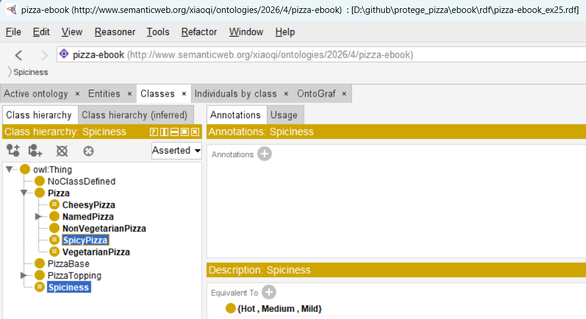

> [!Note]
> The finished state of **Exercise 26** will be saved as `pizza-ebook_ex26.rdf`.

**Step 2: Create the `InterestingPizza` class**

1. Make sure `Pizza` is selected in the class hierarchy
   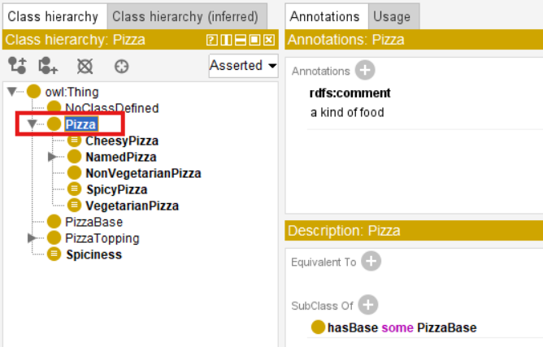
2. Click the **Add subclass** icon
   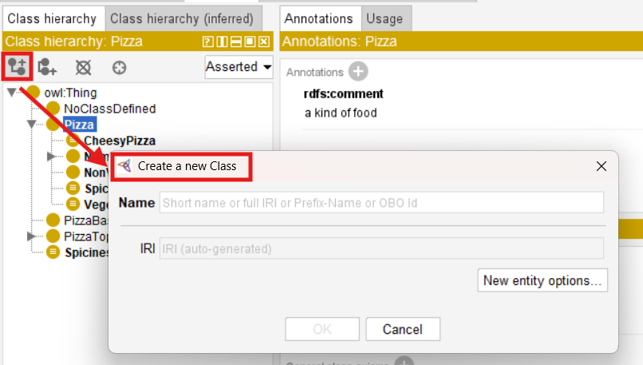
3. Name the new class `InterestingPizza`
4. 
5. Click `OK`
   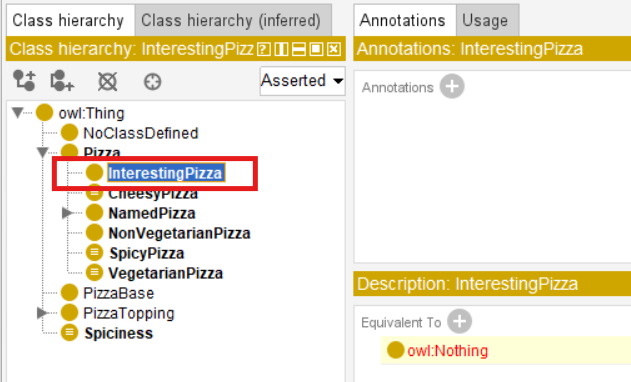

**Step 3: Add the cardinality restriction**

1. Select `InterestingPizza` (should already in focus after previous step)
2. In the Description view, locate the **SubClass Of** section
   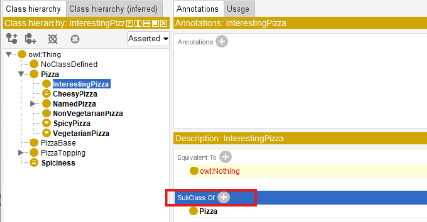
3. Click the Add icon (+)
   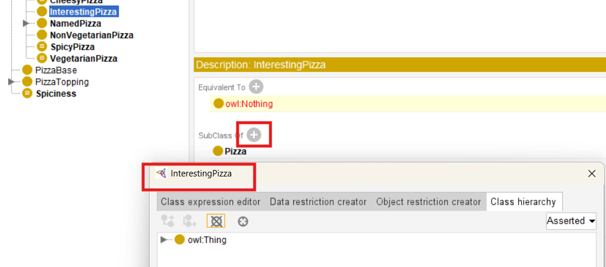
4. In the Class Expression Editor, enter: `hasTopping min 3 PizzaTopping`
   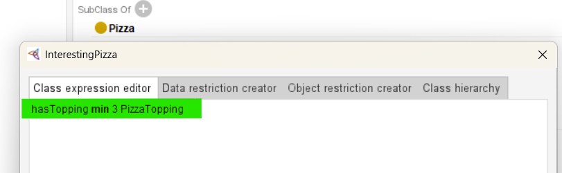
5. Click `OK`
   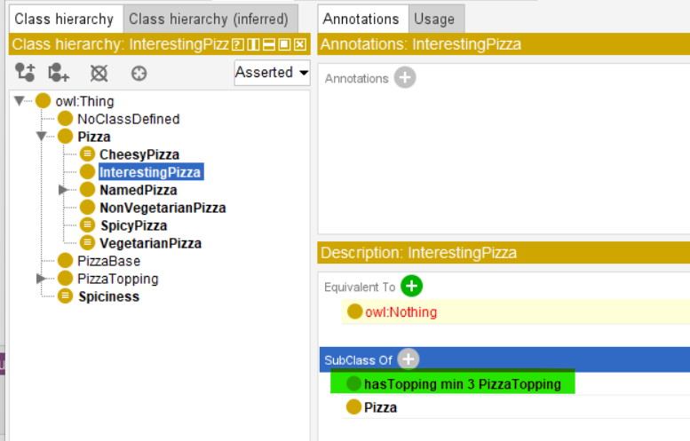

After this step, `InterestingPizza` has:

```text
Class: InterestingPizza
    SubClassOf: Pizza
    SubClassOf: hasTopping min 3 PizzaTopping
```

This says: "An `InterestingPizza` is a pizza and must have at least three toppings."

**Step 4: Convert `InterestingPizza` to a defined class**

1. Make sure `InterestingPizza` is still selected
2. Select `Edit > Convert to defined class`
   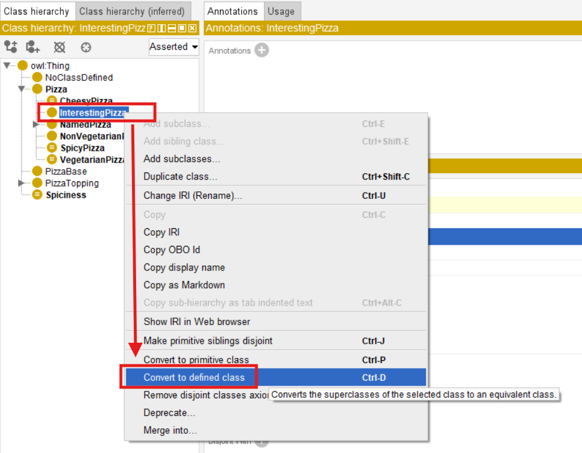

Observe what happens in the Description view. The `SubClassOf` axiom for the cardinality restriction is moved to `EquivalentTo`:

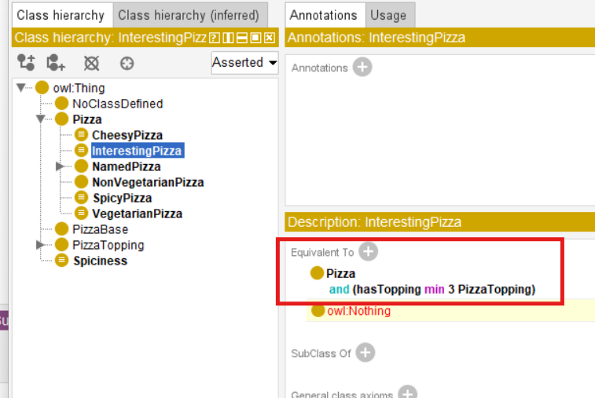

```text
Class: InterestingPizza
    EquivalentTo: Pizza and (hasTopping min 3 PizzaTopping)
    EquivalentTo: owl:Nothing
    SubClassOf: <Empty>
```

> [!Note]
> You may notice the **SubClass Of** section is empty, to learn why, check later §26.3.5 for some clarification.

**Step 5: Synchronize the reasoner**

Select `Reasoner > Synchronize reasoner` (Ctrl+R)

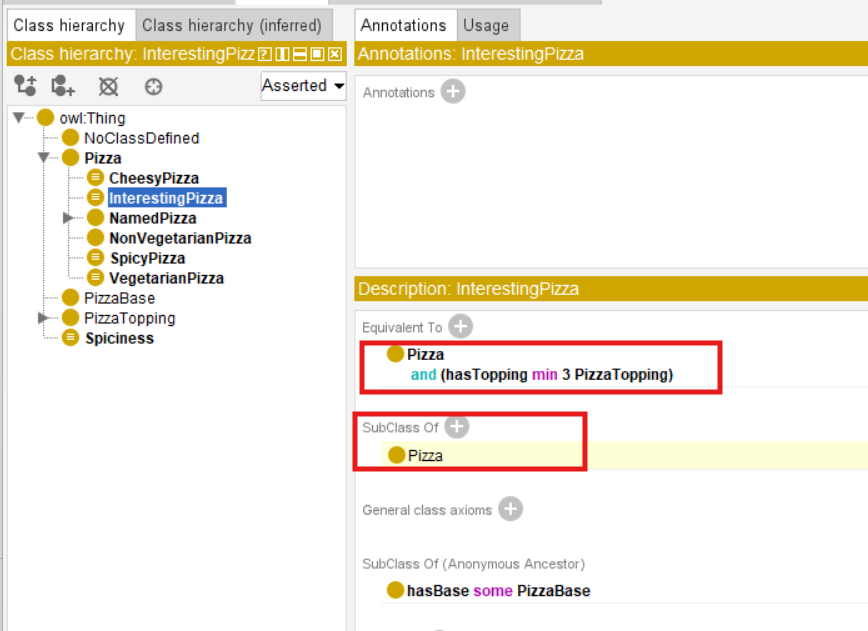

After reasoner synchronized, the **SubClass Of** section contains `Pizza` again.

```text
Class: InterestingPizza
    EquivalentTo: Pizza and (hasTopping min 3 PizzaTopping)
    SubClassOf: Pizza
```

**Step 6: Observe the result**

We would assume that the reasoner classifies pizzas with three or more toppings as subclasses of `InterestingPizza`. In the tutorial's data, these include `AmericanaHotPizza`, `AmericanaPizza`, and `SohoPizza`.

However, look at the **Class hierarchy (inferred)** tab:

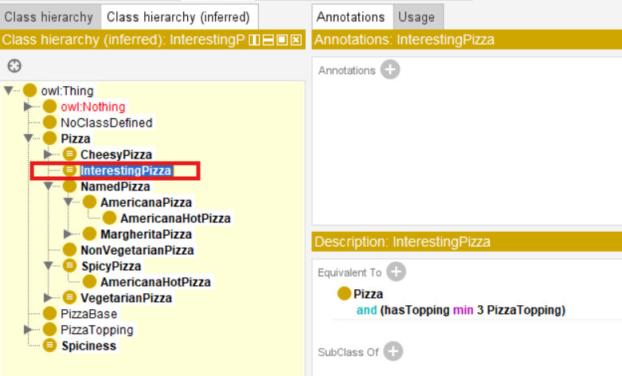

You will see something surprising: **Non of `AmericanaHotPizza`, `AmericanaPizza`, or `SohoPizza` are classified as subclasses of `InterestingPizza`.**

This is not as tutorial mentioned and unexpected. All three pizzas have three ot more toppings assertions:

| Pizza | Toppings |
| --- | --- |
| `AmericanaPizza` | Mozzarella, Pepperoni, Tomato (3) |
| `AmericanaHotPizza` | Mozzarella, Pepperoni, Tomato, Jalapeno (4) |
| `SohoPizza` | Mozzarella, Tomato, Olive, Parmesan (4) |

And yet the reasoner does not classify any of them under `InterestingPizza`.

No worry! This is not a bug in Protégé. It is a subtle consequence of how cardinality restrictions interact with existential restrictions under the Open World Assumption. It deserves its own explanation -- see **§26.3.3**.

### 26.3.3 Why the Reasoner Did Not Classify the Three Pizzas

The behavior in above Step 6 is one of the most instructive moments in this chapter. It looks like a failure, but it is a faithful reflection of OWL's semantics -- and understanding it is essential to writing executable ontologies that work in production.

**The apparent contradiction.** Each of the three pizzas has three or four existential toppings restrictions, e.g. `AmericanaPizza`:

```text
Class: AmericanaPizza
    SubClassOf: hasTopping some MozzarellaTopping
    SubClassOf: hasTopping some PepperoniTopping
    SubClassOf: hasTopping some TomatoTopping
```

A human reads this and concludes: "This pizza has three toppings." The `InterestingPizza` definition asks for `hasTopping min 3 PizzaTopping`. The count matches. So why doesn't the reasoner agree?

**The OWL semantics.** Existential restrictions do **not** commit to the number of distinct fillers. `hasTopping some X` means "there exists at least one value of `hasTopping` that is of type `x`." It does not say "there is exactly one" or "this is the only one of its kind." Under the Open World Assumption, the reasoner is forbidden from assuming the three existentials refer to three distinct individuals unless it can prove it from the axioms.

Even when the filler classers are declared disjoint -- as `MozzarellaTopping`, `PepperoniTopping`, and `TomatoTopping` are -- disjointness establishes that *if* three disjoint individuals exist, they are of different types. It does not establish that three individuals exist. The three existential restrictions could, in the reasoner's view, all be satisfied by the same single individual if that individual happened to be a member of all three classes. (In practice, disjointness rules that out here, but the reasoner cannot bridge from "there exist some X, some Y, some Z" to "there exist at least three individuals" without additional axioms.)

The `min 3 PizzaTopping` restriction, therefore, has nothing to count. The reasoner sees three *existential restrictions*, not three *toppings*, and it cannot satisfy the min-3 cardinality.

**Why this is important?** This is the single most common source of confusion when engineers first write cardinality restriction in OWL. It looks like the ontology should be able to count; semantically, it cannot, without more information. The tutorial's expectation that these pizzas would be inferred as `InterestingPizza` reflects human intuition about the data, not the reasoner's semantics.

This is not a flaw in OWL. It is a *design choice*: OWL refuses to commit to the number of values a property has unless the ontology explicitly closes the world. The consequence for execution is direct: **if a trigger depends on a count, the ontology must be engineered to that the count is provable.**

**Key Insight:**

> "The reasoner counts what the ontology proves, **not** what the engineer intends. Existential restrictions prove existence, not count. Only closure or explicit cardinality makes the count provable."

### 26.3.4 How to Make the Cardinality Fire

The fix is not to remove the cardinality restriction. The fix is to give the reasoner enough information to evaluate it. But as we are about to see, the "obvious" fix does not work -- and reason it does not work is one of the most important lessons in this chapter.

#### Attempt 1 -- Add a closure axiom (the pattern from Chapter 24)

> [!Note] Keep `pizza-ebook_ex26.rdf` as one snapshot, from now on the fix for Approach 1 is saved in `pizza-ebook_ex26-approach1.rdf`

The natural first move is to apply the closure pattern from Chapter 24. If the reasoner cannot prove the count because it does not know the toppings are exhaustively the listed ones, then close the world for each pizza class using a universal restriction:

```text
Class: AmericanaPizza
    SubClassOf: hasTopping only (MozzarellaTopping or PepperoniTopping or TomatoTopping)
```

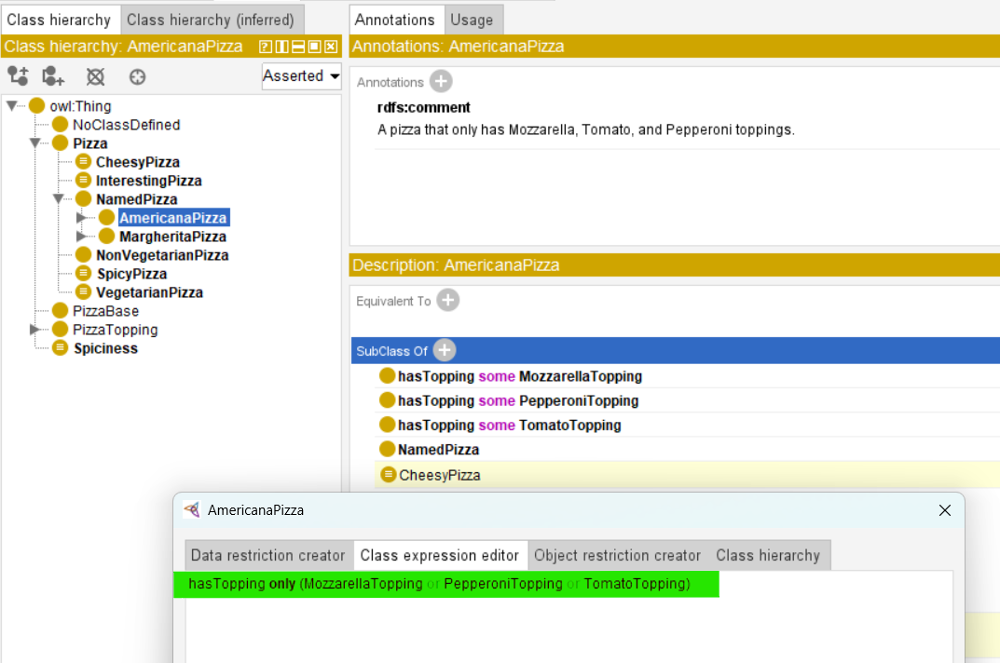

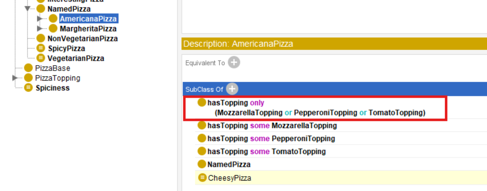

Apple the same closure to `AmericanaHotPizza` (Mozzarella, Pepperoni, Tomato, JalapenoPepper) and `SohoPizza` (Mozzarella, Tomato, Olive, Parmesan). This is exactly the pattern that worked in **Chapter 24** for `MargheritaPizza` and `SohoPizza`. It should work here too.

```text
Class: AmericanaPizza
    SubClassOf: hasTopping only (MozzarellaTopping or PepperoniTopping or TomatoPizza or JalapenoPepperTopping)
Class: SohoPizza
    SubClassOf: hasTopping only (MozzarellaTopping or TomatoTopping or OliveTopping or ParmesanTopping)
```

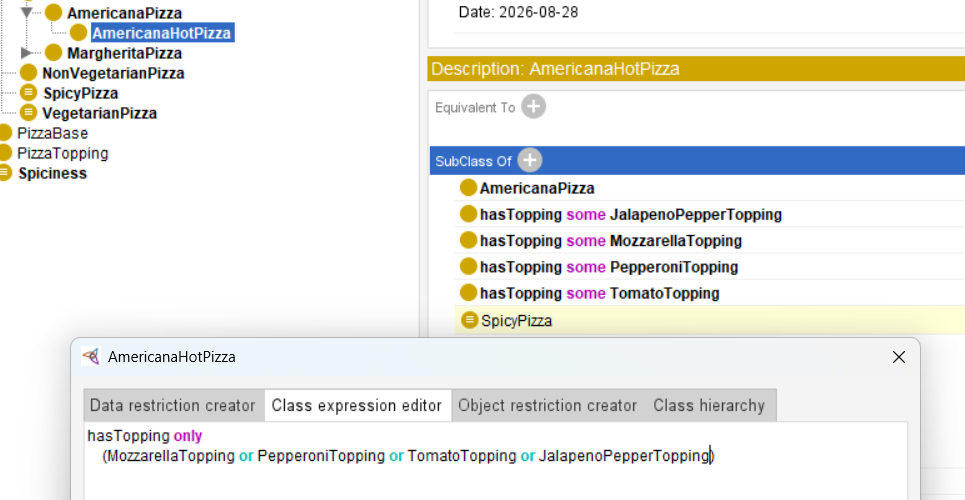

You may find `SohoPizza` has already had the needed universal restriction in the RDF working ontology till now.

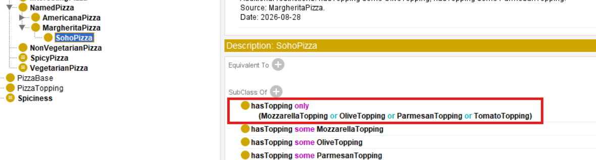

**Synchronize the reasoner and observe.** For example `AmericanaPizza`, the result is **not** what we expect:

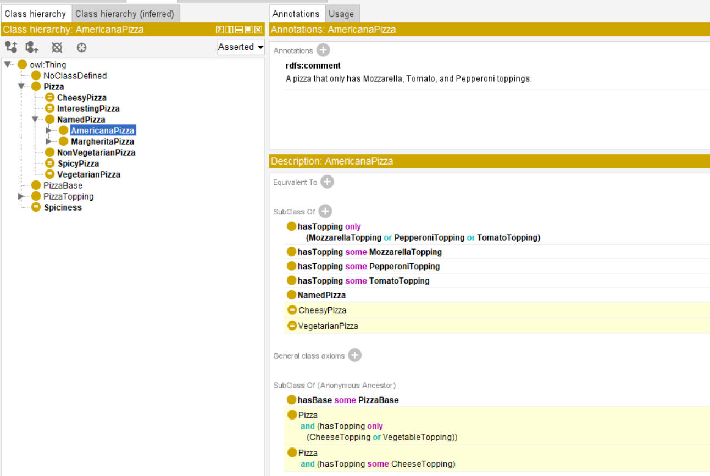

None of the three pizzas are classified as `InterestingPizza`. The closure axiom is in place -- we verified in the Protégé UI (the `hasTopping only (...)` restriction is visible in the `SubClass Of` section of `AmericanaPizza`) -- and yet the min-3 cardinality still does not fire.

**Attempt 1 has failed.** This is worth pausing on, because the failure is not a bug. It is a ***signal***.

**Why Attempt 1 failed -- and what the failure reveals?**

The closure axiom restricts the *range* of `hasTopping`: every topping must be in the listed union. This is necessary for the reasoner to bound the possible toppings. But for the min-3 cardinality to fire, the reasoner must still prove that **three distinct topping individuals exist**.

Even with the closure in place, the reasoner can prove at most **two** distinct toppings for `AmericanaPizza`, see from it's `SubClass Of` section below:

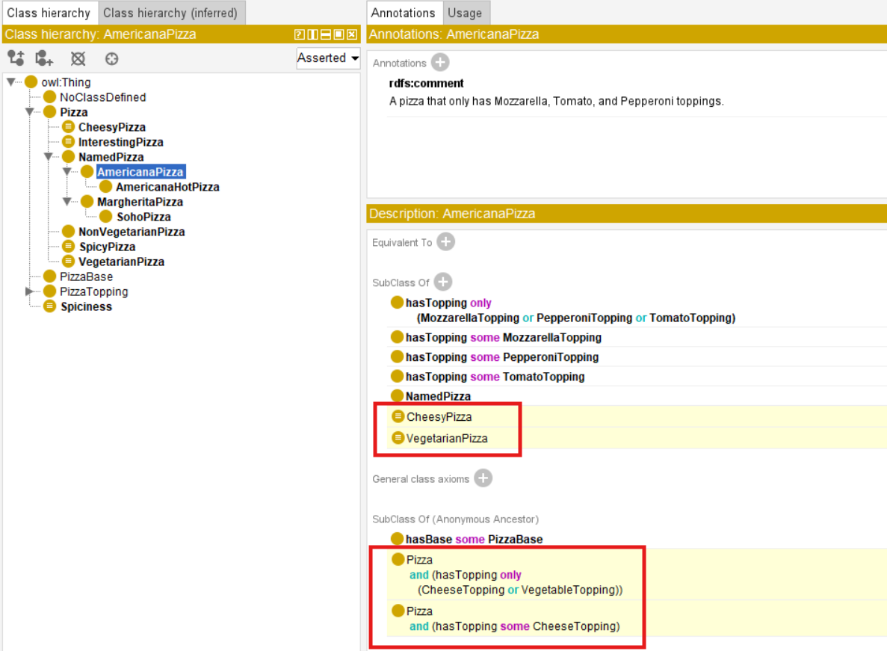

Here is why.

The reasoner's ability to count distinct individuals depends on being able to prove that two values cannot be the same individual. It proves this from **disjointness axioms**. If two classes `A` and `B` are declared disjoint, then no individual can be both an `A` and a `B`, so any individual of type `A` is distinct from any individual of type `B`.

For `AmericanaPizza`'s three toppings -- `MozzarellaTopping`, `PepperoniTopping`, `TomatoTopping` -- the reasoner needs to know that all three are pairwise disjoint. It checks the ontology:

- `MozzarellaTopping` is a subclass of `CheeseTopping`.
- `PepperoniTopping` is declared (in the working ontology) as a subclass of `VegetableTopping`.
- `TomatoTopping` is a subclass of `VegetableTopping`.

The ontology's disjointness declarations establish that `CheeseTopping`, `MeatTopping`, and `VegetableTopping` are pairwise disjoint. So:

- `MozzarellaTopping` (Cheese) is provably distinct from `PepperoniTopping` (Vegetable). :white_check_mark:
- `MozzarellaTopping` (Cheese) is provably distinct from `TomatoTopping` (Vegetable). :white_check_mark:
- `PepperoniTopping` (Vegetable) and `TomatoTopping` (Vegetable) are **not** declared disjoint from each other. :x:

So the reasoner can prove at most **two** distinct toppings for `AmericanaPizza` -- Mozzarella is distinct from the others, but Pepperoni and Tomato might be the same individual as far as the reasoner can tell. The min-3 cardinality cannot be satisfied.

**But, wait, there is a deeper problem here.** The reason `PepperoniTopping` and `TomatoTopping` are not disjoint is not an accident of the ontology's design. It is a **modeling error**.

**Pepperoni is a meat product.** It should be subclass of `MeatTopping`, not `VegetableTopping`. The working ontology got this wrong~ This is the same kind of error the SKDL was designed to catch -- but it has slipped through to Stage 7.

Let's verify the correct taxonomy. Michael DeBellis' reference ontology (`PizzaTutorialWithDataV2.owl`) declares:

```xml
<owl:Class rdf:about="...#PepperoniTopping">
    <rdfs:subClassOf rdf:resource="...#MeatTopping"/>
    ...
</owl:Class>
```

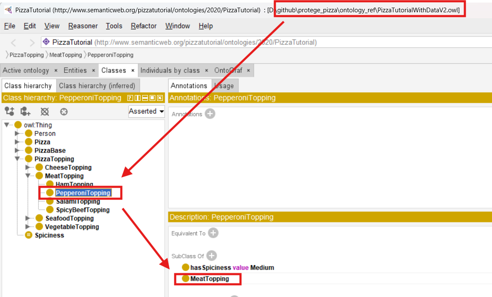

The reference is unambiguous: `PepperoniTopping` is a subclass of `MeatTopping`. The working ontology has it under `VegetableTopping`. **This is a Stage 1 modeling error.**

**Stage 7 cannot fix a Stage 1 error.**

This is the moment where the SKDL's discipline shows its value.

The SKDL is a **lifecycle**, not a checklist. Stage 7 (Executable Knowledge) depends on Stage 6 (Reasoning), which depends on Stage 5 (Validation), which depends on Stage 4 (Governance), which depends on Stage 3 (Reuse), which depends on Stage 2 (Description), which depends on Stage 1 (Conceptual Modeling).

If a modeling error exists at Stage 1, **no amount of engineering at Stage 7 will fix it**. The reasoner will faithfully compute the logical consequences of the axioms it is given -- including the axioms that encode the wrong taxonomy. Attempt 1 failed because the closure axiom's effect was undermined by a Stage 1 classification error that the closure could not compensate for.

**The honest engineering response is to go back to Stage 1, correct the model, and then re-run the Stage 7 work**.

#### Attempt 2 -- Correct the Stage 1 modeling error, then re-test

The fix is a one-line change in the class hierarchy:

```text
Class: PepperoniTopping
    SubClassOf: MeatTopping     # was: VegetableTopping
```

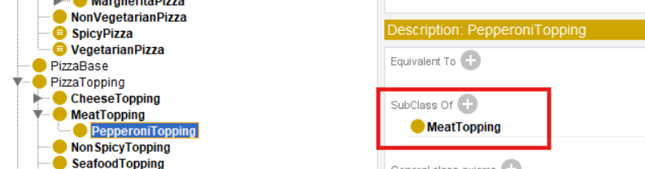

This moves `PepperoniTopping` out from under `VegetableTopping` and into its correct position under `MeatTopping`. Now `PepperoniTopping` is a subclass of `MeatTopping`, and `MeatTopping` is disjoint from `CheeseTopping` and `VegetableTopping` (per the ontology's `AllDisjointClasses` axioms).

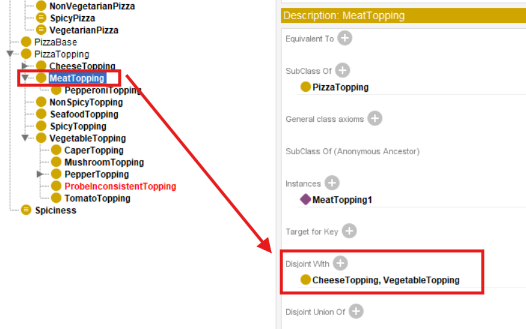

With this correction:

- `MozzarellaTopping` (Cheese) is provably distinct from `PepperoniTopping` (Meat). :white_check_mark:
- `MozzarellaTopping` (Cheese) is provably distinct from `TomatoTopping` (Vegetable). :white_check_mark:
- `PepperoniTopping` (Meat) is provably distinct from `TomatoTopping` (Vegetable). :white_check_mark:

All three toppings are now provably pairwise distinct. The reasoner can count them. Combined with the closure axiom from Attempt 1, the min-3 cardinality should now fire.

**Synchronize the reasoner and observe**. This time, the result of `AmericanaPizza` is what we expect:

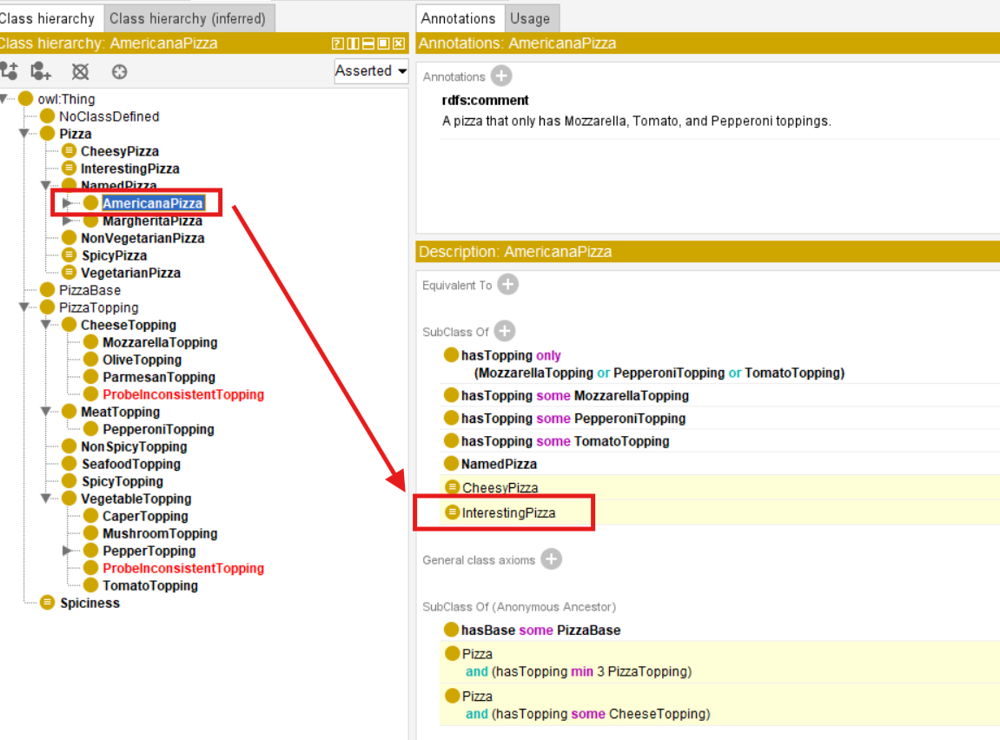

`AmericanaPizza` is now classified as subclass of `InterestingPizza`. **Good progress!**

**However, `AmericanaHotPizza` and `SohoPizza` are still not classified**. Correcting one modeling error has fixed one pizza, but not the other two. The journey continues.

##### Attempt 2.1 -- Diagnose the remaining two pizzas

The reasoner now classifies `AmericanaPizza`, but the other two still fail. Why?

The reason is the same mechanism -- **disjointness provability** -- but the specific gaps are different for each pizza.

`AmericanaHotPizza` (Mozzarella, Pepperoni, Tomato, JalapenoPepper):

> [!Note] Not include `Topping` postfix for simplified displaying purpose only.

After the Pepperoni fix, the disjointness checks are:

- Mozzarella (Cheese) vs. Pepperoni (Meat) :white_check_mark:
- Mozzarella (Cheese) vs. Tomato (Vegetable) :white_check_mark:
- Mozzarella (Cheese) vs. JalapenoPepper (Vegetable > Pepper) :white_check_mark:
- Pepperoni (Meat) vs. Tomato (Vegetable) :white_check_mark:
- Pepperoni (Meat) vs. JalapenoPepper (Vegetable > Pepper) :white_check_mark:
- **Tomato (Vegetable) vs. JalapenoPepper (Vegetable > Pepper) :x:**

Both `TomatoTopping` and `JalapenoPepperTopping` sit under `VegetableTopping`. The working ontology declares only the three pepper subclasses (`GreenPepper`, `JalapenoPepper`, and `RedPepper`) as pairwise disjoint.

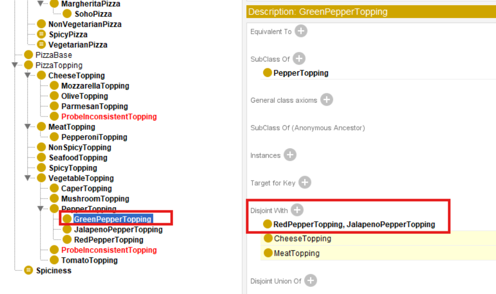

It does **not** declare the broader vegetable subclasses (`Caper`, `Mushroom`, `Pepper`, `Tomato`) as disjoint.

> [!Note] You may still see that `ProbeInconsistentTopping` as subclass of `VegetableTopping`, leave it as that's not impact this fixing result.

The reference ontology has this broader declaration for `VegetableTopping`:

```xml
<owl:members rdf:parseType="Collection">
    <rdf:Description rdf:about="...#CaperTopping"/>
    <rdf:Description rdf:about="...#MushroomTopping"/>
    <rdf:Description rdf:about="...#OliveTopping"/>
    <rdf:Description rdf:about="...#PepperTopping"/>
    <rdf:Description rdf:about="...#TomatoTopping"/>
</owl:members>
```

| Working Ontology | Reference Ontology |
| --- | --- |
| 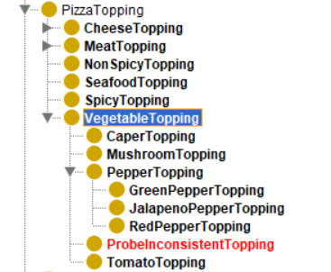 | 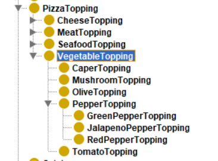 |

The working ontology is **missing this broader disjointness declaration**, also `OliveTopping` is wrongly modeled as a subclass of `CheeseTopping` while should be a subclass of `VegetableTopping`. Without the correct modeling and proper disjointness declaration, the reasoner cannot prove that Tomato and JalapenoPepper are disjoint.

Now let's examine `SohoPizza`.

`SohoPizza` (Mozzarella, Olive, Parmesan, Tomato):

This pizza reveals **another modeling error** (although not directly impacting `AmericanaHotPizza` reasoning above). In the working ontology, `OliveTopping` is declared as a subclass of `CheeseTopping`:

```xml
<owl:Class rdf:about="...#OliveTopping">
    <rdfs:subClassOf rdf:resource="...#CheeseTopping"/>
</owl:class>
```

But Olive is not a cheese. In the reference ontology, `OliveTopping` is a subclass of `VegetableTopping` (see table above). **This is a second Stage 1 modeling error.**

With Olive misplaced under Cheese, `SohoPizza`'s toppings become: Mozzarella (Cheese), Tomato (Vegetable), Olive (Cheese), Parmesan (Cheese). The reasoner checks:

- Mozzarella (Cheese) vs. Tomato (Vegetable) :white_check_mark:
- Mozzarella (Cheese) vs. Olive (Cheese) -- both cheese, no disjointness declared :x:
- Mozzarella (Cheese) vs. Parmesan (Cheese) -- both cheese, no disjointness declared :x:
- Olive (Cheese) vs. Parmesan (Cheese) :x:
- Tomato (Vegetable) vs. all cheeses :white_check_mark:

The reasoner can prove at most **two** distinct toppings for `SohoPizza`. The min-3 fails.

##### Attempt 2.2 -- Correct all three Stage 1 modeling errors

The complete set of corrections is:

**Correction 1 (already applied):** `PepperoniTopping` $\sqsubseteq$ `MeatTopping` (was `VegetableTopping`).

**Correction 2:** `OliveTopping` $\sqsubseteq$ `VegetableTopping` (was `CheeseTopping`)

| Before Fixing | After Fixing |
| --- | --- |
| 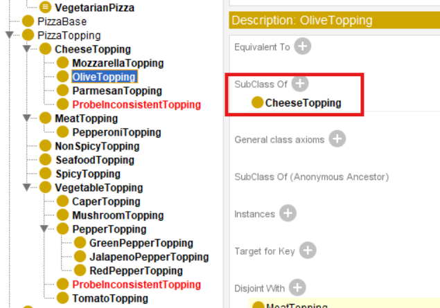 | 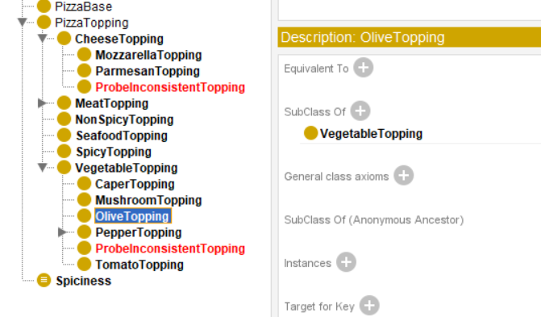 |

```text
Class: OliveTopping
    SubClassOf: VegetableTopping    # was: CheeseTopping
```

After this correction step, synchronizing reasoner still not have `InterestingPizza` as subclass of `AmericanaHotPizza`:


The fixing is not completed.

**Correction 3:** Add the broad vegetable disjointness declaration.

```text
DisjointClasses: CaperTopping, MushroomTopping, OliveTopping, PepperTopping, TomatoTOpping
```

You can see this kind of broad vegetable disjointness in reference ontology as:

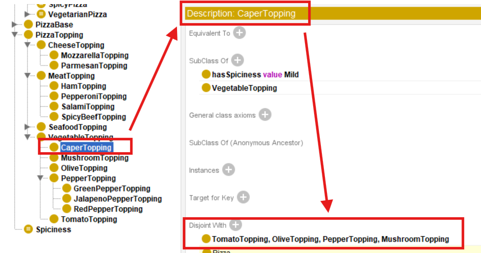

| Before adding broad Disjointness | After adding broad Disjointness |
| --- | --- |
| 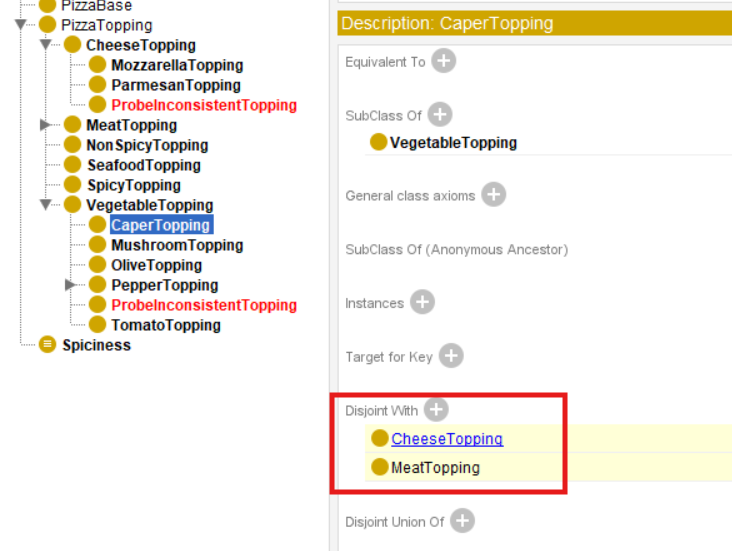 | 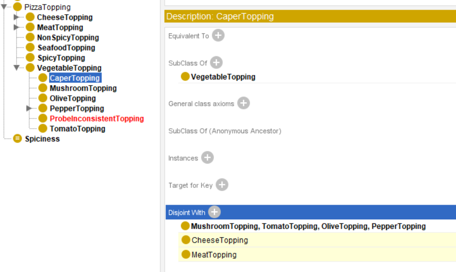 |

With all three corrections:

  - `AmericanaPizza`: Mozzarella (Cheese), Pepperoni (Meat), Tomato (Vegetable) -- 3 distinct :white_check_mark:
  - `AmericananHotPizza`: Mozzarella (Cheese), Pepperoni (Meat), Tomato (Vegetable), JalapenoPepper (Vegetable) -- Tomato and JalapenoPepper are now provably distinct via the vegetable disjointness
  - `SohoPizza`: Mozzarella (Cheese), Tomato (Vegetable), Olive (Vegetable), Parmesan (Cheese) -- Tomato and Olive are distinct via the vegetable disjointness.


Mozzarella and Parmesan are both Cheese, so we need one more disjointness declaration for them:
    - The reference ontology `

#### Approach 2 -- Assert the cardinality directly

Use `exactly` or `min` directly on each pizza class:

```text
Class: AmericanaPizza
    SubClassOf: hasTopping exactly 3 PizzaTopping
```

This tells the reasoner the count is exactly 3, without needing a closure. It is more direct but less flexible -- if the pizza's topping set changes, the cardinality axiom must be updated manually.

**Which to use.** In production ontologies, Approach 1 (closure) is generally preferred, because it preserves the pizza's *open* relationship to the rest of the domain and makes the count *derive* from the closed set of toppings. Approach 2 is useful when a pizza's topping count is a defining feature and is fixed by design.

**For this exercise.** Apply Approach 1 to `AmericanaPizza`, `AmericanaHotPizza`, and `SohoPizza`, then re-run the reasoner. All three will now be classified as subclasses of `Interesting Pizza`. The two-topping `MargheritaPizza` will not, because it correctly fails the min-3 threshold.

**This is exactly the kind of engineering decision that distinguishes an ontology that *looks* correct from on that *executes* correctly!** The reasoner is doing its job; the engineer's job is to give it enough information to do that job reliably.

**Key Insight:**

> "Cardinality without closure is a promise that reasoner cannot keep. Closure turns intention into provable count."

### 26.3.5 Understanding Protégé UI Behavior: Why "SubClass Of" Becomes Empty After Conversion

When you complete Step 4 and select **Edit > Convert to defined class**, a subtle but crucial change occurs in the Protégé interface that often causes confusion:

- **The Mechanics of Conversion:** In Protégé, converting a class to a defined class automatically *moves* the restrictions or superclasses from the **SubClass Of** section up into the **Equivalent To** section. Consequently, the **SubClass Of** box for that class will often appear completely empty immediately after conversion. 
- **Why This Happens Logically:** A *primitive* class only states necessary conditions (i.e., it is a subclass of something). A *defined* class states necessary *and* sufficient conditions (`EquivalentTo`). By shifting `hasTopping min 3 PizzaTopping` into `EquivalentTo`, the reasoner now knows it can *both* recognize pizzas that fit this rule automatically and ensure full logical equivalence.
- **Verifying via Reasoner Inferences:** If you notice your axioms have "disappeared" from *SubClass Of*, check the **Equivalent To** field to confirm they safely relocated there. Once you start the reasoner, any class instance meeting this criteria will correctly and dynamically inherit its classification under `InterestingPizza`.

## 26.4 The Anatomy of an Executable Ontology

Syntheses of the five primitives + EKA mapping

## 26.5 Mathematical Perspective

Closure as set restriction, enumeration as finite extension, `hasValue1 as singleton binding, cardinality as bounded extension

## 26.6 Historical Perspective

From expert systems and production rules to modern rule engines and executable knowledge

## 26.7 Industrial Perspective

ISA-95 / Rhize and the reasoning-to-execution pipeline in manufacturing

## 26.8 EKA Perspective -- Stage 7 Establishes $\Theta$ + $\Phi$

## 26.9 Engineering Guidelines for Executable Knowledge

## 26.10 Key Concepts

## 26.11 Chapter Summary

## 26.12 Looking Ahead -- Toward SKDL Synthesis


---

Last updated at 2026-10-07