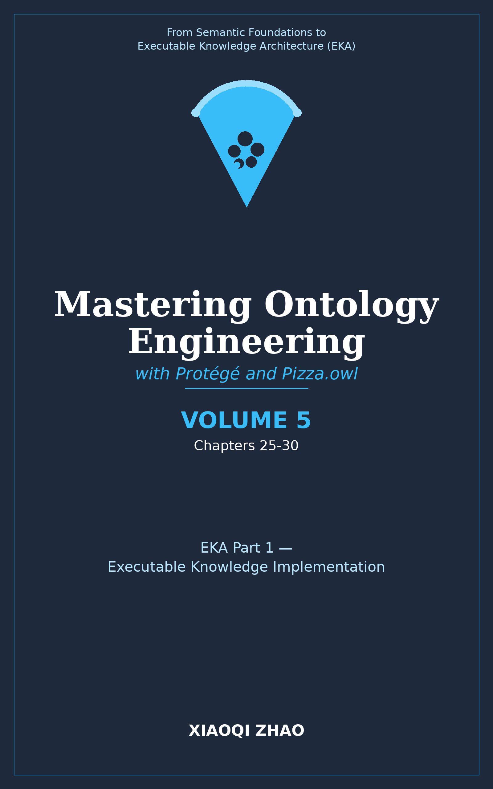

# [Idea] Volume 5: EKA Part 1 -- Executable Knowledge Implementation

**Building on `Pizza` Tutorial Chapter 5, 8, 9, 10**

</img>

| Chapter | Tutorial Exercises | Core Content | Key OWL/Technical Concepts |
| --- | --- | --- | --- |
| 25 | Exercise 22, 23 | Universal restrictions; Open World Assumption; Closure Axioms | Universal restriction (`only`); `VegetarianPizza`; OWL deep dive; closure axioms |
| 26 | Exercise 24, 25, 26 | Enumerated Classes; hasValue Restrictions; Cardinality Restrictions | `Spiciness` enumerated class; `hasValue` restrictions; `min`/`max`/`exactly`; `InterestingPizza` |
| 27 | Exercise 27-32 | Datatype Properties; Custom UI; Individuals Management | `hasCaloricContent`; `xsd:integer`; `HighCaloriePizza`; `LowCaloriePizza`; Individuals by class tab; data property assertions |
| 28 | Exercise 33 | Description Logic Queries | DL Query tab; querying inferred knowledge; `owl:Nothing` in queries; exploring classification results |
| 29 | Exercise 34-36 | SWRL Rules; SQWRL Debugging | SWRL Tab; `HotDiscountRule`; `LessSpicyDiscountRule`; rule antecedents and consequents; `sqwrl:select`; DROOLS |
| 30 | N/A (Extended) | Graph Ecosystems Deep Dive | Native RDF Triple Stores (AllegroGraph, GraphDB, Stardog) vs. Property Graphs (Neo4j); SPARQL vs. Cypher (and more); When to use semantic triples vs. labeled property graphs; T-Box vs. A-Box at scale |

**Volume 5 Focus:**

- Completing the remaining tutorial exercises (22-36)
- Introducing datatype properties and data-driven classification
- Enabling queries and rules as executable knowledge mechanisms
- Brodening perspective to graph databases and query language ecosystems

---

Last updated at 2026-08-28